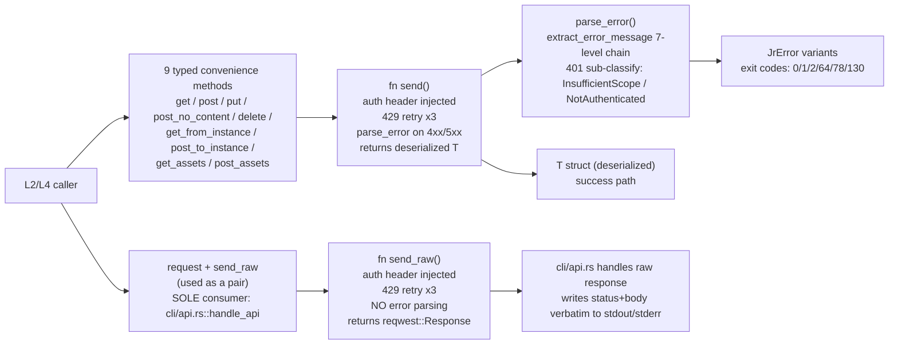

# Component Graph — jr (jira-cli)

**traces_to:** README.md
**Source:** Pass 1 broad + R1 verified edges + R2 cycle-check (1 phantom edge retracted)
**Verification status:** DAG confirmed acyclic. All edges grounded in `use` statement reads.

---

## Module Dependency Graph

```mermaid
graph TD
    main["main.rs (L0)\n268 LOC"] --> cli_mod["cli::mod (L1)\n772 LOC"]
    main --> config["config (L6)\n1,223 LOC"]
    main --> error["error (L6)\n137 LOC"]
    main --> output["output (L6)\n76 LOC"]
    main --> api_client["api::client::JiraClient (L3)\n490 LOC"]

    cli_mod --> api_client
    cli_mod --> config
    cli_mod --> cache["cache (L6)\n899 LOC"]
    cli_mod --> adf["adf (L6)\n1,826 LOC"]
    cli_mod --> jql["jql (L6)\n395 LOC"]
    cli_mod --> partial_match["partial_match (L6)\n200 LOC"]
    cli_mod --> duration["duration (L6)\n159 LOC"]
    cli_mod --> error

    subgraph cli_issue["cli::issue::* (L2)"]
        cli_issue_list["list.rs\n1,083 LOC"]
        cli_issue_view["view.rs\n286 LOC"]
        cli_issue_comments["comments.rs\n61 LOC"]
        cli_issue_workflow["workflow.rs\n788 LOC"]
        cli_issue_create["create.rs\n375 LOC"]
        cli_issue_helpers["helpers.rs\n813 LOC"]
        cli_issue_links["links.rs\n293 LOC"]
        cli_issue_changelog["changelog.rs\n847 LOC"]
        cli_issue_format["format.rs\n226 LOC"]
        cli_issue_assets["assets.rs\n65 LOC"]
        cli_issue_jsonout["json_output.rs\n149 LOC"]
    end

    cli_issue_format --> obs["observability (L6 pub(crate))\n39 LOC"]
    cli_issue_changelog --> obs

    cli_auth["cli::auth (L2)\n1,998 LOC"] --> api_auth["api::auth (L3)\n1,397 LOC"]
    cli_auth --> api_auth_embedded["api::auth_embedded (L3)\n250 LOC"]

    cli_assets["cli::assets (L2)\n1,055 LOC"] --> assets_objects["api::assets::objects\n237 LOC"]
    cli_assets --> assets_workspace["api::assets::workspace\n58 LOC"]
    cli_assets --> assets_schemas["api::assets::schemas\n45 LOC"]

    cli_board["cli::board (L2)\n334 LOC"] --> boards_impl
    cli_sprint["cli::sprint (L2)\n438 LOC"] --> sprints_impl
    cli_requesttype["cli::requesttype (L2)\n[#288 NEW]"] --> request_types_impl
    cli_requesttype --> servicedesks_impl
    cli_requesttype --> cache
    cli_requesttype --> partial_match
    cli_issue_create["create.rs (dispatch fork)\n[#288 MODIFIED]"] --> requests_impl
    cli_issue_create --> request_types_impl
    cli_issue_create --> servicedesks_impl

    cli_issue_assets --> assets_linked["api::assets::linked\n557 LOC"]
    cli_issue_list --> assets_linked
    cli_issue_list --> jql
    cli_issue_view --> assets_linked

    api_client --> api_auth
    api_client --> api_rate_limit["api::rate_limit (L3)\n56 LOC"]
    api_client --> error
    api_client --> config

    api_auth --> api_auth_embedded
    api_auth --> keychain[("OS Keychain\nkeyring crate")]:::external
    api_auth --> network_auth[("auth.atlassian.com\nOAuth IdP")]:::external
    api_auth --> listener[("127.0.0.1:53682\nor :0 dynamic")]:::external
    api_auth_embedded --> outdir[("$OUT_DIR/embedded_oauth.rs\nbuild.rs codegen")]:::external

    subgraph api_jira["api::jira::* (L4 — 11 files, impl JiraClient)"]
        issues_impl["issues.rs"]
        boards_impl["boards.rs"]
        sprints_impl["sprints.rs"]
        fields_impl["fields.rs"]
        statuses_impl["statuses.rs"]
        links_impl["links.rs"]
        teams_impl["teams.rs"]
        worklogs_impl["worklogs.rs"]
        projects_impl["projects.rs"]
        users_impl["users.rs"]
        resolutions_impl["resolutions.rs"]
    end
    api_jira --> api_client
    api_jira --> api_pagination["api::pagination (L3)\n374 LOC"]
    api_jira --> types_jira["types::jira::* (L5)"]

    subgraph api_jsm["api::jsm::* (L4)"]
        servicedesks_impl["servicedesks.rs"]
        queues_impl["queues.rs"]
        requests_impl["requests.rs [#288 NEW]"]
        request_types_impl["request_types.rs [#288 NEW]"]
    end
    api_jsm --> api_client
    api_jsm --> api_pagination
    api_jsm --> types_jsm["types::jsm::* (L5)\n(queue, servicedesk,\nrequest_type [#288 NEW])"]

    subgraph api_assets_grp["api::assets::* (L4 — 5 files)"]
        assets_linked
        assets_objects
        assets_workspace
        assets_schemas
        assets_tickets["tickets.rs\n19 LOC"]
    end
    api_assets_grp --> api_client
    api_assets_grp --> api_pagination
    api_assets_grp --> types_assets["types::assets::* (L5)"]
    api_assets_grp --> cache

    cache --> fs1[("~/.cache/jr/v1/profile/\nXDG_CACHE_HOME")]:::external
    config --> fs2[("~/.config/jr/config.toml\n+ repo/.jr.toml")]:::external
    config --> figment["figment crate"]:::libcrate

    api_client --> reqwest["reqwest (rustls-tls)"]:::libcrate
    api_client --> network_jira[("Atlassian APIs\nJira/JSM/Assets/GraphQL")]:::external

    classDef external fill:#fef3c7,stroke:#b45309,stroke-width:1px;
    classDef libcrate fill:#e0f2fe,stroke:#0369a1,stroke-width:1px;
```



---

## Validated vs Raw HTTP Path



**Verified (Pass 1 R2 §4.1):** `send_raw` consumers = exactly 1 (`cli/api.rs:155`). `request` consumers = exactly 1 (`cli/api.rs:143`). Both used together as a composite escape hatch for `jr api`.

---

## DAG Acyclicity Verification

**Pass 1 R2 §3 confirmed:** the dependency graph is acyclic. Spot-checked all utility-layer modules (`error`, `output`, `cache`, `config`, `jql`, `duration`, `partial_match`, `adf`, `observability`, `api/pagination`, `api/rate_limit`, `api/auth_embedded`) — none import from `cli/`, `api/client`, or `types/`. No upward edges exist.

**One phantom edge retracted (Pass 1 R2 §2 correction):** R1 incorrectly claimed `types/jira/issue.rs` → `observability`. That file uses an inline `static AtomicBool` + `eprintln!` pattern, NOT `crate::observability::log_parse_failure_once`. The edge is absent from this graph.

**Actual `observability` callers (2 only):**
- `cli/issue/format.rs:127`
- `cli/issue/changelog.rs:276`

---

## Layer Isolation Summary

| Layer | Imports from | Does NOT import from |
|-------|-------------|---------------------|
| L0 main | L1, L2 (via jr crate), L3, L6 | nothing above it |
| L1 cli (clap derive) | std, clap | everything (pure derive) |
| L2 handlers | L3, L6 | L4 directly (via L3 client) |
| L3 client | L3 siblings (auth, rate_limit), L6 (config, error) | L2, L4, L5 |
| L3 auth | L3 (auth_embedded), L6 (config, error) | L2, L4, L5 |
| L4 resource impls | L3 client, L5 types, L6 (cache, error) | L2 |
| L5 types | serde, std | everything in crate |
| L6 utilities | std, libcrates | L0-L4 (no upward deps) |

---

## Issue #288 Delta — DAG Verification

**Delta edges introduced (4 new modules, 3 new handler edges):**

```
cli::requesttype (L2) → api::jsm::request_types (L4)    [NEW — L2 → L4 via L3 client; valid]
cli::requesttype (L2) → api::jsm::servicedesks (L4)     [NEW — reuses existing module]
cli::requesttype (L2) → cache (L6)                      [NEW — same pattern as cli::queue]
cli::requesttype (L2) → partial_match (L6)              [NEW — same pattern as cli::queue]
cli::issue::create (L2) → api::jsm::requests (L4)       [NEW — conditional branch only]
cli::issue::create (L2) → api::jsm::request_types (L4)  [NEW — for request type resolution]
cli::issue::create (L2) → api::jsm::servicedesks (L4)   [NEW — for service desk resolution]
api::jsm::requests (L4) → api::client (L3)              [NEW — same pattern as all L4 impls]
api::jsm::requests (L4) → types::jsm::* (L5)            [NEW — same pattern as all L4 impls]
api::jsm::request_types (L4) → api::client (L3)         [NEW — same pattern]
api::jsm::request_types (L4) → api::pagination (L3)     [NEW — isLastPage pagination]
api::jsm::request_types (L4) → types::jsm::* (L5)       [NEW — new request_type.rs type]
types::jsm::request_type (L5) → serde, std              [NEW — pure serde struct, no upward deps]
```

**Cycle check:** All new edges follow existing layer direction (L2 → L4 → L3 → L6, L4 → L5). No upward edges (L4/L5/L6 → L2). No new L6 → L3/L4 edges. DAG remains acyclic.

**Cross-check with purity boundary:** `api::jsm::requests` and `api::jsm::request_types` are I/O-effectful (HTTP), same boundary class as `api::jsm::queues`. `types::jsm::request_type` is pure (serde structs, no I/O). `cli::requesttype` is effectful (HTTP + cache + stdin). All consistent with the existing purity boundary map in `system-overview.md §Purity Boundary`.

Source: ADR-0014 (2026-05-18).

---

## Component Management Delta — DAG Verification (Issues #604/#605/#606/#608, F2 2026-08-15)

**Status:** Spec-level delta only — no `src/` code exists yet for this bundle. Recorded here
ahead of F4 implementation so the DAG/purity cross-check is available to `implementer` and
`consistency-validator` before Wave 1 lands. Source: `.factory/phase-f1-delta-analysis/
impact-boundary-components.md`; ADR-0018.

**New modules (3, all `[PLANNED]`):**

```
cli::component            (L2, new file src/cli/component.rs)   — jr component list/create/edit/delete/rename
api::jira::components      (L4, new file src/api/jira/components.rs) — 5 endpoints + relatedIssueCounts
types::jira::component     (L5, new file src/types/jira/component.rs) — full Component resource shape
```

**Delta edges (all additions; no edges removed; no existing edges modified):**

```
ADDED — new L4 module (api::jira subgraph expanded):
  api::jira::components  → api::client (L3)             [HTTP: list/get/create/update/delete/relatedIssueCounts]
  api::jira::components  → api::pagination (L3)          [NOT used — component list is non-paginated; cited for completeness, no edge drawn]
  api::jira::components  → types::jira::component (L5)   [new full-resource type]
  api::jira::components  → types::jira::issue (L5)       [Component (embedded, name-only) gains `id` field — BC-2.3.040; existing type amended in place, not replaced]

ADDED — new L5 type:
  types::jira::component → serde, std                    [pure serde struct, no upward deps]

ADDED — new L2 handler (cli::component):
  cli::component → api::jira::components
  cli::component → cache (L6)                             [new components cache family]
  cli::component → partial_match (L6)                     [via resolve_component]
  cli::component → jql (L6)                                [BC-8.2.007 pre-delete affected-issue JQL snapshot]

ADDED — modified L2 handlers (existing files, additive changes only):
  cli::issue::helpers → api::jira::components             [new fn resolve_component, structural clone of resolve_team_field — NOT a shared/generic fn]
  cli::issue::helpers → cache (L6)                         [components cache reads, mirrors resolve_team_field's TeamCache read]
  cli::issue::edit    → cli::issue::helpers                [--component add:/remove: resolution, already-existing edge, no new edge — cited for completeness]
  cli::issue::edit    → api::jira::issues                  [multiselectComponents bulk POST — reuses the EXISTING api::jira::issues → api::client edge; no new L2→L4 edge, only a new call pattern within it]
  cli::issue::create  → cli::issue::helpers                [--component resolution, already-existing edge]
  cli::issue::list    → jql (L6)                            [--component filter clause — already-existing edge (cli_issue_list → jql is drawn above), new clause-building call only]

ADDED — modified L6 utility (cache.rs, additive struct + fns only, no signature changes to existing fns):
  cache::ComponentsCacheEntry, cache::CachedComponent (new structs)
  cache::{read,write,invalidate}_components_cache (new fns, profile: &str first arg — ProjectMeta pattern)
```

**Cycle check:** All new/modified edges follow the existing layer direction (L2 → L4 → L3 → L6,
L4 → L5; L2 → L6 directly for cache/jql/partial_match, matching the existing `cli_requesttype`
precedent). No upward edges (L4/L5/L6 → L2). No new L6 → L3/L4 edges. `cli::component` mirrors
`cli::requesttype`'s exact edge shape (L2 → new-L4, L2 → cache, L2 → partial_match) plus one
addition (L2 → jql, for the delete-safety snapshot, BC-8.2.007) not present in the `requesttype`
precedent. **DAG remains acyclic.**

**Purity boundary cross-check (see also `system-overview.md §Purity Boundary` update below):**
- `types::jira::component` — **pure** (serde struct family: id/name/description/lead/
  assigneeType/project, no I/O). Same class as `types::jira::team`/`types::jira::board`.
- `api::jira::components` — **effectful shell** (HTTP via `JiraClient`). Same class as
  `api::jira::teams`/`api::jira::boards`.
- `cli::component` — **effectful shell** (HTTP + cache + stdin/stdout + JQL snapshot search).
  Same class as `cli::team`.
- `cli::issue::helpers::resolve_component` — **effectful shell**, NOT pure, despite being a
  "resolver": it performs a cache-or-fetch HTTP round-trip before calling the pure
  `partial_match::partial_match` primitive. The underlying `partial_match` fn itself remains
  pure and unmodified — `resolve_component` is a thin effectful wrapper around it, exactly the
  same shape as the existing `resolve_team_field`.
- `cache::{read,write,invalidate}_components_cache` — **effectful shell** (filesystem I/O).
  Same class as `cache::{read,write}_project_meta`.

All classifications are consistent with the existing Purity Boundary Map — no reclassification
of any existing module was required by this bundle.

Source: F1 delta analysis §2, §3, §6; ADR-0018 (2026-08-15).

---

## Field DX Delta — DAG Verification (Issues #580/#578, F2 2026-08-25)

**Status:** Spec-level delta only — no `src/` code exists yet for this bundle. Recorded here
ahead of F4 implementation. Source: `.factory/phase-f1-delta-analysis/
delta-analysis-field-dx.md`; ADR-0019.

**New modules (1, `[PLANNED]`):**

```
cli::field   (L2, new file src/cli/field.rs)   — jr field options <field>; structural mirror
                                                   of cli::requesttype (259 LOC precedent, well
                                                   under the ADR-0012 shard threshold)
```

**No new L4 or L5 modules.** `api::jira::issues` (existing L4 node `issues_impl`) gains one new
method (`get_createmeta_fields`) and two inline response types
(`CreateMetaField`/`CreateMetaFieldsResponse`, following the exact in-file-type precedent
`IssueTypeEntry`/`CreatemetaIssueTypesResponse` already establish on the same file for the
sibling createmeta-issuetypes call). `api::jira::issues::get_editmeta` and
`api::jsm::request_types` are reused verbatim (M1/M3, ADR-0019 §1) — no new API-layer code for
either.

**Delta edges (all additions; no edges removed; no existing edges modified):**

```
ADDED — new L2 handler (cli::field):
  cli::field → api::jira::issues (L4)     [get_createmeta_fields (NEW method, M2 primary) +
                                             get_editmeta (REUSED, M1 fallback) +
                                             get_issue_types_for_project (REUSED, S-331 — M2
                                             --type name→issueTypeId resolution)]
  cli::field → api::jira::fields (L4)      [REUSED — list_fields field-name resolution,
                                             BC-X.14.001; fields.json cache-first, same
                                             contract as BC-3.4.015]
  cli::field → api::jsm::request_types (L4) [REUSED — M3 primary, same call jr requesttype
                                               fields already makes]
  cli::field → cache (L6)                  [REUSED — read/write_request_type_fields_cache via
                                             the M3 --request-type path only; no new cache
                                             family]
  cli::field → partial_match (L6)          [<field> positional name resolution against the
                                             editmeta/createmeta/request-type-fields field-name
                                             dict, mirrors cli::requesttype's identical edge]
  cli::field → output (L6)                 [render_json invariant, table rendering — same as
                                             every other cli::* leaf command]

ADDED — modified L4 module (api::jira::issues, additive changes only):
  api::jira::issues → types::jira::editmeta (L5)  [NEW edge — reuses AllowedValue/
                                                     EditMetaFieldSchema for the new
                                                     CreateMetaField type, per ADR-0019 §1
                                                     type-reuse decision; api::jira::issues did
                                                     NOT previously import from editmeta.rs]

ADDED — modified L2 handlers (existing files, additive changes only, per ADR-0019 §2):
  cli::issue::create   → (no new L4/L6 edges) — parse_field_kv return-type change
                          (HashMap<String,String> → HashMap<String,FieldValueSpec>) is an
                          internal signature change, not a new dependency edge; new
                          FieldValueKind/FieldValueSpec types defined in this same file
                          (create.rs, alongside parse_field_kv)
  cli::issue::edit     → (no new L4/L6 edges) — threads FieldValueSpec instead of String
                          through the existing parse_field_kv call site; dry-run preview + Gate
                          B list gain hint-kind awareness (internal logic only)
  cli::issue::jsm_create → (no new L4/L6 edges beyond the one below) — threads FieldValueSpec
                          instead of String through the existing parse_field_kv call site

ADDED — new L2→L4 edges for the :asset hint (BC-3.4.030, uniform per BC-3.8.008 amendment):
  cli::issue::field_resolve → api::assets::workspace (L4)  [NEW — get_or_fetch_workspace_id,
                                                              REUSED read-only, resolves the
                                                              cached workspace id for :asset
                                                              composition on the edit path
                                                              (BC-3.4.030 primary site)]
  cli::issue::create        → api::assets::workspace (L4)  [NEW — same reuse, platform-create
                                                              :asset composition per BC-3.3.010
                                                              "same machinery as issue edit
                                                              --field"]
  cli::issue::jsm_create    → api::assets::workspace (L4)  [NEW — same reuse, JSM :asset
                                                              composition per BC-3.8.008's
                                                              "uniform application" decision]

  Deliberately NOT api::jsm::requests (L4) → api::assets::workspace (L4): a cross-L4 call would
  violate the existing Layer Isolation Summary ("L4 resource impls" import from L3 client/L5
  types/L6 only — not from a sibling L4 subsystem). The workspace id is resolved once at the L2
  caller (whichever of the three sites above applies the hint) and passed into
  JsmRequestBuilder as a plain resolved value, not fetched inside api::jsm::requests itself.

ADDED — modified L4 module (api::jsm::requests, additive/type-widening only):
  JsmRequestBuilder.extra_fields: &'a HashMap<String, String>
    → &'a HashMap<String, FieldValueSpec>            [type widening, not a new edge — same
                                                        L2→L4 edge cli::issue::jsm_create → 
                                                        api::jsm::requests already has]
  build()'s extra_fields loop: unconditional String-wrap → match on FieldValueSpec.kind
                                                        (Option/Id/Name/Asset dispatch,
                                                        BC-3.8.008 amendment)

ADDED — modified L1 (cli::mod, additive only):
  Command::Field { command: FieldCommand } variant + FieldCommand enum (List-shaped subcommand
  surface: `options <field>`), mirrors the existing RequestTypeCommand shape exactly.

ADDED — modified L0 (main.rs, additive only):
  New dispatch arm cli::Command::Field { command } => field::handle(...), structurally
  identical to the existing RequestType arm (main.rs:449).
```

**Cycle check:** All new/modified edges follow the existing layer direction (L2 → L4 → L3 → L6;
L4 → L5; L2 → L6 directly, matching the `cli::requesttype`/`cli::component` precedent). No
upward edges (L4/L5/L6 → L2) are introduced. No new L6 → L3/L4 edges. No new L4 → L4 edge is
introduced (the one place this bundle could have tempted a cross-L4 shortcut —
`api::jsm::requests` reaching into `api::assets::workspace` directly for the `:asset` hint — is
explicitly avoided per ADR-0019 §2; the workspace-id resolution edge is placed at L2 instead,
consistent with the existing `cli_assets`/`cli_issue_assets` → `assets_workspace`/`assets_linked`
edges already in this graph). **DAG remains acyclic.**

**Cross-check with purity boundary:** see `system-overview.md §Purity Boundary` update below —
`cli::field`'s handlers are effectful shell (HTTP + cache + stdout), its `normalize_from_*`
helper functions are pure (function-level carve-out, same class as `cli::resolve_effective_limit`),
`FieldOption`/`FieldValueSpec`/`FieldValueKind` are pure data types, `api::jira::issues::
get_createmeta_fields` is effectful shell (same class as every other L4 HTTP method).

Source: F1 delta analysis §3; ADR-0019 (2026-08-25).
