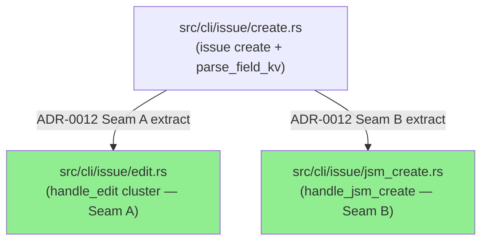
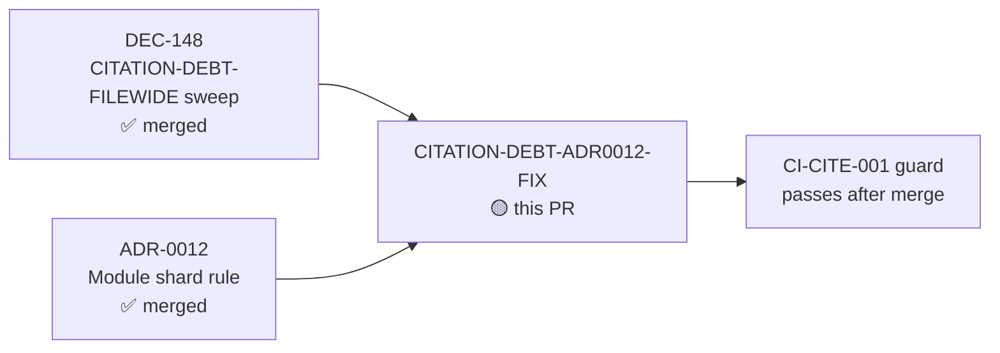
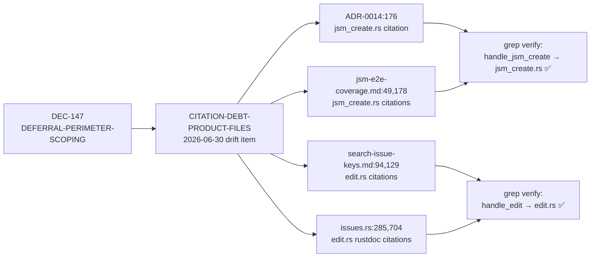
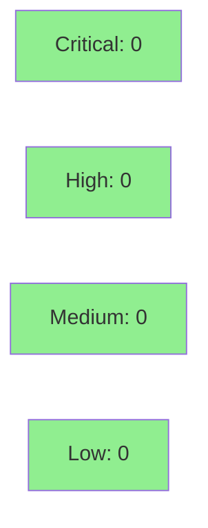

# docs: fix ADR-0012 Seam A/B relocation citations (create.rs → edit.rs / jsm_create.rs)

**Epic:** CITATION-DEBT-FILEWIDE — DEC-148 drift sweep  
**Mode:** maintenance  
**Convergence:** CONVERGED after 3 adversarial passes (whole-touched-file completeness lens)


Repoints 7 stale ADR-0012 Seam A/B module-relocation citations across 4 files. When ADR-0012 split `create.rs` into `edit.rs` (Seam A — `handle_edit` cluster) and `jsm_create.rs` (Seam B — `handle_jsm_create`), references in docs and rustdoc that still pointed at the old `create.rs` home became stale. This PR corrects them so documentation accurately reflects where the implementation lives.

DOC/COMMENT-ONLY — zero behavior or code change. All 7 citations were grep-verified against source before and after.

---

## Architecture Changes



No structural changes in this PR. The diagram shows the post-ADR-0012 shape that the corrected citations now accurately describe.

<details>
<summary><strong>Citation corrections (7 total)</strong></summary>

| File | Old citation | Corrected to |
|------|-------------|--------------|
| `docs/adr/0014-jsm-request-type-dispatch.md:176` | `create.rs::handle_jsm_create` | `jsm_create.rs::handle_jsm_create` |
| `docs/specs/jsm-e2e-coverage.md:49` | `create.rs::handle_jsm_create` | `jsm_create.rs::handle_jsm_create` |
| `docs/specs/jsm-e2e-coverage.md:178` | `create.rs: if request_type_arg…` | `jsm_create.rs: if request_type_arg…` |
| `docs/specs/2026-05-13-search-issue-keys.md:94` | `handle_edit…in cli/issue/create.rs` | `cli/issue/edit.rs` |
| `docs/specs/2026-05-13-search-issue-keys.md:129` | `cli/issue/create.rs::handle_edit` | `src/cli/issue/edit.rs::handle_edit` |
| `src/api/jira/issues.rs:285` | `cli/issue/create.rs::handle_edit` | `cli/issue/edit.rs::handle_edit` |
| `src/api/jira/issues.rs:704` | `handle_edit_bulk_fields in src/cli/issue/create.rs` | `src/cli/issue/edit.rs` |

Historical narrative lines in `2026-05-13-search-issue-keys.md` (lines 9, 22, 194) that describe pre-Seam-B history were intentionally preserved — they are retrospective context, not forward citations.

</details>

---

## Story Dependencies



No upstream PRs pending. DEC-148 file-wide sweep is on `develop`; this PR forks off `develop` at `3b122a8`.

---

## Spec Traceability



---

## Test Evidence

### Coverage Summary

| Metric | Value | Threshold | Status |
|--------|-------|-----------|--------|
| Unit tests | N/A — doc-only change | N/A | N/A |
| Coverage | No code lines changed | N/A | N/A |
| Mutation kill rate | 0 mutants in diff scope | 0 | PASS (0-mutant path) |
| Holdout satisfaction | N/A — evaluated at wave gate | N/A | N/A |

This PR changes only `///` rustdoc comments and markdown documentation files. No `.rs` logic lines were modified. The `cargo-mutants --in-diff` run should find 0 mutants in scope and exit 0 — this is the first scoped-file PR to exercise the 0-mutant pass path (MUTANTS-FIRST-SCOPED-PR-CALIBRATION watch item, see below).

### Grep verification (pre-merge)

All 7 citation targets were verified against source before and after:
- `handle_jsm_create` → defined in `src/cli/issue/jsm_create.rs` ✅
- `handle_edit` → defined in `src/cli/issue/edit.rs` ✅
- `handle_edit_bulk_fields` → defined in `src/cli/issue/edit.rs` ✅
- `parse_field_kv` → retained in `src/cli/issue/create.rs` ✅ (not moved)
- `handle_create` → retained in `src/cli/issue/create.rs` ✅ (not moved)

---

## Holdout Evaluation

N/A — evaluated at wave gate. No behavioral change.

---

## Adversarial Review

| Pass | Lens | Findings | Critical | High | Status |
|------|------|----------|----------|------|--------|
| 1 | Whole-touched-file completeness | 0 remaining after correction | 0 | 0 | CLEAN |
| 2 | Whole-touched-file completeness | 0 | 0 | 0 | CLEAN |
| 3 | Whole-touched-file completeness | 0 | 0 | 0 | CLEAN → CONVERGED |

**Convergence:** 3 consecutive clean passes on the final diff under the whole-touched-file completeness lens. Historical narrative lines in `search-issue-keys.md` were explicitly verified as intentional (retrospective context, not forward citations).

Notable HIGH item cleared: `docs/adr/0014-jsm-request-type-dispatch.md:176` previously labeled `create.rs` as the "canonical JSM dispatch implementation" — corrected to `jsm_create.rs`.

---

## Security Review



Doc/comment-only change. No executable code paths modified. No injection surfaces, no auth changes, no new dependencies. OWASP Top 10 not applicable.

---

## Risk Assessment & Deployment

### Blast Radius
- **Systems affected:** None — documentation and rustdoc only
- **User impact:** None (no behavior change; `jr` binary output is identical)
- **Data impact:** None
- **Risk Level:** LOW

### Performance Impact
None. No code paths changed.

### Rollback Instructions
Standard `git revert` of the squash commit. No migration or feature-flag cleanup needed.

---

## Traceability

| Drift Item | Corrected In | Grep Verified | Status |
|-----------|--------------|--------------|--------|
| ADR-0014:176 `create.rs::handle_jsm_create` | `docs/adr/0014-jsm-request-type-dispatch.md` | `jsm_create.rs` exists, exports `handle_jsm_create` | PASS |
| jsm-e2e:49 `create.rs::handle_jsm_create` | `docs/specs/jsm-e2e-coverage.md` | same | PASS |
| jsm-e2e:178 `create.rs: if request_type_arg` | `docs/specs/jsm-e2e-coverage.md` | numeric-bypass path in `jsm_create.rs` | PASS |
| search-keys:94 `cli/issue/create.rs` | `docs/specs/2026-05-13-search-issue-keys.md` | `handle_edit::effective_keys` in `edit.rs` | PASS |
| search-keys:129 `cli/issue/create.rs::handle_edit` | `docs/specs/2026-05-13-search-issue-keys.md` | same | PASS |
| issues.rs:285 `cli/issue/create.rs::handle_edit` | `src/api/jira/issues.rs` | same | PASS |
| issues.rs:704 `src/cli/issue/create.rs` | `src/api/jira/issues.rs` | `handle_edit_bulk_fields` in `edit.rs` | PASS |

---

## Watch Item: MUTANTS-FIRST-SCOPED-PR-CALIBRATION

`src/api/jira/issues.rs` is in `cargo-mutants` `examine_globs`. This diff touches ONLY `///` rustdoc lines — no code mutants should appear in `--in-diff` scope. Expected outcome: `mutants` job finds 0 mutants → 0-mutant pass path, exits 0. Report if any false `timeout` or unexpected failure is observed. Do not modify mutants config based on this run.

---

## AI Pipeline Metadata

<details>
<summary><strong>Pipeline Details</strong></summary>

```yaml
ai-generated: true
pipeline-mode: maintenance
factory-version: vsdd-factory 1.0.0-rc.18
change-type: doc-only citation fix
citation-count: 7
files-touched: 4
convergence: achieved
adversarial-passes: 3
models-used:
  builder: claude-sonnet-4-6
  adversary: fresh-context adversarial gate
origin: DEC-148 CITATION-DEBT-FILEWIDE sweep / DEC-147 DEFERRAL-PERIMETER-SCOPING
generated-at: "2026-07-01"
```

</details>

---

## Pre-Merge Checklist

- [ ] All CI status checks passing (especially `ci-gate` and `mutants`)
- [ ] `mutants` job: 0 mutants in diff scope (0-mutant pass path confirmed)
- [ ] No critical/high security findings unresolved
- [ ] 7 citations grep-verified against source
- [ ] Historical narrative lines in `search-issue-keys.md` confirmed intentional (preserved)
- [ ] Human review completed (merge authorization required from orchestrator)
