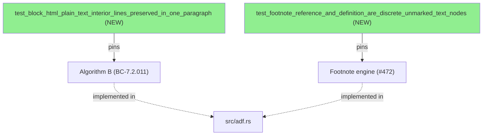
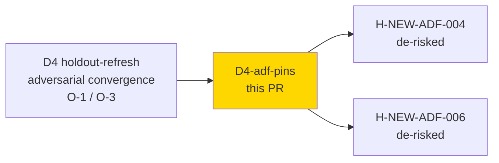
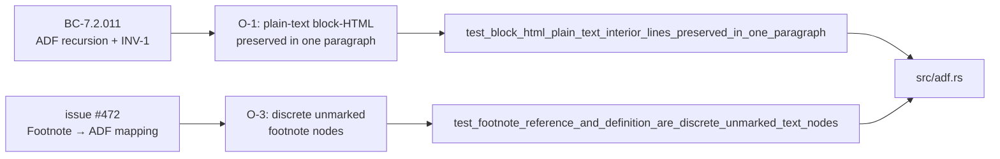
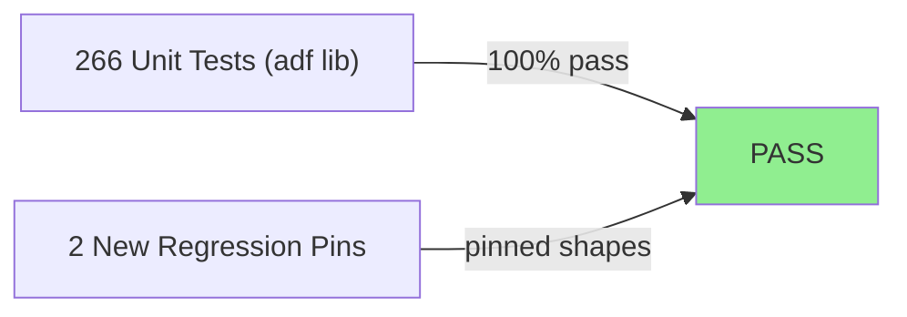
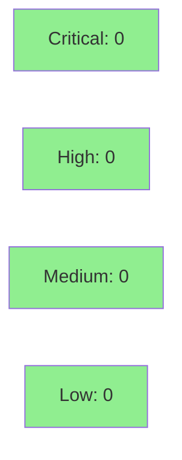

# test(adf): pin plain-text block-HTML and discrete footnote node shapes

**Epic:** D4 holdout follow-up test hardening
**Mode:** maintenance
**Convergence:** CONVERGED — D4 adversarial convergence (O-1, O-3 resolved)


This PR adds two regression-pin unit tests to `src/adf.rs` that de-risk two
D4 holdout scenarios (H-NEW-ADF-004, H-NEW-ADF-006) by pinning previously-unpinned
source-level behavior those scenarios rely on. No production code is changed.
The tests close coverage gaps that the existing concatenated-text assertions
in the footnote suite and the HTML-tag-bearing-line assertions in the block-HTML
suite could not catch.

Local code review found one MEDIUM docstring finding (CR-004: one test docstring
referenced a sibling test by function name without quoting — fixed before commit).

---

## Architecture Changes



<details>
<summary><strong>Architecture Decision Record</strong></summary>

### ADR: Test-only regression pins, no production change

**Context:** D4 holdout-refresh adversarial review raised two observations (O-1, O-3):
- O-1: The existing block-HTML test `test_convert_multiline_block_html_preserves_interior_newlines`
  uses HTML-tag-bearing interior lines (`<span>x</span>`), not plain-text prose lines.
  Holdout scenario H-NEW-ADF-004 depends on plain-text interior lines being preserved
  in the same type-6 HtmlBlock paragraph — that exact shape was unpinned.
- O-3: The existing footnote tests (`test_markdown_footnote_reference_renders_marker_not_literal_caret`,
  `test_markdown_footnote_definition_appended_after_rule_with_label`) verify that the
  correct strings appear via concatenated-text assertions, but do NOT verify node-level
  discreteness or mark absence at the node level. Holdout scenario H-NEW-ADF-006 relies
  on the marker being a separate, unmarked text node.

**Decision:** Add two targeted regression-pin tests that assert the exact node shapes
the holdout scenarios rely on. No production code is changed.

**Rationale:** These are genuine non-tautological pins — each test would fail under
plausible future refactors (e.g. node-merging optimization, mark-inheritance change)
that would break the behavior the holdout scenarios measure.

**Alternatives Considered:**
1. Expand existing tests — rejected because the existing tests use different fixtures
   (HTML-tag-bearing lines, concatenated-text assertions) and adding to them would
   conflate distinct pinning goals.
2. Skip pinning — rejected because H-NEW-ADF-004 and H-NEW-ADF-006 would remain
   at risk of silent regression.

**Consequences:**
- Two new tests in `src/adf.rs::tests` (test-only, no production impact).
- CI suite grows by 2 unit tests; negligible runtime cost.

</details>

---

## Story Dependencies



---

## Spec Traceability



---

## Test Evidence

### Coverage Summary

| Metric | Value | Threshold | Status |
|--------|-------|-----------|--------|
| Unit tests (adf lib) | 266/266 pass | 100% | PASS |
| Production code changed | 0 lines | N/A | N/A (test-only) |
| Mutation kill rate | N/A (test-only change) | N/A | N/A |
| Holdout satisfaction | N/A — evaluated at wave gate | N/A | N/A |

### Test Flow



| Metric | Value |
|--------|-------|
| **New tests** | 2 added, 0 modified |
| **Total adf lib suite** | 266 tests PASS |
| **Coverage delta** | 0% (test-only; no new production lines) |
| **Mutation kill rate** | N/A (no production code changed) |
| **Regressions** | 0 |

<details>
<summary><strong>Detailed Test Results</strong></summary>

### New Tests (This PR)

| Test | What It Pins | Result |
|------|--------------|--------|
| `test_block_html_plain_text_interior_lines_preserved_in_one_paragraph` | Plain-text interior lines inside a `<div>` block produce one 7-node paragraph (BC-7.2.011, #489/#492, O-1) | PASS |
| `test_footnote_reference_and_definition_are_discrete_unmarked_text_nodes` | Footnote reference marker and definition label are separate, unmarked text nodes — not merged, not mark-inheriting (#472, O-3) | PASS |

### Non-Tautology Rationale

**Test 1 — block-HTML plain-text interior lines:**
Would fail if pulldown-cmark stopped treating plain-text continuation lines as part of
the same type-6 HTML block (different top-level node count), OR if Algorithm B merged
adjacent plain-text segments (single large text node instead of discrete per-line nodes
separated by hardBreaks). The existing `test_convert_multiline_block_html_preserves_interior_newlines`
uses HTML-tag-bearing interior lines (`<span>x</span>`) — this test closes the gap for
PLAIN-TEXT interior lines.

**Test 2 — discrete unmarked footnote nodes:**
Would fail if a future refactor merged adjacent same-paragraph text nodes (a valid
ADF-equivalence optimization), because `ref_nodes.len() == 2` and the exact-equality
assertion on `ref_nodes[1]["text"] == "[1]"` require `"[1]"` to be its own separate
node. The existing concatenated-text assertions in the footnote suite verify that the
correct strings appear, but do NOT verify node-level discreteness or mark absence at
the node level.

</details>

---

## Holdout Evaluation

N/A — evaluated at wave gate. This PR de-risks H-NEW-ADF-004 and H-NEW-ADF-006 by
pinning the source behavior those scenarios measure.

---

## Adversarial Review

| Pass | Findings | Critical | High | Medium | Status |
|------|----------|----------|------|--------|--------|
| D4 adversarial (pre-commit) | 1 (CR-004) | 0 | 0 | 1 | Fixed |

**CR-004 (MEDIUM):** One test docstring referenced a sibling test by function name
without quoting (`test_markdown_footnote_reference_renders_marker_not_literal_caret`
appeared unquoted in the doc comment). Fixed before commit — the reference now appears
in backtick form in the rustdoc.

**Convergence:** 0 blocking findings at commit time.

---

## Security Review



Test-only change. No production code modified. No new API surfaces, no new dependencies,
no new unsafe code, no new I/O paths. Security review: CLEAN.

---

## Risk Assessment & Deployment

### Blast Radius
- **Systems affected:** None (test-only change)
- **User impact:** None (no production code changed)
- **Data impact:** None
- **Risk Level:** LOW

### Performance Impact
No production code changed. Test suite runtime increases by a negligible amount (2 unit tests).

<details>
<summary><strong>Rollback Instructions</strong></summary>

**Immediate rollback (< 1 min):**
```bash
git revert <COMMIT_SHA>
git push origin develop
```

No feature flags. No runtime impact.

</details>

---

## Traceability

| Requirement | Observation | Test | Status |
|-------------|-------------|------|--------|
| BC-7.2.011 (Algorithm B, INV-1) | D4 O-1 | `test_block_html_plain_text_interior_lines_preserved_in_one_paragraph` | PASS |
| issue #472 (footnote → ADF) | D4 O-3 | `test_footnote_reference_and_definition_are_discrete_unmarked_text_nodes` | PASS |
| H-NEW-ADF-004 de-risk | D4 O-1 | test 1 above | PINNED |
| H-NEW-ADF-006 de-risk | D4 O-3 | test 2 above | PINNED |

---

## AI Pipeline Metadata

<details>
<summary><strong>Pipeline Details</strong></summary>

```yaml
ai-generated: true
pipeline-mode: maintenance
factory-version: "1.0.0-rc.21"
pipeline-stages:
  d4-holdout-refresh: completed
  adversarial-observations: O-1 O-3
  regression-pin-tests: added
  local-review: clean (CR-004 fixed)
  ci-gate: pending
convergence-metrics:
  blocking-findings: 0
  test-only-change: true
  production-lines-changed: 0
generated-at: "2026-06-26"
```

</details>

---

## Pre-Merge Checklist

- [ ] All CI status checks passing (ci-gate)
- [x] Coverage delta is positive or neutral (test-only, 0 production lines changed)
- [x] No critical/high security findings unresolved
- [x] Test-only change — no rollback procedure needed beyond `git revert`
- [x] No feature flags
- [x] Local code review completed (CR-004 MEDIUM fixed before commit)
- [x] No production code changed — blast radius: NONE
