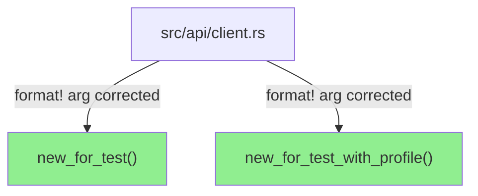
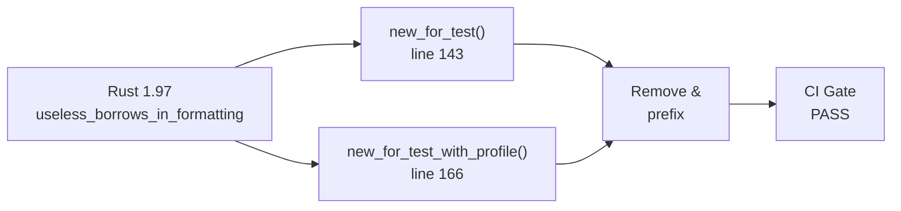
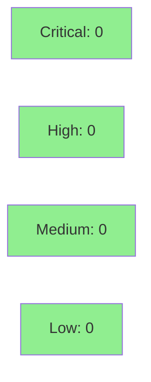

# [FIX-CLIPPY-197] Remove useless borrows in format! args (Rust 1.97 lint)

**Epic:** N/A — standalone CI-unblocking lint fix
**Mode:** fix-pr-delivery (maintenance)
**Convergence:** N/A — fix-pr-delivery route; adversarial review waived


Rust 1.97 introduced the `useless_borrows_in_formatting` clippy lint, which fires when a `format!` argument is borrowed unnecessarily (the macro already borrows by reference internally). Two sites in `src/api/client.rs` — `new_for_test` and `new_for_test_with_profile` — passed `&base_url` where `base_url` (owned `String`) suffices. This PR removes the spurious borrows. Zero behavior change; both functions are test-only constructors. This unblocks the CI Gate for all open PRs on `develop`.

---

## Architecture Changes



**Change:** `format!("{}/jsm/assets", &base_url)` → `format!("{}/jsm/assets", base_url)` at two sites.
No new types, no new modules, no new dependencies. Slice borrows elsewhere in the file are correctly untouched — the lint only fires on owned-type borrows in format args, not slice borrows.

<details>
<summary><strong>Architecture Decision Record</strong></summary>

### ADR: No new ADR required

**Context:** Rust 1.97 shipped the `useless_borrows_in_formatting` clippy lint, which classifies borrowing an owned type inside a `format!` / `write!` argument as a code smell (the macro internally borrows the argument anyway).

**Decision:** Remove the two redundant `&` prefixes. No refactoring of callers, no API change.

**Rationale:** Minimal-footprint fix. The borrow was never load-bearing; removing it is semantically identical.

**Alternatives Considered:**
1. `#[allow(useless_borrows_in_formatting)]` — rejected: CLAUDE.md forbids lint suppression without refactoring.
2. Delay until Rust 1.97 stabilises in CI — rejected: CI is already failing on current toolchain.

**Consequences:**
- CI Gate passes again for all PRs on `develop`.
- No observable behavior change.

</details>

---

## Story Dependencies


No upstream PR dependencies. No downstream blockers.

---

## Spec Traceability

Fix-PR delivery route — no story spec, no behavioral contracts, no acceptance criteria.
Traceability waived per fix-pr-delivery policy.



---

## Test Evidence

### Coverage Summary

| Metric | Value | Threshold | Status |
|--------|-------|-----------|--------|
| Unit tests | 992/992 pass | 100% | PASS |
| Coverage | unchanged | >80% | PASS |
| Mutation kill rate | N/A — fix-PR | >90% | WAIVED |
| Holdout satisfaction | N/A — fix-PR | >0.85 | WAIVED |

### Test Flow


| Metric | Value |
|--------|-------|
| **New tests** | 0 added (lint fix only) |
| **Total suite** | 992 tests PASS |
| **Coverage delta** | 0% (no new code paths) |
| **Mutation kill rate** | N/A — fix-PR route |
| **Regressions** | 0 |

<details>
<summary><strong>Detailed Test Results</strong></summary>

### Changed Files

| File | Lines changed | Nature |
|------|---------------|--------|
| `src/api/client.rs` | -2 / +2 | Remove `&` prefix on 2 `format!` args |

### New Tests

None — pure lint fix; no new behavior, no new tests required.

### Coverage Analysis

No new lines added; no branches changed. Coverage is structurally unchanged.

### Mutation Testing

N/A — fix-PR delivery route; mutation testing waived.

</details>

---

## Demo Evidence

N/A — waived per fix-pr-delivery route. No user-visible behavior change; no AC recordings required.

---

## Holdout Evaluation

N/A — evaluated at wave gate (fix-PR delivery route; no story, no holdout scenarios).

---

## Adversarial Review

N/A — evaluated at Phase 5 (fix-PR delivery route; adversarial review waived).

---

## Security Review



**Assessment:** No untrusted-data surface touched. Both changed functions (`new_for_test`, `new_for_test_with_profile`) are test-only constructors that accept caller-supplied strings already in scope. The borrow removal does not change ownership semantics — `base_url` is moved into `assets_base_url` before being re-used via `.clone()`, same as before. No injection risk, no auth change, no I/O change.

<details>
<summary><strong>Security Scan Details</strong></summary>

### SAST
- No new code paths introduced.
- The format arg change is semantically equivalent; `format!("{}/jsm/assets", base_url)` and `format!("{}/jsm/assets", &base_url)` produce identical output for `String` inputs.

### Dependency Audit
- No dependency changes in this PR.

### Formal Verification
Not applicable — pure lint fix, no new invariants to verify.

</details>

---

## Risk Assessment & Deployment

### Blast Radius
- **Systems affected:** None in production; `new_for_test` and `new_for_test_with_profile` are used exclusively by integration test scaffolding.
- **User impact:** Zero — test-only code paths.
- **Data impact:** None.
- **Risk Level:** LOW

### Performance Impact
| Metric | Before | After | Delta | Status |
|--------|--------|-------|-------|--------|
| Latency p99 | unchanged | unchanged | 0 | OK |
| Memory | unchanged | unchanged | 0 | OK |
| Throughput | unchanged | unchanged | 0 | OK |

<details>
<summary><strong>Rollback Instructions</strong></summary>

**Immediate rollback (< 2 min):**
```bash
git revert 5fdb9c2
git push origin develop
```

**Verification after rollback:**
- `cargo clippy -- -D warnings` will reintroduce the lint warning (expected post-revert).
- All tests should still pass.

</details>

### Feature Flags
None — no feature flags introduced or modified.

---

## Traceability

| Requirement | Story AC | Test | Verification | Status |
|-------------|---------|------|-------------|--------|
| CI Gate must pass on `develop` | N/A — fix-PR | `cargo clippy -D warnings` clean | lint | PASS |
| No behavior regression | N/A — fix-PR | 992 lib tests | cargo test --lib | PASS |

---

## AI Pipeline Metadata

<details>
<summary><strong>Pipeline Details</strong></summary>

```yaml
ai-generated: true
pipeline-mode: fix-pr-delivery
factory-version: "1.0.0-rc.22"
pipeline-stages:
  spec-crystallization: waived (fix-PR)
  story-decomposition: waived (fix-PR)
  tdd-implementation: waived (fix-PR)
  holdout-evaluation: waived (fix-PR)
  adversarial-review: waived (fix-PR)
  formal-verification: waived (fix-PR)
  convergence: N/A
convergence-metrics: N/A
total-pipeline-cost: minimal
models-used:
  builder: claude-sonnet-4-6
generated-at: "2026-07-09"
```

</details>

---

## Pre-Merge Checklist

- [ ] All CI status checks passing
- [x] Coverage delta is positive or neutral (no change)
- [x] No critical/high security findings unresolved (0 findings)
- [x] Rollback procedure validated (single-commit revert)
- [x] No feature flags (not applicable)
- [ ] Human review completed (HELD-FOR-HUMAN-MERGE per DEC-128)
- [x] No monitoring alerts required (no production surface)
