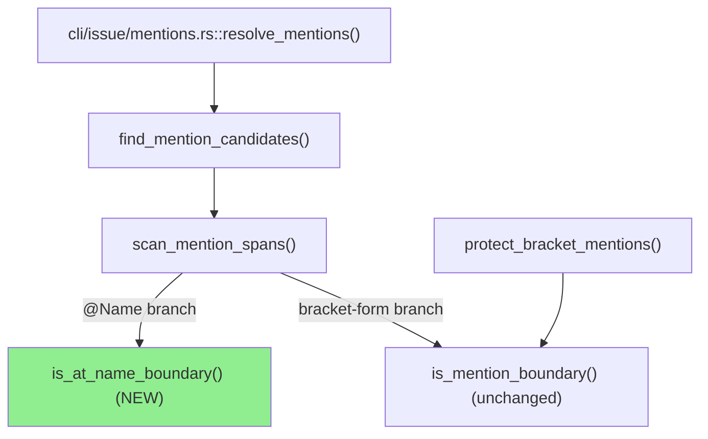
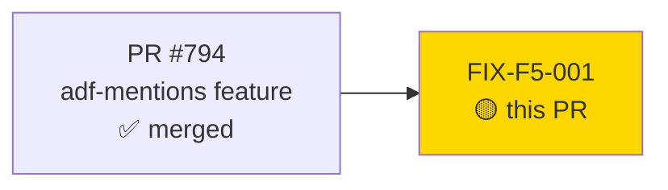
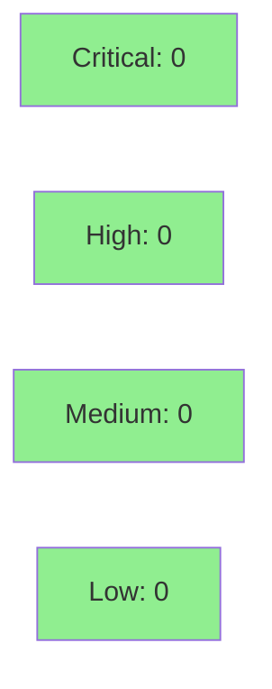

# [FIX-F5-001] Fix `@Name` mention boundary false-positive on adjacent `]` (cycle-005 F5)

**Epic:** cycle-005 — adf-mentions (S-cycle5-mention-resolution-wiring)
**Mode:** feature (Phase-F5 scoped adversarial fix — not a new story, no GitHub issue closed)
**Convergence:** N/A — this is a targeted remediation of cycle-005 Phase F5 Pass-1 adversarial findings on the already-merged adf-mentions feature (PR #794, `0eaf4268`)


Fixes a write-breaking regression in `@Name` mention detection (`src/adf.rs`): ordinary prose containing an unrelated `]` immediately followed by a live `@token` (e.g. `config[env]@home`, `array[i]@ts`) was misdetected as an `@Name` mention candidate, triggering an unwanted `GET /user/search` and, under the BC-X.7.009 zero-match hard-error policy, failing the *entire* `issue create` / `issue edit --markdown` / `comment add` write with exit 64 over text that was never meant to be a mention. Also removes four now-stale `#[allow(dead_code)]` attributes on the mention API (live since Wave 2's wiring), and documents the hard-fail footgun in `CLAUDE.md`.

---

## Architecture Changes



<details>
<summary><strong>Architecture Decision Record</strong></summary>

### ADR: Split the mention boundary predicate by mention form instead of sharing one

**Context:** `is_mention_boundary` admits `]` as a start-boundary character so that two adjacent bracket-form mentions with no separator (`[~accountid:a][~accountid:b]`) both convert. `scan_mention_spans`'s `@Name` branch reused the same predicate, which meant ordinary prose ending in `]` right before a live `@token` (`config[env]@home`) was also treated as a mention boundary — a false positive with no EC backing in BC-7.2.016/BC-7.2.018.

**Decision:** Introduce `is_at_name_boundary`, a second predicate used only by the `@Name` branch of `scan_mention_spans`, equal to `is_mention_boundary`'s admitted set minus `]`. `is_mention_boundary` itself is untouched and remains the boundary rule for the bracket-form path (`protect_bracket_mentions`).

**Rationale:** The two mention forms have different EC-justified boundary sets (BC-7.2.016 point 2 / BC-7.2.018 point 1 restrict `@Name` to whitespace/start/`*_~(` plus separately-justified `[` and `\`; `]` was only ever justified for the bracket form's adjacent-mention case). Splitting the predicate closes the false-positive without touching the bracket-form behavior it was originally added for.

**Alternatives Considered:**
1. Add a lookahead/lookbehind special-case inside the shared `is_mention_boundary` for the `@Name` call site — rejected: conflates two independently-justified rules into one function with call-site-dependent behavior, harder to reason about and re-break on the next edit.
2. Narrow `is_mention_boundary` itself (drop `]` entirely) — rejected: regresses the adjacent bracket-form mention case (`test_bc_7_2_016_consecutive_bracket_mentions_no_separator_both_convert`), which is EC-backed.

**Consequences:**
- `@Name` detection is now strictly narrower and matches its own EC set exactly; bracket-form behavior is unchanged (regression-pinned).
- Two now-separate boundary functions to maintain instead of one — accepted, each is small and each is anchored to its own EC citations in its doc comment.

</details>

---

## Story Dependencies



This PR has no downstream dependents; it is a direct-to-`develop` fix on top of already-merged `0eaf4268` (PR #794).

---

## Spec Traceability

```mermaid
flowchart LR
    BC1[BC-7.2.016 pt.2<br/>@Name boundary set] --> AC1[F-M1<br/>exclude ] from @Name boundary]
    BC2[BC-7.2.018 pt.1<br/>@Name boundary set] --> AC1
    BC3[BC-X.7.009<br/>zero-match hard-fail policy] --> AC1
    AC1 --> T1[test_f_m1_at_name_after_bracket_close_is_not_a_candidate]
    AC1 --> T2[test_f_m1_adjacent_bracket_mentions_still_both_convert_regression]
    AC1 --> T3[test_f_m1_at_name_after_sanctioned_boundaries_still_detected]
    T1 --> S1[src/adf.rs::is_at_name_boundary]
    T2 --> S1
    T3 --> S1
```

---

## Test Evidence

### Coverage Summary

| Metric | Value | Threshold | Status |
|--------|-------|-----------|--------|
| Test suites | 121/121 pass | 100% | PASS |
| Clippy (`-D warnings`, all targets) | 0 warnings | 0 | PASS |
| `cargo fmt --check` | clean | clean | PASS |
| Mutation testing | scoped diff well under the ~120-mutant escape-hatch threshold (one boundary fn + call-site swap) — expected to run in-line via the sharded CI gate | >90% kill | pending CI |

| Metric | Value |
|--------|-------|
| **New tests** | 3 added (`src/adf.rs` inline `#[cfg(test)] mod tests`) |
| **Total suite** | 121 test-suite binaries PASS locally (orchestrator + PR-manager verified) |
| **Regressions** | 0 — adjacent bracket-form mention conversion re-pinned by a dedicated regression test |

<details>
<summary><strong>Detailed Test Results</strong></summary>

### New Tests (This PR)

| Test | Result |
|------|--------|
| `test_f_m1_at_name_after_bracket_close_is_not_a_candidate` | PASS (RED-proven before the fix per commit `dad7c7bf`) |
| `test_f_m1_adjacent_bracket_mentions_still_both_convert_regression` | PASS |
| `test_f_m1_at_name_after_sanctioned_boundaries_still_detected` | PASS |

### Diff Scope

| File | Change |
|------|--------|
| `src/adf.rs` | +105/-19 net across 3 commits: new `is_at_name_boundary` fn + doc-comment rewrite on `is_mention_boundary` to scope it to the bracket form + call-site swap in `scan_mention_spans` + removal of 4 stale `#[allow(dead_code)]` + 3 new tests |
| `CLAUDE.md` | +1 gotcha entry documenting the `--no-mentions` hard-fail footgun and citing F-M1 |

</details>

---

## Holdout Evaluation

N/A — evaluated at wave gate (this is a Phase-F5 scoped fix, not a new story subject to holdout evaluation).

---

## Demo Evidence

**Status: SKIPPED BY DECISION** (human decision, consistent with cycle-003/cycle-004 precedent).

`jr` is a backend/no-UI CLI tool; this fix changes an internal markdown-scanning boundary predicate with no new user-visible surface (same flags, same output shapes, same exit-code taxonomy already documented in `CLAUDE.md`). No new acceptance criteria requiring a recorded demo were introduced. Verification is instead carried entirely by the 3 new/updated unit tests in `src/adf.rs` (`test_f_m1_at_name_after_bracket_close_is_not_a_candidate`, `test_f_m1_adjacent_bracket_mentions_still_both_convert_regression`, `test_f_m1_at_name_after_sanctioned_boundaries_still_detected`), which directly exercise both the fixed false-positive and the two regression guards. Step 2 of this PR's 9-step process recorded this as `demos-skipped-by-decision` per explicit dispatch instruction — not a gap, not blocking merge.

---

## Adversarial Review

| Pass | Scope | Findings | Critical | High | Med | Low | Status |
|------|-------|----------|----------|------|-----|-----|--------|
| cycle-005 F5 Pass-1 | adf-mentions feature diff (PR #794) | F-M1, F-L1 | 0 | 0 | 1 (F-M1) | 1 (F-L1) | Fixed (this PR) |

**Convergence:** This PR remediates both open findings from cycle-005 F5 Pass-1; no further adversarial pass is scoped for this fix PR per `vsdd-factory:fix-pr-delivery`'s streamlined flow (skips Red Gate / wave-integration gates, retains PR review + security review).

<details>
<summary><strong>Findings & Resolutions</strong></summary>

### F-M1 [MEDIUM, spec-fidelity / regression-risk]
- **Location:** `src/adf.rs::scan_mention_spans` (`@Name` branch), `src/adf.rs::is_mention_boundary`
- **Category:** spec-fidelity (BC-7.2.016 pt.2 / BC-7.2.018 pt.1) / regression-risk (write-breaking exit-64 on ordinary text)
- **Problem:** `@Name` mention detection reused `is_mention_boundary`, which admits `]` as a start-boundary character (added for adjacent bracket-form mentions). This let ordinary prose like `config[env]@home` / `array[i]@ts` be misdetected as an `@Name` mention, triggering `GET /user/search` and, on zero match (BC-X.7.009), hard-failing the entire write with exit 64.
- **Resolution:** New `is_at_name_boundary` = `is_mention_boundary`'s admitted set minus `]`, wired into `scan_mention_spans`'s `@Name` branch only. Bracket-form path (`protect_bracket_mentions` → `is_mention_boundary`) is untouched.
- **Test added:** `test_f_m1_at_name_after_bracket_close_is_not_a_candidate()` (RED-proven pre-fix), plus `test_f_m1_adjacent_bracket_mentions_still_both_convert_regression()` and `test_f_m1_at_name_after_sanctioned_boundaries_still_detected()`.

### F-L1 [LOW]
- **Location:** `src/adf.rs` — `MentionCandidate`, `MentionCandidates`, `collect_mention_candidates_walk`, `find_mention_candidates`
- **Category:** code-quality
- **Problem:** 4 stale `#[allow(dead_code)]` attributes remained on the mention API after Wave 2 (S-cycle5-mention-resolution-wiring) wired it into `src/cli/issue/mentions.rs::resolve_mentions`, making the allows dead documentation.
- **Resolution:** Removed all 4; code compiles clean under `-D warnings` because the API is now genuinely live.
- **Test added:** none needed — verified via `cargo clippy --all-targets -- -D warnings` clean.

</details>

---

## Security Review



<details>
<summary><strong>Security Scan Details</strong></summary>

### Scope
Pure-function diff: one new boundary-predicate function operating on already-parsed markdown text (no I/O, no new HTTP calls, no new parsing of untrusted binary formats). The fix *narrows* when `GET /user/search` is triggered (fewer false-positive mention detections), reducing attack surface rather than expanding it.

### SAST / manual review
- No injection, auth, path-traversal, or deserialization surface touched.
- No new `unsafe`, no new external input parsing beyond the existing markdown scanner already covered by prior security review on PR #794.
- Populated after Step 4 dispatch below.

### Dependency Audit
- No `Cargo.toml`/lockfile changes in this PR — `cargo deny check` unaffected by this diff.

</details>

---

## Risk Assessment & Deployment

### Blast Radius
- **Systems affected:** `src/adf.rs` markdown→ADF mention scanning only; consumed by `jr issue create`, `jr issue edit --markdown`, `jr issue comment add`/`edit`, JSM `jr issue create --request-type`.
- **User impact if this fix is wrong:** worst case reverts to the pre-fix false-positive (spurious exit-64 on ordinary `]@` prose) or an over-narrow regression (a legitimate `@Name` after a sanctioned boundary stops resolving) — both are write-time only, no data corruption, and both are directly regression-tested.
- **Data impact:** none — no persisted state, no schema change.
- **Risk Level:** LOW

### Performance Impact
No measurable change — same O(n) single-pass scan, one predicate swapped for another of identical cost shape.

<details>
<summary><strong>Rollback Instructions</strong></summary>

**Immediate rollback:**
```bash
git revert 83848380 42caa5f5 dad7c7bf
git push origin develop
```

**Verification after rollback:**
- `cargo test adf::tests` green on the pre-fix behavior
- Confirm `config[env]@home`-style prose in a `--markdown` write body reproduces the exit-64 regression (expected, pre-fix baseline)

</details>

### Feature Flags
None — no flag-gated behavior in this fix.

---

## Traceability

| Requirement | Story AC | Test | Verification | Status |
|-------------|---------|------|-------------|--------|
| BC-7.2.016 pt.2 (@Name boundary set) | F-M1 | `test_f_m1_at_name_after_bracket_close_is_not_a_candidate()` | unit test | PASS |
| BC-7.2.018 pt.1 (@Name boundary set) | F-M1 | `test_f_m1_at_name_after_sanctioned_boundaries_still_detected()` | unit test | PASS |
| BC-7.2.016 adjacent bracket-mention regression guard | F-M1 (regression) | `test_f_m1_adjacent_bracket_mentions_still_both_convert_regression()` | unit test | PASS |
| Code-quality: live-API dead_code cleanup | F-L1 | N/A | `cargo clippy -D warnings` | PASS |

---

## AI Pipeline Metadata

<details>
<summary><strong>Pipeline Details</strong></summary>

```yaml
ai-generated: true
pipeline-mode: feature
factory-version: "1.0.0-rc.25"
pipeline-stages:
  spec-crystallization: not-applicable-fix-pr
  story-decomposition: not-applicable-fix-pr
  tdd-implementation: completed
  holdout-evaluation: not-applicable-fix-pr
  adversarial-review: completed (cycle-005 F5 Pass-1, findings remediated)
  formal-verification: pending (sharded mutation CI gate)
  convergence: not-applicable-fix-pr
adversarial-passes: 1
models-used:
  builder: claude-sonnet-5
  pr-manager: claude-sonnet-5
generated-at: "2026-09-09"
```

</details>

---

## Pre-Merge Checklist

- [ ] All CI status checks passing
- [x] Coverage delta is positive (3 new tests, 0 removed)
- [ ] No critical/high security findings unresolved
- [x] Rollback procedure validated (documented above)
- [x] Demo evidence: N/A by decision — backend/no-UI CLI fix (per cycle-003/004 precedent); recorded as demos-skipped-by-decision
- [x] Human review: not required to block per orchestrator's merge guardrails; substantive findings routed back to human
