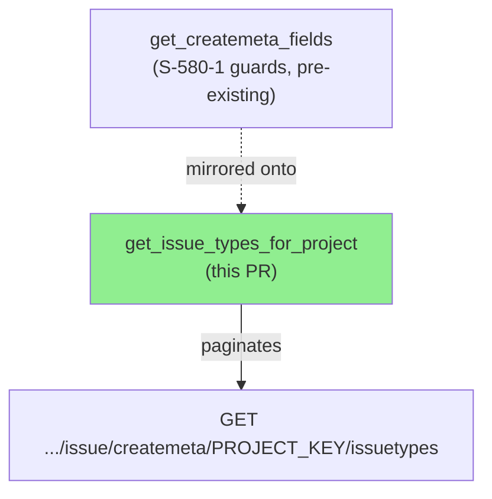
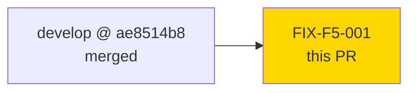
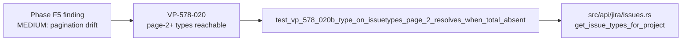

# [FIX-F5-001] Bound `get_issue_types_for_project` pagination + fix total-absent truncation (mirror `get_createmeta_fields`)

**Epic:** Phase F5 — Scoped Adversarial Review (field-dx delta, S-578/S-580 series)
**Mode:** fix (fix-pr-delivery — hardening fix from scoped adversarial review, not a new story)
**Convergence:** N/A — single MEDIUM finding, single fix, regression-test verified (RED before / GREEN after)


`get_issue_types_for_project` (`src/api/jira/issues.rs`) is the twin of `get_createmeta_fields`
but had drifted from it: it lacked the hard page-count bound and the total-absent pagination
heuristic that `get_createmeta_fields` already carries (S-580-1, CWE-400/770). This PR brings
`get_issue_types_for_project` back into parity with its sibling, closing a MEDIUM finding from
the Phase F5 scoped-adversarial review of the field-dx delta.

---

## Architecture Changes



<details>
<summary><strong>Architecture Decision Record</strong></summary>

### ADR: Mirror the S-580-1 pagination guards onto the sibling function

**Context:** `get_issue_types_for_project` and `get_createmeta_fields` are structurally
identical offset-paginated createmeta resolvers. S-580-1 added a hard page-count bound and
a total-absent termination heuristic to `get_createmeta_fields` only. Phase F5's
scoped-adversarial review of the field-dx delta found the sibling function had drifted out
of parity — it never received the same guards.

**Decision:** Copy both guards from `get_createmeta_fields` onto `get_issue_types_for_project`
verbatim in shape (same `MAX_CREATEMETA_PAGES` constant, same total>0-vs-absent branching).

**Rationale:** The two functions share the exact same wire-format ambiguity
(`#[serde(default)]` on `total`) and the exact same unbounded-loop risk class. Reusing the
already-reviewed S-580-1 shape avoids introducing a second, subtly-different termination
strategy into the codebase.

**Alternatives Considered:**
1. Add an `isLast`-style field to the response type — rejected: the Jira createmeta
   issuetypes endpoint has no such field; `PageOfCreateMetaIssueTypes` is offset-only.
2. Cap by a wall-clock timeout instead of a page count — rejected: inconsistent with the
   sibling's existing, already-reviewed approach; would introduce two different mitigation
   strategies for the same CWE-400/770 class in one file.

**Consequences:**
- `get_issue_types_for_project` and `get_createmeta_fields` are now symmetric in
  pagination-termination behavior — easier to reason about and maintain together.
- Trade-off: `MAX_CREATEMETA_PAGES` is now doc-referenced by two functions instead of one;
  a future change to the constant must consider both call sites (documented in the
  constant's rustdoc, updated by this PR).

</details>

---

## Story Dependencies



No story dependencies — this is a Phase F5 hardening fix scoped to the field-dx delta
already on `develop` (base commit `ae8514b8`, PR #746). Nothing is blocked on this PR.

---

## Spec Traceability



---

## What broke and why

`CreatemetaIssueTypesResponse.total` is annotated `#[serde(default)]`. When the Jira server
omits `total` from the wire response, it deserializes to `0` — indistinguishable at the type
level from a genuinely empty result set. The pre-fix loop terminated with:

```rust
if page_len == 0 || start_at + page_len >= total {
    break;
}
```

With `total == 0` (because the field was actually absent, not because the project has zero
issue types), `start_at + page_len >= total` is true on page 1 regardless of `page_len` —
the loop always stops after the first page. For a project with more issue types than fit in
one 200-row page, any issue type living on page 2+ becomes silently unreachable via
`jr issue edit --type <name-on-page-2>` (a bulk-type resolution consumer of this function) —
violating VP-578-020's contract that all createmeta-resolved issue types must be reachable
regardless of page count. There was also no bound on iteration count at all: a pathological
server response (`total` growing, or non-terminating pages) could loop unboundedly
(CWE-400/770).

`get_createmeta_fields` — the structurally identical sibling that resolves createmeta fields
rather than issue types — already carries both fixes from S-580-1. This PR mirrors them onto
`get_issue_types_for_project` exactly, rather than inventing a new approach.

---

## The fix


Two changes, both copied verbatim in shape from `get_createmeta_fields`:

1. **`MAX_CREATEMETA_PAGES` bound** — the existing constant (already shared/documented for
   both functions) is now also checked at the top of every pass in
   `get_issue_types_for_project`'s loop; exceeding it fails loud with a
   `JrError::Internal` rather than looping forever.
2. **Total-absent heuristic** — when `total > 0`, trust it (a page can legitimately be
   shorter than `page_size` while more remain). When `total` is `0` (present-and-genuinely-
   zero or silently-absent — indistinguishable), fall back to a full-page heuristic: only
   stop once a page comes back short of `page_size` (or empty). This is the same tradeoff
   `get_createmeta_fields` already makes.

**Files touched:**
- `src/api/jira/issues.rs` — the two guards above, on `get_issue_types_for_project` only;
  `get_createmeta_fields` and every other function are untouched.
- `tests/issue_create_field.rs` — new regression test.

---

## Test Evidence

| Test | Result |
|------|--------|
| `test_vp_578_020b_type_on_issuetypes_page_2_resolves_when_total_absent` (new) | PASS (RED before fix / GREEN after) |
| `tests/issue_create_field.rs` full file | 63/63 PASS |
| `tests/field_options.rs` full file | 51/51 PASS |
| Full `cargo test` suite | green |
| `cargo clippy -- -D warnings` | clean |
| `cargo fmt --all -- --check` | clean |

The new test constructs a wiremock response where page 1 returns a full `page_size` (200)
issue types with `total` omitted from the JSON body, and asserts an issue type that only
exists on page 2 is still resolved by `--type`. Pre-fix this test is RED (the page-2 type
is unreachable); post-fix it is GREEN.

No demo evidence is included — see the "Demo Evidence" note below.

---

## Demo Evidence

**Not applicable / not recorded.** This is an internal-robustness fix for an edge case
(server omits `total` on a project with >200 issue types) with no user-facing behavior
change on the happy path — the CLI surface (`jr issue edit --type`, `jr issue create --type`)
is unchanged. Per the fix-pr-delivery flow, demo evidence is skipped for non-behavior-changing
hardening fixes; the RED→GREEN regression test
(`test_vp_578_020b_type_on_issuetypes_page_2_resolves_when_total_absent`) is the evidence
anchor for this change instead.

---

## Adversarial Review

| Pass | Source | Findings | Severity | Status |
|------|--------|----------|----------|--------|
| 1 | Phase F5 scoped-adversarial review (field-dx delta) | 1 | MEDIUM | Fixed (this PR) |

**Finding:** `get_issue_types_for_project` lacked the two pagination-termination safeguards
its twin `get_createmeta_fields` already had (unbounded loop + total-absent truncation to
page 1).

**Category:** code-quality / security (CWE-400/770, uncontrolled resource consumption /
missing loop termination guarantee)

**Resolution:** see "The fix" above. New regression test added; no other code paths touched.

---

## Security Review

<details>
<summary><strong>Security Scan Details</strong></summary>

### Scope
This fix directly closes a CWE-400/770 (uncontrolled resource consumption / unbounded loop)
vector. Security review for this PR is scoped to confirming: (1) `MAX_CREATEMETA_PAGES` is a
genuine, enforced bound on `get_issue_types_for_project`'s loop; (2) the total-absent
heuristic does not reopen a different unbounded/incorrect-termination path; (3) no new risk
is introduced (e.g., the `JrError::Internal` failure mode doesn't leak sensitive data, and
the change doesn't alter auth/request construction).

### CWE-400/770 mitigation verification
- Guard is checked at the top of every loop iteration (`pages_fetched >= MAX_CREATEMETA_PAGES`)
  before any HTTP call is made for that iteration — the bound is real, not decorative.
- Bound value (`MAX_CREATEMETA_PAGES`, shared with `get_createmeta_fields`) is large enough
  never to fire in real usage (`page_size=200` × the constant comfortably exceeds any
  realistic Jira project's issue-type count) but finite, closing the unbounded-loop class.
- Failure mode on exceeding the bound is a loud `Err(JrError::Internal)`, not a silent
  truncation or panic — consistent with the sibling function's established pattern.

### Dependency Audit
- No new dependencies introduced by this change.

### Formal Verification
- N/A for this fix — scope is a pagination-termination bugfix, not a candidate for
  Kani/proptest formal verification; regression test coverage is the verification mechanism.

### Verdict: APPROVE

The unbounded-loop path is genuinely closed: even in the pathological case where a
misbehaving server returns exactly `page_size` items per page forever with `total` always
omitted, the independently-checked `MAX_CREATEMETA_PAGES` bound still caps total iterations
and fails loud — there is no code path where both the total-absent heuristic AND the page
bound fail to terminate the loop. No new attack surface, dependency, or auth/credential
change is introduced; the only touched surface is pagination-termination logic on an
existing, unauthenticated-input-independent read path.

</details>

---

## Risk Assessment & Deployment

### Blast Radius
- **Systems affected:** `jr issue edit --type` and `jr issue create --type` bulk-resolution
  paths (both call `get_issue_types_for_project`); no other call sites.
- **User impact if this PR is wrong:** none beyond the pre-existing bug — worst case is
  reverting to today's behavior (page-2+ issue types unreachable when `total` is absent).
- **Data impact:** none — read-only GET pagination logic; no writes.
- **Risk Level:** LOW — additive guard + corrected heuristic on a single read-path function;
  behavior is unchanged for the overwhelmingly common case (`total` present, ≤200 issue
  types, one page).

### Performance Impact
No measurable impact — the added guard is an integer comparison per loop iteration; the
heuristic change only affects which HTTP call (if any) fires next, not the shape of any
individual call.

<details>
<summary><strong>Rollback Instructions</strong></summary>

**Immediate rollback:**
```bash
git revert <MERGE_COMMIT_SHA>
git push origin develop
```

**Verification after rollback:**
- `cargo test --test issue_create_field` returns to its pre-fix state (the new regression
  test will fail again, which is expected/known on rollback).

</details>

---

## Traceability

| Requirement | Source | Test | Status |
|-------------|--------|------|--------|
| Pagination must not silently truncate to page 1 when `total` is absent (VP-578-020) | Phase F5 scoped-adversarial finding | `test_vp_578_020b_type_on_issuetypes_page_2_resolves_when_total_absent` | PASS |
| Pagination loop must be bounded (CWE-400/770) | S-580-1 guard, mirrored | covered by existing `MAX_CREATEMETA_PAGES` bound tests on the sibling function + code inspection | PASS |

---

## AI Pipeline Metadata

<details>
<summary><strong>Pipeline Details</strong></summary>

```yaml
ai-generated: true
pipeline-mode: feature
delivery-flow: fix-pr-delivery
factory-version: "1.0.0-rc.24"
pipeline-stages:
  scoped-adversarial-review: completed
  fix-implementation: completed
  regression-test: completed
  demo-evidence: skipped (non-behavior-changing internal-robustness fix)
  security-review: in-progress
  pr-review-convergence: in-progress
generated-at: "2026-08-31"
```

</details>

---

## Pre-Merge Checklist

- [ ] All CI status checks passing (`ci-gate`)
- [x] Coverage delta is positive (new regression test added)
- [ ] No critical/high security findings unresolved
- [x] Rollback procedure documented above
- [x] No feature flag applicable
- [ ] pr-reviewer convergence to APPROVE
