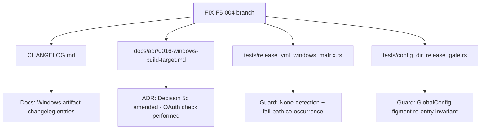
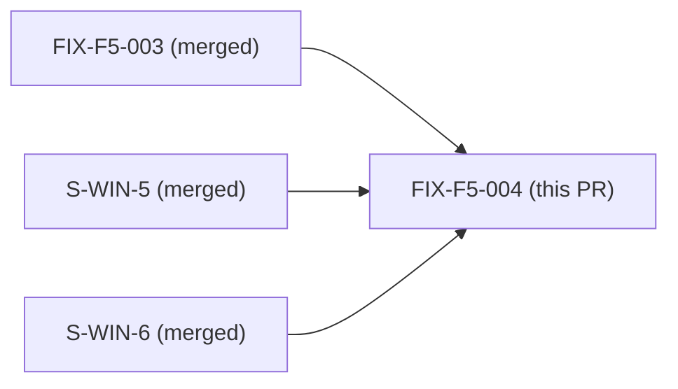
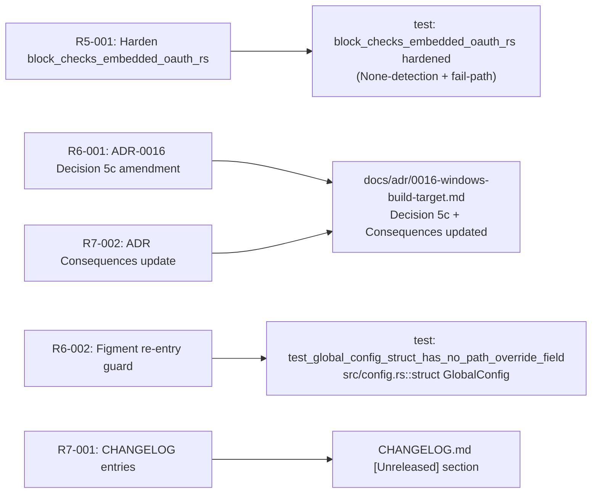

## Summary

F5 Rounds 5/6/7 scoped-adversarial fixes — docs sync and test guard hardening for the Windows build feature. No production logic changes. No user-visible runtime behavior change.

**Changes:**
- `CHANGELOG.md`: Add `[Unreleased]` entries documenting Windows pre-built binary (`.zip`), Windows Credential Manager keyring, `%APPDATA%/%LOCALAPPDATA%` config/cache paths, and `windows-latest` CI matrix. (R7-001)
- `docs/adr/0016-windows-build-target.md`: Amend Decision 5c and Consequences to accurately record that Windows embedded-OAuth verification IS now performed (constants-file check via `pwsh`); runtime `jr auth status` probe remains deferred. (R6-001, R7-002)
- `tests/release_yml_windows_matrix.rs`: Harden `block_checks_embedded_oauth_rs` to require None-detection AND fail-path co-occurrence (R5-001). Pure symbol-presence check was too weak — a future edit inverting the condition or commenting out the None-match would still pass the old test.
- `tests/config_dir_release_gate.rs`: Add `test_global_config_struct_has_no_path_override_field` (R6-002) — guards the figment re-entry invariant: `struct GlobalConfig` must not gain `config_dir` or `cache_dir` fields, which would silently re-open the SEC-PATH-1 path-injection vector via `Env::prefixed("JR_")` in release builds.

## Architecture Changes

## Story Dependencies

All upstream dependency PRs are already merged into `develop`.

## Spec Traceability

## Test Evidence

All tests pass locally (verified pre-PR):

- `cargo fmt --check` — PASS
- `cargo clippy -- -D warnings` — PASS (zero warnings)
- `cargo test` — ALL PASS including:
  - `tests/release_yml_windows_matrix.rs` — hardened `block_checks_embedded_oauth_rs` with R5-001 criteria (None-detection + fail-path); all 5 Windows-matrix tests pass
  - `tests/config_dir_release_gate.rs` — new `test_global_config_struct_has_no_path_override_field` PASS; all config-dir gate tests pass
- `cargo deny check` — PASS

Coverage: docs/test-hardening only; no production logic paths changed.
Mutation testing: N/A — no logic branches added (tests read source-file text; the only mutation possible is removing the test itself, which CI catches).

## Demo Evidence

N/A — docs + test-only change. No user-visible runtime behavior change. No interactive commands affected.

## Holdout Evaluation

N/A — evaluated at wave gate. This is a docs-sync and guard-hardening fix with no behavioral contracts to holdout-evaluate.

## Adversarial Review

N/A — evaluated at Phase 5. FIX-F5-004 IS itself the output of F5 Rounds 5/6/7 adversarial review. The changes in this PR are the direct resolutions of adversarial findings R5-001, R6-001, R6-002, R7-001, and R7-002.

## Security Review

Reviewed by vsdd-factory:security-reviewer. **Verdict: APPROVE — no CRITICAL or HIGH findings.**

| ID | Severity | Finding | Disposition |
|----|----------|---------|-------------|
| SEC-001 | INFO | Integer underflow in brace-tracking loop (usize) — cannot trigger (first char always `{`) | Dismissed |
| SEC-002 | LOW | Silent false-pass if struct closing brace not found — brace-tracking loop sets no post-loop assertion | Accepted (test-infra robustness gap only; current `src/config.rs` is well-formed; does not affect current pass state) |
| SEC-003 | INFO | Substring check for `config_dir` correctness — GUARD comment outside struct body confirmed | Dismissed |
| SEC-004 | INFO | No hardcoded credentials/PII in CHANGELOG or ADR | Dismissed |
| SEC-005 | INFO | `block_checks_embedded_oauth_rs` hardening is correct and closes the identified bypass gap | Positive control confirmed |
| SEC-006 | INFO | ADR-0016 amendment accurately reflects FIX-F5-003 R3-001 scope | Dismissed |

SEC-PATH-1 (figment re-entry path injection): MITIGATED by new `test_global_config_struct_has_no_path_override_field`.

## Risk Assessment

- **Blast radius:** Minimal. Changes are confined to CHANGELOG, ADR prose, and two test files. No production source (`src/`) modified.
- **Performance impact:** None.
- **Rollback:** Trivial — revert the 4 changed files. No schema changes, no migrations, no data.
- **SEC-PATH-1:** The new `test_global_config_struct_has_no_path_override_field` test REDUCES security risk by making the figment re-entry invariant machine-enforceable.

## AI Pipeline Metadata

- Pipeline mode: Feature Mode / F5 Scoped Adversarial Rounds 5-7
- Models used: claude-sonnet-4-6
- PR manager: vsdd-factory:pr-manager

## Pre-Merge Checklist

- [x] PR description matches actual diff
- [x] CHANGELOG entries present for all Windows feature additions
- [x] ADR-0016 Decision 5c reflects current implementation state
- [x] Test guard hardening: `block_checks_embedded_oauth_rs` requires None-detection + fail-path
- [x] Test guard hardening: `test_global_config_struct_has_no_path_override_field` guards figment re-entry
- [x] Local gate clean: fmt, clippy, test, deny all pass
- [ ] CI checks green (pending)
- [ ] AI PR review: no CRITICAL/HIGH findings (pending)
- [ ] Dependency PRs merged (FIX-F5-003, S-WIN-5, S-WIN-6 — verified already merged)
- [ ] Squash-merged with Conventional Commits title
