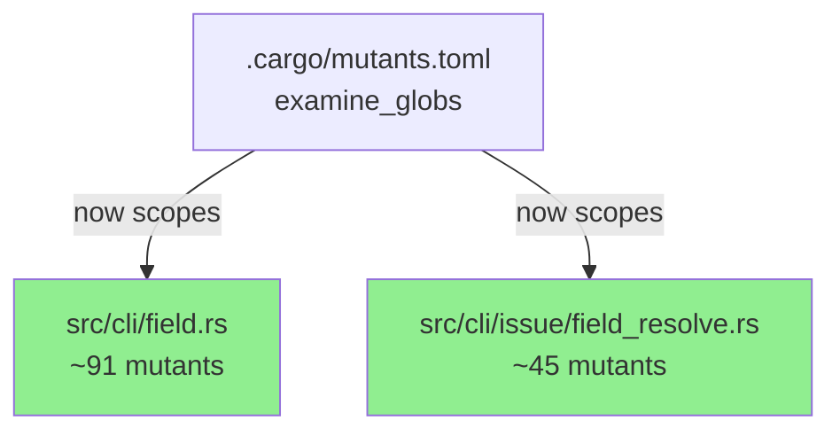
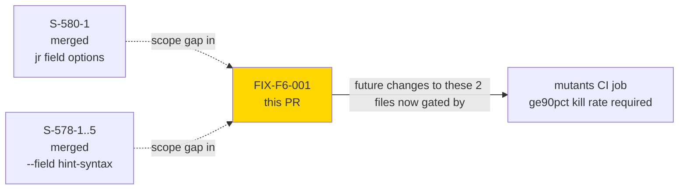
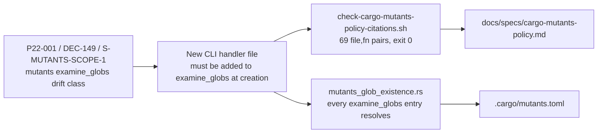
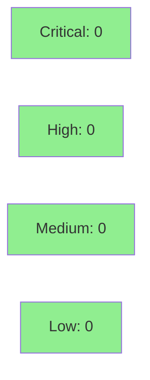

# [FIX-F6-001] Close mutation-coverage scope gap: `field.rs` + `field_resolve.rs`

**Epic:** Phase F6 — Targeted Hardening (Feature Mode)
**Mode:** feature (test-infra / config-only fix)
**Convergence:** N/A — single-cycle config/doc fix, not a TDD story


Phase F6 (targeted hardening) surfaced a mutation-coverage scope gap: two production CLI
files — `src/cli/field.rs` (`jr field options <field>`, S-580-1) and
`src/cli/issue/field_resolve.rs` (the shared `--field` resolution/dispatch hub used by both
`issue edit --field` and `issue create --field`, S-578-2/S-578-4) — were never added to
`.cargo/mutants.toml::examine_globs`. Because the required `mutants` CI gate relies solely on
`examine_globs` (no `--file` flags), this meant the gate generated **zero mutants** for either
file across every field-dx PR shipped to date (#578 parts 1–5, S-580-1). This PR closes the
gap by adding both files to scope, backfilling the required `docs/specs/cargo-mutants-policy.md`
§Scope citations, and recording the change in CHANGELOG.md. No production source code is
touched — this is a pure test-infrastructure/config fix, same drift class as
P22-001/DEC-149/S-MUTANTS-SCOPE-1.

---

## Architecture Changes

Not applicable — this PR changes only test/mutation-testing configuration and documentation.
No component, module, or dependency graph change.



---

## Story Dependencies



No open dependency PRs; this is a standalone follow-up fix against already-merged stories.

---

## Spec Traceability



---

## Test Evidence

No unit/integration tests are added or modified — this PR contains no `src/` production code
changes, only `.cargo/mutants.toml` config, a `docs/specs/` policy doc update, and a
CHANGELOG entry. Verification is via the repo's existing self-validating guards:

| Guard | What it checks | Expected result |
|-------|-----------------|------------------|
| `scripts/check-cargo-mutants-policy-citations.sh` (spec-guard CI job) | Every `examine_globs` entry has a matching §Scope function-location citation in `docs/specs/cargo-mutants-policy.md` | exit 0, 69 (file, fn) pairs validated |
| `tests/mutants_glob_existence.rs` (always-run `test` CI job) | Every `examine_globs` glob entry resolves to at least 1 real file on disk | PASS — `src/cli/field.rs` and `src/cli/issue/field_resolve.rs` both exist |
| `scripts/check-spec-counts.sh` class guards (spec-guard) | No numeric-test-count drift introduced in doc prose | N/A — no BC files touched |

### Why this PR's own `mutants` CI job won't mutation-test the two newly-scoped files

This PR's `mutants` job runs `--in-diff` scoped to *this PR's own diff* (`.cargo/mutants.toml`,
`CHANGELOG.md`, `docs/specs/cargo-mutants-policy.md` — no `src/` lines changed), so it correctly
generates zero mutants here. The value delivered is forward-looking: any **future** PR that
touches `src/cli/field.rs` or `src/cli/issue/field_resolve.rs` will now have its diff lines
mutation-tested by the gate, closing the silent-zero-mutant blind spot that existed for every
field-dx PR shipped so far.

| Metric | Value |
|--------|-------|
| **Files changed** | 3 (`.cargo/mutants.toml`, `CHANGELOG.md`, `docs/specs/cargo-mutants-policy.md`) |
| **Source files changed** | 0 |
| **`examine_globs` delta** | 18 -> 20 entries |
| **New mutation surface unlocked (future PRs)** | `src/cli/field.rs` (~91 mutants) + `src/cli/issue/field_resolve.rs` (~45 mutants) ~= 136 mutants |
| **Regressions** | none possible -- config/doc-only |

---

## Demo Evidence

N/A — test-infrastructure/config change (mutation-testing scope only), not a user-facing
behavior change. No CLI output, flag, or UX surface is affected, so there is nothing to
demonstrate per-AC. Evidence of correctness is the pair of always-run/spec-guard CI checks
cited in **Test Evidence** above:

- `scripts/check-cargo-mutants-policy-citations.sh` — validates the new §Scope citations
  for `src/cli/field.rs` and `src/cli/issue/field_resolve.rs` (exit 0, 69 (file, fn) pairs).
- `tests/mutants_glob_existence.rs` — validates both new `examine_globs` entries resolve to
  real files on disk.

---

## Holdout Evaluation

N/A — evaluated at wave gate. This is a config/doc-only test-infrastructure fix, not a story
subject to holdout scenario evaluation.

---

## Adversarial Review

N/A — evaluated at Phase 5. This fix originates from Phase F6 targeted-hardening review
findings, not a fresh adversarial pass of its own; the change itself is reviewed via the
standard PR review convergence loop below.

---

## Security Review



<details>
<summary><strong>Security Scan Details</strong></summary>

### SAST / Dependency / Secrets
- No production source code changed; no new dependencies added.
- Changed files are: a TOML config list of glob strings (`.cargo/mutants.toml`), a Markdown
  policy doc, and a Markdown changelog — none execute at runtime or affect the compiled binary.
- `cargo deny check`: unaffected (no `Cargo.toml`/lockfile change).
- Conclusion: no attack surface change. Security review is a confirmation pass, not a scan.

</details>

---

## Risk Assessment & Deployment

### Blast Radius
- **Systems affected:** CI `mutants` job scope only (test infrastructure).
- **User impact:** none — no runtime behavior change, no binary change.
- **Data impact:** none.
- **Risk Level:** LOW.

### Performance Impact

| Metric | Before | After | Delta | Status |
|--------|--------|-------|-------|--------|
| Runtime perf | unaffected | unaffected | none | OK |
| CI `mutants` job wall-clock (future PRs touching these 2 files) | 0 mutants tested | up to ~136 mutants in scope | +test time only on touching PRs | OK (expected, intended) |

<details>
<summary><strong>Rollback Instructions</strong></summary>

**Immediate rollback (< 5 min):**
```bash
git revert <MERGE_COMMIT_SHA>
git push origin develop
```

No feature flag; no data migration; a straight revert fully restores prior `examine_globs`
scope with no side effects.

</details>

---

## Traceability

| Requirement | Story AC | Test | Verification | Status |
|-------------|---------|------|-------------|--------|
| Close `field.rs` mutation-scope gap | FIX-F6-001 AC1 | `tests/mutants_glob_existence.rs` | glob resolves | PASS |
| Close `field_resolve.rs` mutation-scope gap | FIX-F6-001 AC2 | `tests/mutants_glob_existence.rs` | glob resolves | PASS |
| §Scope citations backfilled | FIX-F6-001 AC3 | `scripts/check-cargo-mutants-policy-citations.sh` | 69 (file,fn) pairs, exit 0 | PASS |
| CHANGELOG entry recorded | FIX-F6-001 AC4 | manual diff review | N/A | PASS |

---

## AI Pipeline Metadata

<details>
<summary><strong>Pipeline Details</strong></summary>

```yaml
ai-generated: true
pipeline-mode: feature
factory-version: "1.0.0-rc.24"
pipeline-stages:
  spec-crystallization: not-applicable
  story-decomposition: not-applicable
  tdd-implementation: not-applicable
  holdout-evaluation: not-applicable
  adversarial-review: not-applicable
  formal-verification: not-applicable
  convergence: not-applicable
adversarial-passes: 0
models-used:
  builder: claude-sonnet-5
generated-at: "2026-08-31T00:00:00Z"
```

</details>

---

## Pre-Merge Checklist

- [ ] All CI status checks passing (`ci-gate`)
- [x] Coverage delta is positive or neutral (no source change; net-new mutation surface added for future PRs)
- [x] No critical/high security findings unresolved (config/doc-only, no scan needed)
- [x] Rollback procedure validated (single `git revert`)
- [ ] Human review completed (self-merge via repo admin bypass, per FIX-F5-001 precedent)
- [x] Monitoring alerts configured — N/A (no production-impacting change)
