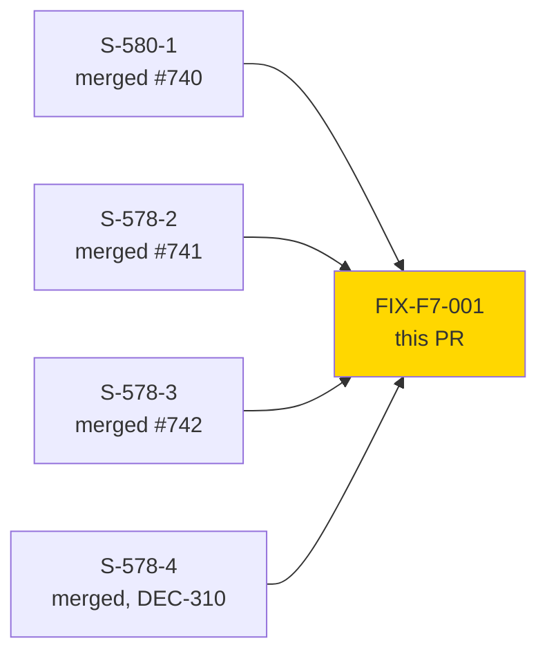
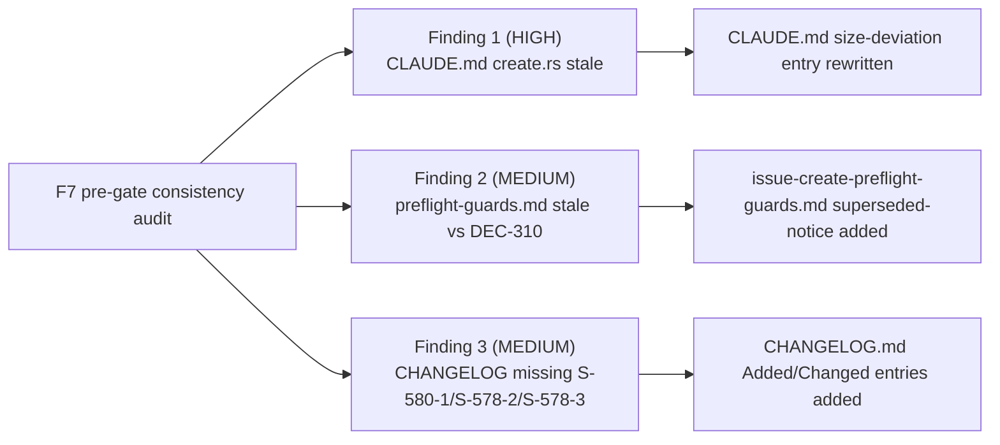

# [FIX-F7-001] F7 pre-gate documentation-consistency fix (field-dx bundle)

**Epic:** field-dx (S-578-1..4 / S-580-1 bundle)
**Mode:** feature (Feature Mode, F7 pre-gate)
**Convergence:** N/A — doc-only change, no adversarial/holdout pipeline invoked


This is a doc-only fix. The F7 pre-gate consistency audit for the field-dx bundle
(S-578-1 through S-578-4, S-580-1) found three product-repo documentation gaps that
had drifted from the shipped code. This PR closes all three; it makes **zero** changes
to `src/`, `tests/`, or any binary/build artifact.

---

## What Changed

### 1. HIGH — `CLAUDE.md` size-deviation entry for `cli/issue/create.rs` was stale

The "Known Size Deviations" entry still said `create.rs` was ~530 LOC (from the
2026-08-25 measurement). Since then, S-578-1's `parse_field_kv` hint-syntax work and
S-578-4's platform-path `--field` `createmeta` resolution (BC-3.3.010/BC-3.3.011,
DEC-310) grew the file to **~1,253 LOC** — crossing ADR-0012's 1,000-LOC shard
threshold with no DOCUMENT-AS-IS write-up justifying the deviation. Fixed: the entry
is re-measured (2026-08-31) and rewritten to explain exactly what grew the file (the
step 2a hint-parse guard, the step 2b `CREATE_D2_GOVERNED_KEYS` collision guard, the
step 4b `get_issue_types_for_project` + `get_createmeta_fields` resolution via
`field_resolve.rs`'s `dispatch_field_value`, and the DEC-310 guard-reversal removal of
the S-639-1/DEC-188 pre-flight exit) and to state the DOCUMENT-AS-IS rationale
explicitly, consistent with the treatment already given to `component.rs` /
`attachments.rs` / `field_resolve.rs`.

### 2. MEDIUM — `docs/specs/issue-create-preflight-guards.md` presented a reversed guard as current

The spec described the DEC-188 `--field`-alone pre-flight exit-64 guard on
`jr issue create` as current behavior, with no note that **DEC-310** (S-578-4, #578,
registered 2026-08-26) reversed the `--field` half of it — the platform path now
resolves `--field` via `createmeta` instead of rejecting it outright. Fixed: added a
top-of-file superseded-notice callout and inline superseded-row annotations in the
behavior table, scoped precisely — the `--on-behalf-of` guard (BC-3.8.013) is
**unchanged** and the doc's ordering/mechanics/rationale content for it remains
accurate. The `--field` content is now explicitly marked historical (describing the
now-superseded DEC-188 shape), pointing readers at CLAUDE.md's DEC-310 gotcha entry
and the amended ADR-0014 notes for current behavior.

### 3. MEDIUM — `CHANGELOG.md` missing entries for shipped field-dx work

Three already-merged changes had no CHANGELOG entry: **S-580-1** (`jr field options
<field>`, #578/#740 — new command, M1/M2/M3 context-mechanism field resolution),
**S-578-2** (`issue edit --field NAME:kind=VALUE` real resolution for
`:option`/`:id`/`:name`/`:asset` kind hints, #578/#741), and **S-578-3** (JSM
`issue create --field` kind-hint resolution parity, #578/#742). Fixed: added an
`### Added` entry for S-580-1 and two `### Changed` entries for S-578-2/S-578-3,
matching the existing CHANGELOG voice and citation style (story ID, BC IDs, issue/PR
numbers).

---

## Architecture Changes

None. Documentation only — no source, test, or build-graph changes.

---

## Story Dependencies



No upstream dependency PRs are open — S-580-1 (#740), S-578-2 (#741, part of #739's
parser work plus its own dispatch PR), S-578-3 (#742), and S-578-4 (DEC-310) are all
already merged to `develop`; this PR only reconciles documentation with that already-
merged state. No downstream PRs are blocked on this one.

---

## Demo Evidence

N/A — doc-only change (`CLAUDE.md`, `docs/specs/issue-create-preflight-guards.md`,
`CHANGELOG.md`). There is no user-facing behavior to demo; the driving evidence is the
F7 pre-gate consistency-audit findings themselves (3 gaps identified: stale
`create.rs` size-deviation entry, stale DEC-188-vs-DEC-310 guard description, missing
CHANGELOG entries for S-580-1/S-578-2/S-578-3), each addressed in the "What Changed"
section above and verifiable by reading the resulting doc diff.

---

## Spec Traceability



---

## Test Evidence

Not applicable — doc-only change with no executable surface. No unit/integration/
mutation/holdout suite applies. Remote CI (`ci-gate`, including the
`test_claude_md_citations_resolve_to_real_files` guard that validates every
backtick-quoted file-path citation in `CLAUDE.md` still resolves) is the verification
mechanism for this PR; see the CI status posted to this PR once available.

---

## Holdout Evaluation

N/A — doc-only change, not routed through Phase 4 holdout evaluation.

---

## Adversarial Review

N/A — doc-only change; scoped fresh-eyes `pr-reviewer` pass on the 3-file diff serves
as the review gate for this PR (see review-findings tracking).

---

## Security Review

N/A — doc-only change (`CLAUDE.md`, `docs/specs/issue-create-preflight-guards.md`,
`CHANGELOG.md`). No code path, dependency, or secret-handling surface touched. Quick
confirmation performed: diff contains no credentials, tokens, real Jira keys/org
IDs/instance URLs, or executable content.

---

## Risk Assessment & Deployment

### Blast Radius
- **Systems affected:** none (documentation only).
- **User impact:** none if this PR fails to merge; if merged, corrects developer-facing
  docs to match already-shipped behavior (no runtime behavior changes).
- **Data impact:** none.
- **Risk Level:** LOW.

### Performance Impact
Not applicable — no code changes.

<details>
<summary><strong>Rollback Instructions</strong></summary>

**Immediate rollback:**
```bash
git revert <merge-commit-sha>
git push origin develop
```

No feature flags involved.

</details>

---

## Traceability

| Requirement | Driver | Change | Status |
|---|---|---|---|
| F7 audit finding 1 (HIGH) | ADR-0012 shard-threshold consistency | `CLAUDE.md` size-deviation entry rewrite | Fixed |
| F7 audit finding 2 (MEDIUM) | DEC-310 documentation consistency | `docs/specs/issue-create-preflight-guards.md` superseded-notice | Fixed |
| F7 audit finding 3 (MEDIUM) | CHANGELOG completeness (S-580-1, S-578-2, S-578-3) | `CHANGELOG.md` Added/Changed entries | Fixed |

---

## AI Pipeline Metadata

<details>
<summary><strong>Pipeline Details</strong></summary>

```yaml
ai-generated: true
pipeline-mode: feature
pipeline-stages:
  f7-pregate-consistency-audit: completed
  doc-fix: completed
  adversarial-review: not-applicable (doc-only)
  formal-verification: skipped (doc-only)
  convergence: not-applicable (doc-only)
generated-at: "2026-08-31"
```

</details>

---

## Pre-Merge Checklist

- [ ] All CI status checks passing (`ci-gate`)
- [x] No code/test/binary changes — coverage and mutation gates not applicable
- [x] No security-relevant surface touched
- [ ] Rollback procedure validated (single `git revert`, no flags)
- [x] No feature flags involved
- [ ] Human review / merge authorization confirmed (AUTHORIZE_MERGE=yes per dispatch)
