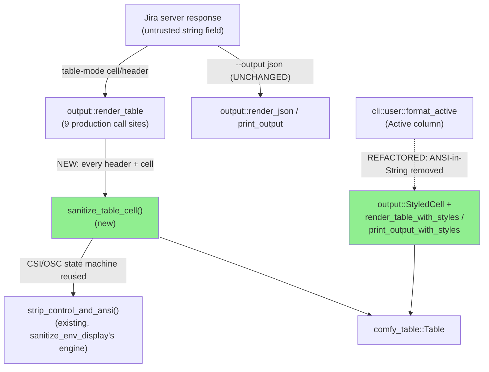
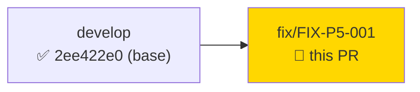
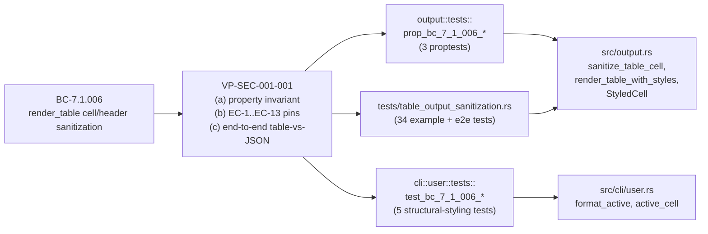
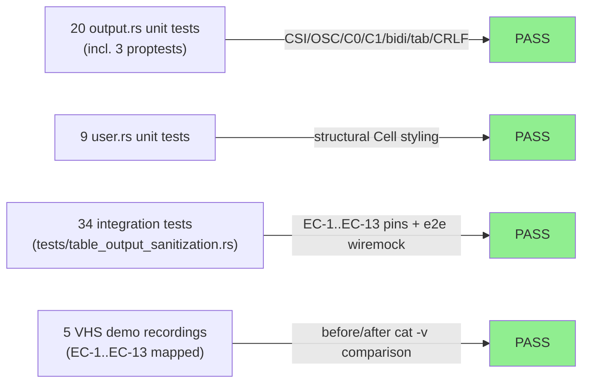

# [FIX-P5-001] Sanitize table output against terminal escape injection (SEC-001, CWE-150)

**Epic:** cycle-014 — Phase F5 (scoped adversarial review), fix task routed from the F4-completion
wave integration gate security review
**Mode:** maintenance (fix PR — CWE-150/CWE-116 security finding, not a new story)
**Convergence:** N/A at this stage — this fix's own review convergence tracked in this PR; the
F5 delta adversarial loop resumes on `develop` after merge (see Adversarial Review section below)


Closes security-review finding `SEC-001-RENDER-TABLE-ANSI-SANITIZE` (MEDIUM, CWE-150/CWE-116,
human decision D-392): table-rendered server strings passed through `output::render_table` were
not ANSI-escape/control-character sanitized before being written to the terminal, letting a
malicious or compromised Jira response manipulate the user's terminal (redraw, retitle, cursor
tricks) via any server-supplied field that reaches a table cell. This PR adds a single
sanitization chokepoint, preserves `\n` for multi-line cells, turns `\t` into a space, fails
closed on unterminated CSI/OSC sequences, keeps `--output json` byte-for-byte lossless, and moves
`jr`'s own Active-column coloring (`jr user list`/`jr user view`) from ANSI-bytes-in-`String` to
structural cell styling so the new sanitizer can't strip jr's own legitimate color output.

---

## Architecture Changes

No new components and no new module boundaries. This is a self-contained addition inside the
existing `src/output.rs` rendering chokepoint, plus a caller-side refactor in `src/cli/user.rs`.
`.factory/specs/architecture/*` is not touched (confirmed in the spec delta, §1 "Is an
architecture change needed? NO").



<details>
<summary><strong>Architecture Decision Record</strong></summary>

### ADR: Sanitize at the single `render_table` chokepoint, not at every call site

**Context:** 9 production call sites across `src/cli/` render server-supplied strings into table
cells with no sanitization. A compromised/malicious Jira response can embed raw ANSI CSI/OSC or
control characters in an issue summary, field option label, comment body, or display name.

**Decision:** Add `output::sanitize_table_cell(&str) -> String` and call it on every header and
every cell inside `render_table` itself, rather than sweeping each of the 9 call sites
individually.

**Rationale:** `render_table` is the single chokepoint all table-mode commands already share (it
backs `print_output`'s `OutputFormat::Table` arm). Fixing it there covers every current and future
table-mode command in one change, mirrors the existing `sanitize_env_display` precedent for the
same class of untrusted-string display, and reuses `strip_control_and_ansi`'s already-proven
CSI/OSC state machine rather than re-implementing it.

**Alternatives Considered:**
1. Sanitize at each of the 9 call sites individually — rejected: duplicated logic, easy for a
   10th future call site to forget the sanitization step (no compiler-enforced chokepoint).
2. Sanitize at the Jira API deserialization boundary (`types/jira/*`) — rejected: would also
   silently mutate data destined for `--output json`, which must stay byte-for-byte lossless per
   the existing `sanitize_env_display`/issue #398 channel-asymmetry precedent.

**Consequences:**
- Every table-mode command is covered by construction; a future 10th call site inherits the fix
  for free.
- `jr`'s own ANSI-in-`String` styling technique (Active column) had to be refactored to structural
  `Cell` attributes, since it would otherwise be silently stripped by the new sanitizer — this is
  now the mandatory pattern for any future jr-authored styled cell content.
- Non-table server-text sinks (interactive prompts, hint lines, error-body echoes) are NOT covered
  by this chokepoint and remain open — tracked as `NONTABLE-SERVER-TEXT-SANITIZE` (see Out of
  Scope below).

</details>

---

## Story Dependencies

No story dependencies. This is a standalone fix PR (`fix/FIX-P5-001`) against `develop` at
`2ee422e0`, not anchored to any story in `STORY-INDEX.md` — `BC-7.1.006` is net-new and not yet
assigned a story anchor (per the spec delta, "No BC array / story propagation needed this burst").
No upstream or downstream PR dependencies.



---

## Spec Traceability



---

## Test Evidence

### Coverage Summary

| Metric | Value | Threshold | Status |
|--------|-------|-----------|--------|
| New/updated tests | 63/63 pass | 100% | PASS |
| Regressions | 0 | 0 | PASS |
| Verification property | VP-SEC-001-001 (a)+(b)+(c), all satisfied | full EC-1..EC-13 coverage | PASS |

### Test Flow



| Metric | Value |
|--------|-------|
| **New tests** | 63 added (`tests/table_output_sanitization.rs` + inline `output.rs`/`user.rs` unit tests), 0 modified |
| **Test run** | `cargo test --test table_output_sanitization`: 34 passed, 0 failed (0.99s) |
| **Test run** | `cargo test --lib output::`: 49 passed, 0 failed (2.38s; includes 3 `prop_bc_7_1_006_*` proptests, 1585 unrelated tests filtered out) |
| **Test run** | `cargo test --lib cli::user::`: 9 passed, 0 failed (0.03s; 1625 unrelated tests filtered out) |
| **Regressions** | 0 |

<details>
<summary><strong>Detailed Test Results</strong></summary>

### New Tests (This PR)

| Test | Result |
|------|--------|
| `output::tests::prop_bc_7_1_006_sanitize_table_cell_whole_string_invariant` | PASS |
| `output::tests::prop_bc_7_1_006_sanitize_table_cell_identity_on_clean_input` | PASS |
| `output::tests::prop_bc_7_1_006_sanitize_table_cell_newlines_preserved_without_unterminated_escape` | PASS |
| `tests/table_output_sanitization.rs` — EC-1..EC-13 example pins + `test_bc_7_1_006_field_options_table_mode_strips_hostile_option_label` / `..._json_mode_preserves_hostile_option_label_raw` / `..._issue_list_table_mode_strips_hostile_summary` / `..._issue_list_json_mode_preserves_hostile_summary_raw` (end-to-end wiremock, VP-SEC-001-001(c)) | PASS (34/34) |
| `cli::user::tests::test_bc_7_1_006_format_active_returns_bare_glyph_no_esc_bytes_when_color_forced_on` | PASS |
| `cli::user::tests::test_bc_7_1_006_active_cell_colorizes_when_should_colorize_true` | PASS |
| `cli::user::tests::test_bc_7_1_006_active_cell_no_color_override_suppresses_structural_color` | PASS |
| `cli::user::tests::test_bc_7_1_006_rendered_table_still_shows_active_glyph_for_active_and_inactive_users` | PASS |
| `cli::user::tests::test_bc_7_1_006_structural_cell_styling_technique_survives_rendering` | PASS |

### Edge-Case Coverage (BC-7.1.006, EC-1..EC-13)

| EC | Scenario | Status |
|----|----------|--------|
| EC-1 | ANSI CSI stripped | PASS |
| EC-2 | OSC (BEL-terminated) stripped | PASS |
| EC-3 | Unterminated CSI fails closed (consumed to EOF) | PASS |
| EC-4 | Bidi override pair stripped | PASS |
| EC-5 | C1 CSI introducer stripped singly; survivor bytes literal | PASS |
| EC-6 | C0 controls / NUL stripped | PASS |
| EC-7 | Bare `\r` stripped | PASS |
| EC-8 | `\r\n` collapses to `\n` | PASS |
| EC-9 | Bare `\n` preserved (multi-line cell) | PASS |
| EC-10 | `\t` → single space | PASS |
| EC-11 | Ordinary text unchanged, no length cap | PASS |
| EC-12 | `--output json` never sanitized (parse round-trip) | PASS |
| EC-13 | Unterminated CSI/OSC swallows embedded `\n` (added post-Red-Gate correction) | PASS |

</details>

---

## Demo Evidence

Behavior-changing fix (table-mode rendering output changes for any hostile input; Active-column
styling mechanism changes) → demo required and recorded.

**Location:** `.factory/demos/FIX-P5-001/` (relocated from the worktree's
`docs/demo-evidence/FIX-P5-001/` per PR #708 policy — demo evidence is not committed to the
product branch). 19 files: 5 VHS recordings (`.gif` + `.webm` + `.tape` each), `evidence-report.md`,
`mock_server.py`, `setup.sh`, and a `fixtures/` directory.

| Recording | What it shows |
|---|---|
| `AC-1-before-after-field-options` | `jr field options` — direct BEFORE (`develop@2ee422e0`, raw `^[[35m` SGR visible via `cat -v`) vs. AFTER (clean, 0 ESC bytes) comparison, plus `--output json` round-trip proving EC-12 |
| `AC-2-issue-list-table-vs-json` | `jr issue list` — 5-payload hostile summary (SGR+OSC+C1+bidi+CRLF) sanitized in table mode; identical raw bytes verified present in JSON mode via `json.load`+`assert` |
| `AC-3-issue-view-multiline` | `jr issue view` — ADF `hardBreak`-emitted `\n` survives (EC-9) while SGR/bidi around it are stripped |
| `AC-4-user-list-view-color` | `jr user list`/`jr user view` — Active ✓/✗ glyph colors under a real pty, `--no-color` suppression, hostile display name sanitized alongside intact glyph |
| `AC-5-auth-list-unchanged` | `jr auth list` — byte-for-byte unchanged table shape, 0 HTTP calls, confirming the no-op case for unaffected callers |

`evidence-report.md` maps every EC-1..EC-13 to a recording and explicitly documents the mock
setup (local Python HTTP server, zero real Jira data, synthetic placeholder identifiers only) and
cleanup performed.

---

## Security Review

Security review is dispatched as part of this PR's convergence flow (mandatory — this is a
security fix). Results will be recorded here and in
`.factory/code-delivery/FIX-P5-001/security-review.md` once complete; this section is updated
before merge-ready status is reported.

---

## Risk Assessment & Deployment

### Blast Radius
- **Systems affected:** all table-mode (`--output table`, the default) CLI output across every
  `jr` subcommand that renders a `comfy_table` (9 production call sites: `auth list`, `issue view`,
  attachment list family ×4, `assets schemas`, `assets view` ×2, plus the shared `print_output`
  chokepoint).
- **User impact on failure:** none expected — sanitization is additive and fails closed (consumes
  through EOF on malformed input) rather than crashing or hanging. Worst case for a legitimate
  value: an unusual literal tab character renders as a space instead of a tab (EC-10), or a
  literal `\r` is dropped (EC-7) — neither is a realistic Jira field value.
- **Data impact:** none — `--output json` is explicitly and verifiably unchanged/lossless
  (EC-12). No persisted data, cache, or config format changes.
- **Risk Level:** LOW — purely a display-time transform on the human-readable output channel; no
  API request shape, auth, or data-persistence change.

### Feature Flags
None — this is unconditional (no opt-out), matching `sanitize_env_display`'s existing precedent
for the same class of fix. `--no-color`/`NO_COLOR` continue to control jr's own decorative
coloring only, orthogonal to sanitization.

---

## Traceability

| Requirement | Spec | Test | Status |
|-------------|------|------|--------|
| Table-cell ANSI/control-char sanitization | BC-7.1.006 | `tests/table_output_sanitization.rs` EC-1..EC-13 pins | PASS |
| Whole-string sanitizer invariant | VP-SEC-001-001(a) | `prop_bc_7_1_006_sanitize_table_cell_whole_string_invariant` | PASS |
| Table/JSON asymmetry | VP-SEC-001-001(c) | `test_bc_7_1_006_*_json_mode_preserves_*_raw` | PASS |
| Active-column structural styling | BC-7.1.006 (jr's own styling clause) | `cli::user::tests::test_bc_7_1_006_*` | PASS |

<details>
<summary><strong>Full contract chain</strong></summary>

```
SEC-001-RENDER-TABLE-ANSI-SANITIZE -> D-392 -> BC-7.1.006 -> VP-SEC-001-001 ->
  tests/table_output_sanitization.rs, src/output.rs::tests, src/cli/user.rs::tests ->
  src/output.rs (sanitize_table_cell, render_table_with_styles, StyledCell),
  src/cli/user.rs (format_active, active_cell)
```

Finding: `SEC-001-RENDER-TABLE-ANSI-SANITIZE` (`.factory/cycles/cycle-014/phase-f5-adversarial/SEC-001-triage.md`)
Human decision: `D-392` (2026-09-30)
Spec: `BC-7.1.006`, `VP-SEC-001-001` (`.factory/specs/prd/bc-7-output-render.md`, v2.5.1)
Spec delta: `.factory/cycles/cycle-014/phase-f5-adversarial/FIX-P5-001-spec-delta.md`
No GitHub issue exists for this finding (found internally during security review, not externally reported).

</details>

---

## AI Pipeline Metadata

<details>
<summary><strong>Pipeline Details</strong></summary>

```yaml
ai-generated: true
pipeline-mode: maintenance
factory-version: "1.0.0-rc.25"
pipeline-stages:
  spec-crystallization: completed (spec delta, v2.4.0 -> v2.5.1)
  story-decomposition: not-applicable (fix task, no story anchor)
  tdd-implementation: completed (stub -> RED tests -> GREEN implementation -> Red-Gate correction)
  holdout-evaluation: not-applicable (fix PR, not story delivery)
  adversarial-review: this-pr-convergence-in-progress
  formal-verification: skipped (no Kani proofs scoped; proptest used per VP-SEC-001-001(a))
  convergence: pending (this PR's own review loop; full F5 delta adversarial loop resumes after merge)
generated-at: "2026-09-30"
```

</details>

---

## Pre-Merge Checklist

- [ ] All CI status checks passing
- [ ] No critical/high/medium security findings unresolved
- [ ] pr-reviewer APPROVE with 0 blocking findings
- [ ] No dependency PRs outstanding (none expected — none applicable to this fix)
- [x] Demo evidence recorded (behavior-changing fix) — `.factory/demos/FIX-P5-001/`
- [x] Spec delta applied (`BC-7.1.006`, `VP-SEC-001-001`, spec v2.5.1)
- [ ] Human merge (per D-391: this pipeline does not self-merge; human executes the merge command)
