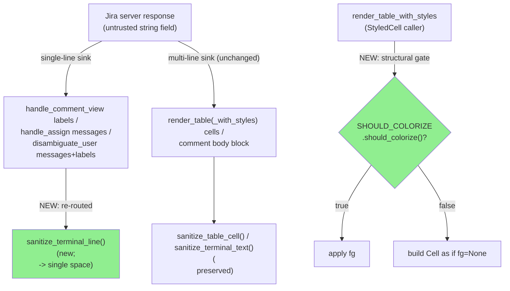
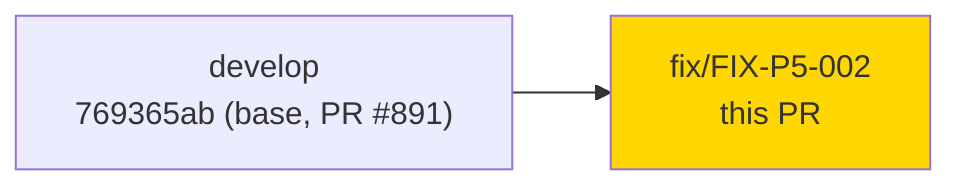
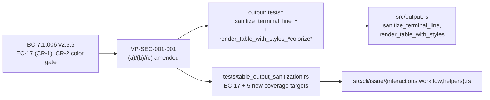

# [FIX-P5-002] Single-line terminal sanitization + structural `--no-color` gating (F5 pass 1)

**Epic:** cycle-014 — Phase F5 (scoped adversarial review), fix task routed from the F5 pass-1
re-review of `FIX-P5-001`/PR #891
**Mode:** maintenance (fix PR — adversarial-review findings against `BC-7.1.006`, not a new story)
**Convergence:** N/A at this stage — this fix's own review convergence tracked in this PR; the F5
delta adversarial loop resumes on `develop` after merge, as **Pass 2**

No GitHub issue — this fix task has no external tracker entry. It was created by human decision
**D-396** (2026-10-01) in response to the cycle-014 F5 pass-1 adversarial review of
`BC-7.1.006`/`VP-SEC-001-001` (`.factory/cycles/cycle-014/phase-f5-adversarial/pass-1.md`), which
re-reviewed `FIX-P5-001`'s shipped code (PR #891) from fresh context and found two unfixed,
behavior-affecting gaps (`CR-1`, `CR-2`) plus several doc-accuracy issues (`F-001`, `F-004`,
`F-005`, `F-006`). Spec: `BC-7.1.006` v2.5.6 (`.factory/specs/prd/bc-7-output-render.md`), delta at
`.factory/cycles/cycle-014/phase-f5-adversarial/FIX-P5-002-spec-delta.md`.

---

## What Changed

### CR-1 — single-line sinks now neutralize an embedded `\n`

`output::sanitize_table_cell`/`sanitize_terminal_text` deliberately *preserve* `\n` — correct for
a genuinely multi-line sink (`render_table`/`render_table_with_styles` cells, `jr issue comment
view`'s ADF-derived body block), but it left a gap in every sink meant to render exactly **one**
line: a hostile server-supplied value with an embedded `\n` could fabricate what looks like an
extra labeled field or an extra picker row (CWE-116).

New function `output::sanitize_terminal_line` applies the identical CSI/OSC/C0/C1/bidi policy as
`sanitize_table_cell`, with one difference: `\n` maps to a single space (the same substitution
already applied to `\t`; consecutive `\n` produce the same number of consecutive spaces, no
further collapsing). Rewired every single-line sink to it:

- `jr issue comment view`'s six labeled fields (`ID`/`Author`/`Created`/`Updated`/`JSM internal`/
  `Restricted`) in `src/cli/issue/interactions.rs::handle_comment_view` — the ADF-derived body
  block stays on `sanitize_terminal_text` (genuinely multi-line, unchanged).
- `jr issue assign`'s two success messages in `src/cli/issue/workflow.rs::handle_assign`.
- `disambiguate_user`'s non-interactive `ExactMultiple`/`Ambiguous`/`None`-branch messages, the
  `None` branch's `all_names` echo, and the `disambiguation_labels` interactive-picker-label helper
  in `src/cli/issue/helpers.rs`.

New edge case **EC-17** (two parts, before/after contrast against pre-D-396 behavior) added to
`BC-7.1.006`.

### Caller-list correction (F-001)

The `disambiguate_user` caller list documented alongside `FIX-P5-001`'s D-395 amendment named a
flag that does not exist (`jr issue edit --assignee` — `IssueCommand::Edit` has no assignee-setting
flag of any kind) and omitted `jr issue list --reporter` (`resolve_user` is called for both
`--assignee` and `--reporter`). Corrected in `BC-7.1.006`'s Behavior subsection, Out-of-scope lead,
Trace, and VP(c); the four underlying callers (`resolve_assignee`/`resolve_assignee_by_project`/
`resolve_user`/`mentions::resolve_at_name_candidate`) were already correct — only the prose naming
them was wrong. `CHANGELOG.md` and `CLAUDE.md` corrected in lockstep.

### CR-2 — structural `--no-color` gate on `render_table_with_styles`

Human decision D-396: "move the `--no-color` check into the styled-table API." Before this fix,
`--no-color`/`NO_COLOR` suppression for a `StyledCell`'s `fg` was caller-side only (`active_cell`'s
own `SHOULD_COLORIZE` check) — `output::render_table_with_styles` itself applied `fg`
unconditionally, leaving every *future* `StyledCell` caller to remember to re-implement the same
check.

`render_table_with_styles` now applies a `StyledCell`'s `fg` only when
`colored::control::SHOULD_COLORIZE.should_colorize()` is `true`, building the `Cell` as if `fg`
were `None` otherwise — a structural guarantee the renderer itself now provides to every caller,
present and future. `active_cell` keeps its own existing check unchanged (now redundant for this
one caller, intentionally and harmlessly). `comfy_table`'s own TTY-based `should_style()` gate is
unaffected and still applies on top (ANDed): color reaches the terminal only when both gates agree.
End-user-visible behavior for `active_cell` (the only caller today) is unchanged by this gate.

### Doc corrections (F-004, F-005, F-006)

- **F-004** — `jr api`'s raw response-body passthrough (`src/cli/api.rs::handle_api`, writes the
  HTTP body directly via `std::io::stdout().write_all`) is now documented as a deliberate,
  permanent exception (`gh api` parity), not an undocumented residual.
- **F-005** — retracted a false claim that `disambiguate_user`'s `Ambiguous` branch "still
  distinguishes the two accounts by their email/account-id fields" even when display names
  collide. Verified against the `MatchResult::Ambiguous` arm: it carries `display_name` only,
  never `email_address`/`account_id` (only `ExactMultiple` carries those). The underlying
  limitation itself is tracked, not fixed here — see Follow-ups below.
- **F-006** — precise `CLICOLOR_FORCE` wording for the Active-column color behavior: color
  requires a TTY (comfy_table's structural gate); suppressed by `--no-color`/`NO_COLOR` (via
  `active_cell`'s check, now also structurally backstopped by CR-2); `CLICOLOR_FORCE` with piped
  stdout no longer colors the column, a minor documented behavior change from pre-#891's
  ANSI-bytes-in-`String` styling (verified against `colored` 3.1.1's `should_colorize()`/
  `resolve_clicolor_force` crossed with `comfy-table` 7.2.2's `should_style()`/`is_tty()`, which has
  no `CLICOLOR_FORCE` awareness).

---

## Architecture Changes

No new components, no new module boundaries — a sibling sanitizer function and an additional gate
inside the existing `src/output.rs` chokepoint, plus caller-side rewiring in
`src/cli/issue/{interactions,workflow,helpers}.rs`. `.factory/specs/architecture/*` is not touched.



---

## Story Dependencies

No story dependencies. Standalone fix PR (`fix/FIX-P5-002`) against `develop` at `769365ab`
(PR #891's merge), not anchored to any story — `BC-7.1.006` still has no story anchor. No upstream
or downstream PR dependencies.



---

## Spec Traceability



---

## Test Evidence

### Coverage Summary

| Metric | Value | Status |
|--------|-------|--------|
| `output::` lib tests | 63 passed, 0 failed | PASS |
| `cli::issue::helpers::` lib tests | 32 passed, 0 failed | PASS |
| `cli::issue::interactions::` lib tests | 14 passed, 0 failed | PASS |
| `cli::issue::workflow::` lib tests | 6 passed, 0 failed | PASS |
| `tests/table_output_sanitization.rs` | 58 passed, 0 failed | PASS |
| `cargo clippy --all-targets -- -D warnings` | clean | PASS |
| `cargo fmt --all -- --check` | clean | PASS |
| Regressions | 0 | PASS |

New test targets (F-002, verified not previously existing): single-line `\n`-neutralization pins
for all four rewired sinks, two `prop_sanitize_terminal_line_*` proptests, the two new CR-2 color
tests (`test_bc_7_1_006_render_table_with_styles_{suppresses,applies}_fg_when_colorize_*`), and
the five F-002 coverage targets named in the spec delta — `issue list --assignee` `Ambiguous`,
`@Name` mention `Ambiguous`, `Ambiguous` `--output json` error-envelope case, `ExactMultiple` with
a hostile display name, and the `disambiguation_labels` EC-17b fixture. The "one shared assertion
helper" claim from the original spec text was removed — verified no such helper exists; each test
is independent.

---

## Demo Evidence

Behavior-changing fix (single-line output no longer fabricates extra lines/fields on hostile
input; `--no-color` now structurally suppresses `StyledCell` color at the renderer) → demo
required and recorded.

**Location:** `.factory/demos/FIX-P5-002/` (not committed to this branch, per existing
demo-evidence policy). 16 files: 4 VHS recordings (`.gif` + `.webm` + `.tape` each),
`evidence-report.md`, `mock_server.py`, `setup.sh`, and `fixtures/`.

| Recording | What it shows |
|---|---|
| `AC-1-comment-view-newline` | `jr issue comment view` — a hostile comment author/field value with an embedded `\n` stays on one line post-fix (pre-fix: fabricates an extra line) |
| `AC-2-assign-newline` | `jr issue assign` — success-message sink, same `\n`-neutralization contrast |
| `AC-3-assign-ambiguous-newline` | `jr issue assign` — `Ambiguous`-branch picker/message sink, same contrast |
| `AC-4-user-list-color-gate` | `jr user list` — `--no-color`/`NO_COLOR` now structurally suppress the Active-column `fg` inside `render_table_with_styles` itself |

---

## Security Review

Dispatched as part of this PR's convergence flow (mandatory — closes CWE-116/CWE-150-adjacent
single-line injection gaps and a color-gate bypass path). Results recorded in
`.factory/code-delivery/FIX-P5-002/security-review.md`; this section is updated with the verdict
before merge-ready status is reported.

---

## Risk Assessment & Deployment

### Blast Radius
- **Systems affected:** four specific single-line output sinks (`jr issue comment view`'s labeled
  fields, `jr issue assign`'s messages, `disambiguate_user`'s non-interactive messages and
  interactive picker labels across `jr issue assign --to`, `jr issue create --to`, `jr issue list
  --assignee`/`--reporter`, `@Name` mention resolution) plus `render_table_with_styles`'s one
  current caller (`jr user list`/`jr user view` Active column).
- **User impact on failure:** none expected — a hostile embedded `\n` becomes a single space
  (same substitution class already applied to `\t`); the color gate is additive suppression only.
  Worst case for a legitimate value: a literal `\n` in a display name (not realistic for Jira
  user/comment fields) renders as a space instead of breaking the line.
- **Data impact:** none — `--output json` paths are untouched; this is a display-time-only change.
- **Risk Level:** LOW — purely a display-time transform on the human-readable output channel; no
  API request shape, auth, or data-persistence change.

### Feature Flags
None — unconditional, matching `FIX-P5-001`'s precedent. `--no-color`/`NO_COLOR` continue to
control jr's own decorative coloring only.

---

## Traceability

| Requirement | Spec | Test | Status |
|-------------|------|------|--------|
| Single-line sink `\n` neutralization | BC-7.1.006 EC-17 | `tests/table_output_sanitization.rs` EC-17 pins + sink-specific tests | PASS |
| `sanitize_terminal_line` whole-string/no-newline invariants | VP-SEC-001-001(a) (amended) | `prop_sanitize_terminal_line_*` | PASS |
| Structural `--no-color` gate on `render_table_with_styles` | BC-7.1.006 CR-2 | `test_bc_7_1_006_render_table_with_styles_{suppresses,applies}_fg_when_colorize_*` | PASS |
| Caller-list / doc accuracy (F-001, F-004, F-005, F-006) | BC-7.1.006 v2.5.6 | spec-only, no test | N/A (docs) |

<details>
<summary><strong>Full contract chain</strong></summary>

```
cycle-014 F5 pass-1 adversarial review (adversary F-001/F-004/F-005/F-006,
code-reviewer CR-1/CR-2) -> D-396 -> BC-7.1.006 v2.5.6 / VP-SEC-001-001 (amended) ->
  tests/table_output_sanitization.rs, src/output.rs::tests,
  src/cli/issue/helpers.rs::tests ->
  src/output.rs (sanitize_terminal_line, render_table_with_styles SHOULD_COLORIZE gate),
  src/cli/issue/{interactions,workflow,helpers}.rs (sink rewiring)
```

Finding record: `.factory/cycles/cycle-014/phase-f5-adversarial/pass-1.md`
Human decision: `D-396` (2026-10-01)
Spec delta: `.factory/cycles/cycle-014/phase-f5-adversarial/FIX-P5-002-spec-delta.md`
No GitHub issue exists for this finding (found internally during adversarial review, not
externally reported).

</details>

---

## Follow-ups (tracked, NOT fixed in this PR — scope frozen to D-396)

Per the F5 pass-1 disposition, the following are recorded as standing items in
`.factory/cycles/OPEN-STANDING-ITEMS.md` and are explicitly out of scope here:

- **F-003 / `CREATE-TO-ECHO-SANITIZE`** — `src/cli/issue/create.rs::handle_create`'s `--to`
  table-mode field-echo loop echoes the raw, unsanitized resolved assignee `display_name` and
  resolved team name — same exposure class as the now-covered `handle_assign` sink, found during
  this fix's own trace.
- **`AMBIGUOUS-PICKER-ACCOUNT-LABELS`** (underlying limitation behind F-005) — `disambiguate_user`'s
  `Ambiguous` branch carries `display_name` only; two accounts whose display names sanitize to the
  identical survivor string are genuinely indistinguishable in the picker/message today. The false
  claim that they remain distinguishable is retracted in this PR's spec delta; the limitation
  itself is not fixed.
- **`OUTPUT-SANITIZER-CLEANUP-NITS`** (code-reviewer `CR-3`..`CR-8`, 6 items) — naming/doc-comment/
  test-organization-level suggestions on the sanitizer cluster; none behavior-affecting.

---

## AI Pipeline Metadata

<details>
<summary><strong>Pipeline Details</strong></summary>

```yaml
ai-generated: true
pipeline-mode: maintenance
factory-version: "1.0.0-rc.25"
pipeline-stages:
  spec-crystallization: completed (spec delta, v2.5.5 -> v2.5.6)
  story-decomposition: not-applicable (fix task, no story anchor)
  tdd-implementation: completed (stub -> RED tests -> GREEN implementation -> docs-correction commit)
  holdout-evaluation: not-applicable (fix PR, not story delivery)
  adversarial-review: this-pr-convergence-in-progress (F5 pass-2 resumes after merge)
  formal-verification: skipped (no Kani proofs scoped; proptest used per VP-SEC-001-001(a))
  convergence: pending (this PR's own review loop)
generated-at: "2026-10-01"
```

</details>

---

## Pre-Merge Checklist

- [ ] All CI status checks passing
- [ ] No critical/high/medium security findings unresolved
- [ ] pr-reviewer APPROVE with 0 blocking findings
- [ ] No dependency PRs outstanding (none expected — none applicable to this fix)
- [x] Demo evidence recorded (behavior-changing fix) — `.factory/demos/FIX-P5-002/`
- [x] Spec delta applied (`BC-7.1.006` v2.5.6, `VP-SEC-001-001` amended)
- [ ] Human merge (per D-391: this pipeline does not self-merge; human executes the merge command)
