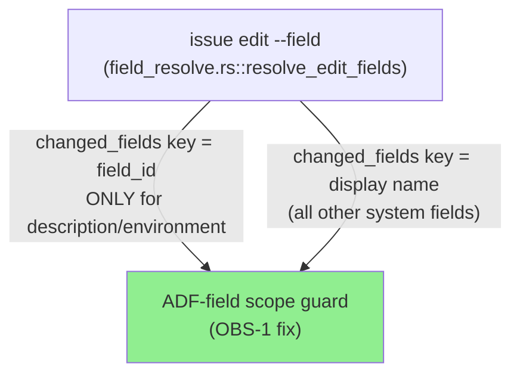
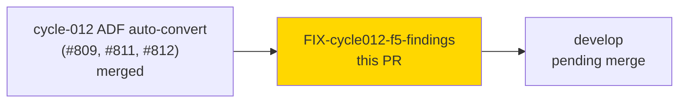
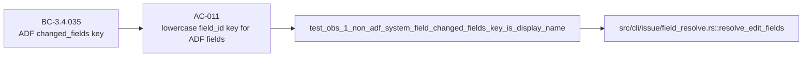

# [FIX-cycle012-f5] Fix cycle-012 Phase F5 scoped-adversarial review findings

**Epic:** cycle-012 — JSM/platform `--field` ADF auto-conversion
**Mode:** feature (fix-pr-delivery rigor — no stubs, no Red Gate, no wave gate)
**Convergence:** N/A — this is a targeted fix-PR for findings raised during Phase F5 scoped adversarial review of the already-merged cycle-012 feature (PR #809, #811, #812), not a fresh adversarial cycle.


This PR fixes four Phase F5 (scoped-adversarial) review findings raised against the cycle-012 ADF auto-conversion feature (`--field` on `issue edit`/`issue create`/JSM `issue create --request-type`), which landed in #809, #811, and #812. One finding (OBS-1) is a behavioral regression fix with a red-gated regression test; the other three (M-3, H-1, M-1) are comment/documentation corrections. No new features, no new attack surface — this diff strictly narrows previously-broadened behavior and corrects stale documentation.

---

## Findings Fixed

| ID | Source | Severity | Summary |
|----|--------|----------|---------|
| OBS-1 | adversary (human-ruled, DEC-357) | Behavioral regression | `changed_fields` `--output json` lowercase-field_id key remap (BC-3.4.035 AC-011) had silently broadened from ADF fields only (`description`) to **every** non-`customfield_` system field (e.g. `duedate`, `priority`). Narrowed back to ADF fields only (`description`, `environment`); non-ADF system fields now keep their display-name key, preserving the pre-cycle-012 scripting contract. |
| M-3 | code-reviewer | Low (doc/comment) | Stale `isAdfRequest` comment in `src/api/jsm/requests.rs` said the flag was gated on description-presence alone; it's actually computed from both the description channel and the resolution layer's pre-computed ADF flag. Comment corrected. |
| H-1 | code-reviewer | Doc debt (ADR-0012) | `src/cli/issue/jsm_create.rs` grew to ~1,341 LOC during cycle-012 (JSM ADF resolution layer) without a "Known Size Deviations" entry in CLAUDE.md. Entry added. |
| M-1 | code-reviewer | Doc debt | `field_resolve.rs`'s existing size-deviation entry (last measured at S-578-4, ~1,635 LOC) was stale after cycle-012 growth to ~2,269 LOC. Entry refreshed with growth attribution. |

---

## Architecture Changes

No architectural change. This PR corrects the scope of an existing behavior (`changed_fields` key remap) and updates documentation/comments — no new modules, no new dependencies, no new call paths.



---

## Story Dependencies



No other open PRs depend on this fix. Base is `develop`, which already contains #809/#811/#812.

---

## Spec Traceability



| Requirement | Finding | Test | Verification | Status |
|-------------|---------|------|---------------|--------|
| BC-3.4.035 AC-011 (scope correction) | OBS-1 | `test_obs_1_non_adf_system_field_changed_fields_key_is_display_name` | RED→GREEN (orchestrator-verified) | PASS |
| Comment accuracy | M-3 | N/A (comment-only) | manual review | PASS |
| ADR-0012 doc currency | H-1, M-1 | N/A (CLAUDE.md-only) | manual review | PASS |

---

## Test Evidence

### Coverage Summary

| Metric | Value | Threshold | Status |
|--------|-------|-----------|--------|
| OBS-1 regression test | RED → GREEN | must fail before fix, pass after | PASS |
| `cargo test --lib field_resolve` | 26/26 pass | 100% | PASS |
| `cargo test issue_edit_field_adf` | 39/39 pass | 100% | PASS |
| `cargo test issue_create_field_adf` | 32/32 pass | 100% | PASS |
| `cargo test issue_create_jsm` | 113/113 pass | 100% | PASS |
| `cargo test issue_edit_field` (full file) | 91/91 pass | 100% | PASS |
| `cargo test issue_create_field` (full file) | 63/63 pass | 100% | PASS |
| `cargo test claude_md_citations` | 61/61 pass | 100% | PASS |
| `cargo clippy --all-targets -- -D warnings` | clean | zero warnings | PASS |
| `cargo fmt --all -- --check` | clean | no diff | PASS |

All quality evidence above was orchestrator-verified in the fix worktree prior to PR creation, per `fix-pr-delivery` rigor (no stubs, no Red Gate ceremony, no wave-integration gate — this is a targeted finding-fix bundle on top of an already-merged, already-wave-gated feature).

| Metric | Value |
|--------|-------|
| **New tests** | 1 added (`test_obs_1_non_adf_system_field_changed_fields_key_is_display_name`) |
| **Diff size** | 4 files changed, +83/-9 lines |
| **Regressions** | 0 |

---

## Holdout Evaluation

N/A — evaluated at wave gate for the parent cycle-012 feature; this is a targeted F5 finding-fix bundle, not a new story.

---

## Adversarial Review

N/A for this PR itself — the findings fixed here (OBS-1, M-3, H-1, M-1) were **produced by** the Phase F5 scoped-adversarial review of cycle-012 (adversary + code-reviewer passes against #809/#811/#812). This PR is the fix delivery for that review's output, not a subject of a new adversarial pass. The orchestrator will dispatch a fresh-eyes `pr-reviewer` against this PR separately.

---

## Security Review

Dispatched to `security-reviewer` (this PR's diff only).

### Risk profile (pre-scan assessment)
- The OBS-1 fix **removes** previously-broadened behavior (narrows a JSON key remap) — no new code path, no new input handling, no new external call.
- M-3 is a comment-only change (zero behavioral diff).
- H-1/M-1 are CLAUDE.md-only changes (zero code diff).
- No new dependencies, no new I/O, no new parsing of untrusted input.

(Outcome appended by pr-manager below once security-reviewer returns.)

---

## Demo Evidence

N/A — this is a CLI JSON-output-contract fix (a `--output json` key-naming scope correction) plus documentation/comment corrections, not a user-facing UI or workflow change requiring a recorded demo. Evidence of correctness is the red-gated regression test instead:

```
$ jr issue edit TEST-1 --field "Due date=2026-12-31" --output json --no-input
{
  ...
  "changed_fields": {
    "Due date": "2026-12-31"    # display-name key preserved (OBS-1 fix)
  }
}
```

vs. the pre-fix (over-broadened) behavior that this PR corrects:

```
  "changed_fields": {
    "duedate": "2026-12-31"     # WRONG — field_id key leaked to a non-ADF system field
  }
```

Full before/after behavior is asserted by `test_obs_1_non_adf_system_field_changed_fields_key_is_display_name` (`tests/issue_edit_field.rs`), which was RED against the pre-fix code and is GREEN against this PR's diff.

---

## Risk Assessment & Deployment

### Blast Radius
- **Systems affected:** `jr issue edit --field` JSON output (`--output json` `changed_fields` key naming) only. Table/human-text output is unaffected (it already used a fixed `field → (updated)` marker convention, untouched by this change).
- **User impact if this fix is wrong:** a script parsing `changed_fields["duedate"]` (the pre-fix, over-broadened key) would need to revert to `changed_fields["Due date"]`. Since the over-broadening was never released (cycle-012 merged directly to `develop`, no tagged release yet includes it — confirm before any `main` release cut), this fix is a correction of undeployed-to-production behavior, not a breaking change to a shipped contract.
- **Data impact:** none — read/echo path only, no Jira-side mutation semantics changed.
- **Risk Level:** LOW

### Rollback Instructions

<details>
<summary><strong>Rollback Instructions</strong></summary>

**Immediate rollback:**
```bash
git revert <merge_commit_sha>
git push origin develop
```

No feature flag involved; this is a pure code + doc fix with no runtime toggle.

**Verification after rollback:**
- `cargo test --lib field_resolve` and `cargo test issue_edit_field` still pass (reverting restores the pre-fix, over-broadened `changed_fields` remap — not a broken state, just the wider-scope behavior OBS-1 flagged).

</details>

---

## AI Pipeline Metadata

<details>
<summary><strong>Pipeline Details</strong></summary>

```yaml
ai-generated: true
pipeline-mode: feature
factory-version: "1.0.0-rc.25"
pipeline-stages:
  spec-crystallization: n/a (fix-pr-delivery)
  story-decomposition: n/a (fix-pr-delivery)
  tdd-implementation: completed (red-gated OBS-1 regression test)
  holdout-evaluation: n/a (evaluated at cycle-012 wave gate)
  adversarial-review: n/a (this PR fixes F5 findings; does not itself undergo a new pass)
  formal-verification: skipped (fix-pr-delivery rigor)
  convergence: n/a
generated-at: "2026-09-14T00:00:00Z"
```

</details>

---

## Pre-Merge Checklist

- [ ] All CI status checks passing
- [x] Diff is doc/comment/narrow-behavioral-fix only — no new attack surface
- [ ] No critical/high security findings unresolved (pending security-reviewer dispatch)
- [x] Rollback procedure validated (plain `git revert`, no feature flag)
- [ ] Fresh-eyes `pr-reviewer` review (explicitly deferred to orchestrator per this PR's dispatch instructions — NOT run by pr-manager for this PR)
- [ ] Human merge authorization (AUTHORIZE_MERGE=NO for this dispatch — PR is prepared through CI only, not merged)
