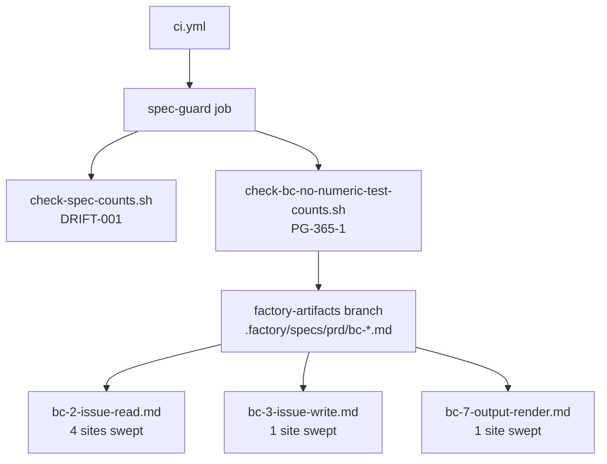
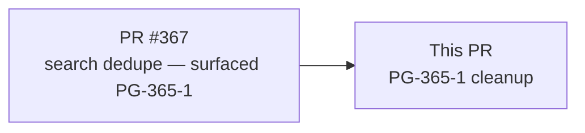
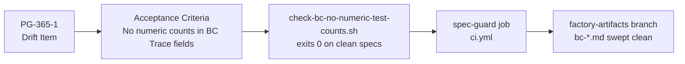

## Summary

- Sweeps numeric test counts from BC `Trace:` / `Source:` fields across 3 spec files (PG-365-1 cleanup) — 6 sites total in `bc-2-issue-read.md` (4), `bc-3-issue-write.md` (1), `bc-7-output-render.md` (1)
- Adds `scripts/check-bc-no-numeric-test-counts.sh` — a CI guard that fails if `\b\d+\s+\w*\s*tests?\b` appears in `**Trace**:` lines of any `bc-*.md` spec file, preventing regression
- Wires both `scripts/check-spec-counts.sh` (DRIFT-001) and `scripts/check-bc-no-numeric-test-counts.sh` (PG-365-1) into a new `spec-guard` CI job — catches up the pre-existing DRIFT-001 script that was documented but never wired into CI

**No closes** — PG-365-1 is a drift item tracked in `.factory/STATE.md`, not a GitHub issue.

**References:** PR #367 (parent cycle that surfaced PG-365-1)

## Architecture Changes

## Story Dependencies

No upstream PRs must merge before this one. This PR has no downstream dependencies.

## Spec Traceability

## Test Evidence

| Check | Result |
|-------|--------|
| `cargo test` (all tests) | 691 unit tests pass, 0 failures |
| `cargo clippy -- -D warnings` | Clean |
| `cargo fmt --check` | Clean |
| `check-bc-no-numeric-test-counts.sh` | Exits 0 |
| `check-spec-counts.sh` | Exits 0 |

## Sites Swept (factory-artifacts branch)

| File | Sites | Before | After |
|------|-------|--------|-------|
| `bc-2-issue-read.md` | 4 | `Trace: … N tests` | Qualitative description |
| `bc-3-issue-write.md` | 1 | `Trace: … N tests` | Qualitative description |
| `bc-7-output-render.md` | 1 | `Trace: … N tests` | Qualitative description |

## Holdout Evaluation

N/A — evaluated at wave gate.

## Adversarial Review

Single adversary review pass found 2 CONCERNs:

1. **CONCERN-1:** Regex `\b\d+\s+tests?\b` too narrow — misses multi-word patterns like "4 new dedupe tests". **Fixed:** Broadened to `\b\d+\s+\w*\s*tests?\b` in `5dcdfef`.
2. **CONCERN-2:** Script comment block contained a misleading example. **Fixed:** Example corrected in `5dcdfef`. Factory-artifacts sweep updated in `81c130a`.

## Security Review

No security-relevant changes. This PR modifies:
- `scripts/check-bc-no-numeric-test-counts.sh` — shell script, read-only file scanner, no network access, no secrets
- `.github/workflows/ci.yml` — adds a new job that calls `git fetch` and runs bash scripts
- `CLAUDE.md` — documentation only

No OWASP top-10 concerns. No injection vectors introduced.

## Risk Assessment

- **Blast radius:** Documentation and CI scripts only. Zero production code changes.
- **Performance impact:** None — CI-only guard on spec files in a separate job.
- **Rollback:** `git revert` of the two commits cleanly removes the guard.

## AI Pipeline Metadata

| Field | Value |
|-------|-------|
| Pipeline mode | Chore / drift cleanup |
| Story ID | PG-365-1 |
| Cycle | 3-feature-search-issue-keys-dedupe-365 |
| Models used | claude-sonnet-4-6 |
| Adversary cycles | 1 (2 CONCERNs → both fixed) |

## Pre-Merge Checklist

- [x] cargo test (691 tests pass)
- [x] cargo clippy -- -D warnings (clean)
- [x] cargo fmt --check (clean)
- [x] check-bc-no-numeric-test-counts.sh (exits 0)
- [x] check-spec-counts.sh (exits 0)
- [x] Adversary review complete (2 CONCERNs resolved)
- [x] PR description structured and complete
- [ ] CI verification (will run on PR push)
- [ ] Copilot review clean
- [ ] Human merge approval
