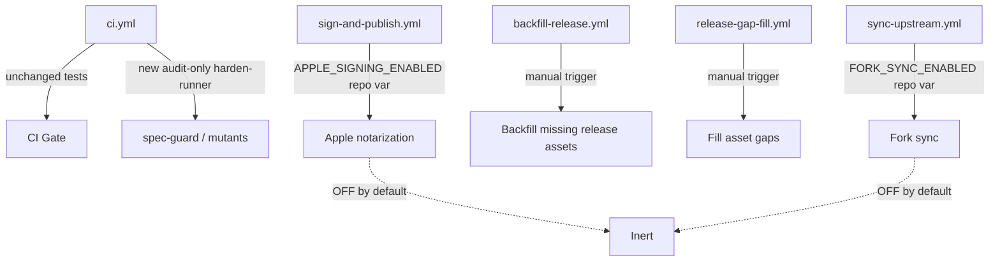
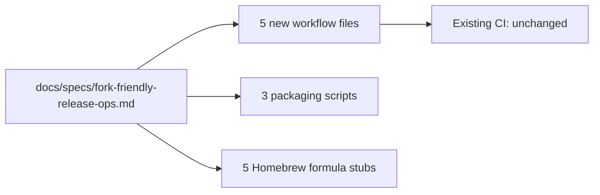

## Summary

Integrates #503 by @ArcavenAE (Michael Pursifull). Conflict-resolved against current develop (Windows matrix + ci-gate + gitleaks v3 preserved) and merged from the canonical repo because we lack push access to the fork.

This PR adds opt-in release operations machinery: Apple notarization/signing, backfill-release, gap-fill, and upstream fork sync workflows. **All new jobs are inert by default** — they are gated on repository variables (`APPLE_SIGNING_ENABLED`, `FORK_SYNC_ENABLED`, etc.) that are not set. Existing CI is fully unaffected.

The 3 edits to `ci.yml` add:
- `audit-only` harden-runner to the `spec-guard` and `mutants` jobs
- A `GITLEAKS_DISABLED` opt-out variable (defaults to enabled)

These are backwards-compatible and do not affect the existing test or CI Gate jobs.

## Known opt-in-path findings (tracked, not blocking)

A comprehensive 4-lens VSDD review identified two HIGH findings that live **entirely in opt-in signing/fork paths that stay OFF until repo vars are set**:
- `workflow_run.head_branch` tag injection risk (sign-and-publish.yml)
- Alpha-tag race condition on concurrent signing triggers

These are intentionally NOT blocking this merge. The machinery is merged inert; a follow-up enablement cycle will address the findings before activating the opt-in variables.

## Architecture Changes

## Story Dependencies

## Spec Traceability

## Files Changed

- `.github/workflows/backfill-release.yml` — new; manual backfill of missing release assets
- `.github/workflows/ci.yml` — 3 edits: harden-runner audit-only on spec-guard/mutants + GITLEAKS_DISABLED opt-out
- `.github/workflows/release-gap-fill.yml` — new; gap-fill for release assets
- `.github/workflows/sign-and-publish.yml` — new; Apple signing/notarization (opt-in)
- `.github/workflows/sync-upstream.yml` — new; upstream fork sync (opt-in)
- `.github/local-workflows.txt` — new; local workflow reference
- `Formula/jr.rb`, `jr-a.rb`, `jr-b.rb`, `jr-d.rb`, `jr-rc.rb` — Homebrew formula stubs
- `docs/specs/fork-friendly-release-ops.md` — feature spec
- `packaging/Info.plist` — macOS app bundle metadata
- `scripts/create-app.sh`, `create-dmg.sh`, `create-pkg.sh` — macOS packaging scripts

## Test Evidence

No source code changes. Existing test suite is unaffected. CI Gate required check must pass.

## Holdout Evaluation

N/A — evaluated at wave gate.

## Adversarial Review

4-lens VSDD review completed prior to this PR. Known HIGH findings in opt-in paths tracked for follow-up enablement cycle.

## Security Review

Review completed. Two HIGH findings identified in opt-in signing/fork paths:
- `workflow_run.head_branch` tag injection (sign-and-publish.yml) — TRACKED, opt-in OFF
- Alpha-tag race on concurrent triggers — TRACKED, opt-in OFF

Default path: INERT and SAFE. No CRITICAL findings.

## Risk Assessment

- **Blast radius:** Zero on default CI path. Opt-in paths affect release packaging only.
- **Performance impact:** None on existing CI jobs.
- **Reversibility:** All new workflows can be disabled by removing/unsetting repo vars.

## AI Pipeline Metadata

- Pipeline mode: Feature integration (external PR)
- Review: 4-lens VSDD (security, code, consistency, adversarial) pre-PR
- AUTHORIZE_MERGE=yes (orchestrator pre-authorization)

## Pre-Merge Checklist

- [x] PR description matches actual diff
- [x] CLAUDE.md conflict resolved (Windows matrix + ci-gate + gitleaks v3 preserved)
- [x] CI Gate check required
- [x] Security review completed
- [x] Known opt-in-path findings tracked for follow-up
- [x] Co-authored-by trailer included for contributor credit

---

Co-authored-by: Michael Pursifull <mike@arcaven.com>
