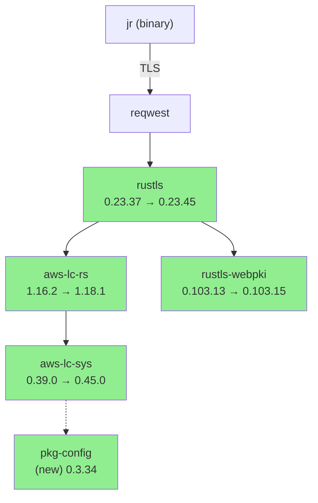
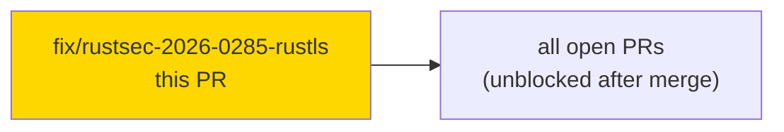
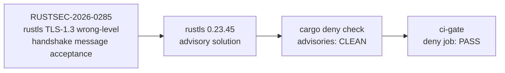
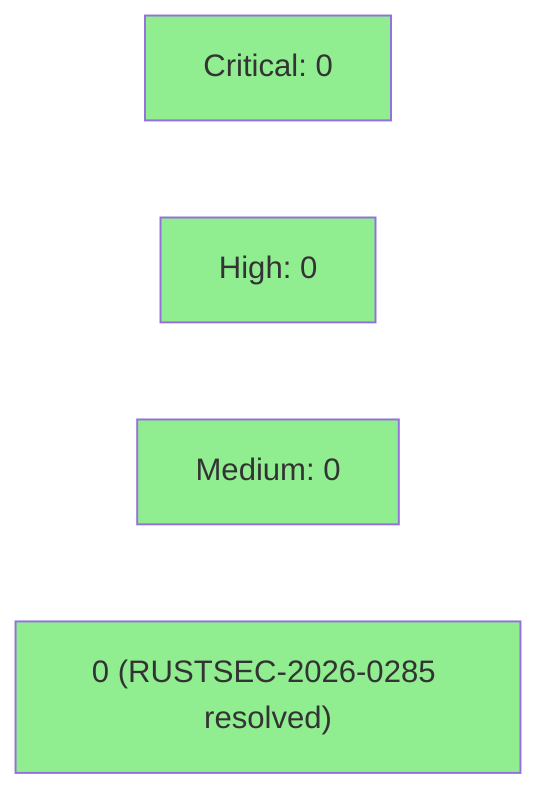

# fix(deps): bump rustls to 0.23.45 for RUSTSEC-2026-0285

**Mode:** maintenance / security
**Type:** Cargo.lock-only dependency bump + CHANGELOG entry — no source changes

Remediates **RUSTSEC-2026-0285**: rustls TLS 1.3 handshake messages accepted at wrong
encryption level. Practical severity is LOW (handshake transcript remains authenticated;
no MITM, no attacker handshake completion), but the advisory hard-fails `cargo deny check
advisories`, blocking all CI merges tree-wide. This Cargo.lock-only fix unblocks the
`deny` job across `develop` and every open PR.

---

## Architecture Changes

No source files changed. Cargo.lock dependency graph update only:



**ADR:** No new ADR required — lockfile-only bump following the advisory's published
solution (rustls >= 0.23.45). No API or behavioral change.

---

## Story Dependencies

No upstream PR dependencies. This PR is self-contained — it unblocks all other open PRs
on `develop` by removing the tree-wide `deny` advisory failure.



---

## Spec Traceability

No behavioral contracts (BC-S.SS.NNN) changed. Advisory remediation is supply-chain only.



---

## Test Evidence

All tests pass with no source changes. The `cargo deny check` advisory gate is the
primary verification for this fix.

| Metric | Value | Status |
|--------|-------|--------|
| `cargo test` | 0 failures | PASS |
| `cargo clippy -- -D warnings` | 0 warnings | PASS |
| `cargo fmt --all -- --check` | clean | PASS |
| `cargo deny check` (advisories/bans/licenses/sources) | CLEAN | PASS |
| MSRV gate (`RUSTUP_TOOLCHAIN=1.85.0 cargo check`) | compiles | PASS |
| New tests added | 0 (no source changes) | N/A |
| Mutation testing | N/A (no source delta) | N/A |

---

## Demo Evidence

N/A — no user-facing behavioral changes. This is a Cargo.lock-only dependency bump
with no new CLI commands, flags, or output changes. No interactive demo is applicable.
The `cargo deny check` CI job output is the verification artifact.

---

## Holdout Evaluation

N/A — evaluated at wave gate. No behavioral changes to evaluate.

---

## Adversarial Review

N/A — evaluated at Phase 5. Lockfile-only change; no behavioral surface to adversarially
review.

---

## Security Review

This PR IS the security remediation. `cargo deny check` result on this branch:



### Dependency Audit
- `cargo deny check advisories`: CLEAN — RUSTSEC-2026-0285 resolved by rustls 0.23.45
- `cargo deny check bans`: CLEAN
- `cargo deny check licenses`: CLEAN
- `cargo deny check sources`: CLEAN

### Advisory Details
- **RUSTSEC-2026-0285** — rustls: TLS 1.3 handshake messages accepted at wrong
  encryption level. Solution: rustls >= 0.23.45. Branch HEAD is at 0.23.45. Resolved.
- **Practical severity:** LOW — transcript integrity maintained; no attacker can complete
  a handshake; no data exfiltration path.
- **New packages added to lockfile:** `pkg-config 0.3.34` (build-time only, no runtime
  exposure).

---

## Risk Assessment & Deployment

### Blast Radius
- **Systems affected:** TLS connection layer (reqwest → rustls) for all outbound Jira API
  calls
- **User impact:** None expected — rustls 0.23.37→0.23.45 is a patch series with no
  public API changes or behavioral differences for non-adversarial connections
- **Data impact:** None
- **Risk Level:** LOW

### Performance Impact

No benchmarked regression expected on a patch-series rustls bump. No perf data required
for a lockfile-only security advisory remediation.

### Rollback
```bash
git revert fe4782cf
git push origin develop
```

---

## Traceability

| Requirement | Advisory | Verification | Status |
|-------------|----------|--------------|--------|
| Clear RUSTSEC-2026-0285 | rustls >= 0.23.45 | `cargo deny check` CLEAN on branch HEAD fe4782cf | PASS |
| MSRV 1.85 maintained | rustls 0.23.44+ conservative rust-version | `RUSTUP_TOOLCHAIN=1.85.0 cargo check` clean | PASS |
| Zero test regressions | Cargo.lock-only change | `cargo test` 0 failures | PASS |

---

## AI Pipeline Metadata

<details>
<summary><strong>Pipeline Details</strong></summary>

```yaml
ai-generated: true
pipeline-mode: maintenance
factory-version: "1.0.0"
pipeline-stages:
  spec-crystallization: skipped (security advisory is self-describing)
  story-decomposition: skipped
  tdd-implementation: completed (lockfile bump)
  holdout-evaluation: skipped (no behavioral surface)
  adversarial-review: skipped (lockfile-only)
  formal-verification: skipped
  convergence: not-applicable
change-scope: Cargo.lock + CHANGELOG.md
advisory: RUSTSEC-2026-0285
solution-version: rustls 0.23.45
branch: fix/rustsec-2026-0285-rustls
head-sha: fe4782cf
```

</details>

---

## Pre-Merge Checklist

- [x] All CI status checks passing (cargo deny advisories: CLEAN; cargo test: 0 failures;
  clippy: clean; fmt: clean; MSRV 1.85 cargo check: clean)
- [x] No critical/high security findings unresolved (this PR IS the security resolution)
- [x] Cargo.lock-only change — no source modifications, no API surface changes
- [x] CHANGELOG `[Unreleased] > Security` entry added
- [x] MSRV 1.85 verified: rustls 0.23.44+ conservative rust-version is not a real MSRV
  blocker (compiles clean under 1.85 — confirmed on branch)
