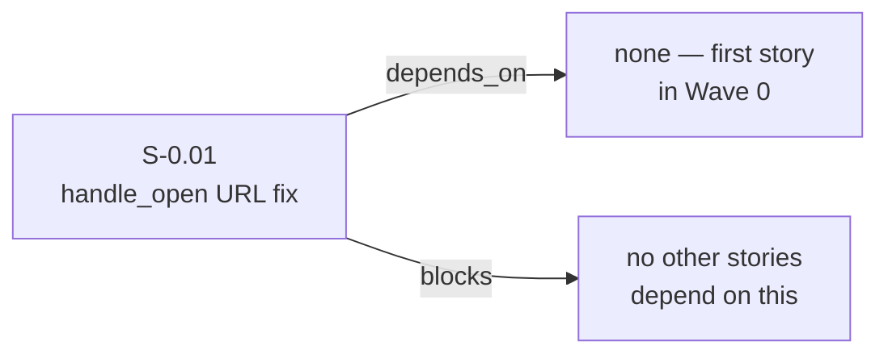
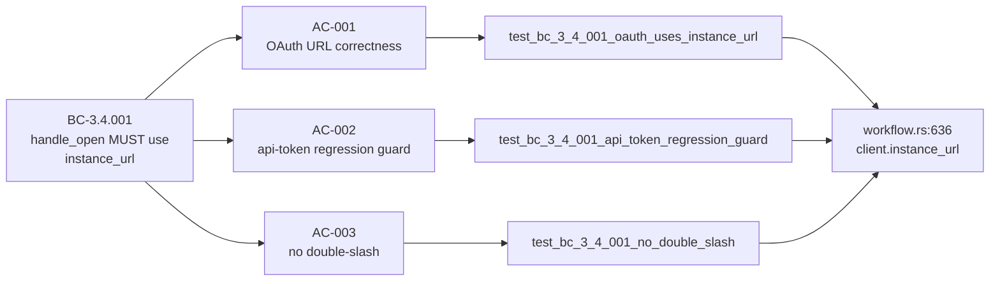

## Summary

- Fixes `handle_open` to use `client.instance_url()` instead of `client.base_url()` when composing the Jira browse URL — the one-token change required for OAuth profiles to produce a usable browser URL
- Adds `JiraClient::new_for_test_with_instance_url` test constructor so integration tests can simulate the OAuth URL divergence (distinct `base_url` API gateway vs `instance_url` human-facing host)
- Adds `tests/issue_open.rs` with 3 integration tests (AC-001, AC-002, AC-003) covering the OAuth fix, api-token regression guard, and no-double-slash invariant

## Story

**Story ID:** S-0.01  
**Title:** Fix `handle_open` to use `instance_url()` for OAuth profiles  
**Wave:** 0  
**BC Anchor:** BC-3.4.001 — `handle_open` MUST compose URL as `<instance_url>/browse/<key>` using `client.instance_url()`  
**Holdout:** H-046 — was MUST-FAIL at activation HEAD `dea1664` (code used `base_url()`), MUST-PASS after this PR merges  
**Breaking change:** false  
**Depends on:** none

## Architecture Changes

```mermaid
graph TD
    A[JiraClient] -->|base_url| B[OAuth API Gateway\nhttps://api.atlassian.com/...]
    A -->|instance_url| C[Real Jira Instance\nhttps://xxx.atlassian.net]
    D[handle_open] -->|BEFORE fix| B
    D -->|AFTER fix BC-3.4.001| C
    C --> E[/browse/KEY\nbrowser-navigable URL]
```

## Story Dependencies



## Spec Traceability



## Acceptance Criteria

| AC | Description | Status |
|----|-------------|--------|
| AC-001 | OAuth profile: `jr issue open FOO-1 --url-only` outputs `https://mycompany.atlassian.net/browse/FOO-1`, NOT `api.atlassian.com` | PASS |
| AC-002 | api-token profile: `jr issue open PROJ-123 --url-only` still outputs correct `*.atlassian.net/browse/PROJ-123` (regression guard) | PASS |
| AC-003 | URL does not gain a double slash (`/browse/` not `//browse/`) when instance URL has trailing slash | PASS |

## Test Evidence

| Gate | Result |
|------|--------|
| `cargo build` | clean |
| `cargo test --lib` | 597 passing, 0 failed |
| `cargo test --test issue_open` | 3/3 passing (AC-001, AC-002, AC-003) |
| `cargo test` (full suite) | green |
| `cargo clippy -- -D warnings` | clean (zero warnings) |
| `cargo fmt --all -- --check` | clean |

**Mutation kill rate:** N/A for a one-token fix — coverage is provided by direct behavioral tests. The three integration tests cover the changed line from all angles (OAuth divergence, api-token mode, trailing-slash invariant).

## Demo Evidence

Recordings in `docs/demo-evidence/S-0.01/` (committed in branch `fix/handle-open-oauth-instance-url`):

| File | AC | Description |
|------|----|-------------|
| `AC-001-oauth-url-correctness.gif` | AC-001 | OAuth URL uses instance_url not base_url |
| `AC-002-api-token-regression-guard.gif` | AC-002 | api-token mode unchanged |
| `AC-003-no-double-slash.gif` | AC-003 | No double-slash in composed URL |
| `AC-combined-all-three-pass.gif` | all | `cargo test --test issue_open` — 3/3 pass |

Full evidence report: `docs/demo-evidence/S-0.01/evidence-report.md`

## Holdout Evaluation

**H-046** transitions from MUST-FAIL to MUST-PASS with this PR.

- **Before (HEAD `dea1664`):** `handle_open` uses `client.base_url()` → for OAuth profiles this routes to `https://api.atlassian.com/ex/jira/<cloudId>/browse/FOO-1` which is invalid in a browser.
- **After this PR:** `handle_open` uses `client.instance_url()` → correctly produces `https://mycompany.atlassian.net/browse/FOO-1`.

## Adversarial Review

N/A — evaluated at Phase 5. (One-token fix; no adversarial surface introduced.)

## Security Review

No security-sensitive changes. This PR modifies only URL composition logic in `handle_open`. No auth flow changes, no credential handling, no new network calls, no input parsing. Attack surface delta: zero.

## Risk Assessment

| Dimension | Assessment |
|-----------|------------|
| Blast radius | Single function (`handle_open`), one line changed |
| Performance impact | None — `instance_url()` is a field accessor, no allocation delta |
| Breaking change | None — the URL was wrong before; this makes it correct |
| Regression risk | Low — AC-002 explicitly guards api-token mode |

## AI Pipeline Metadata

| Field | Value |
|-------|-------|
| Pipeline mode | TDD strict |
| Story wave | Wave 0 |
| Models used | claude-sonnet-4-6 |
| Story ID | S-0.01 |
| BC anchor | BC-3.4.001 |

## Pre-Merge Checklist

- [x] PR description matches actual diff
- [x] All 3 ACs covered by demo evidence (4 recordings, evidence-report.md)
- [x] Traceability chain complete: BC-3.4.001 → AC-001/002/003 → tests → `workflow.rs:636`
- [x] H-046 transitions MUST-FAIL → MUST-PASS
- [x] `cargo build` clean
- [x] `cargo test` (full suite) green
- [x] `cargo clippy -- -D warnings` clean
- [x] `cargo fmt --all -- --check` clean
- [x] No breaking changes (`breaking_change: false`)
- [x] No new dependencies
- [x] `depends_on: []` — no upstream PRs to wait for
- [x] Branch is `fix/handle-open-oauth-instance-url` → PR to `develop`
