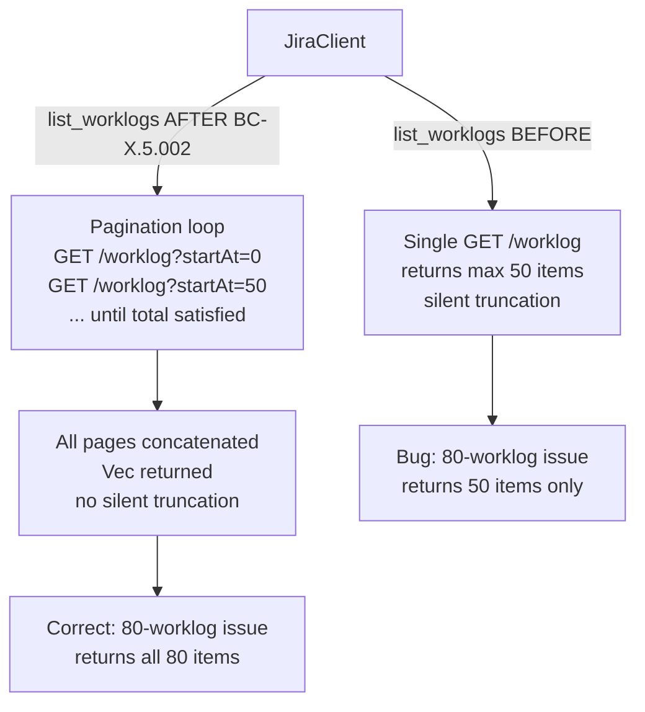
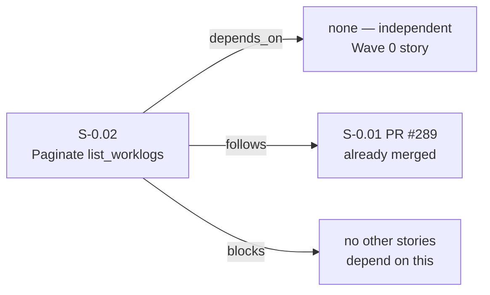
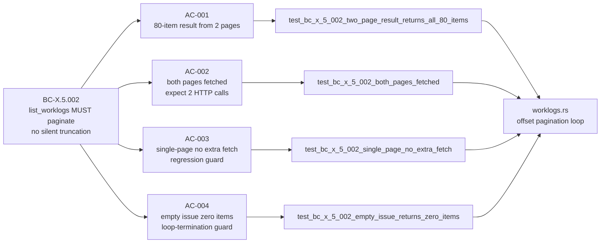

## Summary

- Replaces the single-page `list_worklogs` fetch with an offset-based pagination loop that iterates until `total <= start_at + count`, preventing silent truncation of issues with more than 50 worklogs
- Adds 4 integration tests (AC-001 through AC-004) with wiremock stubs verifying all-pages concatenation, exact HTTP call counts, single-page regression guard, and empty-issue loop termination
- Closes holdout H-045 — was MUST-FAIL at activation HEAD `dea1664` (returned 50 for an 80-worklog issue), MUST-PASS after this PR merges

## Story

**Story ID:** S-0.02
**Title:** Paginate `list_worklogs` to prevent silent truncation
**Wave:** 0
**BC Anchor:** BC-X.5.002 — `client.list_worklogs(key)` MUST paginate in a loop until `page.total <= page.start_at + page.items().len()`. All pages concatenated and returned to caller. No silent truncation.
**Holdout:** H-045 — was MUST-FAIL at activation HEAD `dea1664`, MUST-PASS after this PR merges
**Breaking change:** false
**Depends on:** none

## Architecture Changes



## Story Dependencies



## Spec Traceability



## Acceptance Criteria

| AC | Description | Status |
|----|-------------|--------|
| AC-001 | Given wiremock returns page 1 (50 items, total: 80) and page 2 (30 items, total: 80), `jr worklog list PROJ-1 --output json` JSON array length = 80 | PASS |
| AC-002 | Both pages fetched from server — wiremock `expect(1)` on each of two stubs, both satisfied | PASS |
| AC-003 | Single-page result (total=20) issues exactly one HTTP request — no spurious second-page fetch | PASS |
| AC-004 | Empty issue (total=0) returns zero items with no HTTP errors — loop terminates cleanly | PASS |

## Test Evidence

| Gate | Result |
|------|--------|
| `cargo build` | clean |
| `cargo test --lib` | 597 passing, 0 failed (baseline preserved) |
| `cargo test --test worklog_commands` | 9/9 passing (4 new AC tests + 5 existing) |
| `cargo clippy -- -D warnings` | clean |
| `cargo fmt --all -- --check` | clean |

**Worklog test suite (9/9):**
```
test test_add_worklog ... ok
test test_bc_x_5_002_both_pages_fetched ... ok
test test_bc_x_5_002_empty_issue_returns_zero_items ... ok
test test_bc_x_5_002_single_page_no_extra_fetch ... ok
test test_bc_x_5_002_two_page_result_returns_all_80_items ... ok
test test_list_worklogs ... ok
test worklog_list_network_drop_surfaces_reach_error ... ok
test worklog_list_server_error_surfaces_friendly_message ... ok
test worklog_list_unauthorized_dispatches_reauth_message ... ok

test result: ok. 9 passed; 0 failed; 0 ignored; 0 measured; 0 filtered out; finished in 0.67s
```

## Demo Evidence

Per-AC terminal recordings at `docs/demo-evidence/S-0.02/`:

| Recording | AC | Result |
|-----------|----|--------|
| `AC-001-two-page-result.gif` | AC-001 | PASS |
| `AC-002-both-pages-fetched.gif` | AC-002 | PASS |
| `AC-003-single-page-no-extra-fetch.gif` | AC-003 | PASS |
| `AC-004-empty-issue-zero-items.gif` | AC-004 | PASS |
| `AC-combined-all-four-pass.gif` | all 4 + 5 existing | 9/9 PASS |

## Holdout Evaluation

**H-045** — wave-gate holdout for BC-X.5.002:
- **Status at activation HEAD `dea1664`:** MUST-FAIL (single-page fetch returned 50, not 80)
- **Status after this PR:** MUST-PASS (pagination loop returns all items; AC-001 + AC-002 verify this)

## Security Review

No security-relevant changes. This PR modifies only:
- `src/api/jira/worklogs.rs` — adds a pagination loop using the existing `self.get()` client method with the same URL path, extended with a `?startAt=N` query parameter (integer, not user-supplied input)
- `tests/worklog_commands.rs` — test-only code with wiremock

No new input validation surface, no auth changes, no new dependencies. OWASP Top 10: not applicable to this change.

## Risk Assessment

- **Blast radius:** Narrow — only `list_worklogs` method modified. No callers changed; return type unchanged (`Vec<Worklog>`).
- **Performance:** Improved for large issues (previously silent data loss); no regression for typical issues (single-page path still issues exactly one request, verified by AC-003).
- **Backwards compatibility:** No breaking change — callers receive more items than before (correct behavior). The `Vec<Worklog>` return type is unchanged.

## AI Pipeline Metadata

- **Pipeline mode:** Wave 0 MUST-FIX story (TDD strict mode)
- **Story writer:** vsdd-factory:story-writer
- **Implementer:** vsdd-factory:implementer (worktree: `.worktrees/S-0.02-paginate-list-worklogs`)
- **Branch base:** `b7b9c9c30d4d32270b67a40493895a1a37048781` (develop at story creation)

## Pre-Merge Checklist

- [x] PR description matches actual diff
- [x] All 4 ACs covered by demo evidence (4 per-AC recordings + 1 combined)
- [x] Traceability chain complete: BC-X.5.002 -> AC-001/002/003/004 -> tests -> `worklogs.rs`
- [x] `cargo build` clean
- [x] `cargo test --lib` 597 passing (baseline preserved)
- [x] `cargo test --test worklog_commands` 9/9 passing
- [x] `cargo clippy -- -D warnings` clean
- [x] `cargo fmt --all -- --check` clean
- [x] No breaking changes
- [x] No new dependencies
- [x] No `.factory/` files on branch (excluded by `.gitignore`)
- [x] Depends on: none (S-0.01 already merged as PR #289)

## Breaking Changes

NONE. This PR returns more items than before (correct behavior). Callers are unaffected.

## Related

- Follows S-0.01 (PR #289, merged) — part of Wave 0 MUST-FIX batch
- BC-X.5.002 in `docs/factory/behavioral-contracts/cross-cutting.md`
- Holdout H-045 in `.factory/holdouts/`
