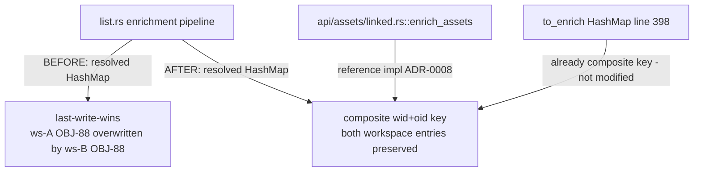
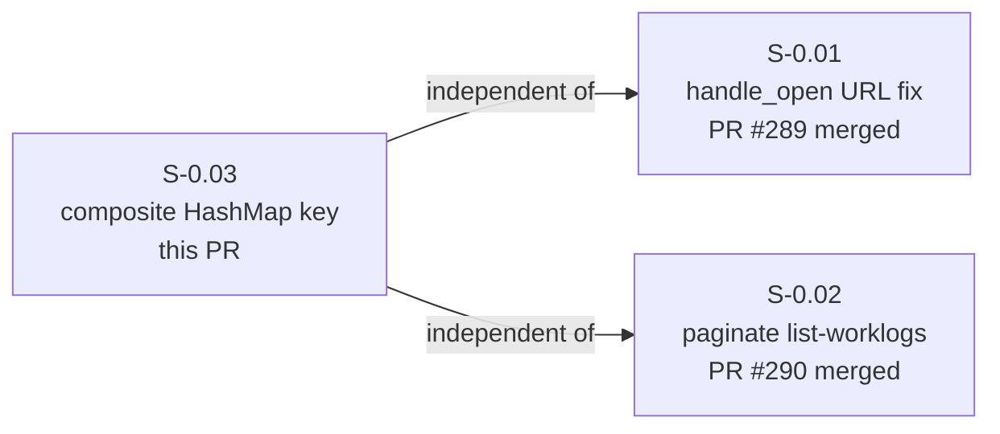
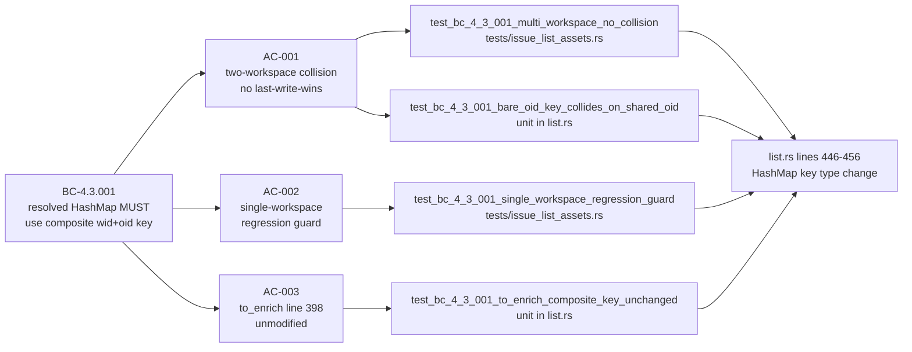

## Summary

- Fixes `resolved: HashMap<String, _>` in `src/cli/issue/list.rs` to use composite `(workspace_id, oid)` key, eliminating last-write-wins data mis-attribution when two workspaces share the same asset OID
- Adds `tests/issue_list_assets.rs` with 2 wiremock integration tests covering the two-workspace collision scenario and single-workspace regression guard
- Mirrors the composite-key pattern already used by `api/assets/linked.rs::enrich_assets` (the reference implementation per ADR-0008)

## Story

**Story ID:** S-0.03
**Title:** Fix multi-workspace asset HashMap to use composite `(workspace_id, oid)` key
**Wave:** 0 (MUST-FIX — correctness bug, silent data mis-attribution)
**BC Anchor:** BC-4.3.001 — `resolved` HashMap MUST use `(workspace_id, oid)` composite key
**Holdout:** H-036 — was MUST-FAIL at activation HEAD `dea1664` (last-write-wins), MUST-PASS after this PR merges
**NFR:** NFR-R-E — correctness of asset enrichment results
**ADR:** ADR-0008 — multi-workspace composite key design pattern
**Breaking change:** false
**Depends on:** none (independent of S-0.01, S-0.02)

## Architecture Changes

## Story Dependencies

## Spec Traceability

## Acceptance Criteria

| AC | Description | Status |
|----|-------------|--------|
| AC-001 | Two workspaces both with `oid = "OBJ-88"`: ws-A asset shows "Acme Corp", ws-B shows "Widgets Inc" — no last-write-wins collision | PASS |
| AC-002 | Single-workspace tenants: output identical to pre-fix behavior (regression guard) | PASS |
| AC-003 | `to_enrich` HashMap at `list.rs:398` (already composite) is not modified by this fix | PASS |

## Test Evidence

| Gate | Result |
|------|--------|
| `cargo build` | clean (0 warnings) |
| `cargo test --lib` | 600/600 passing |
| `cargo test --test issue_list_assets` | 2/2 passing (AC-001, AC-002) |
| `cargo test` (full suite) | green |
| `cargo clippy -- -D warnings` | clean (zero warnings) |
| `cargo fmt --all -- --check` | clean |

**Unit tests** (in `src/cli/issue/list.rs` `mod tests`):
- `test_bc_4_3_001_bare_oid_key_collides_on_shared_oid` — verifies composite key preserves both workspace entries (was red pre-fix)
- `test_bc_4_3_001_composite_key_preserves_both_workspaces` — structural correctness of composite key pattern
- `test_bc_4_3_001_to_enrich_composite_key_unchanged` — confirms `to_enrich` line 398 untouched

**Integration tests** (in `tests/issue_list_assets.rs`):
- `test_bc_4_3_001_multi_workspace_no_collision` — wiremock: ws-A OBJ-88 → "Acme Corp", ws-B OBJ-88 → "Widgets Inc"; both correct in JSON output
- `test_bc_4_3_001_single_workspace_regression_guard` — wiremock: single workspace; output matches pre-fix behavior

## Demo Evidence

Recordings in `docs/demo-evidence/S-0.03/` (committed in branch):

| File | AC | Description |
|------|----|-------------|
| `AC-001-multi-workspace-no-collision.gif` | AC-001 | Two-workspace collision fix — integration test green |
| `AC-001-unit-composite-key-verification.gif` | AC-001 | Unit test: composite key preserves both entries |
| `AC-002-single-workspace-regression-guard.gif` | AC-002 | Single-workspace regression guard passes |
| `AC-003-to-enrich-composite-key-unchanged.gif` | AC-003 | `to_enrich` at line 398 unmodified |
| `AC-combined-all-bc-4-3-001-pass.gif` | all | All 5 BC-4.3.001 tests: 3 unit + 2 integration — 5/5 pass |

Full evidence report: `docs/demo-evidence/S-0.03/evidence-report.md`

## Holdout Evaluation

**H-036** transitions from MUST-FAIL to MUST-PASS with this PR.

- **Before (HEAD `dea1664`):** `resolved: HashMap<String, _>` uses bare `oid` key. Two workspaces with `OBJ-88` → last write wins, ws-B data overwrites ws-A. PROJ-1 (linked to ws-A's OBJ-88 "Acme Corp") incorrectly shows "Widgets Inc".
- **After this PR:** `resolved: HashMap<(String, String), _>` uses `(workspace_id, oid)` composite key. Both entries coexist. PROJ-1 shows "Acme Corp", PROJ-2 shows "Widgets Inc". H-036: MUST-PASS.

## Adversarial Review

N/A — evaluated at Phase 5. (Three-line type + key change at lines 446/449/456; no new abstractions introduced.)

## Security Review

No security-sensitive changes. This PR modifies only the HashMap key type in the CMDB asset enrichment pipeline within `handle_list`. No auth flow changes, no credential handling, no new network calls, no external input parsing added. The composite key uses `workspace_id` and `oid` already in scope from `to_enrich` iteration — no new data sources. Attack surface delta: zero.

## Risk Assessment

| Dimension | Assessment |
|-----------|------------|
| Blast radius | Three lines in `handle_list` enrichment pipeline (`list.rs:446/449/456`) + async future return type at line 440 |
| Performance impact | None — `HashMap<(String, String), _>` has identical O(1) lookup; tuple key hashing is marginally cheaper than String clone of concatenated key |
| Breaking change | None — single-workspace tenants see identical output; multi-workspace tenants see corrected output (bug fix) |
| Regression risk | Low — AC-002 integration test explicitly guards single-workspace behavior; `to_enrich` at line 398 untouched |

## Reference Implementation

`api/assets/linked.rs::enrich_assets` is the canonical multi-workspace composite key implementation per ADR-0008. This PR brings `list.rs` inline enrichment into conformance with that pattern. The fix does not modify `enrich_assets` or any `api/` layer code.

## Related PRs

- S-0.01 fix: PR #289 (merged) — `fix: use instance_url() for OAuth handle_open (S-0.01)`
- S-0.02 fix: PR #290 (merged) — `fix: paginate list-worklogs beyond 50 entries (S-0.02)`

## AI Pipeline Metadata

| Field | Value |
|-------|-------|
| Pipeline mode | TDD strict |
| Story wave | Wave 0 |
| Models used | claude-sonnet-4-6 |
| Story ID | S-0.03 |
| BC anchor | BC-4.3.001 |
| Holdout | H-036 |

## Pre-Merge Checklist

- [x] PR description matches actual diff (3 lines changed in `list.rs`, 1 new test file, 1 fmt commit)
- [x] All 3 ACs covered by demo evidence (5 recordings, evidence-report.md)
- [x] Traceability chain complete: BC-4.3.001 → AC-001/002/003 → tests → `list.rs:446/449/456`
- [x] H-036 transitions MUST-FAIL → MUST-PASS
- [x] `cargo build` clean
- [x] `cargo test` (full suite) green
- [x] `cargo clippy -- -D warnings` clean
- [x] `cargo fmt --all -- --check` clean
- [x] No breaking changes (`breaking_change: false`)
- [x] No new dependencies
- [x] `depends_on: []` — no upstream PRs to wait for
- [x] Branch is `fix/multi-workspace-asset-hashmap-key` → PR to `develop`
- [x] ADR-0008 compliance — composite `(workspace_id, oid)` key pattern, no newtype wrapper
