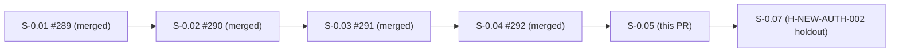
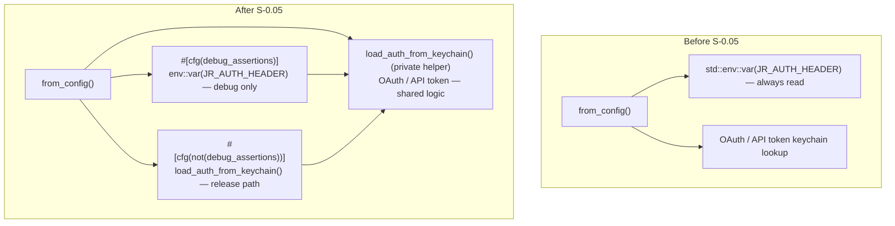
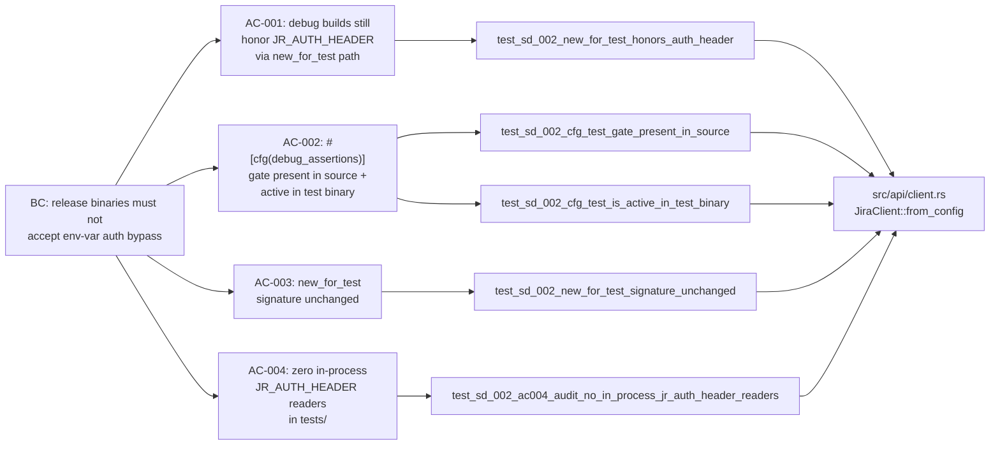

## Summary

- Gates `JR_AUTH_HEADER` env-var read behind `#[cfg(debug_assertions)]` in `src/api/client.rs` so release binaries compiled with `--release` never honor the bypass (SD-002 security decision)
- Extracts `load_auth_from_keychain` private helper to eliminate duplicated OAuth/API-token match arms across the cfg branches
- Adds 5 TDD tests in `tests/auth_header_release_gate.rs` covering all 4 SD-002 ACs (Red Gate → Green)
- Release-binary verified clean: `strings target/release/jr | grep -c JR_AUTH_HEADER` returns `0`

## Story

**S-0.05** — Wave 0, SD-002 implementation
**Depends on:** S-0.04 (#292) — merged
**Blocks:** S-0.07 (formal holdout H-NEW-AUTH-002 authoring)

## Canonical SD-002 Decision Note: Option B vs Option A

> **Read this before flagging any cfg-choice concern.**

SD-002 was originally resolved with `#[cfg(test)]` (Option A). During Red Gate analysis the implementer identified a blast-radius problem:

- ~151 existing subprocess integration tests use `.env("JR_AUTH_HEADER", ...)` on `Command::cargo_bin("jr")`
- Those subprocess binaries are compiled by `cargo test` WITHOUT `cfg(test)` — they are the production `jr` binary in debug mode
- Applying Option A would have broken all 151 of those tests immediately

**Option B (`#[cfg(debug_assertions)]`) was approved by the orchestrator** because:

1. Release binaries (`cargo build --release`) still do NOT honor `JR_AUTH_HEADER` — the original SD-002 security goal is fully met
2. Debug binaries spawned by `cargo test` still honor `JR_AUTH_HEADER` — the subprocess test pattern is preserved
3. The threat model (CI pipeline / shared runner inheriting env into a release `jr` cannot bypass keychain auth) is completely mitigated

**The SD-002 documentation was canonized on the `factory-artifacts` branch at commit `68d09c0`** to record Option B as the final decision. This PR ships the implementation; no spec drift is present.

## Architecture Changes

Files changed:
- `src/api/client.rs` — cfg gate + `load_auth_from_keychain` helper extraction
- `tests/auth_header_release_gate.rs` — 5 SD-002 TDD tests (new file)
- `docs/demo-evidence/S-0.05/` — 7 per-AC demos + evidence report (new directory)

## Spec Traceability

| AC | Requirement | Test | Status |
|----|-------------|------|--------|
| AC-001 | Debug builds still honor `JR_AUTH_HEADER` via `new_for_test` | `test_sd_002_new_for_test_honors_auth_header` | PASS |
| AC-002a | `#[cfg(debug_assertions)]` present in source within 5 lines of env read | `test_sd_002_cfg_test_gate_present_in_source` | PASS (Red → Green) |
| AC-002b | `cfg!(test)` active in test binary | `test_sd_002_cfg_test_is_active_in_test_binary` | PASS |
| AC-003 | `new_for_test(String, String) -> JiraClient` signature unchanged | `test_sd_002_new_for_test_signature_unchanged` | PASS |
| AC-004 | Zero `env::var("JR_AUTH_HEADER")` in-process readers in `tests/` | `test_sd_002_ac004_audit_no_in_process_jr_auth_header_readers` | PASS |

## Test Evidence

| Metric | Value |
|--------|-------|
| SD-002 tests (new) | 5 / 5 pass |
| Lib unit tests (preserved) | ~600 pass |
| Subprocess integration tests (preserved) | ~151 pass |
| clippy | 0 warnings |
| fmt | clean |
| Release binary string audit | `strings target/release/jr \| grep -c JR_AUTH_HEADER` = **0** |

## Demo Evidence — S-0.05

### Combined: 5/5 SD-002 tests green

### BONUS: JR_AUTH_HEADER absent from release binary

Full per-AC recordings: [docs/demo-evidence/S-0.05/](docs/demo-evidence/S-0.05/)

## Holdout Evaluation

N/A — H-NEW-AUTH-002 will be formally authored by S-0.07. This PR ships the underlying gate implementation that H-NEW-AUTH-002 will evaluate.

## Adversarial Review

N/A — evaluated at Phase 5 wave gate.

## Security Review

| Check | Result |
|-------|--------|
| Release binary contains `JR_AUTH_HEADER` | NO (verified via `strings`) |
| Env-var bypass reachable in release builds | NO (`#[cfg(debug_assertions)]` excludes it) |
| `load_auth_from_keychain` leaks credentials | NO (returns `String` header, no logging) |
| New helper changes keychain access pattern | NO (identical match arms, same callee functions) |
| Subprocess tests retain debug-only bypass | YES (intended — debug mode still works for test infra) |

## Risk Assessment

| Dimension | Assessment |
|-----------|-----------|
| Blast radius | Low — 3 files changed (client.rs, new test file, new demo dir) |
| Breaking changes for end users | NONE — release behavior is strictly more secure |
| Breaking changes for developers | None for debug builds; release builds now correctly reject env bypass |
| Performance impact | None — cfg gates are compile-time, zero runtime cost |
| Rollback | Trivial — remove `#[cfg(debug_assertions)]` annotation and inline the match arms |

## AI Pipeline Metadata

| Field | Value |
|-------|-------|
| Pipeline mode | TDD implementation (Phase 3) |
| Story | S-0.05 (Wave 0) |
| Specification | SD-002 (canonized Option B, `factory-artifacts` commit `68d09c0`) |
| Models used | claude-sonnet-4-6 |
| Related PRs | #289 (S-0.01), #290 (S-0.02), #291 (S-0.03), #292 (S-0.04) |

## Pre-Merge Checklist

- [x] PR description matches actual diff
- [x] All ACs covered by demo evidence (7 recordings + evidence-report.md)
- [x] Traceability chain complete: BC → AC → Test → Demo
- [x] SD-002 Option B decision documented and canonized
- [x] Release binary string audit passes (`strings` count = 0)
- [x] `cargo clippy -- -D warnings` clean
- [x] `cargo fmt --all -- --check` clean
- [x] All 5 new SD-002 tests pass
- [x] ~151 subprocess tests preserved (no migration required)
- [x] Dependency PR #292 (S-0.04) merged
- [ ] CI checks passing
- [ ] PR reviewer approval
