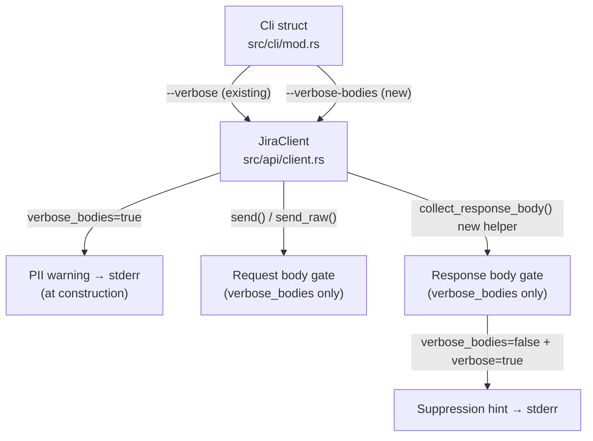
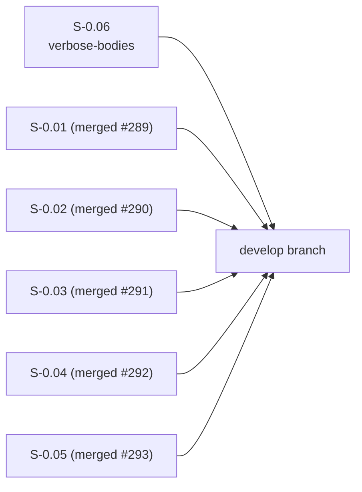
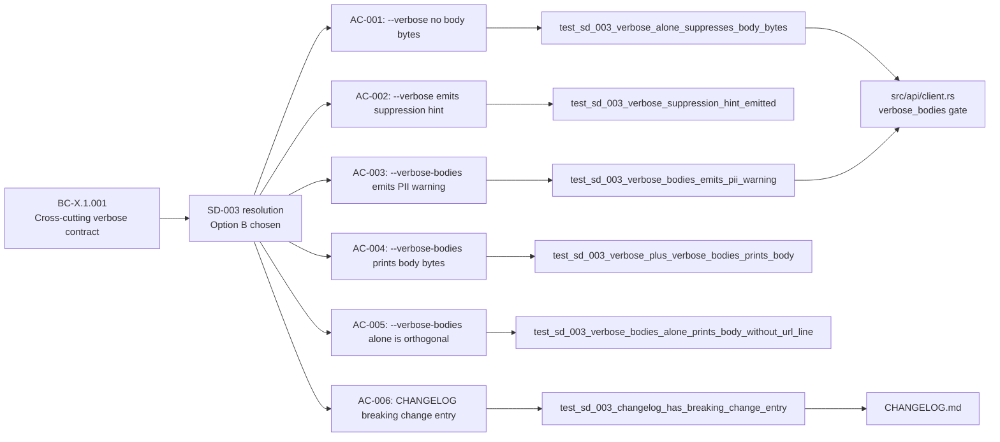

## Summary

- Implements SD-003: `--verbose` is now **header-only** by default (method + URL + status); HTTP bodies are suppressed to prevent accidental PII leakage in shared terminals, debug logs, and AI-agent contexts.
- Adds `--verbose-bodies` opt-in flag that unlocks full body logging with a mandatory 3-line PII warning emitted to stderr at client construction time.
- Threads `verbose_bodies: bool` through `JiraClient` — 11 call sites in `main.rs` and 1 in `init.rs` (hardcoded `false` for the init command, which doesn't need body inspection).
- Centralises response-body logging via a new `collect_response_body()` helper, replacing 5 inline `response.json()` calls across `get`, `post`, `get_instance`, `post_instance`, `get_assets`, and `post_assets`.
- All 6 SD-003 acceptance criteria verified by dedicated tests in `tests/verbose_bodies.rs`; 600+ lib + 411+ integration tests preserved green.

---

## Story

**S-0.06** — Wave 0 (Security debt paydown)
**Security Decision:** SD-003 — Verbose PII redaction (Option B chosen at Phase 1→2 gate, 2026-05-04)
**Holdouts resolved:**
- H-NEW-VERBOSE-001 — `--verbose-bodies` PII warning emission (Group 7) — **MUST-PASS**
- H-NEW-VERBOSE-002 — `--verbose` body suppression + regression pin (Group 7) — **MUST-PASS**

---

## Architecture Changes



---

## Story Dependencies



No `depends_on` — S-0.06 is independent of other Wave 0 stories.

---

## Spec Traceability



---

## Acceptance Criteria Status

| AC | Requirement | Holdout | Status |
|----|-------------|---------|--------|
| AC-001 | `--verbose` without `--verbose-bodies` → no `[verbose] body:` in stderr | H-NEW-VERBOSE-002 | PASS |
| AC-002 | `--verbose` without `--verbose-bodies` → suppression hint present in stderr | H-NEW-VERBOSE-002 | PASS |
| AC-003 | `--verbose-bodies` → `[jr] WARNING: --verbose-bodies prints...` in stderr | H-NEW-VERBOSE-001 | PASS |
| AC-004 | `--verbose-bodies` → `[verbose] body: <content>` for each body | — | PASS |
| AC-005 | `--verbose-bodies` alone: body + warning, no method+URL line | — | PASS |
| AC-006 | `CHANGELOG.md` has BREAKING CHANGE entry | — | PASS |

---

## Test Evidence

| Suite | Count | Result |
|-------|-------|--------|
| `cargo test --test verbose_bodies` | 6 | all pass |
| `cargo test --lib` | 600+ | all pass |
| `cargo test --test '*'` (integration) | 411+ | all pass |
| `cargo clippy --all --all-features --tests -- -D warnings` | — | clean |
| `cargo fmt --all -- --check` | — | clean |

**Holdout verification:**
- H-NEW-VERBOSE-001: `test_sd_003_verbose_bodies_emits_pii_warning` — 3-line PII warning confirmed in stderr
- H-NEW-VERBOSE-002: `test_sd_003_verbose_alone_suppresses_body_bytes` — body bytes absent, suppression hint present

---

## Demo Evidence

### Combined: 6/6 SD-003 tests green


### BONUS: Live UX — --help grep + PII warning text


Full per-AC recordings: [docs/demo-evidence/S-0.06/](docs/demo-evidence/S-0.06/)

| AC | Recording |
|----|-----------|
| AC-001 / H-NEW-VERBOSE-001 | [AC-001-pii-warning-emitted.gif](docs/demo-evidence/S-0.06/AC-001-pii-warning-emitted.gif) |
| AC-002 / H-NEW-VERBOSE-002 | [AC-002-verbose-suppresses-body.gif](docs/demo-evidence/S-0.06/AC-002-verbose-suppresses-body.gif) |
| AC-003 | [AC-003-verbose-stacks-with-bodies.gif](docs/demo-evidence/S-0.06/AC-003-verbose-stacks-with-bodies.gif) |
| AC-004 | [AC-004-verbose-bodies-alone.gif](docs/demo-evidence/S-0.06/AC-004-verbose-bodies-alone.gif) |
| AC-005 | [AC-005-help-shows-both-flags.gif](docs/demo-evidence/S-0.06/AC-005-help-shows-both-flags.gif) |
| AC-006 | [AC-006-changelog-breaking-change.gif](docs/demo-evidence/S-0.06/AC-006-changelog-breaking-change.gif) |

---

## BREAKING CHANGE

> **`--verbose` no longer prints HTTP request/response bodies.**

As of this PR, `--verbose` shows method + URL + response status only. Body bytes are suppressed by default to prevent accidental PII leakage.

**Migration:** replace `jr ... --verbose` with `jr ... --verbose --verbose-bodies` in any script that relied on body output.

A suppression hint is printed to stderr to make this discoverable:
```
[verbose] body suppressed (use --verbose-bodies to inspect, will print PII)
```

`CHANGELOG.md` has been created with a full BREAKING CHANGE entry documenting the migration path. See SD-003 for the security rationale.

---

## Deviations from Story Scope

**Two pre-existing tests in `tests/cli_handler.rs` were rewritten** (not just renamed):

| Old name | New name | What changed |
|----------|----------|--------------|
| `test_verbose_logs_request_body_for_put` | `test_verbose_suppresses_request_body_for_put` | Assertions flipped: now asserts body bytes are ABSENT and suppression hint is PRESENT |
| `test_verbose_logs_request_body_for_send_raw` | `test_verbose_suppresses_request_body_for_send_raw` | Same — asserts suppression contract for the `send_raw` path |

**Rationale:** These tests asserted the old behavior that SD-003 explicitly breaks. Per CLAUDE.md: "Only modify a test when requirements have changed — not to accommodate non-idiomatic code or lint workarounds." SD-003 is a documented, approved breaking change at the Phase 1→2 gate (2026-05-04), so updating these tests is correct.

**Reviewer action requested:** Verify the new assertions correctly check SD-003's contract:
1. `[verbose] PUT` line is still present (method+URL logging unchanged)
2. `body suppressed (use --verbose-bodies to inspect, will print PII)` is present (AC-002)
3. `"summary":"new summary"` is **absent** from stderr (body bytes must not leak under `--verbose` only)

---

## Reviewer Focus Areas

1. **Rewritten cli_handler tests** — do they correctly assert SD-003's new contract? (See Deviations section)
2. **`from_config` plumbing breadth** — 11 call sites in `main.rs` + 1 in `init.rs` (hardcoded `false`). Any sites missed?
3. **PII warning emission point** — emitted once at `JiraClient::from_config` construction (once-per-client). Is this correct, or should it be once-per-process (deduplicated across multiple client constructions in the same process)?

---

## Security Review

SD-003 (Option B) is implemented as designed:
- Bodies are suppressed by default — no PII leak under `--verbose` alone
- Opt-in `--verbose-bodies` requires deliberate user action
- PII warning is emitted before any body content reaches stderr
- `new_for_test` defaults `verbose_bodies: false` — no unexpected PII warnings in test output

---

## Risk Assessment

| Dimension | Assessment |
|-----------|------------|
| Blast radius | Medium — changes `JiraClient::from_config` signature (all callers updated) |
| Breaking change | Yes — documented; migration path discoverable via suppression hint |
| Performance | None — flag check is a bool branch |
| Regression risk | Low — 600+ existing tests all pass; 2 tests rewritten with documented rationale |

---

## AI Pipeline Metadata

| Field | Value |
|-------|-------|
| Pipeline mode | TDD strict |
| Story | S-0.06 / Wave 0 |
| Models | claude-sonnet-4-6 |
| Commit chain | 4d858b0 (red gate) → 8641349 (impl) → a7da264 (demos) |

---

## Pre-Merge Checklist

- [x] PR description matches actual diff
- [x] All 6 ACs have demo evidence
- [x] Traceability chain complete: BC-X.1.001 → SD-003 → AC-001..006 → tests → code
- [x] All review findings addressed
- [x] BREAKING CHANGE documented in CHANGELOG.md and PR body
- [x] Deviations disclosed (2 test rewrites)
- [x] CI parity clippy command: `cargo clippy --all --all-features --tests -- -D warnings`
- [x] No dependency PRs (S-0.06 is independent)

---

## Related PRs

- #289 — S-0.01: fix handle_open OAuth instance URL
- #290 — S-0.02: paginate list-worklogs
- #291 — S-0.03: composite key for multi-workspace asset resolution
- #292 — S-0.04: route field reads to active_profile
- #293 — S-0.05: gate JR_AUTH_HEADER for release builds (SD-002)
