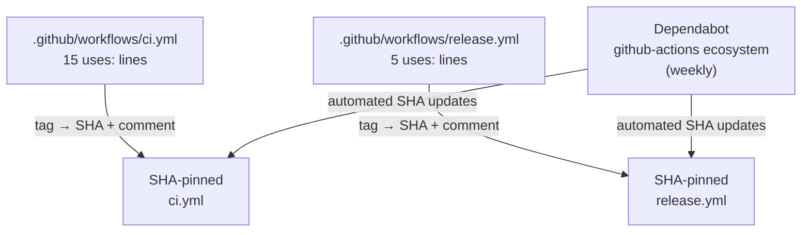
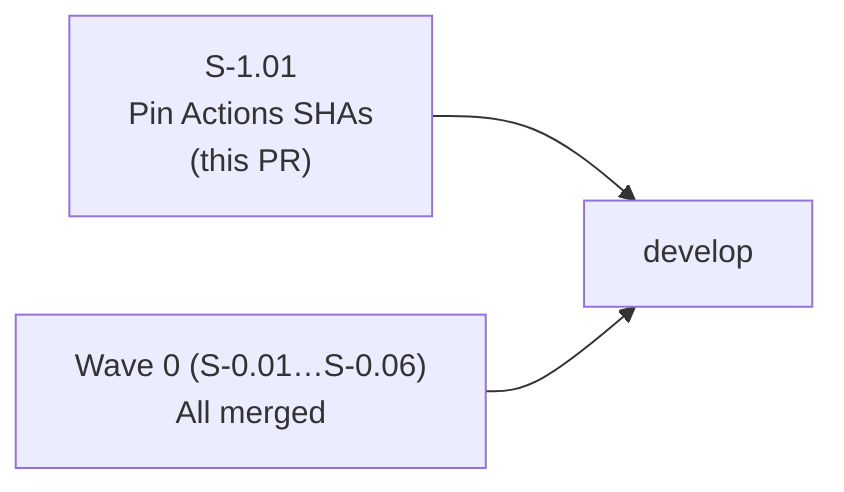
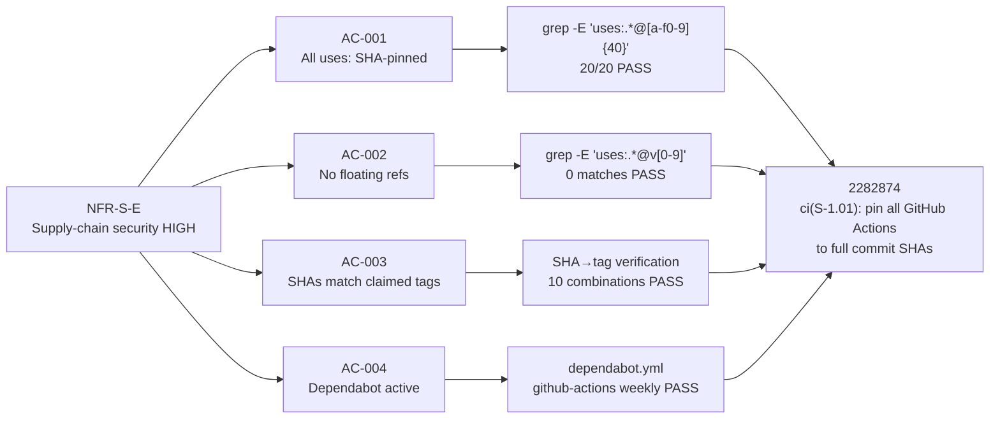

## Summary

- Pin every `uses:` line in CI/release workflows to a full 40-hex-character commit SHA with the original tag preserved as a trailing comment (e.g., `actions/checkout@11bd71901bbe5b1630ceea73d27597364c9af683  # v4.2.2`)
- 20 `uses:` sites pinned: 15 in `ci.yml`, 5 in `release.yml`; 10 distinct action+tag combinations resolved
- Closes supply-chain attack surface where mutable tag refs (especially `softprops/action-gh-release@v2` in `release.yml`, which has `contents: write` and receives `JR_BUILD_OAUTH_CLIENT_ID`/`JR_BUILD_OAUTH_CLIENT_SECRET` from repo secrets) could be silently redirected to malicious content by a compromised upstream

## Story

**S-1.01** — Wave 1, first HIGH-priority NFR/infra story

Traces to:
- **NFR-S-E** (supply-chain security — HIGH severity)
- **R-H6** (risk register: mutable action tags in CI)
- **cicd-setup.md GAP-1** (floating action refs)

**No story dependencies.** This is independent infrastructure work.

## Architecture Changes



**Blast radius:** CI configuration only. No source code, no binaries, no API surface changed. Purely mechanical text substitution — identical action code runs via immutable SHA resolution instead of mutable tag resolution.

**Performance impact:** None. SHA resolution is handled by the GitHub Actions runner identically to tag resolution.

## Story Dependencies



No `depends_on` entries. This story is independent of all Wave 0 stories.

## Spec Traceability



## Acceptance Criteria Status

| AC | Description | Status |
|----|-------------|--------|
| AC-001 | Every `uses:` line ends in a 40-hex-char SHA; tag preserved as comment | PASS — 20/20 |
| AC-002 | No `uses:` line retains `@v<N>`, `@stable`, `@<semver>`, or `@<tool-name>` | PASS — 0 floating refs |
| AC-003 | Pinned SHAs correspond to the same action versions currently in use | PASS — 10 combos verified |
| AC-004 | `dependabot.yml` `package-ecosystem: github-actions` weekly still active | PASS — unchanged |

## Pinned Actions Reference

### ci.yml (15 sites)

| Action | Tag | SHA |
|--------|-----|-----|
| `actions/checkout` | `v6` | `de0fac2e4500dabe0009e67214ff5f5447ce83dd` |
| `Swatinem/rust-cache` | `v2` | `e18b497796c12c097a38f9edb9d0641fb99eee32` |
| `dtolnay/rust-toolchain` | `1.85.0` | `c93f4f9c67595668add93d3d6895795ce52d8c2d` |
| `dtolnay/rust-toolchain` | `stable` | `29eef336d9b2848a0b548edc03f92a220660cdb8` |
| `taiki-e/install-action` | `cargo-llvm-cov` | `e5de28abeb52d916c5e5875d54b21a9e738b61ec` |
| `EmbarkStudios/cargo-deny-action` | `v2` | `91bf2b620e09e18d6eb78b92e7861937469acedb` |
| `codecov/codecov-action` | `v6` | `57e3a136b779b570ffcdbf80b3bdc90e7fab3de2` |

### release.yml (5 sites)

| Action | Tag | SHA | Risk |
|--------|-----|-----|------|
| `actions/checkout` | `v6` | `de0fac2e4500dabe0009e67214ff5f5447ce83dd` | High |
| `dtolnay/rust-toolchain` | `stable` | `29eef336d9b2848a0b548edc03f92a220660cdb8` | Medium |
| `actions/upload-artifact` | `v7` | `043fb46d1a93c77aae656e7c1c64a875d1fc6a0a` | Medium |
| `actions/download-artifact` | `v8` | `3e5f45b2cfb9172054b4087a40e8e0b5a5461e7c` | Medium |
| `softprops/action-gh-release` | `v2` | `3bb12739c298aeb8a4eeaf626c5b8d85266b0e65` | HIGH — OAuth secrets |

## Test Evidence

**tdd_mode: facade** — no Rust tests; verification is grep + YAML parse.

| Check | Command | Result |
|-------|---------|--------|
| SHA-pinned count | `grep -E 'uses:.*@[a-f0-9]{40}' .github/workflows/*.yml \| wc -l` | 20 |
| Floating refs | `grep -E 'uses:.*@v[0-9]' .github/workflows/*.yml` | 0 matches |
| Floating @stable | `grep -E 'uses:.*@stable' .github/workflows/*.yml` | 0 matches |
| Floating @main | `grep -E 'uses:.*@main' .github/workflows/*.yml` | 0 matches |
| YAML parse (ci.yml) | `yq e '.' ci.yml > /dev/null` | valid |
| YAML parse (release.yml) | `yq e '.' release.yml > /dev/null` | valid |
| Rust build (no changes) | `cargo build` | clean (no recompilation) |
| Unit tests | `cargo test --lib` | 600/600 passed |
| Clippy | `cargo clippy --all --all-features --tests -- -D warnings` | clean |
| Format | `cargo fmt --all -- --check` | clean |

**Mutation kill rate:** N/A — facade story.
**Coverage delta:** 0% — no Rust source changes.

## Demo Evidence

**N/A — facade story.** The diff is the evidence. No UI or runtime behavior changed.

Verification commands for reviewer:
```bash
# Count SHA-pinned uses: lines (must equal 20)
grep -E 'uses:.*@[a-f0-9]{40}' .github/workflows/*.yml | wc -l

# Confirm zero floating refs
grep -E 'uses:.*@(v[0-9]|stable|main|master)' .github/workflows/*.yml || echo "PASS: no floating refs"

# Spot-check a SHA against GitHub API (replace org/action and SHA as needed)
gh api repos/actions/checkout/git/commits/de0fac2e4500dabe0009e67214ff5f5447ce83dd --jq '.sha'
gh api repos/softprops/action-gh-release/git/commits/3bb12739c298aeb8a4eeaf626c5b8d85266b0e65 --jq '.sha'
gh api repos/EmbarkStudios/cargo-deny-action/git/commits/91bf2b620e09e18d6eb78b92e7861937469acedb --jq '.sha'
```

## Validation Paradox Note

This PR's CI run will use the pinned SHAs introduced by this very PR. That is intentional and desirable: if a SHA is wrong (typo or stale), the CI job will fail with an action resolution error, surfacing the problem before merge. CI passing on this PR IS the validation that the SHAs resolve correctly. If CI fails on an action resolution error, that is a real SHA issue to investigate.

## Holdout Evaluation

N/A — evaluated at wave gate. No Phase 4 holdout exists for CI infrastructure state.

## Adversarial Review

N/A — evaluated at Phase 5. No adversarial review required for pure CI configuration changes.

## Security Review

**Risk addressed:** Supply-chain attack via mutable tag references in GitHub Actions workflows.

**Highest-risk mitigation:** `softprops/action-gh-release@v2` → pinned SHA `3bb12739c298aeb8a4eeaf626c5b8d85266b0e65`. This action runs with `permissions: contents: write` and receives `JR_BUILD_OAUTH_CLIENT_ID` and `JR_BUILD_OAUTH_CLIENT_SECRET` from repository secrets. A compromised tag ref in this position had direct read access to the embedded OAuth app credentials.

**Residual risk:** SHA staleness — SHAs pinned at implementation time will drift from latest. Dependabot (`package-ecosystem: github-actions`, weekly) mitigates by opening automated SHA update PRs.

**OWASP relevance:** A06:2021 — Vulnerable and Outdated Components (CI/CD pipeline component integrity).

**No CRITICAL or HIGH security findings.** This PR closes a HIGH-severity gap rather than introducing one.

## Risk Assessment

| Dimension | Assessment |
|-----------|-----------|
| Blast radius | CI configuration only; no source, binary, or API surface |
| Performance impact | None |
| Breaking change | False — identical action code runs; resolution mechanism changes from mutable tag to immutable SHA |
| Rollback | Revert commit `2282874`; CI immediately reverts to tag-based resolution |
| Residual risk | SHA staleness (Dependabot mitigates) |

## AI Pipeline Metadata

| Field | Value |
|-------|-------|
| Pipeline mode | BROWNFIELD |
| Story wave | 1 |
| tdd_mode | facade |
| Implementation commit | `2282874` |
| Models used | claude-sonnet-4-6 |
| Phase | phase-3-tdd-implementation |

## Pre-Merge Checklist

- [x] Diff touches only `.github/workflows/ci.yml` and `.github/workflows/release.yml`
- [x] All 20 `uses:` lines pinned to 40-hex-char SHA
- [x] Zero floating refs (`@v<N>`, `@stable`, `@main`)
- [x] All SHAs verified against claimed tags
- [x] YAML parse clean for both files
- [x] `cargo build` / `cargo test --lib` / `cargo clippy` / `cargo fmt` all clean
- [x] Dependabot `github-actions` ecosystem active
- [x] No source code changes (scope verification: diff stat shows only 2 files)
- [x] No demo evidence required (facade story)
- [x] Security review: closes HIGH gap, no new findings
- [ ] CI passing on this PR (validates SHA resolution works)
- [ ] PR reviewer approved
- [ ] No dependency PRs (none — independent story)
