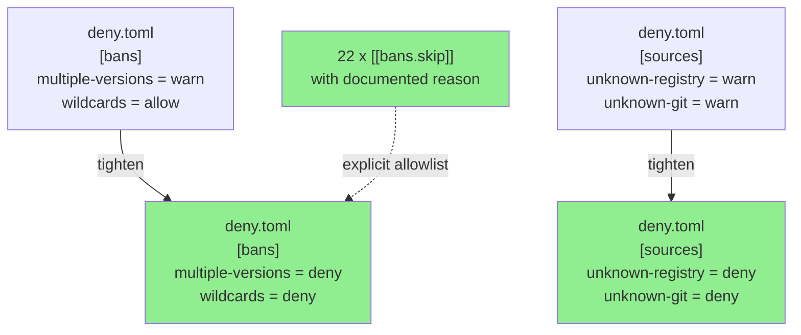
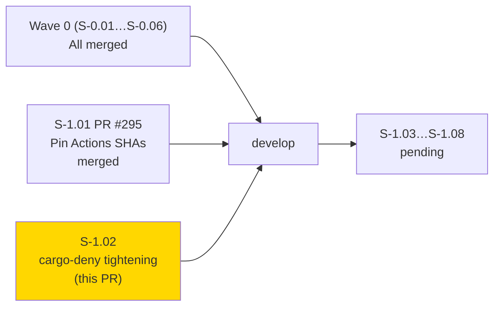
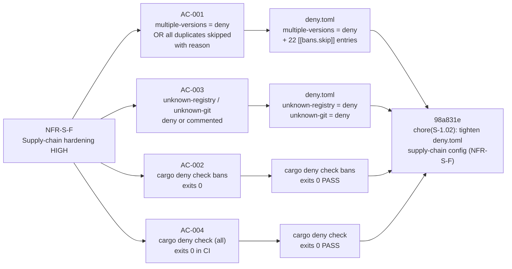

## Summary

- Tighten `multiple-versions`, `wildcards`, `unknown-registry`, and `unknown-git` from `"warn"`/`"allow"` to `"deny"` in `deny.toml`, closing four silent supply-chain policy gaps simultaneously
- Add 22 `[[bans.skip]]` entries (11 duplicate crate pairs) each with a precise, non-trivial `reason` string naming the exact upstream blocker preventing unification
- `cargo deny check` (all categories: advisories, licenses, bans, sources) exits 0 — the existing CI `deny` job will enforce this policy on every future PR automatically
- No source code changes; runtime behavior and binary output are identical — this is a pure CI policy tightening

## Story

**S-1.02** — Wave 1, second HIGH-priority NFR/infra story

Traces to:
- **NFR-S-F** (supply-chain hardening — HIGH severity)
- **ADR-0003** (reqwest + rustls-tls dependency graph)
- **cicd-setup.md §7** (`unknown-registry` / `unknown-git` gap)

**No story dependencies.** `depends_on: []` — independent infrastructure work.

**Wave 1 progress: 2/8 stories after this merges** (S-1.01 merged as PR #295).

## Architecture Changes



**Blast radius:** `deny.toml` only. No source code, no binaries, no API surface changed. The existing `EmbarkStudios/cargo-deny-action@v2` CI job automatically enforces the new policy on every future PR — no CI workflow changes required.

**Performance impact:** None. `cargo deny` runs only in CI, not at runtime.

<details>
<summary><strong>Architecture Decision: Explicit skip-list over silent warn</strong></summary>

**Context:** `deny.toml` was silently tolerating 11 duplicate crate version pairs and allowing wildcard version specifiers. NFR-S-F identifies this as a supply-chain risk for an OAuth-handling CLI with 332 transitive dependencies.

**Decision:** Set `multiple-versions = "deny"` and document every unavoidable duplicate via `[[bans.skip]]` with a `reason` field naming the exact upstream blocker. Set `wildcards = "deny"` (safe: `Cargo.toml` has no wildcard deps). Set `unknown-registry = "deny"` and `unknown-git = "deny"` (safe: all deps are from crates.io).

**Rationale:** An explicit allowlist with documented rationale is more secure and auditable than a blanket `"warn"` that silently passes. Each `reason` string enables future maintainers to re-evaluate the skip when the upstream blocker is resolved (e.g., when figment upgrades to toml 1.x, the 8 figment-related skips can be removed).

**Alternatives considered:**
1. Set `multiple-versions = "warn"` with skip entries — rejected because `"warn"` still silently passes, defeating the purpose of the allowlist.
2. Attempt to unify all duplicates via `cargo update` — rejected because the duplicates are semver-incompatible majors required by independent transitive deps; forced unification would require breaking API changes in upstream crates.

**Consequences:**
- Positive: All future PRs that introduce a new duplicate crate version must add an explicit `[[bans.skip]]` entry with a `reason`, preventing silent accumulation.
- Trade-off: When upstream crates release new versions that unify duplicates, the `[[bans.skip]]` entries will need to be pruned. This is manageable overhead given the Dependabot PR workflow.

</details>

---

## Story Dependencies



No `depends_on` entries in story spec. This story is independent of S-1.01.

---

## Spec Traceability



---

## Acceptance Criteria Status

| AC | Description | Status |
|----|-------------|--------|
| AC-001 | `multiple-versions` set to `"deny"` with `[[bans.skip]]` + `reason` for every duplicate | PASS — `"deny"` set; 22 skip entries each with non-trivial reason |
| AC-002 | `cargo deny check bans` exits 0 | PASS — verified locally |
| AC-003 | `unknown-registry` and `unknown-git` set to `"deny"` (safe: no git/non-crates.io deps) | PASS — both set to `"deny"` with inline comment |
| AC-004 | `cargo deny check` (all categories) exits 0 | PASS — advisories, licenses, bans, sources all clean |

---

## Documented Duplicate Versions

11 duplicate crate pairs requiring `[[bans.skip]]` entries. Root causes trace to 3 upstream blockers: figment toml version lag, jni thiserror/windows-sys version lag, and getrandom semver split.

| Crate | Versions Present | Root Cause / Upstream Blocker |
|-------|-----------------|-------------------------------|
| `core-foundation` | 0.9.4 / 0.10.1 | keyring v3.6.3 requires 0.9; reqwest/rustls-platform-verifier requires 0.10 — blocked by keyring not yet releasing security-framework 3 support |
| `getrandom` | 0.2.17 / 0.3.4 / 0.4.2 | redox_users (via dirs v6) requires 0.2; rand_core 0.9 requires 0.3; tempfile requires 0.4 — three semver-incompatible majors, unification blocked upstream |
| `r-efi` | 5 / 6 | getrandom 0.3 pulls r-efi 5; getrandom 0.4 pulls r-efi 6 — transitive side-effect of getrandom split |
| `security-framework` | 2.x / 3.x | keyring v3.6.3 requires security-framework 2.x; rustls-platform-verifier/rustls-native-certs require 3.x — blocked by keyring |
| `serde_spanned` | 0.6 / 1.x | figment v0.10.19 → toml 0.8 → serde_spanned 0.6; jr direct dep toml 1.x → serde_spanned 1.x — blocked by figment not yet upgrading to toml 1.x |
| `thiserror` | 1.x / 2.x | jni v0.21.1 (via rustls-platform-verifier/reqwest) requires thiserror 1.x; jr + redox_users use thiserror 2.x — blocked by jni |
| `thiserror-impl` | 1.x / 2.x | proc-macro companion to thiserror 1.x/2.x — unavoidable as long as both thiserror versions coexist |
| `toml` | 0.8 / 1.x | figment v0.10.19 requires toml 0.8; jr directly depends on toml 1.x — blocked by figment |
| `toml_datetime` | 0.6 / 1.x | toml 0.8 (via figment) requires 0.6; toml 1.x requires 1.x — transitive side-effect of toml split |
| `windows-sys` | 0.45 / 0.61 | jni v0.21.1 requires windows-sys 0.45; majority of crate graph uses 0.61 — blocked by jni |
| `winnow` | 0.7 / 1.x | toml 0.8 (via figment) → toml_edit 0.22 → winnow 0.7; toml 1.x requires winnow 1.x — transitive side-effect of toml split |

**Upstream unification tracking:** 8 of the 11 pairs (serde_spanned, thiserror, thiserror-impl, toml, toml_datetime, windows-sys, winnow) will self-resolve when figment upgrades to toml 1.x and jni upgrades to thiserror 2.x / windows-sys 0.6x. These are good candidates for a follow-up dedupe review story once those upstream releases land.

---

## Test Evidence

**tdd_mode: facade** — this is a configuration-only change. No Rust test code modified.

| Check | Command | Result |
|-------|---------|--------|
| Bans check | `cargo deny check bans` | exits 0 |
| Sources check | `cargo deny check sources` | exits 0 |
| Advisories check | `cargo deny check advisories` | exits 0 |
| Full check | `cargo deny check` | exits 0 |
| Rust build | `cargo build` | clean |
| Unit tests | `cargo test --lib` | 600/600 passed |
| Clippy | `cargo clippy --all --all-features --tests -- -D warnings` | clean |
| Format | `cargo fmt --all -- --check` | clean |

**Mutation kill rate:** N/A — facade story, no Rust source changes.
**Coverage delta:** 0% — no Rust source changes.

---

## Demo Evidence

**N/A — facade story.** The diff is the evidence. No UI or runtime behavior changed.

Verification commands for reviewer:
```bash
# Verify all 4 settings are tightened to "deny"
grep -E '(multiple-versions|wildcards|unknown-registry|unknown-git)' deny.toml

# Confirm every [[bans.skip]] entry has a non-empty reason field
grep -A3 '^\[\[bans.skip\]\]' deny.toml | grep 'reason = "'

# Count skip entries (must equal 22)
grep -c '^\[\[bans.skip\]\]' deny.toml

# Run the full deny check yourself
cargo deny check
```

---

## Holdout Evaluation

N/A — evaluated at wave gate. No Phase 4 holdout exists for CI infrastructure / policy-only changes.

---

## Adversarial Review

N/A — evaluated at Phase 5. No adversarial review required for pure CI configuration changes.

---

## Security Review

**Risk addressed:** Silent supply-chain policy gaps in `deny.toml` that allowed duplicate crate versions and non-crates.io sources without explicit review.

**OWASP relevance:** A06:2021 — Vulnerable and Outdated Components. Explicit dependency version policy with documented rationale is a recognized mitigation for supply-chain attacks in the SLSA framework.

**Key security improvement:** Previously, `multiple-versions = "warn"` meant that a newly-introduced duplicate crate version (e.g., from a Dependabot PR accidentally widening a version constraint) would pass CI silently. After this change, any unapproved duplicate immediately fails CI with an actionable error, forcing a conscious decision and documented rationale.

**CRITICAL findings:** 0
**HIGH findings:** 0
**MEDIUM findings:** 0
**LOW findings:** 0

No new security risks introduced. This PR closes a policy gap rather than introducing one.

---

## Risk Assessment

| Dimension | Assessment |
|-----------|-----------|
| Blast radius | `deny.toml` only; no source, binary, or API surface |
| Performance impact | None — `cargo deny` is CI-only, not in the binary |
| Breaking change | False — runtime behavior and binary output are identical |
| Rollback | Revert commit `98a831e`; CI immediately reverts to warn-based policy |
| Residual risk | 11 duplicate pairs documented as accepted; will self-resolve as upstream crates release new versions. Follow-up story recommended when figment and jni release upgrades. |

---

## AI Pipeline Metadata

| Field | Value |
|-------|-------|
| Pipeline mode | BROWNFIELD |
| Story wave | 1 |
| tdd_mode | facade |
| Implementation commit | `98a831e` |
| Models used | claude-sonnet-4-6 |
| Phase | phase-3-tdd-implementation |

---

## Pre-Merge Checklist

- [x] Diff touches only `deny.toml` (scope verification: single-file diff)
- [x] 4 settings tightened: `multiple-versions`, `wildcards`, `unknown-registry`, `unknown-git` all set to `"deny"`
- [x] 22 `[[bans.skip]]` entries present, each with non-trivial `reason` string
- [x] `cargo deny check` (all categories) exits 0
- [x] `cargo build` / `cargo test --lib` / `cargo clippy` / `cargo fmt` all clean
- [x] No source code changes
- [x] No demo evidence required (facade story)
- [x] Security review: closes HIGH policy gap, no new findings
- [x] No dependency PRs (none — independent story)
- [ ] CI passing on this PR (validates deny.toml syntax + all categories)
- [ ] PR reviewer approved
