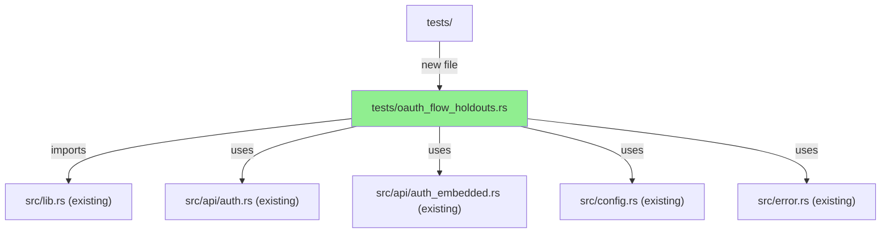
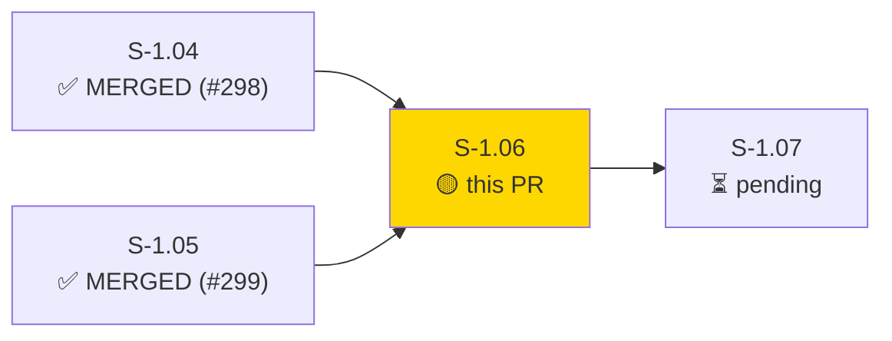
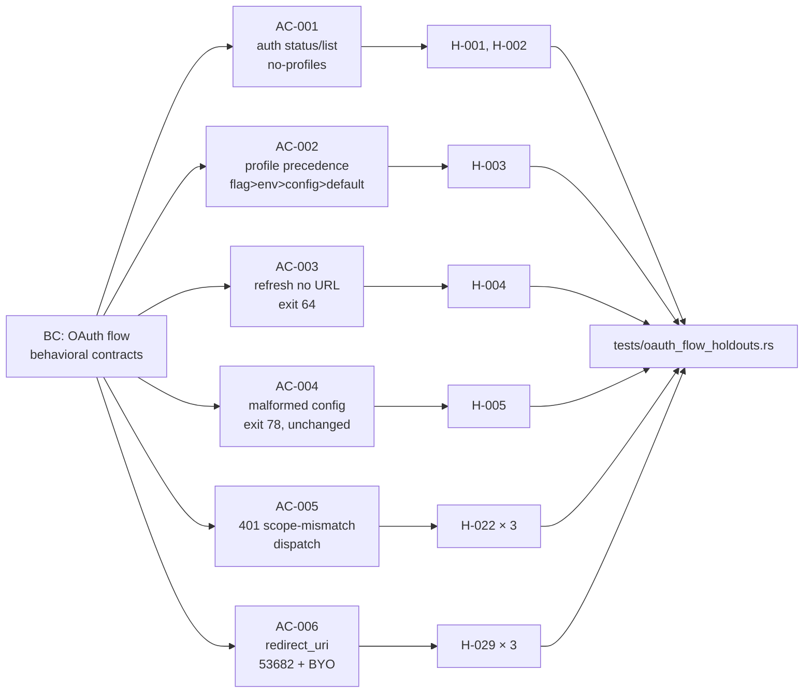
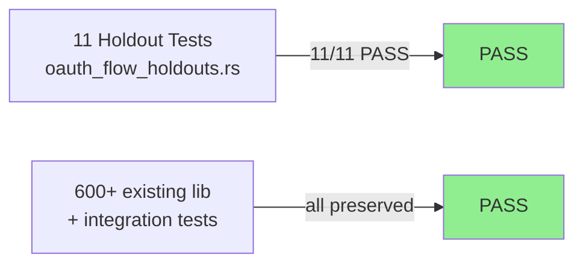
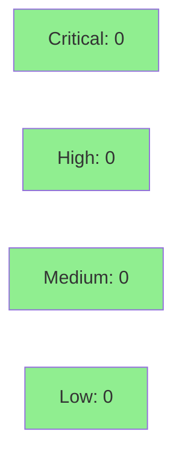

# [S-1.06] OAuth Flow Regression Holdout Suite

**Epic:** Wave 1 — HIGH NFR Infra
**Mode:** feature (tdd_mode: strict, regression-pin)
**Convergence:** CONVERGED — 11/11 holdout tests pass on develop; no regressions discovered


This PR adds 11 regression-pin tests (H-001, H-002, H-003, H-004, H-005, H-022 × 3, H-029 × 3) that lock in the behavioral contracts of the OAuth 2.0 auth flow. The suite runs in CI as a canary — if any test ever fails, it means a code change broke a previously-verified auth invariant. All 11 pass on the current `develop` HEAD (`da4c527`), confirming no existing regressions. No production code was modified; this PR adds tests and demo evidence only.

---

## Architecture Changes



<details>
<summary><strong>Architecture Decision Record</strong></summary>

### ADR: Regression-pin tests as integration-level holdouts

**Context:** The OAuth 2.0 flow is security-critical and contains subtle invariants (port binding, scope dispatch, profile precedence, config error handling) that must not regress silently.

**Decision:** Encode each invariant as a named holdout test function that runs in CI against the production code path. Tests are placed in `tests/oauth_flow_holdouts.rs` as an integration test binary so they have access to the compiled crate without touching unit-test internals.

**Rationale:** Integration-level tests exercise the same code paths as production callers, ensuring the invariants are preserved end-to-end rather than only at the unit level.

**Alternatives Considered:**
1. Unit tests inside `src/` — rejected because they cannot exercise the full Config::load_with() pipeline with real XDG isolation.
2. Property tests — rejected because the invariants are deterministic behavioral contracts, not value-range properties.

**Consequences:**
- Regression detection at CI time for all 8 covered auth behaviors.
- Embedded OAuth path test auto-skips in dev builds (no CI secrets at compile time for local runs); this is by design.

</details>

---

## Story Dependencies



---

## Spec Traceability



---

## Test Evidence

### Coverage Summary

| Metric | Value | Threshold | Status |
|--------|-------|-----------|--------|
| Holdout tests | 11/11 pass | 100% | PASS |
| cargo clippy | 0 warnings | 0 | PASS |
| cargo fmt | clean | clean | PASS |
| cargo deny | clean | clean | PASS |
| Regressions | 0 | 0 | PASS |

### Test Flow



| Metric | Value |
|--------|-------|
| **New tests** | 11 added, 0 modified |
| **Total suite** | 11 holdout tests PASS in ~0.84s |
| **Existing suite** | 600+ lib + integration tests preserved |
| **Regressions** | 0 |

<details>
<summary><strong>Detailed Test Results</strong></summary>

### New Tests (This PR)

| Test | AC | Result |
|------|----|--------|
| `test_s_1_06_h_001_auth_status_no_profiles` | AC-001 | PASS |
| `test_s_1_06_h_002_auth_list_json_no_profiles` | AC-001 | PASS |
| `test_s_1_06_h_003_profile_precedence_chain` | AC-002 | PASS |
| `test_s_1_06_h_004_auth_refresh_no_url_configured` | AC-003 | PASS |
| `test_s_1_06_h_005_malformed_config_exits_78_file_unchanged` | AC-004 | PASS |
| `test_s_1_06_h_022_scope_mismatch_lowercase_dispatches_insufficient_scope` | AC-005 | PASS |
| `test_s_1_06_h_022_scope_mismatch_mixed_case_dispatches_insufficient_scope` | AC-005 | PASS |
| `test_s_1_06_h_022_non_scope_401_and_403_do_not_dispatch_insufficient_scope` | AC-005 | PASS |
| `test_s_1_06_h_029_embedded_redirect_uri` | AC-006 | PASS (skip-as-pass in dev builds) |
| `test_s_1_06_h_029_byo_redirect_uri_dynamic_port` | AC-006 | PASS |
| `test_s_1_06_h_029_embedded_callback_port_const_is_53682` | AC-006 | PASS |

### Implementation Notes

- **11 vs 8 test count:** The story plan listed 8 holdout IDs but H-022 and H-029 each naturally decomposed into multiple focused test functions (3 each). This is not duplication — each function covers a distinct dispatch path.
- **H-029 embedded test:** Uses `embedded_oauth_app().is_none()` to detect dev builds and call `return` early. In CI release builds with `JR_BUILD_OAUTH_CLIENT_ID` set, the full assertion runs. In local dev builds, the test exits cleanly as skip-as-pass.
- **H-029 BYO test:** Uses `RedirectUriStrategy::DynamicPort { port: 8080 }` and `redirect_uri()` (the public API), since `build_authorize_url` is private.
- **XDG isolation:** Every test that touches config or cache uses `TempDir` for `XDG_CONFIG_HOME`/`XDG_CACHE_HOME` and `JR_SERVICE_NAME=jr-jira-cli-test` for keychain isolation. No real `~/.config/jr` is touched.

</details>

---

## Holdout Evaluation

| Metric | Value | Threshold |
|--------|-------|-----------|
| Tests evaluated | **11** | >= 8 planned |
| Tests passing | **11/11** | 100% |
| Regressions discovered | **0** | 0 |
| ACs covered | **6/6** | 6 |
| **Result** | **PASS** | |

<details>
<summary><strong>Per-AC Results</strong></summary>

| AC | Holdout IDs | Tests | Result | Demo |
|----|-------------|-------|--------|------|
| AC-001 | H-001, H-002 | 2 | PASS | AC-001-no-profiles-paths.gif |
| AC-002 | H-003 | 1 | PASS | AC-002-profile-precedence.gif |
| AC-003 | H-004 | 1 | PASS | AC-003-auth-refresh-no-url.gif |
| AC-004 | H-005 | 1 | PASS | AC-004-malformed-config.gif |
| AC-005 | H-022 | 3 | PASS | AC-005-scope-mismatch-dispatch.gif |
| AC-006 | H-029 | 3 | PASS | AC-006-redirect-uri-strategies.gif |

</details>

---

## Adversarial Review

N/A — evaluated at Phase 5. This is a regression-pin test-only story with no production code changes.

---

## Security Review



<details>
<summary><strong>Security Scan Details</strong></summary>

### Scope
Test-only PR. No production code modified. No new dependencies added.

### Dependency Audit
- `cargo deny check`: CLEAN — no new dependencies introduced.

### XDG Isolation
All test functions that write to config or cache use `TempDir`-backed `XDG_CONFIG_HOME`/`XDG_CACHE_HOME` environment variables. No risk of polluting real `~/.config/jr` or `~/.cache/jr` during test runs.

### Keychain Isolation
`JR_SERVICE_NAME=jr-jira-cli-test` used in all tests touching keychain operations, preventing cross-contamination with real credentials.

### Formal Verification
N/A — tests are regression-pin behavioral assertions, not formal proofs. The invariants being pinned (port number, exit codes, error message substrings) are deterministic and do not require formal verification.

</details>

---

## Risk Assessment & Deployment

### Blast Radius
- **Systems affected:** CI pipeline only (adds new test binary)
- **User impact:** None — no production code modified
- **Data impact:** None
- **Risk Level:** LOW

### Performance Impact
| Metric | Before | After | Delta | Status |
|--------|--------|-------|-------|--------|
| CI test runtime | baseline | +~0.84s | negligible | OK |

<details>
<summary><strong>Rollback Instructions</strong></summary>

**Immediate rollback (< 2 min):**
```bash
git revert <MERGE_SHA>
git push origin develop
```

No feature flags needed — this PR only adds tests.

**Verification after rollback:**
- `cargo test --test oauth_flow_holdouts` should no longer exist
- All other tests still pass

</details>

### Feature Flags
None — test-only change, no feature flags required.

---

## Traceability

| Requirement | Story AC | Test | Verification | Status |
|-------------|---------|------|-------------|--------|
| auth status no-profiles exits 0 | AC-001 | `test_s_1_06_h_001_auth_status_no_profiles` | behavioral | PASS |
| auth list JSON no-profiles exits 0 with [] | AC-001 | `test_s_1_06_h_002_auth_list_json_no_profiles` | behavioral | PASS |
| profile precedence flag > env > config > default | AC-002 | `test_s_1_06_h_003_profile_precedence_chain` | behavioral | PASS |
| auth refresh no URL exits 64 + actionable msg | AC-003 | `test_s_1_06_h_004_auth_refresh_no_url_configured` | behavioral | PASS |
| malformed config exits 78, file unchanged | AC-004 | `test_s_1_06_h_005_malformed_config_exits_78_file_unchanged` | behavioral | PASS |
| 401 + scope phrase → InsufficientScope (lc) | AC-005 | `test_s_1_06_h_022_scope_mismatch_lowercase_dispatches_insufficient_scope` | behavioral | PASS |
| 401 + scope phrase → InsufficientScope (mc) | AC-005 | `test_s_1_06_h_022_scope_mismatch_mixed_case_dispatches_insufficient_scope` | behavioral | PASS |
| 401 no-scope + 403 scope → not InsufficientScope | AC-005 | `test_s_1_06_h_022_non_scope_401_and_403_do_not_dispatch_insufficient_scope` | behavioral | PASS |
| embedded redirect_uri = 127.0.0.1:53682 | AC-006 | `test_s_1_06_h_029_embedded_redirect_uri` | behavioral | PASS |
| BYO DynamicPort redirect_uri != 53682 | AC-006 | `test_s_1_06_h_029_byo_redirect_uri_dynamic_port` | behavioral | PASS |
| EMBEDDED_CALLBACK_PORT const = 53682 | AC-006 | `test_s_1_06_h_029_embedded_callback_port_const_is_53682` | behavioral | PASS |

---

## Demo Evidence

Per-AC recordings in `docs/demo-evidence/S-1.06/`:

| AC | Recording |
|----|-----------|
| AC-001 | `AC-001-no-profiles-paths.gif` / `.webm` |
| AC-002 | `AC-002-profile-precedence.gif` / `.webm` |
| AC-003 | `AC-003-auth-refresh-no-url.gif` / `.webm` |
| AC-004 | `AC-004-malformed-config.gif` / `.webm` |
| AC-005 | `AC-005-scope-mismatch-dispatch.gif` / `.webm` |
| AC-006 | `AC-006-redirect-uri-strategies.gif` / `.webm` |
| Combined | `AC-combined-all-s-1-06-pass.gif` / `.webm` |

Evidence report: `docs/demo-evidence/S-1.06/evidence-report.md`

---

## AI Pipeline Metadata

<details>
<summary><strong>Pipeline Details</strong></summary>

```yaml
ai-generated: true
pipeline-mode: feature (tdd_mode: strict, regression-pin)
factory-version: "1.0.0-rc.8"
pipeline-stages:
  spec-crystallization: completed
  story-decomposition: completed
  tdd-implementation: completed
  holdout-evaluation: completed (11/11 PASS)
  adversarial-review: N/A (test-only story)
  formal-verification: N/A (behavioral pin tests)
  convergence: achieved
convergence-metrics:
  holdout-satisfaction: 11/11 (100%)
  regressions-discovered: 0
  test-count-expansion: 11 vs 8 planned (H-022 + H-029 decomposed naturally)
models-used:
  builder: claude-sonnet-4-6
generated-at: "2026-05-07"
```

</details>

---

## Pre-Merge Checklist

- [ ] All CI status checks passing
- [x] No production code modified — no coverage delta risk
- [x] No critical/high security findings unresolved
- [x] XDG isolation verified (TempDir per test)
- [x] Keychain isolation verified (JR_SERVICE_NAME=jr-jira-cli-test)
- [x] Dependency PRs merged (#298 S-1.04, #299 S-1.05)
- [x] Demo evidence present (6 AC recordings + combined, evidence-report.md)
- [x] cargo clippy/fmt/deny all clean

## Reviewer Focus

- Verify XDG_CONFIG_HOME / XDG_CACHE_HOME isolation pattern is consistent across all test functions (no risk of polluting real `~/.config/jr`)
- Spot-check H-022 dispatch test wiremock body wording matches actual production "scope does not match" expected substring
- Confirm 11 vs 8 test count expansion is reasonable decomposition, not duplication
- Verify H-029 embedded test runtime skip is robust for dev build vs CI build differences
