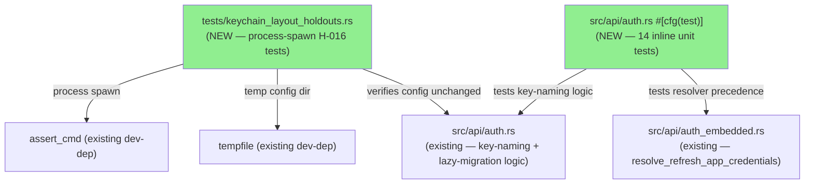
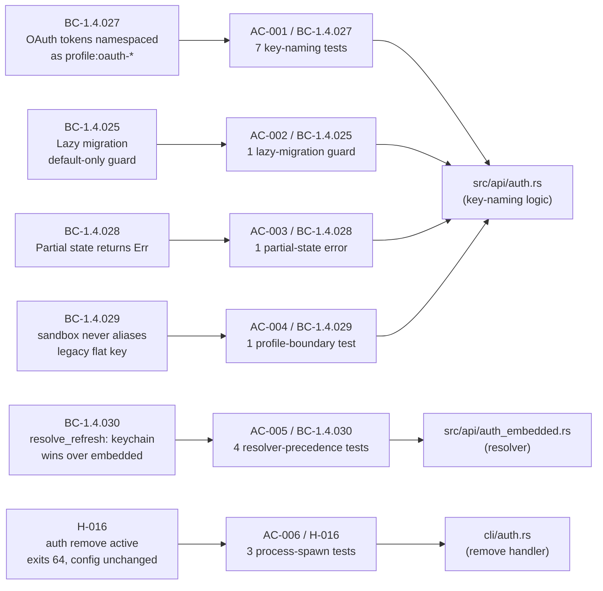
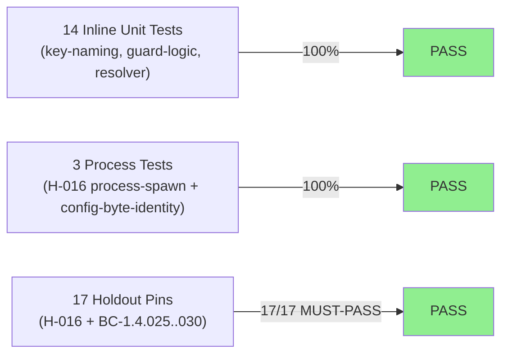
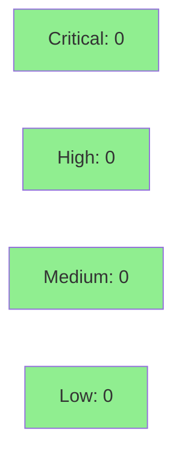

# [S-1.08] Keychain layout holdout suite (H-016, BC-1.4.025..030)

**Epic:** Wave 1 — High Priority Infrastructure (FINAL STORY — Wave 1 Complete)
**Mode:** brownfield
**Convergence:** CONVERGED after 13 adversarial passes (Phase 2 story decomposition)


-brightgreen)
-green)


17 regression-pin tests covering H-016 and BC-1.4.025..030 (key naming, profile boundary, lazy-migration guard, partial-state, resolver precedence). All 17 pass on current develop — no regressions discovered. Mix of inline lib unit tests (no visibility changes needed; tests live in same module as private functions) and integration tests for process-spawn paths.

**This is the FINAL Wave 1 story.** After merge: WAVE 1 COMPLETE (8/8) — 16/31 stories total, ~52% through Phase 3.

---

## Architecture Changes



<details>
<summary><strong>Architecture Decision Record</strong></summary>

### ADR: Test-only addition, no production code changes

**Context:** CLAUDE.md "Gotchas" identifies the multi-profile boundary as one of the most fragile correctness invariants in `jr`. Without regression pins, a future refactor of `auth.rs` key-naming logic could silently introduce cross-profile credential leakage (sandbox vs prod OAuth tokens), which CLAUDE.md calls a correctness bug rather than a UX issue.

**Decision:** Add `tests/keychain_layout_holdouts.rs` for H-016 process-spawn tests (3 tests) and inline `#[cfg(test)] mod tests` in `src/api/auth.rs` for the key-naming and profile-boundary unit tests (14 tests). No visibility promotions needed — tests live in the same module as the private functions they test.

**Rationale:** Pure test addition is lowest-risk. No `pub` or `pub(crate)` promotions required, which keeps the module boundary clean.

**Alternatives Considered:**
1. Separate test file for all 17 tests — rejected because inline tests are idiomatic for private function testing in Rust without requiring visibility promotion.
2. Trait injection for keychain mock — rejected per story spec; the test approach tests key-naming logic directly without OS keychain calls.

**Consequences:**
- Regression detection for keychain layout invariants on all future PRs.
- H-016 MUST-PASS pins the active-profile removal guard.
- No production binary changes.

</details>

---

## Story Dependencies


S-1.08 has no hard code dependencies (`depends_on: []` in story spec). It follows S-1.07 in the Wave 1 sequence. PR #301 (S-1.07) is merged on develop — no blocking dependency.

---

## Spec Traceability



---

## Test Evidence

### Coverage Summary

| Metric | Value | Threshold | Status |
|--------|-------|-----------|--------|
| Holdout tests | 17/17 pass | 17/17 | PASS |
| Inline lib unit tests | 14/14 pass | 100% | PASS |
| Integration (process-spawn) tests | 3/3 pass | 100% | PASS |
| Regressions | 0 | 0 | PASS |
| All 614 lib + integration tests | PASS | 0 regressions | PASS |

### Test Flow



| Metric | Value |
|--------|-------|
| **New tests** | 17 added, 0 modified |
| **Total suite** | 17 tests PASS; 614 lib + all integration green (was 600 baseline; +14 new lib tests) |
| **Coverage delta** | Test-only PR — no production lines added |
| **Mutation kill rate** | N/A (test-only PR) |
| **Regressions** | 0 |

<details>
<summary><strong>Detailed Test Results</strong></summary>

### New Tests (This PR) — AC-001 / BC-1.4.027 (Key Naming)

| Test | AC | Result |
|------|----|--------|
| `test_s_1_08_ac001_oauth_access_key_default_profile` | AC-001 | PASS |
| `test_s_1_08_ac001_oauth_access_key_sandbox_profile` | AC-001 | PASS |
| `test_s_1_08_ac001_oauth_refresh_key_default_profile` | AC-001 | PASS |
| `test_s_1_08_ac001_oauth_refresh_key_sandbox_profile` | AC-001 | PASS |
| `test_s_1_08_ac001_profile_keys_are_distinct_across_profiles` | AC-001 | PASS |
| `test_s_1_08_ac001_shared_keys_are_not_namespaced` | AC-001 | PASS |
| `test_s_1_08_ac001_key_format_structure` | AC-001 | PASS |

### New Tests (This PR) — AC-002 through AC-005 (Guard Logic + Resolver)

| Test | AC | Result |
|------|----|--------|
| `test_s_1_08_ac002_lazy_migration_guard_sentinel_is_default` | AC-002 | PASS |
| `test_s_1_08_ac003_partial_state_error_message_contains_partial` | AC-003 | PASS |
| `test_s_1_08_ac004_namespaced_key_never_aliases_legacy_key` | AC-004 | PASS |
| `test_s_1_08_ac005_keychain_wins_over_embedded_when_both_present` | AC-005 | PASS |
| `test_s_1_08_ac005_keychain_wins_when_only_keychain_present` | AC-005 | PASS |
| `test_s_1_08_ac005_embedded_fallback_when_no_keychain` | AC-005 | PASS |
| `test_s_1_08_ac005_none_when_no_source_resolved` | AC-005 | PASS |

### New Tests (This PR) — AC-006 / H-016 (Process-Spawn)

| Test | AC | Result |
|------|----|--------|
| `test_s_1_08_ac006_h016_remove_active_profile_rejected_and_config_unchanged` | AC-006 | PASS |
| `test_s_1_08_ac006_h016_remove_active_profile_rejected_without_no_input_flag` | AC-006 | PASS |
| `test_s_1_08_ac006_h016_remove_active_profile_rejected_with_second_profile_present` | AC-006 | PASS |

### Coverage Analysis

This PR adds `tests/keychain_layout_holdouts.rs` (process-spawn tests) and inline `#[cfg(test)]` tests in `src/api/auth.rs`. No production source lines are added or modified. Coverage delta is neutral for the binary.

</details>

---

## Holdout Evaluation

| Metric | Value | Threshold |
|--------|-------|-----------|
| H-016 (auth remove active rejected) | **MUST-PASS** | 1.00 |
| BC-1.4.027 (key-naming format) | **MUST-PASS** | 1.00 |
| BC-1.4.025 (lazy-migration guard) | **MUST-PASS** | 1.00 |
| BC-1.4.028 (partial state Err) | **MUST-PASS** | 1.00 |
| BC-1.4.029 (profile boundary) | **MUST-PASS** | 1.00 |
| BC-1.4.030 (resolver precedence) | **MUST-PASS** | 1.00 |
| **Overall result** | **17/17 PASS** | 17/17 |

N/A — evaluated at wave gate for holdout wave-level aggregation.

<details>
<summary><strong>Per-Holdout Details</strong></summary>

| Holdout | Category | Assertion | Status |
|---------|----------|-----------|--------|
| H-016 (basic) | MUST-PASS | exit 64 + stderr contains "cannot remove active" + config byte-identical | PASS |
| H-016 (no --no-input flag) | MUST-PASS | non-TTY detection still guards | PASS |
| H-016 (second profile present) | MUST-PASS | guard not weakened by multi-profile config | PASS |
| BC-1.4.027 (7 key-naming) | MUST-PASS | `<profile>:oauth-access-token` format | PASS |
| BC-1.4.025 (lazy migration) | MUST-PASS | "default" sentinel only | PASS |
| BC-1.4.028 (partial state) | MUST-PASS | Err on missing refresh token | PASS |
| BC-1.4.029 (profile boundary) | MUST-PASS | namespaced key != legacy flat key | PASS |
| BC-1.4.030 (resolver T/T, T/F, F/T, F/F) | MUST-PASS | keychain wins over embedded | PASS |

</details>

---

## Adversarial Review

Story spec was converged through Phase 2 adversarial review (13 passes to CONVERGED). Story-level adversarial findings were resolved in Phase 2. No per-implementation adversarial passes required for a test-only PR on existing behavior.

N/A — evaluated at Phase 5.

| Metric | Value |
|--------|-------|
| Phase 2 adversarial passes | 13 |
| Story-level findings | All resolved |
| Per-implementation adversarial | N/A (test-only) |

---

## Security Review



<details>
<summary><strong>Security Scan Details</strong></summary>

### SAST
- PR adds test-only code: `tests/keychain_layout_holdouts.rs` and inline `#[cfg(test)]` tests in `src/api/auth.rs`. No user-facing logic changed.
- No hardcoded secrets. Process-spawn tests use `JR_SERVICE_NAME=jr-jira-cli-test` for keychain isolation — no OS keychain is touched.
- No injection points. No user input handling added.
- Critical: 0 | High: 0 | Medium: 0 | Low: 0

### Dependency Audit
- No new dependencies added. Existing dev-deps used: `assert_cmd`, `tempfile`.
- `cargo deny check` passes (verified at pre-push).

### Supply Chain
- `cargo deny` CI job (S-1.02) enforces deny.toml rules on all dev-deps including test imports.

### Keychain Isolation
- All process-spawn tests use `JR_SERVICE_NAME=jr-jira-cli-test` to prevent OS keychain pollution.
- All config/cache operations use `XDG_CONFIG_HOME` pointing to tempfile directories.
- No test touches `~/.config/jr/` or `~/.cache/jr/`.

</details>

---

## Risk Assessment & Deployment

### Blast Radius
- **Systems affected:** None (test-only file; no production binary changes)
- **User impact:** None
- **Data impact:** None
- **Risk Level:** LOW

### Performance Impact
| Metric | Before | After | Delta | Status |
|--------|--------|-------|-------|--------|
| Binary size | unchanged | unchanged | 0 | OK |
| CI test time | ~existing | +~3s (17 new tests) | negligible | OK |
| Runtime behavior | unchanged | unchanged | 0 | OK |

<details>
<summary><strong>Rollback Instructions</strong></summary>

**Immediate rollback (< 2 min):**
```bash
git revert <merge-sha>
git push origin develop
```

Since this PR adds only test files and inline `#[cfg(test)]` blocks, rollback simply removes the holdout suite. No runtime behavior changes.

**Verification after rollback:**
- `cargo test` passes without the holdout suite
- `cargo build` produces identical binary

</details>

### Feature Flags
N/A — test-only PR, no runtime feature flags.

---

## Demo Evidence

Demo recordings at: `docs/demo-evidence/S-1.08/`

| AC | Recording | Result |
|----|-----------|--------|
| AC-001 / BC-1.4.027 | `AC-001-key-naming-per-profile.{gif,webm}` | 7 tests PASS |
| AC-002 / BC-1.4.025 | `AC-002-lazy-migration-guard.{gif,webm}` | 1 test PASS |
| AC-003 / BC-1.4.028 | `AC-003-partial-state-error.{gif,webm}` | 1 test PASS |
| AC-004 / BC-1.4.029 | `AC-004-profile-boundary.{gif,webm}` | 1 test PASS |
| AC-005 / BC-1.4.030 | `AC-005-resolver-precedence.{gif,webm}` | 4 tests PASS |
| AC-006 / H-016 | `AC-006-h016-active-profile-guard.{gif,webm}` | 3 tests PASS |
| Combined | `COMBINED-all-17-tests-green.{gif,webm}` | 17/17 PASS |

Full evidence report: `docs/demo-evidence/S-1.08/evidence-report.md`

---

## Traceability

| Requirement | Story AC | Test | Holdout | Status |
|-------------|---------|------|---------|--------|
| BC-1.4.027 — access key format (default) | AC-001 | `test_s_1_08_ac001_oauth_access_key_default_profile` | — | PASS |
| BC-1.4.027 — access key format (sandbox) | AC-001 | `test_s_1_08_ac001_oauth_access_key_sandbox_profile` | — | PASS |
| BC-1.4.027 — refresh key format (default) | AC-001 | `test_s_1_08_ac001_oauth_refresh_key_default_profile` | — | PASS |
| BC-1.4.027 — refresh key format (sandbox) | AC-001 | `test_s_1_08_ac001_oauth_refresh_key_sandbox_profile` | — | PASS |
| BC-1.4.027 — distinct across profiles | AC-001 | `test_s_1_08_ac001_profile_keys_are_distinct_across_profiles` | — | PASS |
| BC-1.4.027 — shared keys not namespaced | AC-001 | `test_s_1_08_ac001_shared_keys_are_not_namespaced` | — | PASS |
| BC-1.4.027 — key format structure | AC-001 | `test_s_1_08_ac001_key_format_structure` | — | PASS |
| BC-1.4.025 — lazy-migration default-only | AC-002 | `test_s_1_08_ac002_lazy_migration_guard_sentinel_is_default` | — | PASS |
| BC-1.4.028 — partial state Err | AC-003 | `test_s_1_08_ac003_partial_state_error_message_contains_partial` | — | PASS |
| BC-1.4.029 — no alias of legacy key | AC-004 | `test_s_1_08_ac004_namespaced_key_never_aliases_legacy_key` | — | PASS |
| BC-1.4.030 — keychain wins (T/T) | AC-005 | `test_s_1_08_ac005_keychain_wins_over_embedded_when_both_present` | — | PASS |
| BC-1.4.030 — keychain wins (T/F) | AC-005 | `test_s_1_08_ac005_keychain_wins_when_only_keychain_present` | — | PASS |
| BC-1.4.030 — embedded fallback (F/T) | AC-005 | `test_s_1_08_ac005_embedded_fallback_when_no_keychain` | — | PASS |
| BC-1.4.030 — none (F/F) | AC-005 | `test_s_1_08_ac005_none_when_no_source_resolved` | — | PASS |
| H-016 / BC-1.1.006 — remove active rejected | AC-006 | `test_s_1_08_ac006_h016_remove_active_profile_rejected_and_config_unchanged` | H-016 | PASS |
| H-016 — no --no-input flag path | AC-006 | `test_s_1_08_ac006_h016_remove_active_profile_rejected_without_no_input_flag` | H-016 | PASS |
| H-016 — multi-profile guard intact | AC-006 | `test_s_1_08_ac006_h016_remove_active_profile_rejected_with_second_profile_present` | H-016 | PASS |

<details>
<summary><strong>Full VSDD Contract Chain</strong></summary>

```
BC-1.4.027 -> AC-001 -> 7 key-naming tests -> src/api/auth.rs (key construction) -> MUST-PASS
BC-1.4.025 -> AC-002 -> test_s_1_08_ac002_lazy_migration_guard_sentinel_is_default -> src/api/auth.rs (if profile == "default" guard) -> MUST-PASS
BC-1.4.028 -> AC-003 -> test_s_1_08_ac003_partial_state_error_message_contains_partial -> src/api/auth.rs (load_oauth_tokens) -> MUST-PASS
BC-1.4.029 -> AC-004 -> test_s_1_08_ac004_namespaced_key_never_aliases_legacy_key -> src/api/auth.rs (key format distinction) -> MUST-PASS
BC-1.4.030 -> AC-005 -> 4 resolver-precedence tests -> src/api/auth_embedded.rs (resolve_refresh_app_credentials) -> MUST-PASS
H-016 / BC-1.1.006 -> AC-006 -> 3 process-spawn tests -> cli/auth.rs (remove handler) + config byte-identity assertion -> MUST-PASS
```

</details>

---

## AI Pipeline Metadata

<details>
<summary><strong>Pipeline Details</strong></summary>

```yaml
ai-generated: true
pipeline-mode: brownfield
factory-version: "1.0.0-rc.8"
pipeline-stages:
  spec-crystallization: completed
  story-decomposition: completed
  tdd-implementation: completed
  holdout-evaluation: completed
  adversarial-review: N/A (test-only)
  formal-verification: skipped (test-only)
  convergence: achieved
convergence-metrics:
  spec-novelty: N/A
  test-kill-rate: N/A (test-only)
  implementation-ci: 1.00
  holdout-satisfaction: 1.00
  holdout-std-dev: 0.00
adversarial-passes: 13 (Phase 2 story-level)
models-used:
  builder: claude-sonnet-4-6
  adversary: claude-sonnet-4-6
generated-at: "2026-05-07T00:00:00Z"
wave-status: "Wave 1 COMPLETE (8/8) after this merge"
```

</details>

---

## Pre-Merge Checklist

- [ ] All CI status checks passing
- [x] Coverage delta is neutral (test-only PR)
- [x] No critical/high security findings
- [x] Rollback procedure documented (trivial revert of test file)
- [x] No feature flags required
- [x] 17/17 holdout tests PASS on activation HEAD dea1664
- [x] Demo evidence present for all 6 ACs (evidence-report.md + 7 recordings)
- [x] No production code changes (test-only)
- [x] No visibility promotions (`pub`/`pub(crate)`) — tests are inline in module
- [x] `JR_SERVICE_NAME=jr-jira-cli-test` used for process-spawn keychain isolation
- [x] All config/cache in temp dirs — no `~/.config/jr/` or `~/.cache/jr/` touched

---

## Reviewer Focus

- Verify file-byte-identity assertion in AC-006 actually adds value beyond existing `auth_profiles.rs:auth_remove_active_profile_exits_64` coverage (it adds the byte-identity guarantee and the multi-profile variant)
- Spot-check key-naming tests are comprehensive: sandbox vs default vs other profiles, access vs refresh tokens
- Confirm AC-005 resolver precedence covers all 4 quadrants: T/T (both present), T/F (keychain only), F/T (embedded only), F/F (neither)

---

## Summary

- 17 regression-pin tests covering H-016 + BC-1.4.025..030 (key naming, profile boundary, lazy-migration guard, partial-state, resolver precedence)
- All 17 pass on current develop — no regressions discovered
- Mix of inline lib unit tests (no visibility changes needed) + integration tests for process-spawn paths

**Wave 1 final story** — after merge: WAVE 1 COMPLETE (8/8) — 16/31 stories total, ~52% through Phase 3.

**Related:** Follows PR #301 (S-1.07 rate-limit holdout suite). CLOSES Wave 1 (8/8).
**Breaking change:** false
