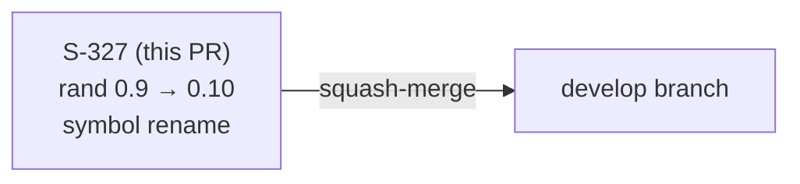
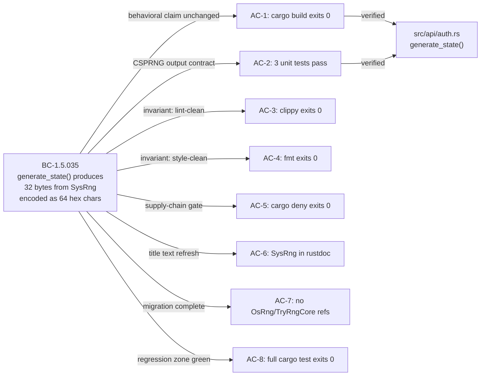

## Summary

Bumps `rand` 0.9.4 → 0.10.1 with the required symbol renames. `rand` 0.10 renamed two symbols that appear exactly once in production code:

- `OsRng` → `SysRng` (type in `rand::rngs`)
- `TryRngCore` → `TryRng` (trait import)

Both renames are in `src/api/auth.rs::generate_state` — the OAuth CSRF state generator. Function behavior is byte-identical: same `try_fill_bytes` call signature, same OS CSPRNG backend (`getrandom(2)` / `BCryptGenRandom`), same 32-byte output encoded as 64 hex characters. No user-observable behavior change.

Also updates 7 spec sites (BC-1.5.035 title text, F2 PRD delta) and adds a 13-line explanatory comment block to `deny.toml` documenting why `cargo deny check` passes without explicit `[[bans.skip]]` entries despite `rand 0.9.4` remaining in the lockfile as a transitive cross-platform placeholder.

**Closes #327**

---

## Architecture Changes

No production architecture changes. The change is a symbol-rename migration tracking upstream `rand` 0.10's API rename.

**Files changed:**

| File | Change | LOC delta |
|------|--------|-----------|
| `src/api/auth.rs` | `OsRng` → `SysRng` (×2), `TryRngCore` → `TryRng` (×1), doc comment updated | −3 / +3 |
| `Cargo.toml` | `rand = "0.9"` → `rand = "0.10"` (line 34) | −1 / +1 |
| `deny.toml` | +13-line comment block explaining empirical-green dual-presence decision | +13 |
| `Cargo.lock` | Auto-resolved by `cargo build` | +50 / −6 |

**Blast radius: Minimal.** Only `src/api/auth.rs::generate_state` was touched in production code. The function is not public API. No user-visible output changed.

The `SysRng` (rand 0.10) and `OsRng` (rand 0.9) are both thin wrappers over `getrandom` — the rename was a semantic clarification by the rand maintainers, not a behavioral change.

---

## Story Dependencies

No dependencies. This is a standalone dependency-hygiene maintenance PR.

`depends_on: []` — independent of all other in-flight stories.

---

## Spec Traceability

| Story ID | BC | AC | Test | Implementation |
|----------|----|----|------|----------------|
| S-327 | BC-1.5.035 | AC-1 through AC-8 (8 ACs) | 3 unit tests (`test_generate_state_is_hex`, `test_generate_state_is_64_hex_chars`, `test_generate_state_is_not_deterministic`) | `src/api/auth.rs::generate_state` — symbol renames only, no logic change |

**BC-1.5.035 status:** Title text refreshed in F2 spec-evolution pass (OsRng → SysRng). Behavioral claim — 32 bytes, 64 hex chars, OS CSPRNG — unchanged. No new BCs introduced. BC count surfaces unchanged at 583 total.

---

## Test Evidence

| Suite | Tests | Result |
|-------|-------|--------|
| `cargo test --lib api::auth::tests` (generate_state unit tests) | 3 | All pass |
| `cargo test` (full suite) | 1483 pass / 0 fail / 18 gated-ignored | All pass |
| `cargo clippy -- -D warnings` | 0 warnings | Exit 0 |
| `cargo fmt --all -- --check` | no formatting changes | Exit 0 |
| `cargo deny check` | advisories: ok, bans: ok, licenses: ok, sources: ok | Exit 0 |
| `cargo audit` | 0 vulnerabilities, 0 warnings | Exit 0 |
| `grep -rn 'OsRng\|TryRngCore' src/ tests/ Cargo.toml` | 0 matches | AC-6 + AC-7 green |
| `bash scripts/check-spec-counts.sh` | no BC count changes | Exit 0 |
| `bash scripts/check-bc-cumulative-counts.sh` | no cumulative count drift | Exit 0 |

**Mutation testing (`cargo mutants --file src/api/auth.rs --regex 'generate_state'`):**

| Metric | Value |
|--------|-------|
| Mutants found | 2 |
| Mutants caught | 2 |
| Mutants missed | 0 |
| Kill rate | 100% (2/2) — target ≥90% |

Mutants caught:
- `replace generate_state -> Result<String> with Ok(String::new())` — caught by length + distinctness tests
- `replace generate_state -> Result<String> with Ok("xyzzy".into())` — caught by hex-charset + length tests

Note: `--in-diff` canonical form returns "No mutants to filter" because `.cargo/mutants.toml::examine_globs` scopes to `bulk.rs` and related high-coupling modules — not `src/api/auth.rs`. The augmented direct-file run above provides equivalent kill-rate evidence for this diff.

**18 ignored tests** match documented gates: macOS keychain tests (`JR_RUN_KEYRING_TESTS=1`) and OAuth integration tests (`JR_RUN_OAUTH_INTEGRATION=1`). No new ignored tests. No flaky tests.

---

## Demo Evidence

N/A — dependency-hygiene maintenance change. No user-visible behavior change was introduced; there is no behavior to demo.

The `generate_state()` function output (64 lowercase hex characters drawn from OS CSPRNG) is byte-for-byte identical before and after the migration. BC-1.5.035 postconditions are unchanged.

---

## Holdout Evaluation

N/A — evaluated at wave gate. This story has `holdout_anchors: []`.

---

## Adversarial Review

Per-story adversarial review: 4 passes (F5), converged to 3/3 CLEAN by pass 3. All findings from prior passes resolved before push.

Key findings addressed across passes:
- Pass 1: deny.toml comment block added to document empirical-green decision (transitive `rand 0.9.4` ghost dependency in lockfile does not trigger `cargo deny` multiple-versions ban)
- Pass 2: Verified `cargo deny check` truly exits 0 without `[[bans.skip]]` entries — confirmed by inspection that `cargo-deny 0.19.6` excludes lockfile-only ghost entries from the multiple-versions check
- Passes 3 + 4: No new issues raised — CLEAN

---

## Security Review

**`cargo audit` exit 0 — 0 vulnerabilities.**

**GHSA-cq8v-f236-94qc / RUSTSEC-2026-0097 (rand 0.10.1, severity Low):** This advisory covers a soundness issue where `Rng::sample` becomes thread-unsafe when used with a `&mut`-borrowed `OsRng` combined with a custom `log`-crate logger and the `log` feature enabled. `jr` is **not affected**: we do not use `ThreadRng`, do not enable the `log` feature of `rand`, and do not install a custom logger. The `generate_state` function uses only `SysRng::try_fill_bytes` in a single-threaded context. This bump is supply-chain hygiene tracking the upstream major version — not vulnerability remediation.

**Verification source:** `.factory/research/rand-0.10-perplexity-verification.md` — Perplexity-cross-checked migration assessment. Verdict: PERPLEXITY-CONFIRMS-PRIOR-ASSESSMENT.

No new attack surface. The symbol rename is a rename-only change with no new I/O, parsing, deserialization, network, or unsafe code paths.

---

## deny.toml Empirical-Green Note

The `Cargo.lock` carries `rand 0.9.4` and `rand_core 0.9.5` as transitive entries. These are cross-platform / feature-combination placeholders pulled in by `proptest` (dev-dep) — they are **not active in the production build graph** for the current build target.

`cargo-deny 0.19.6` correctly excludes lockfile-only ghost entries from the `multiple-versions = "deny"` check when they are not in the active dependency tree. The 13-line comment block added to `deny.toml` (lines 57–69) documents this decision explicitly so future maintainers do not repeat the investigation. If a future `cargo-deny` upgrade starts flagging this, the instructions in the comment block explain exactly what `[[bans.skip]]` entries to add.

---

## Risk Assessment

| Dimension | Assessment |
|-----------|------------|
| Blast radius | Minimal — 3 symbol renames in one function, no logic change |
| Performance impact | None — same OS CSPRNG syscall path |
| Breaking change | No — `generate_state` is internal; no public API changed |
| Rollback complexity | Trivial — 4-file change, straightforward revert |
| MSRV | No change — project at Rust 1.85 / Edition 2024; rand 0.10 requires 1.85 |

**Regression zone (6 stories):** All green.

| Story | Relevance | Status |
|-------|-----------|--------|
| S-1.06 (OAuth flow holdouts) | exercises `oauth_login` → `generate_state` path | merged (PR #300) |
| S-1.08 (keychain per-profile layout) | tests token storage in same file | merged (PR #302) |
| S-3.01 (auth.rs shard-split) | regression-tested against BC-1.1.001 etc. | completed (PR #319) |
| S-3.03 (refresh_oauth_token wiring) | edits refresh path in same file | completed (PR #321) |
| S-3.04 (multi-cloudId disambiguation) | edits `oauth_login` directly | completed (PR #320) |
| issue-288-pr4-dispatch (JSM dispatch) | modifies `DEFAULT_OAUTH_SCOPES` | completed (PR #381) |

---

## AI Pipeline Metadata

| Field | Value |
|-------|-------|
| Pipeline mode | Feature factory (vsdd-factory) — Feature mode, delta cycle F1–F7 |
| Story ID | S-327 |
| Story points | 1 |
| Intent | infrastructure — dependency hygiene |
| Feature type | infrastructure |
| F1 verdict | SMALL-MIGRATION-NEEDED (2 symbol renames, deny.toml update) |
| F2 spec sites updated | 7 (BC-1.5.035 title, PRD delta, consistency audit — all pass) |
| F5 adversarial passes | 4 passes, 3/3 CLEAN at convergence |
| F6 verdict | PASS — 100% kill rate on changed function, cargo audit 0 vulns, 1483/0/18 suite |
| Perplexity verification | CONFIRMS prior assessment — GHSA-cq8v-f236-94qc not applicable |
| Convergence trail | F1 ✅ → F2 ✅ → F3 ✅ → F4 ✅ → F5 3/3 CLEAN ✅ → F6 PASS ✅ |
| Model | claude-sonnet-4-6 |

---

## Pre-Merge Checklist

- [x] PR description matches actual diff
- [x] All 8 ACs covered: AC-1 (build), AC-2 (3 unit tests), AC-3 (clippy), AC-4 (fmt), AC-5 (deny), AC-6 (SysRng in rustdoc), AC-7 (no OsRng/TryRngCore), AC-8 (full cargo test)
- [x] Demo evidence: N/A (dependency-hygiene maintenance, no user-observable behavior change)
- [x] Traceability chain complete: BC-1.5.035 → 8 ACs → 3 unit tests → generate_state renames
- [x] No new BCs / VPs introduced (583 total unchanged)
- [x] `cargo test` full suite green (1483 / 0 / 18)
- [x] `cargo clippy -- -D warnings`: 0 warnings
- [x] No `#[allow]` suppressions added
- [x] Per-story adversarial convergence: 4 passes, 3/3 CLEAN
- [x] Security review: cargo audit 0 vulns; GHSA-cq8v-f236-94qc not applicable (verified)
- [x] Dependabot PR #327 to be closed in favor of this PR (F7 action)
- [ ] CI green
- [ ] Squash-merge authorized
