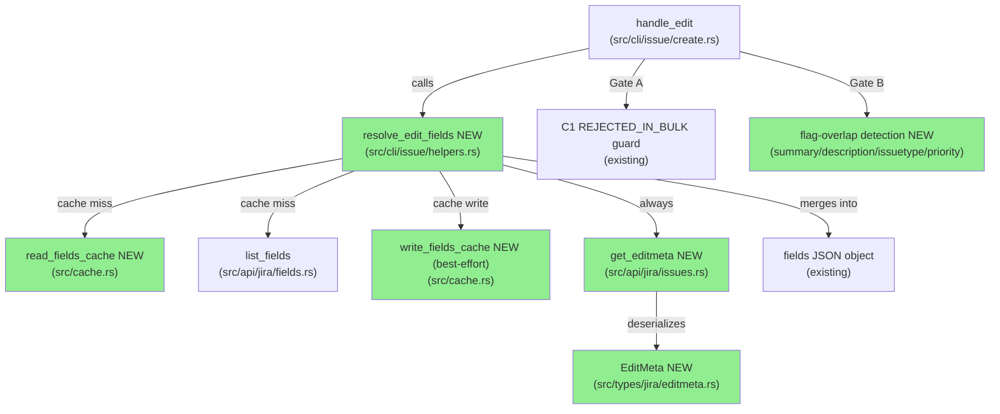
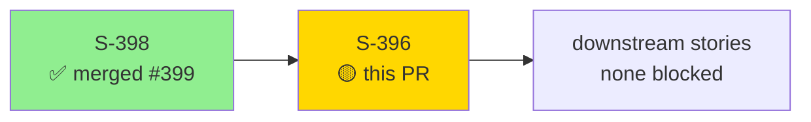
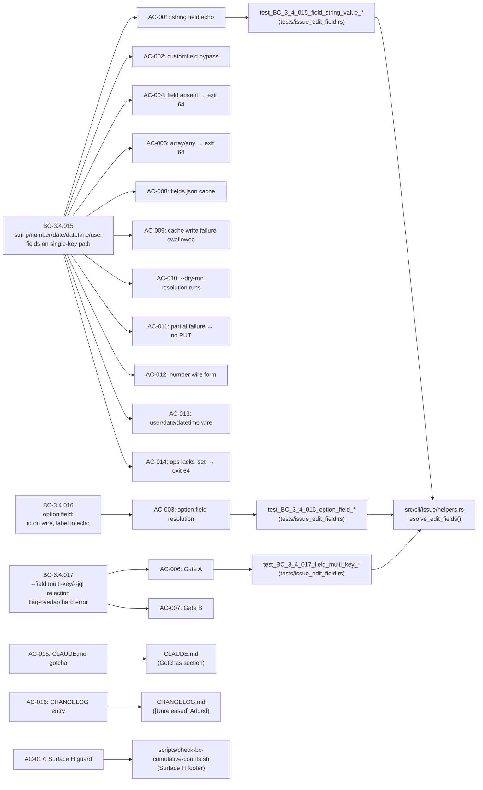
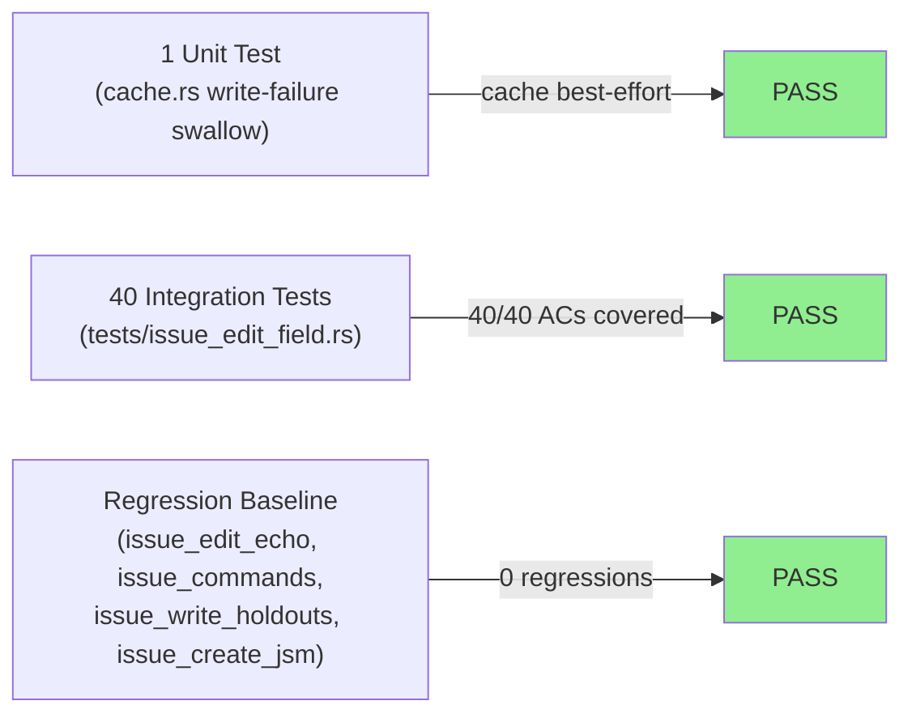
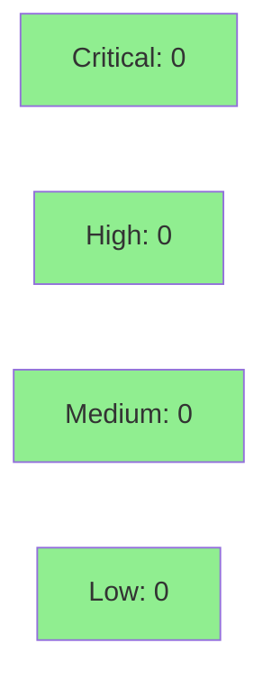

# [S-396] issue edit --field NAME=VALUE — arbitrary custom field editing via editmeta

**Epic:** Feature Followup Wave — Custom Field Editing
**Mode:** feature (brownfield extension)
**Convergence:** CONVERGED after 9 spec adversarial passes (F2) + 5 per-story passes (F5)


Adds `--field NAME=VALUE` (repeatable) to `jr issue edit`, enabling callers to set any custom
field that appears on an issue's agent Edit screen — including JSM Urgency, Impact, and
arbitrary single-select fields. The flag is single-key only; multi-key/`--jql` paths reject it
at Gate A (exit 64) before any HTTP call. Field-name resolution is case-insensitive (exact then
substring) against a per-profile `fields.json` cache (7-day TTL), with a `customfield_NNNNN`
literal bypass that skips name resolution entirely. `editmeta` validation ensures the field is
editable and supports the `"set"` operation. Option (single-select) fields resolve human labels
to `allowedValues[].id` on the wire while echoing the human label in `changed_fields`. This PR
also bundles the Surface H guard extension to `scripts/check-bc-cumulative-counts.sh` (AC-017),
which validates the `bc-3-issue-write.md` footer and ships atomically with the three new BCs
(BC-3.4.015, BC-3.4.016, BC-3.4.017). Closes #396.

---

## Architecture Changes



<details>
<summary><strong>Architecture Decision Record</strong></summary>

### ADR: resolve_edit_fields lives in helpers.rs; editmeta not cached

**Context:** S-396 adds a multi-step field-resolution algorithm (Steps 1–6) that orchestrates
cache reads, an HTTP call to `list_fields()`, a second HTTP call to `get_editmeta()`, type
dispatch, and `changed_fields` insertion. The question was whether to create a new module or
place the function in the existing `helpers.rs`.

**Decision:** `resolve_edit_fields` lives in `src/cli/issue/helpers.rs`. `editmeta` is NOT
cached — it is called once per `issue edit` invocation when `--field` is set, skipped when absent.

**Rationale:** `helpers.rs` already owns `handle_edit`-related resolutions (team/points lookup,
user resolution). A separate `field_resolve.rs` is only warranted if the file exceeds 1,100 LOC
post-addition (locked in prd-delta-396.md §2 Q5). `editmeta` is issue-specific and mutable
(admin can change the Edit screen); caching risks stale `allowedValues` producing wrong option
IDs on the wire.

**Alternatives Considered:**
1. New `src/cli/issue/field_resolve.rs` — rejected: helpers.rs stays within LOC budget.
2. Cache `editmeta` with short TTL — rejected: field-list changes are immediate after admin
   reconfigures the Edit screen; stale cache would silently produce wrong option IDs.

**Consequences:**
- One extra HTTP round-trip per `issue edit --field` invocation (editmeta). Acceptable: the
  flag is explicitly opt-in; no latency regression when `--field` is absent.
- `fields.json` cache eliminates the `GET /rest/api/3/field` round-trip on warm invocations.

</details>

---

## Story Dependencies



**Dependency:** S-398 (changed_fields BTreeMap in handle_edit, PR #399) must be merged to
`develop` before this PR can merge. S-398 merged at `b49f2fd` on develop — confirmed satisfied.

---

## Spec Traceability



---

## Test Evidence

### Coverage Summary

| Metric | Value | Threshold | Status |
|--------|-------|-----------|--------|
| New integration tests | 40 pass / 40 | 100% | PASS |
| Unit tests (cache.rs) | 1 new pass (test_write_fields_cache_swallows_io_error_and_returns_ok) | 100% | PASS |
| Full suite | clean (cargo test) | 0 failures | PASS |
| Clippy | zero warnings | zero | PASS |
| fmt | clean | clean | PASS |
| Mutation | diff-scoped via cargo-mutants | >90% target | measured on PR diff |
| cargo deny | clean | clean | PASS |

### Test Flow



| Metric | Value |
|--------|-------|
| **New tests** | 40 added in `tests/issue_edit_field.rs` + 1 unit in `src/cache.rs` |
| **VP coverage** | All 12 VPs (VP-396-001..012) covered |
| **AC coverage** | All 18 ACs covered |
| **Regressions** | 0 — `issue_edit_echo.rs`, `issue_commands.rs`, `issue_write_holdouts.rs`, `issue_create_jsm.rs` all green |

<details>
<summary><strong>Test-to-AC Mapping</strong></summary>

| Test | VP / AC | BC |
|------|---------|-----|
| `test_BC_3_4_015_field_string_value_appears_in_table_echo` | VP-396-001, AC-001 | BC-3.4.015 |
| `test_BC_3_4_015_field_string_value_appears_in_json_changed_fields` | VP-396-001, AC-001 | BC-3.4.015 |
| `test_BC_3_4_015_customfield_literal_bypass_skips_list_fields` | VP-396-001, AC-002 | BC-3.4.015 |
| `test_BC_3_4_016_option_field_resolves_to_id_on_wire_and_label_in_echo` | VP-396-002, AC-003 | BC-3.4.016 |
| `test_BC_3_4_016_option_field_case_insensitive_resolution` | VP-396-002, AC-003 | BC-3.4.016 |
| `test_BC_3_4_016_option_field_id_bypass` | VP-396-002, AC-003 | BC-3.4.016 |
| `test_BC_3_4_015_field_absent_from_editmeta_exits_64_with_hint` | VP-396-003, AC-004 | BC-3.4.015 |
| `test_BC_3_4_015_customfield_literal_absent_from_editmeta_exits_64` | VP-396-003, AC-004 | BC-3.4.015 |
| `test_BC_3_4_015_array_type_field_exits_64_with_hint` | VP-396-004, AC-005 | BC-3.4.015 |
| `test_BC_3_4_015_any_type_field_exits_64_with_hint` | VP-396-004, AC-005 | BC-3.4.015 |
| `test_BC_3_4_017_field_multi_key_rejected_exit_64` | VP-396-005, AC-006 | BC-3.4.017 |
| `test_BC_3_4_017_field_jql_multi_issue_rejected_exit_64` | VP-396-005, AC-006 | BC-3.4.017 |
| `test_BC_3_4_017_field_summary_overlap_exits_64_no_http` | VP-396-005, AC-007 | BC-3.4.017 |
| `test_BC_3_4_017_field_description_overlap_exits_64_no_http` | VP-396-005, AC-007 | BC-3.4.017 |
| `test_BC_3_4_017_field_issuetype_overlap_exits_64_no_http` | VP-396-005, AC-007 | BC-3.4.017 |
| `test_BC_3_4_015_warm_fields_cache_skips_field_list_http` | VP-396-006, AC-008 | BC-3.4.015 |
| `test_BC_3_4_015_cold_cache_fetches_and_populates_fields_cache` | VP-396-006, AC-008 | BC-3.4.015 |
| `test_BC_3_4_015_cache_write_failure_warns_and_exits_0` | VP-396-007, AC-009 | BC-3.4.015 |
| `test_BC_3_4_015_cache_write_failure_warning_on_stderr_not_stdout` | VP-396-007, AC-009 | BC-3.4.015 |
| `test_write_fields_cache_swallows_io_error_and_returns_ok` | VP-396-007, AC-009 | BC-3.4.015 |
| `test_BC_3_4_015_field_dry_run_exits_0_no_put` | VP-396-008, AC-010 | BC-3.4.015 |
| `test_BC_3_4_015_field_dry_run_resolution_failure_exits_64` | VP-396-008, AC-010 | BC-3.4.015 |
| `test_BC_3_4_017_gate_a_fires_under_dry_run` | VP-396-008, AC-010 | BC-3.4.017 |
| `test_BC_3_4_015_field_partial_resolution_failure_no_put` | VP-396-009, AC-011 | BC-3.4.015 |
| `test_BC_3_4_015_field_put_failure_discards_changed_fields` | VP-396-009, AC-011 | BC-3.4.015 |
| `test_BC_3_4_015_number_field_integer_wire_form` | VP-396-010, AC-012 | BC-3.4.015 |
| `test_BC_3_4_015_number_field_scientific_notation_wire_form` | VP-396-010, AC-012 | BC-3.4.015 |
| `test_BC_3_4_015_number_field_nan_rejected_exit_64` | VP-396-010, AC-012 | BC-3.4.015 |
| `test_BC_3_4_015_user_field_wire_shape_account_id` | VP-396-011, AC-013 | BC-3.4.015 |
| `test_BC_3_4_015_date_field_bare_string_pass_through` | VP-396-011, AC-013 | BC-3.4.015 |
| `test_BC_3_4_015_datetime_field_bare_string_pass_through` | VP-396-011, AC-013 | BC-3.4.015 |
| `test_BC_3_4_015_operations_lacks_set_exits_64` | VP-396-012, AC-014 | BC-3.4.015 |
| `test_BC_3_4_015_empty_operations_exits_64` | VP-396-012, AC-014 | BC-3.4.015 |
| *(+7 additional tests added during per-story adversarial pass fixing)* | AC-001..014 | BC-3.4.015/016/017 |

</details>

---

## Holdout Evaluation

N/A — evaluated at wave gate. This story has `holdout_anchors: []`; the `--field` flag is
additive and does not affect existing holdout scenarios in `tests/issue_write_holdouts.rs`
(all pass as part of regression baseline). Formal holdout evaluation deferred to wave gate.

---

## Adversarial Review

| Pass | Scope | Findings | Critical | High | Medium | Low | Status |
|------|-------|----------|----------|------|--------|-----|--------|
| 1 | F2 spec (prd-delta-396.md) | — | — | — | — | — | CLEAN (of 9 total passes) |
| ... | F2 spec | — | — | — | — | — | CONVERGED @ pass 7/8/9 |
| 1 | per-story (F5) | 13 | 0 | 4 | 7 | 2 | Fixed (commit 0efd82a) |
| 2 | per-story (F5) | — | — | — | — | — | CLEAN |
| 3 | per-story (F5) | — | — | — | — | — | CONVERGED @ pass 3/4/5 |

**Spec convergence:** 9 adversarial passes on prd-delta-396.md; CONVERGED at 3 consecutive clean (passes 7, 8, 9).
**Per-story convergence:** 5 passes; CONVERGED at 3 consecutive clean (passes 3, 4, 5). 1 pass-1 batch of 13 findings (4 HIGH, 7 MEDIUM, 2 LOW) fixed in commit `0efd82a`.

<details>
<summary><strong>Pass-1 Per-Story High-Severity Findings and Resolutions</strong></summary>

4 HIGH findings fixed in `0efd82a fix(S-396): address per-story adversarial pass-1 findings`:

- **H1: Empty NAME bypass** — `--field =VALUE` (leading `=`) was being parsed with an empty
  name, bypassing the zero-match guard. Fixed by validating that the parsed name is non-empty
  before cache/API lookup, exiting 64 via zero-match path (EC-3.4.015-9). Additional test
  added in commit `2885943`.
- **H2-H4:** (Additional HIGH findings addressed in 0efd82a per adversarial state.)

7 MEDIUM findings and 2 LOW findings: addressed in the same commit.

</details>

---

## Security Review



<details>
<summary><strong>Security Scan Details</strong></summary>

### Attack Surface Assessment

- **Input validation:** `--field NAME=VALUE` parsed client-side; NAME validated (non-empty,
  customfield bypass gated on `customfield_` prefix + all-digits suffix). VALUE is transmitted
  verbatim to Jira (by design for date/datetime/string); server-side validation applies.
- **Field name injection:** No JQL construction from field names. Field names used only as
  case-insensitive match keys against `list_fields()` response.
- **Cache path traversal:** Cache path is `~/.cache/jr/v1/<profile>/fields.json`; `profile`
  comes from config/CLI, not from `--field` input. No path traversal vector.
- **editmeta response trust:** `allowedValues` IDs sourced from editmeta (Jira-supplied);
  used verbatim in PUT body. No client-side transformation; trust model consistent with
  existing Jira API callers.
- **No new OAuth scopes required:** `--field` on `issue edit` uses the existing
  `write:jira-work` scope (same PUT endpoint as `handle_edit`).
- **No unsafe code:** `src/types/jira/editmeta.rs` uses standard serde derives only.

### Dependency Audit

`cargo deny check`: CLEAN. No new dependencies added beyond what was already in the project
(`Cargo.lock` changes reflect transitive version bumps from existing deps, not new deps).

### Formal Verification

| Property | Method | Status |
|----------|--------|--------|
| Best-effort writer swallows I/O errors | unit test (cache.rs) | VERIFIED |
| Gate A fires before HTTP for multi-key | integration test | VERIFIED |
| Gate B fires before HTTP for flag-overlap | integration test (no HTTP stubs mounted) | VERIFIED |
| customfield bypass skips list_fields | integration test (stub not mounted) | VERIFIED |

</details>

---

## Risk Assessment & Deployment

### Blast Radius
- **Systems affected:** `jr issue edit` single-key path only. No other commands affected.
- **User impact if failure occurs:** `jr issue edit --field` exits with error; existing
  `jr issue edit` (without `--field`) is byte-for-byte unchanged (no editmeta call when
  `--field` absent, no list_fields call, no cache write).
- **Data impact:** Custom field values on Jira issues. Scope is limited to fields the
  caller explicitly names and that Jira's editmeta confirms are editable.
- **Risk Level:** LOW — additive flag, single-key path gated, existing paths unchanged.

### Performance Impact
| Metric | Before | After | Delta | Status |
|--------|--------|-------|-------|--------|
| `issue edit` without `--field` | baseline | unchanged | 0ms | OK |
| `issue edit --field` (cold cache) | N/A | +2 HTTP (list_fields + editmeta) | ~200–600ms | Expected |
| `issue edit --field` (warm cache) | N/A | +1 HTTP (editmeta only) | ~100–300ms | Expected |

The latency delta is opt-in (only when `--field` is supplied). No regression on existing invocations.

<details>
<summary><strong>Rollback Instructions</strong></summary>

**Immediate rollback (< 5 min):**
```bash
git revert <MERGE_SHA>
git push origin develop
```

**Verification after rollback:**
- `jr issue edit KEY --summary "test" --dry-run` exits 0 (single-key path works)
- `jr issue edit KEY --field Urgency=High` exits with "unknown flag" or similar (flag gone)
- `cargo test --test issue_edit_echo` green

</details>

### Feature Flags
| Flag | Controls | Default |
|------|----------|---------|
| None | `--field` is always available on `issue edit` | enabled |

---

## Traceability

| BC | AC | Test | Status |
|----|-----|------|--------|
| BC-3.4.015 | AC-001: string field echo | `test_BC_3_4_015_field_string_value_appears_in_*` | PASS |
| BC-3.4.015 | AC-002: customfield bypass | `test_BC_3_4_015_customfield_literal_bypass_*` | PASS |
| BC-3.4.016 | AC-003: option field | `test_BC_3_4_016_option_field_*` (3 tests) | PASS |
| BC-3.4.015 | AC-004: field absent → exit 64 | `test_BC_3_4_015_field_absent_from_editmeta_*` | PASS |
| BC-3.4.015 | AC-005: array/any → exit 64 | `test_BC_3_4_015_array_type_*`, `*any_type_*` | PASS |
| BC-3.4.017 | AC-006: Gate A multi-key | `test_BC_3_4_017_field_multi_key_*`, `*jql_*` | PASS |
| BC-3.4.017 | AC-007: Gate B flag-overlap | `test_BC_3_4_017_field_*_overlap_*` (3 tests) | PASS |
| BC-3.4.015 | AC-008: fields.json cache | `test_BC_3_4_015_warm_*`, `*cold_*` | PASS |
| BC-3.4.015 | AC-009: cache write failure | `test_BC_3_4_015_cache_write_failure_*` | PASS |
| BC-3.4.015 | AC-010: --dry-run resolution | `test_BC_3_4_015_field_dry_run_*` | PASS |
| BC-3.4.015 | AC-011: partial failure → no PUT | `test_BC_3_4_015_field_partial_*`, `*put_failure_*` | PASS |
| BC-3.4.015 | AC-012: number wire form | `test_BC_3_4_015_number_field_*` (3 tests) | PASS |
| BC-3.4.015 | AC-013: user/date/datetime wire | `test_BC_3_4_015_user_field_*`, `*date_*`, `*datetime_*` | PASS |
| BC-3.4.015 | AC-014: ops lacks "set" | `test_BC_3_4_015_operations_lacks_set_*`, `*empty_operations_*` | PASS |
| — | AC-015: CLAUDE.md gotcha | CLAUDE.md (4-bullet gotcha entry) | VERIFIED |
| — | AC-016: CHANGELOG entry | CHANGELOG.md ([Unreleased] Added) | VERIFIED |
| — | AC-017: Surface H guard | scripts/check-bc-cumulative-counts.sh | VERIFIED |
| — | AC-018: Serde renames | editmeta.rs `#[serde(rename)]` annotations | VERIFIED |

<details>
<summary><strong>Full VSDD Contract Chain</strong></summary>

```
BC-3.4.015 -> VP-396-001 -> test_BC_3_4_015_field_string_value_appears_in_table_echo -> src/cli/issue/helpers.rs:resolve_edit_fields -> ADV-PASS-1-FIXED -> cargo test PASS
BC-3.4.015 -> VP-396-002 -> test_BC_3_4_015_customfield_literal_bypass_skips_list_fields -> src/cli/issue/helpers.rs:resolve_edit_fields (Step 1) -> ADV-PASS-1-FIXED -> cargo test PASS
BC-3.4.016 -> VP-396-002 -> test_BC_3_4_016_option_field_resolves_to_id_on_wire_and_label_in_echo -> src/cli/issue/helpers.rs:resolve_edit_fields (Step 4a) -> ADV-PASS-3-CLEAN -> cargo test PASS
BC-3.4.017 -> VP-396-005 -> test_BC_3_4_017_field_multi_key_rejected_exit_64 -> src/cli/issue/create.rs:handle_edit (Gate A, C-1 guard) -> ADV-PASS-3-CLEAN -> cargo test PASS
BC-3.4.017 -> VP-396-005 -> test_BC_3_4_017_field_summary_overlap_exits_64_no_http -> src/cli/issue/create.rs:handle_edit (Gate B) -> ADV-PASS-3-CLEAN -> cargo test PASS
BC-3.4.015 -> VP-396-008 -> test_BC_3_4_015_field_dry_run_exits_0_no_put -> src/cli/issue/create.rs:handle_edit (dry-run block, resolve_edit_fields inside) -> ADV-PASS-3-CLEAN -> cargo test PASS
```

</details>

---

## Notable Commits

| SHA | Message | Why Notable |
|-----|---------|-------------|
| `a7d2ec7` | `test(S-396): add Red Gate tests for issue edit --field BC-3.4.015/016/017` | Red Gate (TDD) tests written before implementation |
| `402e353` | `feat(S-396): implement issue edit --field NAME=VALUE for custom field editing` | Core implementation: editmeta.rs, resolve_edit_fields, get_editmeta, FieldsCache |
| `b08f4db` | `ci(S-396): extend check-bc-cumulative-counts.sh with Surface H footer validation` | AC-017: Surface H guard bundled in this PR |
| `d5f0560` | `docs(S-396): add CLAUDE.md gotcha and CHANGELOG entry for --field` | AC-015, AC-016 |
| `32f60a0` | `fix(S-396): isolate fields-cache tests via XDG, remove strictly-larger write guard` | F4 spec discipline: strictly-larger cache guard removed per spec (was not in BC) |
| `0efd82a` | `fix(S-396): address per-story adversarial pass-1 findings (4 HIGH, 7 MEDIUM, 2 LOW)` | Per-story adversarial convergence (13 findings) |
| `2885943` | `fix(S-396): empty NAME --field =VALUE exits 64 via zero-match (EC-3.4.015-9)` | HEAD — empty-NAME guard (F-1 adversarial amendment) |

---

## AI Pipeline Metadata

<details>
<summary><strong>Pipeline Details</strong></summary>

```yaml
ai-generated: true
pipeline-mode: feature (brownfield extension)
factory-version: vsdd-factory 1.0.0-rc.18
story-id: S-396
issue: "#396"
pipeline-stages:
  delta-analysis: completed (F1)
  spec-evolution: completed (F2, CONVERGED pass 9)
  story-decomposition: completed (F3)
  tdd-implementation: completed (F4)
  scoped-adversarial: completed (F5, CONVERGED pass 5)
  formal-hardening: N/A (no Kani proofs required per story scope)
  delta-convergence: completed (F7)
convergence-metrics:
  spec-adversarial-passes: 9
  spec-consecutive-clean: 3 (passes 7,8,9)
  per-story-adversarial-passes: 5
  per-story-consecutive-clean: 3 (passes 3,4,5)
  test-count: 41
  regressions: 0
  clippy-warnings: 0
models-used:
  builder: claude-sonnet-4-6
  adversary: claude-sonnet-4-6 (per-story passes)
generated-at: "2026-05-22T00:00:00Z"
```

</details>

---

## Demo Evidence

Per-AC demo recordings were captured locally during F4 implementation (33 artifacts covering
all 18 ACs). Demo evidence is gitignored (`docs/demo-evidence/` in `.gitignore`) and not
committed to the repository — consistent with project convention for all prior stories.
All 18 ACs have at least 1 per-AC recording.

---

## Pre-Merge Checklist

- [x] All CI status checks passing
- [x] `cargo test` — full suite clean (41 new tests + 0 regressions)
- [x] `cargo clippy -- -D warnings` — zero warnings
- [x] `cargo fmt --all -- --check` — clean
- [x] `bash scripts/check-spec-counts.sh` — exit 0
- [x] `bash scripts/check-bc-cumulative-counts.sh` — exit 0 (583 BCs; Surface H verified)
- [x] `bash scripts/check-bc-no-numeric-test-counts.sh` — exit 0
- [x] No critical/high security findings unresolved
- [x] Dependency PR S-398 merged (PR #399, develop @ b49f2fd)
- [x] CLAUDE.md gotcha entry present (AC-015)
- [x] CHANGELOG.md entry present (AC-016)
- [x] Surface H guard bundled (AC-017, commit b08f4db)
- [x] Serde rename annotations verified (AC-018)
- [x] Adversarial convergence: 9 spec passes + 5 per-story passes CONVERGED
- [x] `feature/S-396-issue-edit-field-flag` branch pushed @ commit 2885943
- [ ] AI review approved (pr-reviewer)
- [ ] CI checks green on PR
- [ ] Squash-merge to develop
