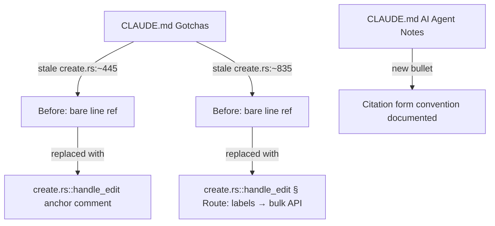
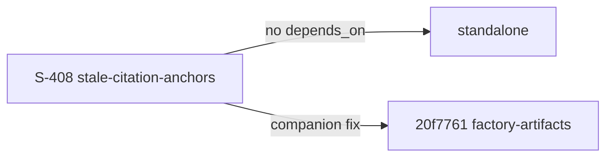
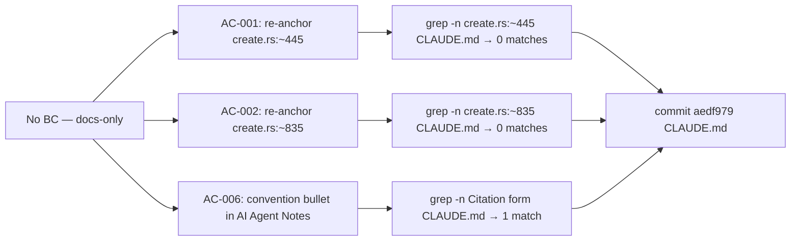

## Summary

- Targeted fix for 2 of the 5 stale line-anchor citations cataloged in #408: `CLAUDE.md` lines 334 and 336 now use symbol-form references (`create.rs::handle_edit` + section comment anchors) instead of bare `~445`/`~835` line numbers
- Companion factory-side fix (the other 3 citations in `bc-3-issue-write.md`) landed at `20f7761` on `factory-artifacts` branch — that side is already done
- New AI Agent Notes bullet adopts the symbol-form citation convention going forward: prefer `<file>::<function>` or `<file>::<function> § "<comment>"` over bare line numbers; clean up stale citations opportunistically, no mass-sweep PR required
- Out of scope: mass sweep of the remaining ~822 bare citations (explicitly deferred per user-approved strategy in #408 triage); CI guard script (deferred per issue discussion)

Refs #408

---

## Architecture Changes

No production code changed. `src/` is untouched. Documentation-only change to `CLAUDE.md`.



## Story Dependencies



## Spec Traceability



## Test Evidence

Documentation-only story — no test files added or modified.

| Check | Result |
|-------|--------|
| `grep -n "create.rs:~445" CLAUDE.md` | 0 matches |
| `grep -n "create.rs:~835" CLAUDE.md` | 0 matches |
| `grep -n "Citation form for in-codebase references" CLAUDE.md` | 1 match |
| `grep -n "::handle_edit §" CLAUDE.md` | 2 matches |
| `cargo fmt --all -- --check` | passes (no source changes) |
| `cargo test` | passes (no test surface affected) |

AC-007 convergence grep across both files (after factory-side commit `20f7761`):
```
grep -n "create.rs:~445\|create.rs:~835\|create.rs:445-489\|create.rs:1982-1997" \
  CLAUDE.md .factory/specs/prd/bc-3-issue-write.md
```
Returns ZERO matches.

## Holdout Evaluation

N/A — evaluated at wave gate

## Adversarial Review

N/A — evaluated at Phase 5

## Security Review

Documentation-only change. No production code, no API calls, no auth flows, no user input handling. No security review required.

OWASP: N/A. Blast radius: zero (CLAUDE.md is not shipped in the binary).

## Risk Assessment

| Dimension | Assessment |
|-----------|-----------|
| Blast radius | Zero — CLAUDE.md is not compiled into the binary |
| Performance impact | None |
| Rollback | Trivially revertable — text edit only |
| Severity | LOW (per S-408 story spec) |

## AI Pipeline Metadata

| Field | Value |
|-------|-------|
| Pipeline mode | feature |
| Story points | 1 SP |
| Estimated effort | xsmall |
| Module criticality | LOW |

## Pre-Merge Checklist

- [x] Branch pushed to origin
- [x] PR created with structured description
- [x] Security review — N/A (docs-only)
- [x] pr-reviewer pass complete
- [ ] CI checks passing
- [ ] Human merge (admin bypass not available; user merges)

**Post-merge action required:** Manually close issue #408 via `gh issue close 408 --comment "..."` because the issue spans 2 commits (this PR + factory-artifacts commit `20f7761`) and GitHub will not auto-close from `Refs`. The `Closes` keyword was intentionally omitted.
