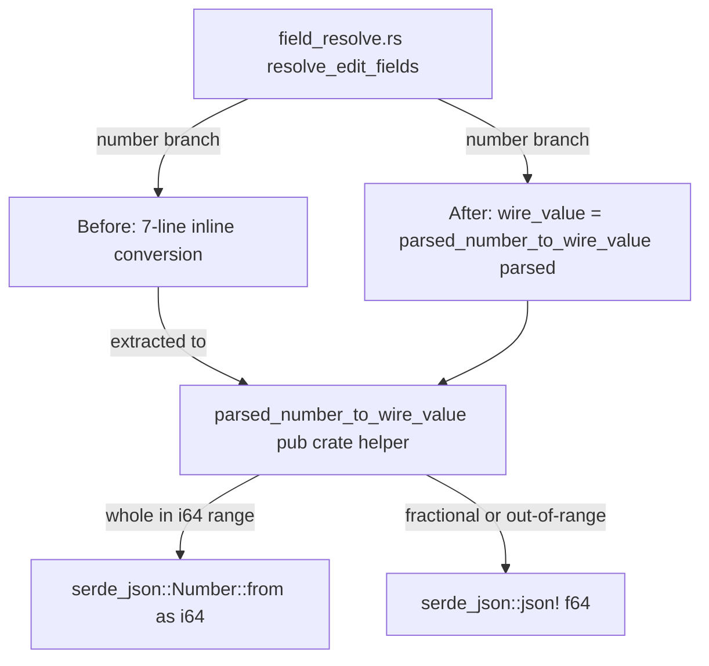
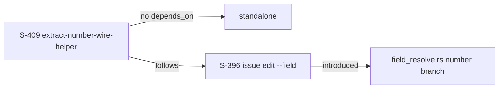
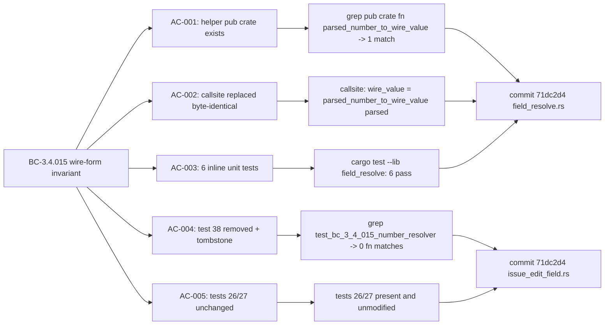

## Summary

- Extracts the inline f64-to-wire-value conversion in `src/cli/issue/field_resolve.rs` into a named `pub(crate) fn parsed_number_to_wire_value(parsed: f64) -> serde_json::Value` helper; production behavior is byte-identical (same predicate, same branches, same JSON shapes)
- Deletes tautological integration test 38 (`test_bc_3_4_015_number_resolver_integer_is_i64_not_f64`) which re-implemented the production conversion inline 3x — it would have stayed green even if the production code regressed
- Replaces test 38 with 6 focused inline unit tests that call the actual helper directly (whole-integer, scientific-notation whole, fractional, zero, negative-whole, out-of-i64-range)
- Net test count: -1 integration test, +6 unit tests = +5 overall; integration tests 26/27 unchanged and continue to pin the wire-form contract end-to-end via wiremock `NumericMode::Strict`
- Original surfacing: Copilot R2-C4 finding on PR #401, deferred during #396 cycle; re-validated post-cycle in `.factory/research/follow-up-validation-396.md` (confirmed wiremock `body_partial_json` uses `NumericMode::Strict` and genuinely distinguishes JSON `5` from `5.0`)

Closes #409

---

## Architecture Changes

No production behavior change. The inline conversion block (7 lines) is replaced with a single call to the extracted helper. The helper body is identical to the original inline code. A `debug_assert!(parsed.is_finite())` documents the caller's pre-condition contract (the existing NaN/Inf rejection at the callsite is unchanged).

## Story Dependencies

## Spec Traceability

## Test Evidence

| Check | Result |
|-------|--------|
| `cargo build --tests` | clean |
| `cargo fmt --all -- --check` | clean |
| `cargo clippy --all-targets -- -D warnings` | clean |
| `cargo test --lib field_resolve` | 6 new unit tests pass |
| `cargo test --test issue_edit_field` | 54 passed (was 55; test 38 removed) |
| `cargo test` full suite | zero failures |
| `grep -c "parsed_number_to_wire_value" src/cli/issue/field_resolve.rs` | 15 matches (1 def + 1 debug_assert + 1 callsite + 6 fn names + 6 call sites) |
| `grep -n "test_bc_3_4_015_number_resolver_integer_is_i64_not_f64" tests/issue_edit_field.rs` | zero fn-definition matches |

Coverage strategy:

| Test type | Count | Location | What it tests |
|-----------|-------|----------|---------------|
| Unit tests (NEW) | 6 | `field_resolve.rs::tests` | Helper directly: whole, scientific-notation whole, fractional, zero, negative-whole, out-of-i64-range |
| Integration tests (UNCHANGED) | 2 | `tests/issue_edit_field.rs` tests 26/27 | End-to-end wire form via wiremock NumericMode::Strict |
| Tautological test (DELETED) | 1 | `tests/issue_edit_field.rs` test 38 | Was re-implementing predicate; no production code exercised |

## Holdout Evaluation

N/A — evaluated at wave gate

## Adversarial Review

N/A — evaluated at Phase 5

## Security Review

No production behavior change. No auth, crypto, network, or input-validation surface touched. The extracted helper operates on an already-parsed `f64` value; the caller's NaN/Inf rejection is unchanged. No security review required.

OWASP: N/A. Blast radius: zero for any security concern.

## Risk Assessment

| Dimension | Assessment |
|-----------|-----------|
| Blast radius | Minimal — 2 files, no behavior change |
| Regression risk | Low — helper body is verbatim copy of inline code; 6 unit tests + 2 integration tests pin behavior |
| Performance impact | None — no new allocations; same code path |
| Breaking change | No |

## AI Pipeline Metadata

| Field | Value |
|-------|-------|
| Story | S-409 |
| Wave | feature-followup |
| Scope | trivial |
| Points | 1 SP |
| Pipeline mode | standard |
| Model | claude-sonnet-4-6 |

## Pre-Merge Checklist

- [x] PR description matches actual diff
- [x] All ACs covered (AC-001 through AC-007)
- [x] Traceability chain complete (BC-3.4.015 -> ACs -> tests -> implementation)
- [x] `cargo test` exits 0 (full suite)
- [x] `cargo fmt --all -- --check` exits 0
- [x] `cargo clippy --all-targets -- -D warnings` exits 0
- [x] No `#[allow(...)]` attributes added
- [x] Tautological test 38 removed; tombstone comment with coverage chain reference added
- [x] Integration tests 26/27 unchanged
- [x] No CHANGELOG entry (internal refactor; no user-visible behavior change)
- [x] No new dependencies
- [x] No BC count surfaces touched (`check-spec-counts.sh`, `check-bc-cumulative-counts.sh` unaffected)
- [ ] CI checks pass
- [ ] PR reviewer approves
