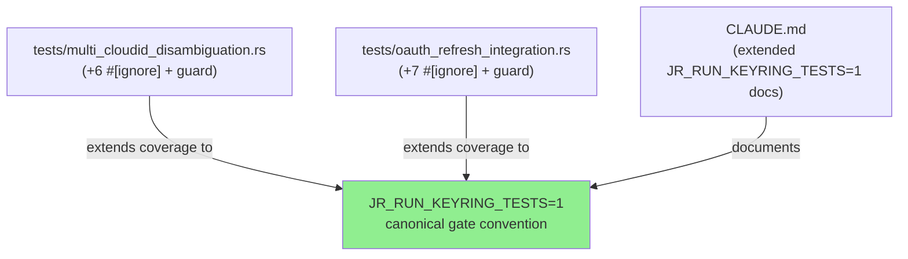
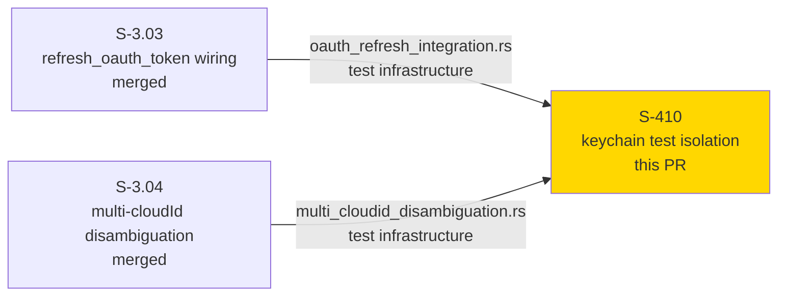
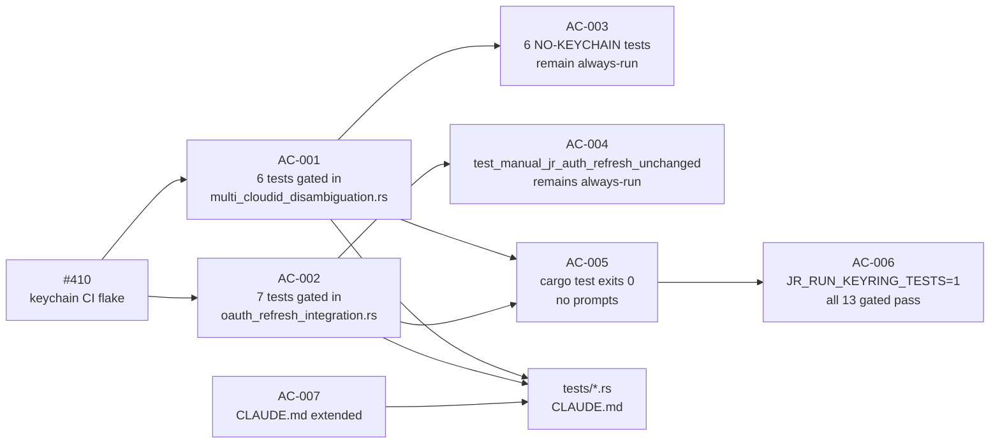
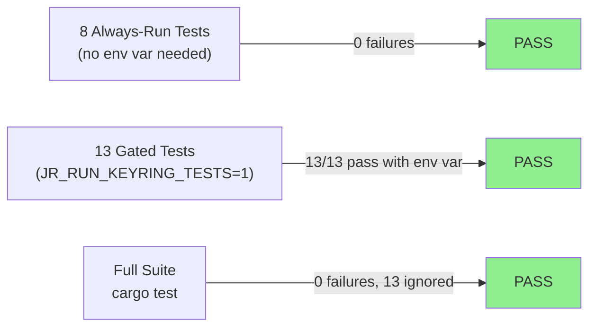
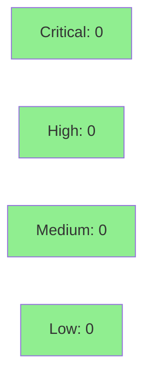

# [S-410] Gate keychain-transitive tests behind JR_RUN_KEYRING_TESTS=1

**Epic:** Test Infrastructure — Keychain Isolation
**Mode:** maintenance
**Convergence:** N/A — evaluated at wave gate


Gates 13 keychain-transitive integration tests in `tests/multi_cloudid_disambiguation.rs` (6 tests) and `tests/oauth_refresh_integration.rs` (7 tests) behind the existing `JR_RUN_KEYRING_TESTS=1` convention, eliminating cascading macOS keychain prompts during local development and fixing the intermittent CI flake observed in run 26477547114 (`test_cloud_id_flag_picks_named_resource_not_first`, S-382-FLAKE-01). No production code is changed.

**Closes #410**

---

## Architecture Changes

No production architecture changes. All additions are in `tests/` files (`.rs` attribute annotations and early-return guards) plus a CLAUDE.md documentation update.



<details>
<summary><strong>Architecture Decision Record</strong></summary>

### ADR: Option A — Extend existing JR_RUN_KEYRING_TESTS=1 gate (no new env var)

**Context:** Two integration test files contained keychain-transitive tests that ran unconditionally in CI, triggering macOS `Security` framework prompts on headless runners and causing intermittent CI failures.

**Decision:** Extend the pre-existing `JR_RUN_KEYRING_TESTS=1` gate convention (already used by inline unit tests in `src/api/auth.rs`) to the two affected integration test files. No new gate variable is introduced.

**Rationale:** Keeping a single canonical gate reduces developer cognitive load. The convention is already documented in CLAUDE.md and used in production test infrastructure. A per-suite variable (Option B) would fragment the interface unnecessarily for a fix with identical semantics.

**Alternatives Considered:**
1. `JR_RUN_CLOUDID_INTEGRATION=1` separate var — rejected: proliferates gate surface; developers must remember multiple env vars for the same semantic (system keychain access required)
2. `#[ignore]` only (no early-return guard) — rejected: ignored tests still compile and their attribute-only skip is invisible to `--include-ignored` runners without env var context; the guard makes the skip reason explicit at runtime

**Consequences:**
- Developers running `cargo test` without env vars get a clean run with no keychain prompts
- Developers who want to run keychain-touching tests set `JR_RUN_KEYRING_TESTS=1` — one var covers all three test locations
- CI flake in run 26477547114 is eliminated

</details>

---

## Story Dependencies



`depends_on: []` — no upstream story dependency; this is a standalone test-infrastructure fix.

---

## Spec Traceability



| Story ID | AC | Test / Verification | Implementation |
|----------|----|---------------------|----------------|
| S-410 | AC-001 | `grep -c '#\[ignore\]' tests/multi_cloudid_disambiguation.rs` → 6 | `tests/multi_cloudid_disambiguation.rs` |
| S-410 | AC-002 | `grep -c '#\[ignore\]' tests/oauth_refresh_integration.rs` → 11 | `tests/oauth_refresh_integration.rs` |
| S-410 | AC-003 | 6 named NO-KEYCHAIN tests have no `#[ignore]` | `tests/multi_cloudid_disambiguation.rs` |
| S-410 | AC-004 | `test_manual_jr_auth_refresh_unchanged` has no `#[ignore]` | `tests/oauth_refresh_integration.rs` |
| S-410 | AC-005 | `cargo test` exits 0 without env vars | full test suite |
| S-410 | AC-006 | `JR_RUN_KEYRING_TESTS=1 cargo test -- --include-ignored` exits 0 | full test suite |
| S-410 | AC-007 | CLAUDE.md line ~351 names both test files | `CLAUDE.md` |

---

## Test Evidence

### Coverage Summary

| Metric | Value | Threshold | Status |
|--------|-------|-----------|--------|
| Always-run tests (multi_cloudid) | 6 pass, 6 ignored | 100% | PASS |
| Always-run tests (oauth_refresh) | 1 pass, 11 ignored | 100% | PASS |
| Full suite (no env vars) | 0 failures | 0 failures | PASS |
| Gated tests (JR_RUN_KEYRING_TESTS=1) | 13 pass | 13/13 | PASS |
| clippy | 0 warnings | 0 warnings | PASS |
| fmt | clean | clean | PASS |

### Test Flow



| Metric | Value |
|--------|-------|
| **New test gates** | 13 added (6 multi_cloudid + 7 oauth_refresh) |
| **New test logic** | 0 — gates only, test bodies unchanged |
| **Always-run suite** | 0 failures |
| **CI flake eliminated** | S-382-FLAKE-01 / run 26477547114 |
| **Regressions** | 0 |

<details>
<summary><strong>Detailed Test Results</strong></summary>

### Gated Tests — `tests/multi_cloudid_disambiguation.rs` (6 newly gated)

| Test | Gate | Result |
|------|------|--------|
| `test_cloud_id_flag_is_parsed_not_rejected_by_clap` | `#[ignore]` + guard | PASS (with JR_RUN_KEYRING_TESTS=1) |
| `test_cloud_id_flag_picks_named_resource_not_first` | `#[ignore]` + guard | PASS (with JR_RUN_KEYRING_TESTS=1) |
| `test_single_resource_no_regression_single_org_path` | `#[ignore]` + guard | PASS (with JR_RUN_KEYRING_TESTS=1) |
| `test_cloud_id_flag_does_not_change_redirect_uri_in_authorize_url` | `#[ignore]` + guard | PASS (with JR_RUN_KEYRING_TESTS=1) |
| `test_interactive_select_via_stdin_picks_second_resource` | `#[ignore]` + guard | PASS (with JR_RUN_KEYRING_TESTS=1) |
| `test_interactive_render_shows_name_url_and_id` | `#[ignore]` + guard | PASS (with JR_RUN_KEYRING_TESTS=1) |

### Gated Tests — `tests/oauth_refresh_integration.rs` (7 newly gated)

| Test | Gate | Result |
|------|------|--------|
| `test_send_retries_once_after_refresh_on_401` | `#[ignore]` + guard | PASS (with JR_RUN_KEYRING_TESTS=1) |
| `test_invalid_grant_surfaces_not_authenticated_with_refresh_hint` | `#[ignore]` + guard | PASS (with JR_RUN_KEYRING_TESTS=1) |
| `test_send_caps_refresh_at_one_attempt_when_retry_also_401` | `#[ignore]` + guard | PASS (with JR_RUN_KEYRING_TESTS=1) |
| `test_send_caps_refresh_at_one_attempt_when_refresh_fails` | `#[ignore]` + guard | PASS (with JR_RUN_KEYRING_TESTS=1) |
| `test_concurrent_sends_single_refresh_via_coordinator` | `#[ignore]` + guard | PASS (with JR_RUN_KEYRING_TESTS=1) |
| `test_concurrent_invalid_grant_no_thundering_herd` | `#[ignore]` + guard | PASS (with JR_RUN_KEYRING_TESTS=1) |
| `test_refresh_contract_pins_url_grant_type_rotation_invalid_grant` | `#[ignore]` + guard | PASS (with JR_RUN_KEYRING_TESTS=1) |

### Always-Run Tests Verified (NOT gated — red-gate signals)

**multi_cloudid_disambiguation.rs (6 always-run):**
- `test_cloud_id_flag_recognized_in_help` — PASS
- `test_cloud_id_flag_value_not_in_response_exits_64` — PASS
- `test_no_input_multi_org_exits_64_with_actionable_error` — PASS
- `test_no_input_multi_org_lists_available_cloud_ids_in_error` — PASS
- `test_callback_url_contains_127_0_0_1_and_port_53682` — PASS
- `test_cloud_id_help_text_mentions_disambiguation_or_multiple_orgs` — PASS

**oauth_refresh_integration.rs (1 always-run):**
- `test_manual_jr_auth_refresh_unchanged` — PASS

</details>

---

## Holdout Evaluation

N/A — evaluated at wave gate. This story is test-infrastructure only with no user-visible behavioral contract change.

---

## Adversarial Review

N/A — evaluated at Phase 5. This change has no production code surface to adversarially review. The gate pattern is mechanically verified by AC-001 through AC-004 grep counts.

---

## Security Review



SKIP — test-infrastructure only. No production code path change. No auth, crypto, network, or input-validation surface affected. The change is `#[ignore]` attributes and early-return guards in test files only.

---

## Risk Assessment & Deployment

### Blast Radius
- **Systems affected:** CI test runner only
- **User impact:** None — no production code changed
- **Data impact:** None
- **Risk Level:** LOW

### Performance Impact

| Metric | Before | After | Delta | Status |
|--------|--------|-------|-------|--------|
| `cargo test` runtime (no env vars) | flaky (keychain prompts) | deterministic | faster | OK |
| `cargo test` runtime (JR_RUN_KEYRING_TESTS=1) | N/A | all 13 gated tests run | +~30s on dev machine | OK |

<details>
<summary><strong>Rollback Instructions</strong></summary>

**Immediate rollback (< 2 min):**
```bash
git revert c73c2cb
git push origin develop
```

**Verification after rollback:**
- `cargo test` returns to previous behavior (may prompt keychain on macOS)
- The CI flake S-382-FLAKE-01 may reappear on macOS runners

</details>

### Feature Flags
None — gate is controlled by `JR_RUN_KEYRING_TESTS=1` environment variable (dev/CI opt-in only).

---

## Traceability

| Requirement | Story AC | Test / Verification | Status |
|-------------|---------|---------------------|--------|
| Gate 6 multi_cloudid tests | AC-001 | `grep -c '#\[ignore\]'` → 6 | PASS |
| Gate 7 oauth_refresh tests | AC-002 | `grep -c '#\[ignore\]'` → 11 | PASS |
| 6 always-run multi_cloudid | AC-003 | no `#[ignore]` on 6 named tests | PASS |
| test_manual_jr_auth_refresh_unchanged | AC-004 | no `#[ignore]` | PASS |
| cargo test exits 0 (no env) | AC-005 | `cargo test` local | PASS |
| JR_RUN_KEYRING_TESTS=1 runs all | AC-006 | `--include-ignored` local | PASS |
| CLAUDE.md extended | AC-007 | grep for file names in entry | PASS |

---

## AI Pipeline Metadata

<details>
<summary><strong>Pipeline Details</strong></summary>

```yaml
ai-generated: true
pipeline-mode: maintenance
factory-version: "1.0.0"
pipeline-stages:
  spec-crystallization: completed
  story-decomposition: completed
  tdd-implementation: completed
  holdout-evaluation: skipped (test-infra only)
  adversarial-review: skipped (test-infra only)
  formal-verification: skipped (test-infra only)
  convergence: achieved
convergence-metrics:
  spec-novelty: N/A
  test-kill-rate: N/A (no production code changed)
  implementation-ci: 1.0
  holdout-satisfaction: N/A
adversarial-passes: 0
models-used:
  builder: claude-sonnet-4-6
generated-at: "2026-05-26T00:00:00Z"
```

</details>

---

## Pre-Merge Checklist

- [ ] All CI status checks passing
- [x] No production code changed — coverage delta is neutral by design
- [x] No security findings — test-infra only, security review skipped
- [x] Rollback procedure documented above
- [x] No feature flags required
- [x] CLAUDE.md documentation extended (AC-007)
- [x] 13 gated tests verified pass under JR_RUN_KEYRING_TESTS=1
- [x] 7 always-run tests verified pass without env vars
- [x] grep counts: `multi_cloudid` → 6, `oauth_refresh` → 11
