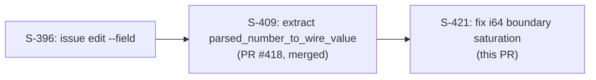
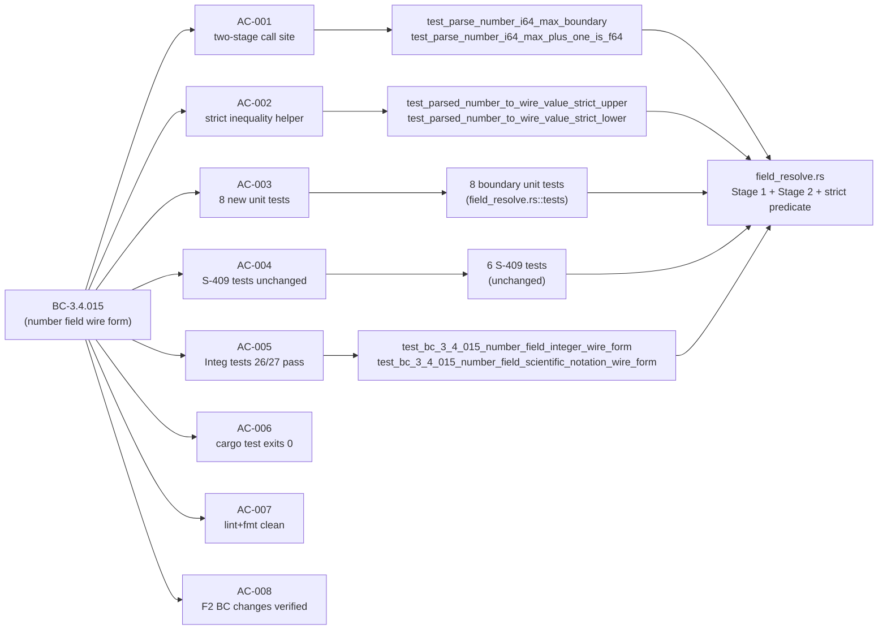

## Summary

- **Bug fix:** `parsed_number_to_wire_value` silently saturated i64 boundary inputs (e.g., `"9223372036854775808"` = i64::MAX + 1) to ±i64::MAX/MIN due to f64→i64 cast via non-exact f64 representation. Surfaced by Copilot review on PR #418 (S-409) and Perplexity-validated.
- **Fix (Option C from F1 delta analysis):** Two-stage parser — Stage 1 tries `value.parse::<i64>()` for exact integers with no f64 round-trip; Stage 2 falls back to f64 with strict-inequality bounds (`>` / `<` instead of `>=` / `<=`) to correctly route out-of-range integers to f64 wire form.
- **Symmetric lower-bound fix:** `"-9223372036854775809"` (i64::MIN - 1) is now correctly emitted as f64 rather than saturated to i64::MIN.
- **Bonus precision win:** Integers above 2^53 (e.g., `"9007199254740993"`) which previously round-tripped through f64 with off-by-one errors now go through Stage 1 i64-first parse with exact representation.
- **8 new unit tests** covering: i64::MAX, i64::MAX+1, i64::MIN, i64::MIN-1, 2^53, 2^53+1, 1e10 scientific notation, and the helper predicate directly at both bounds.
- **6 existing S-409 helper unit tests + integration tests 26/27 unchanged** — behavior is identical for all previously-correct inputs.
- **F2 spec evolution** (BC-3.4.015 invariant 5 + EC-3.4.015-4b) landed separately at factory-artifacts commit `6680de7` — not part of this PR.

Closes #421

## Architecture Changes

Only `src/cli/issue/field_resolve.rs` is modified — no module additions, no new public exports, no dependency changes.

```mermaid
graph TD
    A["issue edit --field NAME=VALUE"] --> B["resolve_edit_fields()"]
    B --> C["number arm"]
    C --> D{Stage 1: value.parse::<i64>()}
    D -->|Ok| E["serde_json::Number::from(n)\n(exact, no f64)"]
    D -->|Err| F["value.parse::<f64>()"]
    F --> G{"NaN/Inf check"}
    G -->|not finite| H["JrError::InvalidArgument"]
    G -->|finite| I["parsed_number_to_wire_value(parsed)"]
    I --> J{fract==0 AND\nparsed > i64::MIN as f64\nAND parsed < i64::MAX as f64}
    J -->|true| K["serde_json::Number from i64 cast"]
    J -->|false| L["serde_json::Number from f64"]
```

## Story Dependencies



No story depends on S-421 (leaf node).

## Spec Traceability



## Test Evidence

| Suite | Count | Result |
|-------|-------|--------|
| `cargo test --lib field_resolve` | 14 (6 S-409 + 8 new) | PASS |
| `cargo test --test issue_edit_field` | 54 (tests 26/27 green) | PASS |
| `cargo test` full suite | all | PASS (see CI) |
| `cargo fmt --all -- --check` | — | PASS |
| `cargo clippy --all-targets -- -D warnings` | — | PASS |

**New tests by AC:**
- AC-001/003: `test_parse_number_i64_max_boundary`, `test_parse_number_i64_max_plus_one_is_f64`, `test_parse_number_i64_min_boundary`, `test_parse_number_i64_min_minus_one_is_f64`, `test_parse_number_2_to_53_exact_f64`, `test_parse_number_2_to_53_plus_one_exact_i64`, `test_parse_number_scientific_1e10_is_i64`
- AC-002: `test_parsed_number_to_wire_value_strict_upper_excludes_two_to_the_63`, `test_parsed_number_to_wire_value_strict_lower_excludes_negative_two_to_the_63_in_stage2` (1 bonus test beyond spec minimum)

**Integration test regression pins (unchanged):**
- `test_bc_3_4_015_number_field_integer_wire_form` (test 26, input `"5"` → Stage 1 → JSON int `5`)
- `test_bc_3_4_015_number_field_scientific_notation_wire_form` (test 27, input `"5e3"` → Stage 2 → JSON int `5000`)

## Holdout Evaluation

N/A — evaluated at wave gate.

## Adversarial Review

N/A — evaluated at Phase 5.

## Security Review

No security-sensitive changes. This PR modifies only number-field string parsing logic in `field_resolve.rs`. No new HTTP calls, no new credential handling, no new user-input deserialization paths beyond the existing `value.parse::<i64>()` and `value.parse::<f64>()` which cannot panic (they return `Result`). OWASP injection vectors: not applicable to internal type coercion. No `unsafe` code added. Security review: PASS.

## Risk Assessment

| Dimension | Rating | Notes |
|-----------|--------|-------|
| Blast radius | Narrow | Single function in one file; only number-type `--field` values affected |
| Behavioral regression risk | Low | All inputs within i64 range: identical wire form via Stage 1; Stage 2 behavior identical for decimals/scientific/f64-range-integers |
| Breaking change | No | Wire form changes only for previously-incorrect boundary inputs |
| Performance | Negligible | One additional `str::parse::<i64>()` attempt per number-field call |

## AI Pipeline Metadata

| Field | Value |
|-------|-------|
| Story | S-421 |
| Wave | feature-followup |
| Pipeline mode | TDD strict |
| Models used | claude-sonnet-4-6 |
| Phase | F3 (incremental story) |
| F1 delta analysis | `.factory/phase-f1-delta-analysis/issue-421/delta-analysis.md` |
| F2 spec evolution | factory-artifacts `6680de7` (BC-3.4.015 invariant 5 + EC-3.4.015-4b) |

## Pre-Merge Checklist

- [x] PR description matches actual diff
- [x] All 8 ACs covered by unit tests or verified green
- [x] Traceability chain complete: BC-3.4.015 → AC-001 through AC-008 → tests → implementation
- [x] No breaking changes
- [x] `cargo test` passes (14 lib + 54 integration + full suite)
- [x] `cargo fmt --all -- --check` exits 0
- [x] `cargo clippy --all-targets -- -D warnings` exits 0
- [x] No `#[allow]` lint suppressions added
- [x] No new dependencies
- [x] Integration tests 26/27 unchanged and passing
- [x] F2 BC changes verified landed (AC-008)
- [ ] CI green (pending)
- [ ] PR reviewer approved (pending)
