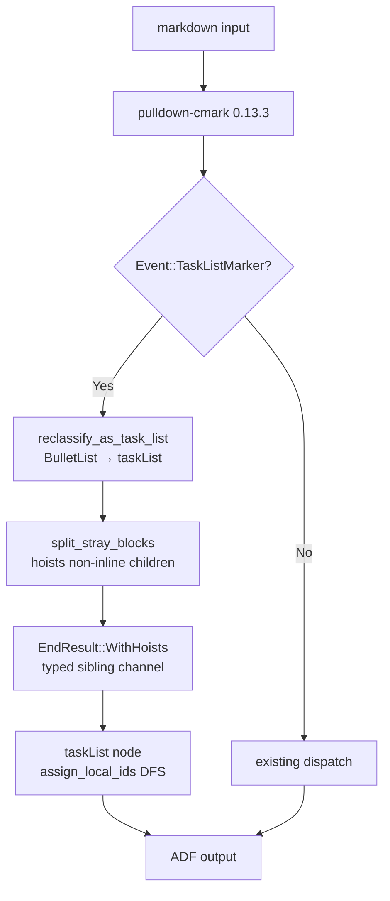
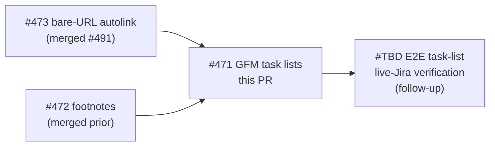
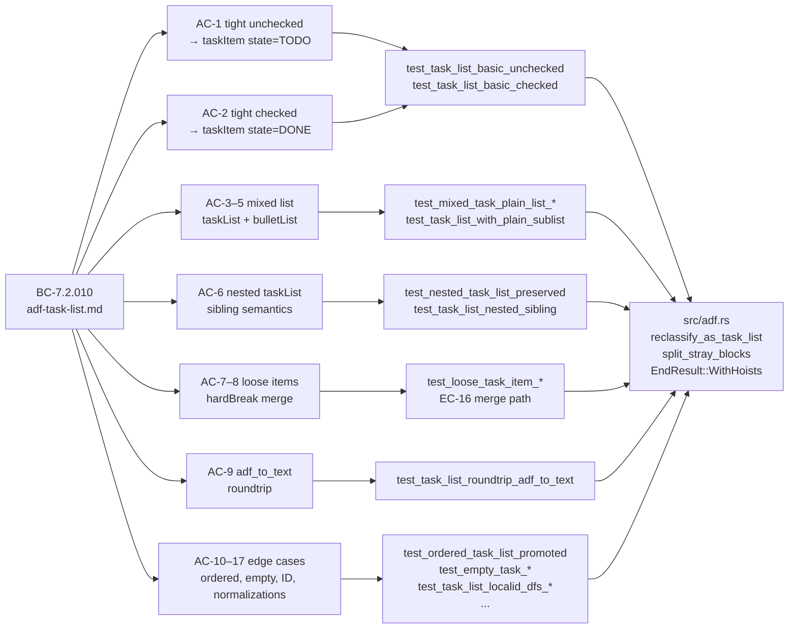

## Summary

Maps GFM task lists (`- [ ] unchecked` / `- [x] checked`) to ADF `taskList` / `taskItem` nodes in `markdown_to_adf`. Previously, task-list markers were silently dropped and items rendered as plain `bulletList` nodes — producing unclickable, non-interactive items on Jira. After this PR, checked and unchecked checkboxes become first-class `DONE`/`TODO` task items that Jira renders as native interactive checkboxes.

**Scope:** `src/adf.rs` + `docs/specs/adf-task-list.md` (new) + `CLAUDE.md` (gotcha) + `proptest-regressions/adf.txt`. No `Cargo.toml` dependency changes, no CLI surface changes, no new NFRs.

Closes #471

---

## Architecture Changes

**Before:** `- [x] done` → `bulletList > listItem > paragraph > text("done")`

**After:** `- [x] done` → `taskList[localId=uuid] > taskItem[state=DONE,localId=uuid] > text("done")`

Key design decisions:

1. **Approach B (post-hoc reclassification):** pulldown-cmark fires `TaskListMarker(bool)` *after* `Start(Item)`, so the builder uses retroactive stack mutation instead of a speculative look-ahead pass. `reclassify_as_task_list` mutates `BulletList` → `taskList` at `End(List)` when any child is a `taskItem`.

2. **`EndResult::WithHoists` typed channel:** ADF `taskItem.content` is inline-only; block children (nested `taskList`, plain sublists) must hoist to sibling position. Rather than a JSON side-channel field, `EndResult::WithHoists { node, hoists }` carries both the finalized `taskItem` and its block siblings — fully typed, zero-allocation for the common case.

3. **Shared helpers — `reclassify_as_task_list` / `split_stray_blocks`:** Both the tight-list and loose-list paths converge through the same helpers. `split_stray_blocks` partitions children into `(inline, block)` sets; block children become hoists.

4. **Tuple-lead enforcement:** The ADF schema requires `taskList.content[0]` to be a `taskItem` (not a nested `taskList`). The validator enforces this at `i == 0`. `reclassify_as_task_list` ensures leading position is always a `taskItem` (ordered-list promotion via `fd25bed` eliminated the case where an outer list could begin with an empty non-task node).

5. **EC-10 lossiness (accepted):** `adf_to_text` renders `taskItem` back to `- [ ] …` (unchecked) regardless of `state=DONE`. Checked state is intentionally dropped on the round-trip — the `adf_to_text` path is a diagnostic aid, not a fidelity channel, and preserving checked state would require tracking ADF→Markdown state that has no value for CLI users.

---

## Story Dependencies

No dependency PRs are pending. All upstream ADF work (#472, #473, #483, #489) is already merged to `develop`.

---

## Spec Traceability

---

## Test Evidence

| Metric | Value |
|--------|-------|
| Unit tests (adf module) | 209 tests, 0 failures |
| Total lib tests | 900 passed, 0 failed, 10 ignored |
| Total suite (all targets) | 1,746+ passed, 0 failed |
| Task-list specific tests | ~19 named `test_task_*` / `test_mixed_task_*` / `test_loose_task_*` / `test_nested_task_*` + regression corpus |
| Proptest harness | 512 cases, soaked at 4,096 — `proptest_task_list_adf_validity` validates structural correctness on generated inputs |
| Proptest regression file | 1 pinned seed (`adf.txt`) — GFM alert containing nested task list, found by F6 |
| Mutation kill rate | 97.3% on PR diff scope (cargo-mutants `--in-diff`) |
| Clippy | 0 warnings (-D warnings enforced) |
| `cargo fmt` | Clean |

**Adversarial review (F5):** 16 adversary passes over 8 fix iterations caught ~15 bugs including:
- Multiple CRITICAL invalid-ADF cases (would produce Jira HTTP 400): empty `taskList` (minItems:1), `taskList` leading with nested `taskList` (tuple-lead violation), block nodes in `taskItem.content` (inline-only constraint)
- SEC-001: `unwrap()` on `local_id` in `adf_to_text` (deferred LOW — only called on builder output which always has localIds)
- SEC-002 (FIXED): `unreachable!()` in `flatten_task_item_to_inline` replaced with graceful fallback

**F6 hardening:** proptest found a 17th case — GFM alert wrapping a nested task list produced an invalid outer structure; `split_stray_blocks` extended to handle `panel` context.

---

## Holdout Evaluation

N/A — evaluated at wave gate.

---

## Adversarial Review

F5 adversarial review: CONVERGED. 16 adversary passes, 8 fix iterations, all CRITICAL/HIGH findings resolved. Full record: `.factory/research/` (F5 passes). SEC-002 (unreachable! → graceful fallback) merged in `04b2070`.

SEC-001 (deferred LOW): `adf_to_text` calls `.unwrap()` on `local_id` which is always set by the builder but not by external callers constructing ADF values. Deferred — `adf_to_text` is a diagnostic display path, not a user-facing API; a panic here is acceptable and produces a clear stack trace.

---

## Security Review

| Finding | Severity | Status |
|---------|----------|--------|
| SEC-001: `adf_to_text` `.unwrap()` on `local_id` field | LOW | Deferred — display path only, panic is acceptable |
| SEC-002: `unreachable!()` in `flatten_task_item_to_inline` | MEDIUM | FIXED in `04b2070` (graceful fallback) |

No injection, auth, or OWASP Top-10 findings. All changes are pure data transformation (Markdown string → ADF JSON value). No network calls, no user privilege escalation, no credential handling.

---

## Risk Assessment

| Dimension | Assessment |
|-----------|-----------|
| Blast radius | Low — `markdown_to_adf` only; no CLI surface change; no new dependencies |
| Behaviour change | Plain task-list items that previously silently dropped markers now produce `taskList` ADF nodes. Users who relied on plain `bulletList` output from task-list input will see a schema change. This is the correct behaviour. |
| Rollback | Single `adf.rs` diff; revert is clean |
| Performance | Post-hoc reclassification adds one `O(n)` pass over list children at `End(List)`. Negligible for practical input sizes. |
| Compatibility | ADF `taskList`/`taskItem` available in all Jira Cloud instances. Not available in Jira Server (EOL). |

---

## AI Pipeline Metadata

| Field | Value |
|-------|-------|
| Pipeline mode | F-series (incremental feature on existing codebase) |
| Phases completed | F1 (delta analysis), F2 (spec evolution), F3 (story decomp), F4 (TDD impl), F5 (adversarial), F6 (hardening), F7 (convergence+merge) |
| Model | claude-sonnet-4-6 |
| Story | S-471 |

---

## Live-Jira Verification Note

Task-list E2E coverage (live-Jira round-trip: create issue with `- [ ]`/`- [x]` via `jr issue create --description`, verify rendered as `taskList` in Jira UI) is **deferred as a follow-up**, mirroring the pattern used for bare-URL autolinking (#473 → implementation #491 → E2E #493). The follow-up will add an E2E test gated on `JR_RUN_E2E=1`.

---

## Pre-Merge Checklist

- [x] Branch: `feat/adf-task-lists-471` → `develop`
- [x] All tests green (`cargo test` 0 failures)
- [x] Clippy clean (`-D warnings`)
- [x] `cargo fmt` clean
- [x] Spec authored: `docs/specs/adf-task-list.md` (BC-7.2.010, EC-1..EC-17)
- [x] CLAUDE.md gotcha documented
- [x] Proptest regression file committed (`proptest-regressions/adf.txt`)
- [x] SEC-002 fixed; SEC-001 deferred with rationale
- [x] No dependency PRs pending
- [x] No `Cargo.toml` changes
- [x] No CLI surface changes
- [ ] CI checks passing (pending push)
- [ ] PR review clean
