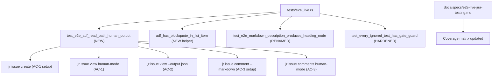
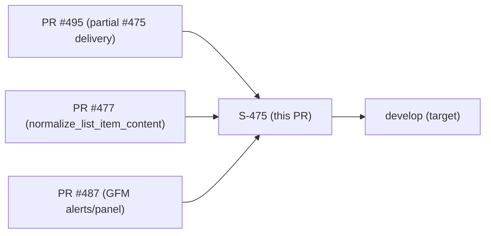
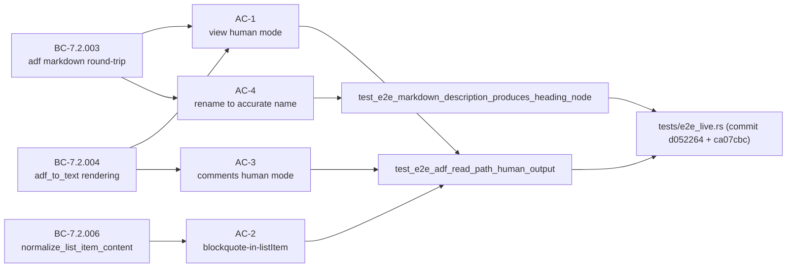

## Summary

Completes the remaining coverage gaps of issue #475 (most was delivered in PR #495). This PR
adds live E2E tests that exercise the **`adf_to_text` read path** for the first time — via
`jr issue view` and `jr issue comments` in human/table mode — and performs the first live
exercise of `normalize_list_item_content` against Jira Cloud.

**Test-only. Zero `src/` production code changes.**

### Changes

- **New gated live E2E test `test_e2e_adf_read_path_human_output`** (`tests/e2e_live.rs`):
  create → view → comment → close lifecycle covering:
  - AC-1: `adf_to_text` via `jr issue view` human mode (headings, lists, code blocks, links, blockquotes)
  - AC-2: `normalize_list_item_content` asserted live against Jira Cloud (blockquote-in-listItem stripped; no 400)
  - AC-3: `adf_to_text` via `jr issue comments` human mode (`**body**` / `*emphasis*` / `!_emphasis_` discriminator)
- **New helper `adf_has_blockquote_in_list_item`** — direct-child-only walk of ADF JSON
- **Rename** `test_e2e_issue_markdown_description_roundtrip` → `test_e2e_markdown_description_produces_heading_node`
  (old name implied full round-trip; test only verifies forward markdown→ADF) + clarifying comment
- **Hardened `test_every_ignored_test_has_gate_guard`** to recognize `async fn test_` signatures
  (defense-in-depth, caught HIGH finding F-1 in adversarial review — fixed by de-asyncing the test,
  plus hardening the guard to prevent recurrence)
- `docs/specs/e2e-live-jira-testing.md` updated with renamed test name

Completes remaining gaps of https://github.com/Zious11/jira-cli/issues/475

---

## Architecture Changes

**No `src/` files changed. Blast radius: test infrastructure only.**

---

## Story Dependencies

All predecessor PRs are merged on `develop`.

---

## Spec Traceability

**BC counts unchanged:** 594 BCs / 41 NFRs. No new BCs authored.

---

## Test Evidence

### Hermetic Suite (offline, run on worktree branch)

| Check | Result |
|-------|--------|
| `cargo test` full suite | ALL CLEAN — 0 failures |
| `cargo test --test e2e_cli_surface_guard` | 10/10 passing |
| Gate-guard meta-test (`test_every_ignored_test_has_gate_guard`) | PASS |
| Gate-disabled meta-test (`test_e2e_gate_disabled_when_env_unset`) | PASS |
| `--list` confirms new test present | `test_e2e_adf_read_path_human_output` present |
| `--list` confirms old name absent | `test_e2e_issue_markdown_description_roundtrip` absent |
| `--list` confirms renamed test present | `test_e2e_markdown_description_produces_heading_node` present |
| `cargo clippy --all-targets -- -D warnings` | CLEAN |
| `cargo fmt --all -- --check` | CLEAN |
| `cargo deny check` (advisories/bans/licenses/sources) | OK |
| `cargo build` | CLEAN |
| `check-bc-cumulative-counts.sh` | 594 BCs — unchanged |
| `check-spec-counts.sh` | 41 NFRs — unchanged |

### Live E2E

Live verification deferred to nightly `e2e.yml` (same model as test-only PRs #493 and #495).
The new test `test_e2e_adf_read_path_human_output` is gated `JR_RUN_E2E=1` + `#[ignore]`
and inert in `ci.yml`. It will execute in the nightly E2E run.

---

## Holdout Evaluation

N/A — evaluated at wave gate (test-only story; no production behavior change).

---

## Adversarial Review

**F4 per-story adversarial review: CONVERGED in 2 rounds.**

Reference: `.factory/phase-f4-delta-implementation/475-adf-e2e-readpath/adversary-convergence.md`

| Round | Findings | Blocking | Fixed | Remaining |
|-------|----------|----------|-------|-----------|
| R1 | 2 | 1 HIGH + 1 LOW | 2 | 0 |
| R2 | 0 | 0 | — | 0 → APPROVE |

**R1 HIGH finding (F-1): Async test silently escaped gate-guard meta-test**
- `test_e2e_adf_read_path_human_output` was written `async fn` with zero `.await` calls
- Gate-guard only matched `fn test_`, not `async fn test_` — false green
- Root-cause fix (commit `ca07cbc`): de-asynced to sync `fn` (correct; no `.await` needed)
- Defense-in-depth fix (same commit): guard hardened to strip leading `async ` before matching

**R1 LOW finding (F-1b): Gate-guard meta-test blind to `async fn` signatures**
- Fixed as part of the defense-in-depth hardening above

Three consecutive clean passes in Round 2 confirmed no residual findings.

**Prior adversarial phases:**
- F2 spec converged: R1 9→0 findings, R2 6→0 findings
- F3 story converged: R2 0/0/0 findings
- 5/5 external Jira API assumptions research-validated

---

## Security Review

Test-only diff. No `src/` production code changes. Security surface:
- No new network calls added (tests are gated `#[ignore]` + `JR_RUN_E2E`)
- No credentials, tokens, or real Jira keys/org IDs/URLs in test fixtures
- Fixtures use `project()`, `run_label()`, `e2e_enabled()` helpers — no hardcoded real data
- No GDPR-sensitive constructs (user mentions) in fixture markdown per spec constraint

---

## Risk Assessment

| Dimension | Assessment |
|-----------|-----------|
| Blast radius | Test infrastructure only — zero production code change |
| Performance impact | None (new tests are gated `#[ignore]`) |
| Breaking change | No |
| Rollback | Trivial (revert 2 test-file commits) |
| CI impact | Hermetic suite unaffected; new test inert in `ci.yml`; nightly `e2e.yml` gains 1 test |

---

## AI Pipeline Metadata

| Field | Value |
|-------|-------|
| Pipeline mode | Feature Mode (VSDD) |
| Story | S-475-adf-e2e-readpath |
| Phases completed | F1 (delta analysis), F2 (spec evolution), F3 (stories), F4 (TDD implementation), F5 (adversarial) |
| Branch | `test/issue-475-adf-e2e-readpath` |
| Commits | `d052264`, `ca07cbc` |
| Adversarial convergence | F4 per-story: 2 rounds to clean; F5 prior phases: 5/5 research-validated |

---

## Pre-Merge Checklist

- [x] PR description matches actual diff (test-only, 2 files changed)
- [x] All ACs covered by hermetic evidence + demo note (live deferred to nightly)
- [x] Traceability chain complete: BC-7.2.003/004/006 → AC-1/2/3/4 → test functions → commits
- [x] All adversarial review findings resolved (0 blocking remaining)
- [x] No real Jira keys/org IDs/instance URLs in fixtures
- [x] `cargo test` full suite green
- [x] `cargo clippy` clean
- [x] `cargo fmt` clean
- [x] `cargo deny` clean
- [x] BC/NFR counts unchanged (594 BCs, 41 NFRs)
- [x] Gate guard meta-test passes (including hardened async detection)
- [ ] CI green on this PR
- [ ] Human merge gate (F7)
