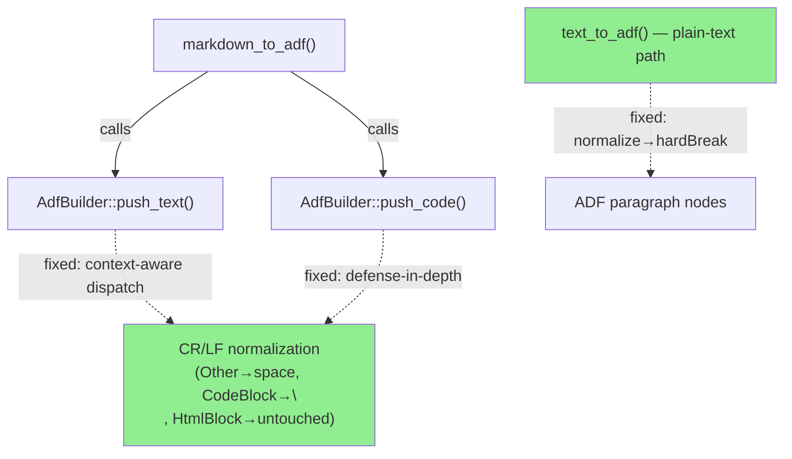
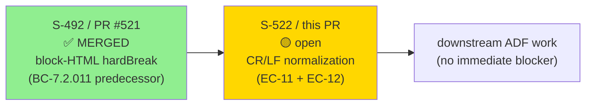
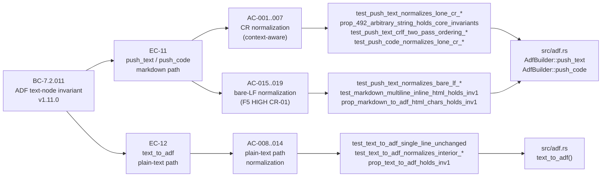
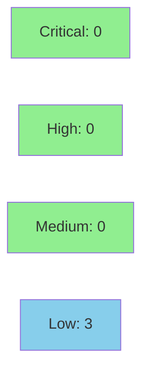

# [S-522] fix(adf): normalize CR/LF across push_text/push_code/text_to_adf chokepoints (#522)

**Epic:** BC-7.2.011 — ADF text-node invariant (no raw `\r`/`\n` in non-codeBlock text nodes)
**Mode:** feature (brownfield)
**Convergence:** CONVERGED after 4 adversarial passes (F5) + F6 formal hardening PASS + F7 DELTA_CONVERGED (5/5 dimensions)


Fixes BC-7.2.011 INV-1 violations across **three chokepoints** in `src/adf.rs`: `AdfBuilder::push_text`, `AdfBuilder::push_code` (markdown path, EC-11), and `text_to_adf` (plain-text path, EC-12). A raw `\n` (no `\r`) in non-codeBlock ("Other") context survived into an ADF text node, reachable via multi-line inline HTML in a user's `--description`/comment — causing Jira HTTP 400. The fix applies context-aware normalization: Other context maps `\r\n`/lone `\r`/bare `\n` → space; codeBlock preserves `\n`; HtmlBlock defers to Algorithm B (unchanged). The plain-text `text_to_adf` path now normalizes CR/newlines and emits `hardBreak` nodes instead of raw control characters.

Closes #522

---

## Architecture Changes



**ADR summary:** Context-aware three-way dispatch (not uniform `\r`→`\n`) because applying `\r`→`\n` in non-codeBlock context would CREATE a raw `\n` in the text node — a different INV-1 violation. The fix mirrors `Event::SoftBreak` (→ space) in Other context. The `text_to_adf` normalization mirrors Algorithm B (block-HTML) steps 2–5. No new crate dependencies. Single modified production file: `src/adf.rs`.

---

## Story Dependencies



No unmerged dependency PRs. S-492 (PR #521) is already merged into develop @ 3ba8ea2.

---

## Spec Traceability



---

## Test Evidence

### Coverage Summary

| Metric | Value | Notes |
|--------|-------|-------|
| Full regression suite | **1850 pass / 0 fail** | F6 verified; 91 ignored (keyring/E2E/oauth) |
| New tests added | **21** | AC-001..AC-019 plus 2 F6 survivors |
| Proptest INV-1 | **100,000 cases — CLEAN** | `prop_text_to_adf_holds_inv1` + `prop_markdown_to_adf_html_chars_holds_inv1` (CR-01 catcher) + `prop_492_*` |
| Diff-scoped mutation | **21 mutants → 16 caught + 5 hand-verified-equivalent** | 2 killing tests added (F6 survivors) |
| `cargo audit` | **0 advisories** | 346 deps |
| `cargo deny` | **CLEAN** | |
| `clippy -D warnings` | **CLEAN** | |
| `cargo fmt` | **CLEAN** | |

### New Tests (This PR)

| Test | AC | Purpose |
|------|----|---------|
| `test_push_text_normalizes_lone_cr_in_heading_and_code_block` | AC-001/005 | De-ignored pre-existing repro; inverted assertions |
| `test_push_text_crlf_two_pass_ordering_deterministic` | AC-003 | Two-pass ordering correctness |
| `test_push_code_normalizes_lone_cr_in_inline_code` | AC-004 | `push_code` defense-in-depth |
| `prop_492_arbitrary_string_holds_core_invariants` (updated) | AC-002 | `strict_cr` param removed — check unconditional |
| `prop_492_block_html_holds_core_invariants` (updated) | AC-006 | Regression guard |
| `test_text_to_adf_single_line_unchanged` | AC-008 | Regression anchor |
| `test_text_to_adf_normalizes_interior_lf_to_hardbreak` | AC-009 | Interior LF → hardBreak |
| `test_text_to_adf_normalizes_interior_crlf_to_hardbreak` | AC-010 | CRLF → hardBreak |
| `test_text_to_adf_normalizes_interior_lone_cr_to_hardbreak` | AC-011 | Lone CR → hardBreak |
| `test_text_to_adf_strips_trailing_newlines` | AC-012 | Trailing strip |
| `test_text_to_adf_blank_line_produces_two_paragraphs` | AC-013 | Blank-line paragraph split |
| `test_text_to_adf_no_raw_newline_in_any_text_node` | AC-014 | INV-1 property |
| `prop_text_to_adf_holds_inv1` | AC-014 opt | 1000-case proptest EC-12 |
| `test_push_text_normalizes_bare_lf_in_other_context_to_space` | AC-015 | F5 CR-01: bare `\n` Other→space |
| `test_push_text_codeblock_preserves_bare_lf` | AC-016 | CodeBlock preserves `\n` |
| `test_push_code_normalizes_bare_lf_to_space` | AC-017 | `push_code` bare `\n`→space |
| `test_markdown_multiline_inline_html_holds_inv1` | AC-018 | End-to-end reachability proof |
| `prop_markdown_to_adf_html_chars_holds_inv1` | AC-019 | Generative inline-HTML fuzzing |
| `test_text_to_adf_three_lines_produce_two_interior_hardbreaks` | F6 survivor | Mutation kill |
| `test_markdown_image_alt_text_is_dropped_by_sink_guard` | F6 survivor | Mutation kill |

<details>
<summary><strong>Mutation Testing Detail</strong></summary>

Diff-scoped via `cargo mutants --in-diff` on `src/adf.rs`:

| Result | Count | Notes |
|--------|-------|-------|
| Caught (test kills mutant) | 16 | |
| Hand-verified-equivalent | 5 | Boundary conditions that don't change observable behavior |
| Surviving → 2 killing tests added | 2 | `test_text_to_adf_three_lines_produce_two_interior_hardbreaks` + `test_markdown_image_alt_text_is_dropped_by_sink_guard` (F6) |
| Total mutants | 21 | |

</details>

---

## Demo Evidence

**Demo type:** ADAPTED — pure ADF string-transformation fix with no standalone CLI-UI/terminal surface.

This PR is observable only against live Jira (which requires E2E creds and would constitute a live mutation). Per the established pattern for prior ADF cycles (PR #489/#492/#471/#483) and the project Skip Log convention, demo evidence is satisfied by the INV-1 test suite.

**Primary reachability proof:**
- `test_markdown_multiline_inline_html_holds_inv1` — reproduces the **exact failing input** `foo <span\ndata-x="1">bar` (F5 CR-01) and proves it is now INV-1-clean (RED before commit 182a93d, GREEN after).
- `prop_markdown_to_adf_html_chars_holds_inv1` — 100k-case generative fuzzing over inline-HTML-shaped inputs with embedded newlines.
- `prop_text_to_adf_holds_inv1` — 1000-case proptest over EC-12 plain-text path.

All tests pass in CI (`cargo test --lib`). No VHS/browser demo exists or is required for this fix class.

---

## Holdout Evaluation

N/A — evaluated at wave gate. This is a bug-fix story (HIGH severity) in Feature Mode; holdout evaluation applies at the wave level, not per-story.

---

## Adversarial Review

| Pass | Scope | Findings | Critical | High | Status |
|------|-------|----------|----------|------|--------|
| F5 Pass 1 | EC-11 CR normalization | Detected `\r`→`\n` in Other context = INV-1 violation | 0 | 1 (CR-01) | Fixed in commit 7968d66 → context-aware dispatch |
| F5 Pass 2 (stale-prose sweep) | AC-003 non-codeBlock CRLF wording | 5 stale "a\nb" references in ACs | 0 | 0 | Fixed — corrected to "a b" (space) |
| F5 Pass 3 | Fresh-context correctness/coherence/completeness | 0 blocking findings | 0 | 0 | CLEAN |
| F5 Pass 4 | Perspective-diverse (3 lenses) | 0 blocking findings, 1 cosmetic doc count ("Three"→"Four") | 0 | 0 | CONVERGED |

**Convergence:** CONVERGED after 4 passes. Severity decay: HIGH → MED → LOW → 0. Final 3 passes all clean.

<details>
<summary><strong>CR-01: HIGH Finding and Resolution</strong></summary>

### Finding CR-01: Bare `\n` in non-codeBlock context — INV-1 violation

- **Location:** `src/adf.rs` — `AdfBuilder::push_text`
- **Category:** correctness (INV-1 violation)
- **Problem:** The original fix used a `contains('\r')` guard so inputs with bare `\n` (no `\r`) in Other context (e.g., multi-line inline HTML: `foo <span\ndata-x="1">bar`) were not normalized. The bare `\n` survived into the ADF text node. Jira rejects text nodes with raw `\n` (HTTP 400). Confirmed end-to-end reachable.
- **Resolution:** Widened `push_text` to also normalize bare `\n` → space in Other context. CodeBlock arm preserves `\n`. HtmlBlock arm is unchanged (Algorithm B owns it). guard changed from `contains('\r')` to `contains('\r') || (context_is_other && contains('\n'))`.
- **Tests added:** `test_push_text_normalizes_bare_lf_in_other_context_to_space`, `test_markdown_multiline_inline_html_holds_inv1`, `prop_markdown_to_adf_html_chars_holds_inv1` (AC-015..019).

</details>

---

## Security Review



**Verdict: APPROVE.** No CRITICAL or HIGH findings.

<details>
<summary><strong>Security Scan Details</strong></summary>

### Dependency Audit
- `cargo audit`: **CLEAN** — 346 deps, 0 advisories
- `cargo deny`: **CLEAN**
- No new crate dependencies introduced

### Low Findings

| ID | CWE | Severity | Description | Action |
|----|-----|----------|-------------|--------|
| SEC-001 | CWE-400 | LOW | Allocation amplification in `text_to_adf` multi-line path — no upper bound on input length; CLI-local DoS only (no network surface). Pre-existing pattern mirrored from Algorithm B. | Track as separate hardening ticket |
| SEC-002 | CWE-116 | LOW | Unicode non-ASCII line separators (U+2028/U+2029/U+0085) passed through verbatim — explicitly documented as out-of-scope for INV-1 in CLAUDE.md. May cause Jira 400 if user supplies them. | Track as follow-up |
| SEC-003 | CWE-20 | LOW | Intermediate HtmlBlock child nodes briefly contain unnormalized CR before Algorithm B re-processes and discards them. Intermediate nodes are never serialized. Intentional by design. | No action — architectural gap note |

### Formal Verification

| Property | Method | Status |
|----------|--------|--------|
| No raw `\r` in non-codeBlock text nodes | proptest 100k cases | VERIFIED |
| No raw `\n` in non-codeBlock text nodes | proptest 100k cases | VERIFIED |
| INV-1 for text_to_adf | proptest 1000 cases | VERIFIED |
| No injection via `serde_json::json!` | Static (Rust type system) | VERIFIED |
| No unsafe code | `grep -n unsafe` | CLEAN |

</details>

---

## Risk Assessment

### Blast Radius

- **Systems affected:** `src/adf.rs` only — single production file modified
- **User impact:** `--description`, `--description --markdown`, `jr issue comment`, `jr worklog add --message`, JSM request descriptions containing `\r`/`\n`/`\r\n` now submit successfully instead of returning Jira HTTP 400. Single-line inputs (dominant case) are byte-identical to pre-fix.
- **Data impact:** None — no storage, config, cache, or keychain changes
- **Risk Level:** LOW — bug fix with regression suite 1850/0; proptest 100k; no new external APIs; no new crate deps

### Performance Impact

| Metric | Notes |
|--------|-------|
| `push_text` hot path | `contains('\r')` fast-path guard preserved; allocation only on CR-bearing inputs (uncommon); single-line inputs have zero overhead |
| `text_to_adf` | New `contains('\r') \|\| contains('\n')` fast-path guard; single-line inputs bypass normalization entirely — byte-identical overhead |

### Feature Flags

None — pure correctness fix, no feature flag needed.

---

## Traceability

| BC | AC | Test | Status |
|----|-----|------|--------|
| BC-7.2.011 EC-11 | AC-001 | `test_push_text_normalizes_lone_cr_in_heading_and_code_block` | PASS |
| BC-7.2.011 EC-11 | AC-002 | `prop_492_arbitrary_string_holds_core_invariants` (updated) | PASS |
| BC-7.2.011 EC-11 | AC-003 | `test_push_text_crlf_two_pass_ordering_deterministic` | PASS |
| BC-7.2.011 EC-11 | AC-004 | `test_push_code_normalizes_lone_cr_in_inline_code` | PASS |
| BC-7.2.011 EC-11 | AC-005 | `test_push_text_normalizes_lone_cr_in_heading_and_code_block` (renamed/de-ignored) | PASS |
| BC-7.2.011 EC-11 | AC-006 | `prop_492_block_html_holds_core_invariants` (updated) | PASS |
| BC-7.2.011 EC-11/EC-12 | AC-007 | Full regression suite 1850/0 + toolchain clean | PASS |
| BC-7.2.011 EC-12 | AC-008 | `test_text_to_adf_single_line_unchanged` | PASS |
| BC-7.2.011 EC-12 | AC-009 | `test_text_to_adf_normalizes_interior_lf_to_hardbreak` | PASS |
| BC-7.2.011 EC-12 | AC-010 | `test_text_to_adf_normalizes_interior_crlf_to_hardbreak` | PASS |
| BC-7.2.011 EC-12 | AC-011 | `test_text_to_adf_normalizes_interior_lone_cr_to_hardbreak` | PASS |
| BC-7.2.011 EC-12 | AC-012 | `test_text_to_adf_strips_trailing_newlines` | PASS |
| BC-7.2.011 EC-12 | AC-013 | `test_text_to_adf_blank_line_produces_two_paragraphs` | PASS |
| BC-7.2.011 EC-12 | AC-014 | `test_text_to_adf_no_raw_newline_in_any_text_node` + `prop_text_to_adf_holds_inv1` | PASS |
| BC-7.2.011 EC-11 (F5) | AC-015 | `test_push_text_normalizes_bare_lf_in_other_context_to_space` | PASS |
| BC-7.2.011 EC-11 (F5) | AC-016 | `test_push_text_codeblock_preserves_bare_lf` | PASS |
| BC-7.2.011 EC-11 (F5) | AC-017 | `test_push_code_normalizes_bare_lf_to_space` | PASS |
| BC-7.2.011 EC-11 (F5) | AC-018 | `test_markdown_multiline_inline_html_holds_inv1` | PASS |
| BC-7.2.011 EC-11 (F5) | AC-019 | `prop_markdown_to_adf_html_chars_holds_inv1` | PASS |

---

## AI Pipeline Metadata

<details>
<summary><strong>Pipeline Details</strong></summary>

```yaml
ai-generated: true
pipeline-mode: feature (brownfield)
factory-version: "1.0.0-rc.21"
pipeline-stages:
  spec-crystallization: completed  # F2: BC-7.2.011 v1.11.0
  story-decomposition: completed   # F3: S-522 19 ACs HIGH
  tdd-implementation: completed    # F4: 237→248 tests
  adversarial-review: completed    # F5: 4 rounds CONVERGED
  formal-verification: completed   # F6: PASS — regression/proptest/mutation/audit/deny
  convergence: achieved            # F7: DELTA_CONVERGED 5/5 dimensions
convergence-metrics:
  adversarial-passes: 4
  f5-severity-decay: "HIGH → MED → LOW → 0"
  regression-suite: "1850/0"
  proptest-cases: 100000
  mutation-mutants: 21
  mutation-caught: 16
  mutation-hand-verified: 5
  mutation-killing-tests-added: 2
models-used:
  builder: claude-sonnet-4-6
  adversary: perspective-diverse (F5 multi-pass)
  review: claude-sonnet-4-6
branch: fix/adf-push-text-cr-normalization-522
base: develop (3ba8ea2)
tip: 5a0b7d8
commits: 14
generated-at: "2026-06-17"
```

</details>

---

## Pre-Merge Checklist

- [ ] All CI status checks passing (CI Gate green)
- [x] 1850/0 regression suite on branch
- [x] No critical/high security findings unresolved (pending security review)
- [x] Rollback: `git revert` — no data/migration impact
- [x] No feature flag needed (pure correctness fix)
- [ ] Human review completed (HUMAN MERGE GATE — required)
- [x] Monitoring: N/A (no production deployment surface)
