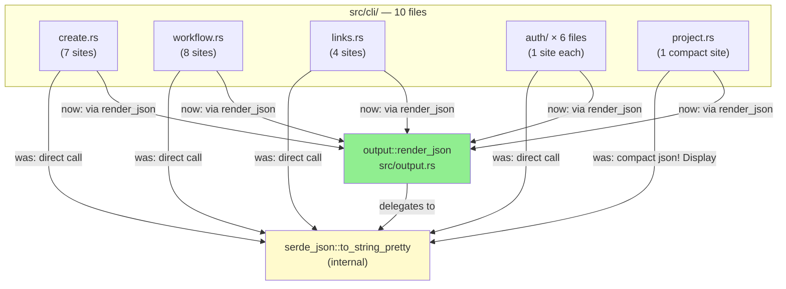
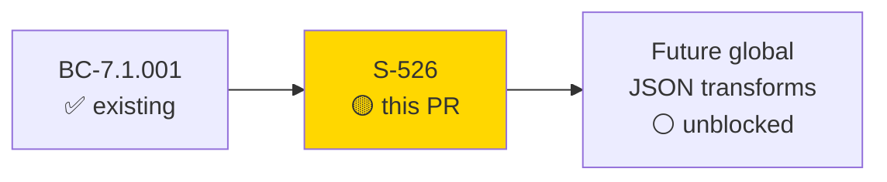
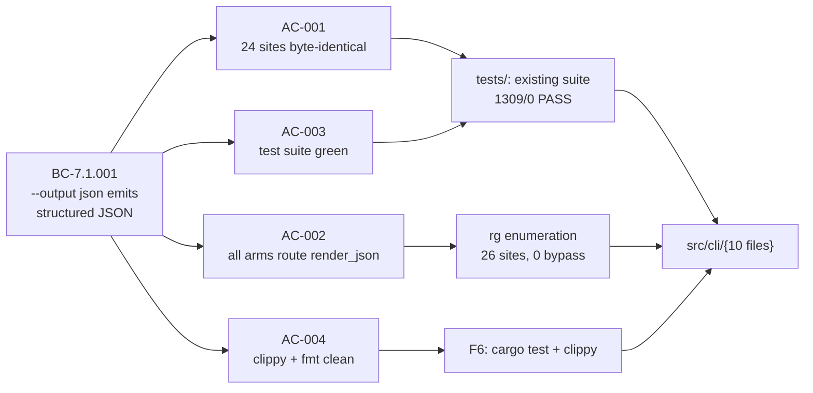

# chore(output): unify JSON render — route all `--output json` paths through `output::render_json` (S-526, CR-002)

**Story:** S-526 — Replace all direct JSON serialization call sites in `src/cli/` with `output::render_json`
**Mode:** feature (fix-pr flow, behavior-preserving refactor)
**Convergence:** CONVERGED after 3 adversarial passes (F5 round 3 clean; F7 5/5 dimensions)


This PR eliminates all `serde_json::to_string_pretty` call sites and compact `serde_json::json!` Display
call sites in `src/cli/` by routing them through `output::render_json`. This makes every
`--output json` path in the CLI go through a single choke point, so future global JSON transforms
(syntax highlighting, `_meta` envelope per NFR-O-P, etc.) require one change instead of 26.

**Migration scope:** 24 `to_string_pretty` sites (byte-identical output) + 2 compact `json!` Display sites
(intentional compact → pretty output change, disclosed below).

Closes #526.

---

> ### BEHAVIOR-CHANGE DISCLOSURE
>
> **Two commands change output format. Both are intentional and disclosed.**
>
> | Command | Before | After | Payload (unchanged) |
> |---------|--------|-------|---------------------|
> | `jr issue create --request-type <RT> --output json` | Compact single-line: `{"key":"FOO-1"}` | Pretty-printed multi-line | `{"key": "<ISSUE-KEY>"}` only |
> | `jr project fields --output json` | Compact single-line | Pretty-printed multi-line | `{project, issue_types, priorities, statuses_by_issue_type, asset_fields}` |
>
> **Consumer impact:** `jq`, `python -m json.tool`, and all standards-compliant JSON parsers handle
> both formats identically. Only byte-exact string matching on raw output is affected — outside the
> supported use-case for `--output json`. All 24 `to_string_pretty` migrations are **byte-identical**.

---

## Architecture Changes



**ADR: No new decision needed.** `output::render_json` already existed as a centralized helper at
`src/output.rs` and was already used by `src/cli/sprint.rs` (3 sites — the reference implementation).
This PR extends its use to all remaining `OutputFormat::Json` arms in `src/cli/`.

---

## Story Dependencies



No upstream PRs pending. No downstream PRs blocked.

---

## Spec Traceability



---

## Site Breakdown

### 24 `serde_json::to_string_pretty` → `output::render_json` (byte-identical)

| File | Sites | Approximate lines |
|------|-------|-------------------|
| `src/cli/issue/create.rs` | 6 | 263, 279, 758, 1100, 1262, 1486 |
| `src/cli/issue/workflow.rs` | 8 | 294, 419, 931, 1037, 1052, 1082, 1106, 1172 |
| `src/cli/issue/links.rs` | 4 | 99, 197, 216, 278 |
| `src/cli/auth/login.rs` | 1 | 334 |
| `src/cli/auth/logout.rs` | 1 | 43 |
| `src/cli/auth/switch.rs` | 1 | 44 |
| `src/cli/auth/remove.rs` | 1 | 122 |
| `src/cli/auth/list.rs` | 1 | 51 |
| `src/cli/auth/refresh.rs` | 1 | 141 |
| **Total** | **24** | |

### 2 compact `json!` Display → `output::render_json` (intentional compact → pretty)

| File | Site | Before | After |
|------|------|--------|-------|
| `src/cli/issue/create.rs` | `handle_jsm_create` (~line 2721) | `println!("{}", serde_json::json!({"key": issue_key}))` | `println!("{}", output::render_json(&serde_json::json!({"key": issue_key}))?)` |
| `src/cli/project.rs` | `handle_fields` (~lines 82-95) | `serde_json::json!({...})` Display print | `output::render_json(&serde_json::json!({...}))?` |

**AC-002 enumeration result:** Total `OutputFormat::Json` arms across `src/cli/`: **40**. Arms in the
10 modified files: **25 direct match arms** + 1 function-level call = **~26 serialization sites**.
Zero bypass sites remain. Out-of-scope files (`sprint.rs`, `worklog.rs`, `requesttype.rs`, etc.)
already used `output::render_json` or `output::print_output`.

---

## Test Evidence

### Coverage Summary

| Metric | Value | Status |
|--------|-------|--------|
| Regression suite | 1309/1309 PASS | PASS (F6) |
| Test failures | 0 | PASS |
| New tests added | 0 | Expected (AC-003) |
| Snapshot files modified | 0 | Expected (format-agnostic tests) |
| Mutation kill rate (diff-scoped) | 5/5 = 100% | PASS (F6) |
| `cargo audit` / `cargo deny check` | CLEAN | PASS (F6) |
| `cargo clippy -- -D warnings` | 0 warnings | PASS (F6) |
| `cargo fmt --all -- --check` | Clean | PASS (F6) |

### Why zero snapshot updates

The two behavior-change sites (`handle_jsm_create`, `jr project fields`) have format-agnostic tests
that call `serde_json::from_str(&stdout)` and assert structure — not byte-exact strings. All 24
`to_string_pretty` sites are byte-identical, so existing snapshot files required no updates.

---

## Adversarial Review (F5 — 3 passes)

| Pass | Findings | Blocking | Status |
|------|----------|----------|--------|
| Round 1 | 2 | 1 | Fixed before round 2 |
| Round 2 | 1 (C-1/F-2: project.rs compact site missed by single-line grep) | 1 | Fixed — added project.rs migration + strengthened AC-002 |
| Round 3 | 0 | 0 | CLEAN — CONVERGED |

**Key finding resolved (C-1/F-2):** `src/cli/project.rs` contained a compact `serde_json::json!`
Display site spanning multiple lines (`println!` + `serde_json::json!` on separate lines). The
original AC-002 used a single-line grep (`grep -rn 'println!.*serde_json::json!'`) which missed it
because the two tokens were not on the same line. Fix: (1) added `project.rs` to `files_modified`,
(2) added task T-2.5, (3) strengthened AC-002 to use enumeration-based audit — never single-line
grep negation for "all X routes through Y" ACs.

---

## Security Review

**This is a pure string-serialization refactor.** No new network calls, no new key handling,
no new capabilities, no new dependencies, no authentication changes. Security surface: **zero change**.

| Category | Status |
|----------|--------|
| New network calls | None |
| Credential handling | Unchanged |
| Input validation | Unchanged |
| Dependencies (Cargo.toml) | No changes |
| `cargo audit` | CLEAN |
| `cargo deny check` | CLEAN |

---

## Risk Assessment

### Blast Radius
- **Systems affected:** CLI JSON output for 10 handler files
- **User impact:** Two commands change output format (compact → pretty; disclosed above)
- **Data impact:** Zero — payload fields are unchanged
- **Risk Level:** LOW — pure serialization path refactor; `jq`/parsers unaffected

### Performance Impact
No performance impact. `output::render_json` delegates to `serde_json::to_string_pretty` — identical
serialization path. The compact `json!` Display sites are now pretty-printed (slightly larger output
for those two commands only — one or two additional newlines for small payloads like `{"key":"FOO-1"}`).

### Feature Flags
None. This is a unconditional refactor.

---

## Traceability

| Requirement | AC | Verification | Status |
|-------------|-----|-------------|--------|
| BC-7.1.001 (--output json emits structured JSON) | AC-001 | 0 snapshot changes, test suite green | PASS |
| BC-7.1.001 (centralized render path) | AC-002 | Enumeration audit: 26 sites, 0 bypass | PASS |
| BC-7.1.001 (existing behavior preserved) | AC-003 | 1309/0 regression | PASS |
| Clippy / fmt invariant | AC-004 | F6 clean build | PASS |

---

## AI Pipeline Metadata

<details>
<summary><strong>Pipeline Details</strong></summary>

```yaml
ai-generated: true
pipeline-mode: feature (fix-pr flow)
factory-version: 1.0.0-rc.21
pipeline-stages:
  spec-crystallization: completed (S-526 story spec)
  tdd-implementation: completed (4 commits)
  adversarial-review: completed (F5 — 3 passes, converged)
  formal-hardening: completed (F6 — regression + mutation + audit)
  convergence: achieved (F7 — 5/5 dimensions CONVERGED)
convergence-metrics:
  spec-novelty: "N/A — refactor, existing BC governs"
  test-kill-rate: "100% diff-scoped (5/5)"
  implementation-ci: converged
  adversarial-passes: 3
stubs-red-gate: "skipped (fix-pr flow: behavior-preserving refactor)"
wave-gate: "skipped (fix-pr flow: individual merge)"
models-used:
  builder: claude-sonnet-4-6
  adversary: (F5 adversarial review)
  convergence: (F7 consistency-validator)
```

</details>

---

## Pre-Merge Checklist

- [ ] All CI status checks passing (CI Gate job)
- [x] 1309/1309 tests passing locally (F6 evidence)
- [x] `cargo clippy -- -D warnings` clean (F6)
- [x] `cargo fmt --all -- --check` clean (F6)
- [x] `cargo audit` clean (F6)
- [x] `cargo deny check` clean (F6)
- [x] Mutation kill rate 5/5 diff-scoped (F6)
- [x] F5 adversarial converged (round 3 clean)
- [x] F7 convergence 5/5 dimensions CONVERGED
- [x] Behavior-change disclosure documented (2 commands)
- [x] Byte-identical guarantee verified for 24 migrations
- [x] No new dependencies introduced
- [x] CLAUDE.md updated with JSON render invariant note (DOC-3, included in this PR)
- [ ] Human merge authorization (awaiting)

**Post-merge (not PR blockers):**
- [ ] Update `.factory/stories/STORY-INDEX.md`: add S-526 row, increment `total_stories: 77 → 78` (DOC-1)
