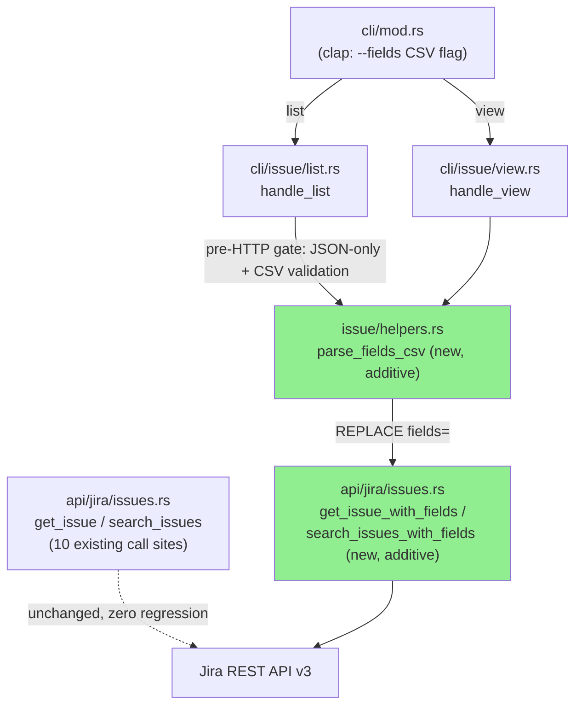
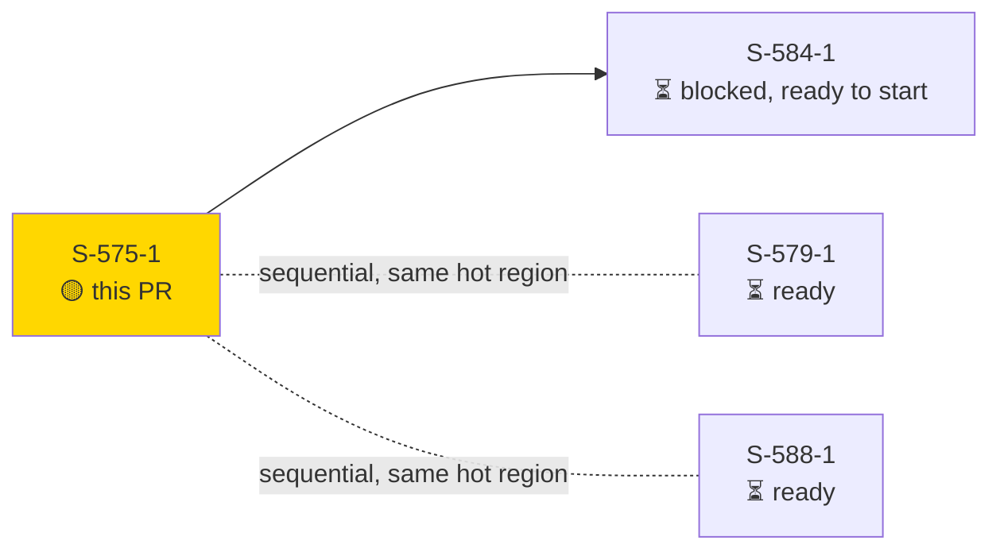
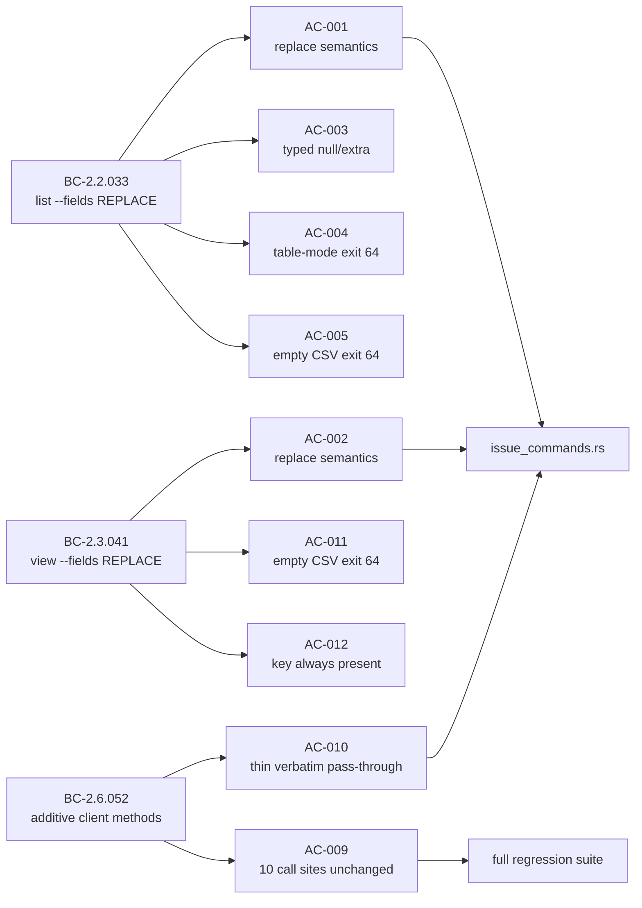

# [S-575-1] `--fields <CSV>` on `jr issue list` / `jr issue view`

**Epic:** none (feature-followup bundle `list-read-ergonomics`, closes #575 part 1 of 4)
**Mode:** feature
**Convergence:** CONVERGED after 8 adversarial passes (3 consecutive clean passes to close)

Adds `--fields <CSV>` to `jr issue list` and `jr issue view` so a caller can request
exactly the Jira `fields=` set they need instead of the CLI's fixed default field list —
cutting wire payload size and removing the need for workaround `jr api` calls when only a
few fields are wanted. The requested CSV **REPLACES** (never unions with) the default
field set, including the config-driven extras normally injected by `--points`/`--assets`/
team lookups. Output shape is unchanged: results still serialize through the existing
typed `Issue`/`IssueFields` struct via `render_json` — named fields not covered by the
request come back as JSON `null`, unnamed/custom fields (e.g. `comment`) flow through
`IssueFields.extra` verbatim.

`--fields` is JSON-only: combined with table-mode output (default, or explicit
`--output table`) it exits 64 pre-HTTP. CSV validation (trim + reject empty segments)
also happens pre-HTTP, so a malformed value never reaches Jira.

---

## Architecture Changes



No existing signatures changed — `get_issue`/`search_issues` and their 10 call sites
(`edit.rs` x2, `links.rs`, `create.rs`, `assets.rs`, `workflow.rs` x3, `board.rs`,
`queue.rs`) are untouched (BC-2.6.052 Precondition 1). The new field-override methods
are additive siblings; the pre-HTTP CSV validation and output-format gate are new pure
functions in the CLI layer, not the client layer (BC-2.6.052 EC-1: an empty field slice
is not a client-layer error — the CLI gate is the sole enforcement point).

<details>
<summary><strong>Architecture Decision Record</strong></summary>

### ADR: REPLACE (not UNION) semantics for `--fields`, additive client methods

**Context:** `jr issue list`/`jr issue view` always requested a fixed `BASE_ISSUE_FIELDS`
set plus config-driven extras (`--points`'s custom field id, `--assets`'s CMDB field ids,
team field id). Users who only need 2-3 fields from a large result set had no way to
shrink the `fields=` request short of a raw `jr api` call, and the default set doesn't
scale down.

**Decision:** `--fields <CSV>` fully REPLACES the requested field set (human-locked
DEC-298) rather than unioning with the default — this is the behavior a user asking for
"only these fields" expects, and unioning would silently defeat the wire-cost reduction
that's the whole point of the flag. New client methods (`get_issue_with_fields`,
`search_issues_with_fields`) are added as additive siblings to `get_issue`/`search_issues`
rather than adding an `Option<Vec<String>>` parameter to the existing methods, to
guarantee zero behavior change at the 10 existing call sites (BC-2.6.052).

**Rationale:** REPLACE semantics match user intent for a scoping flag and avoid a
confusing "my requested fields plus some fields I didn't ask for" result. Additive
methods avoid touching 10 call sites across 8 files for a feature only 2 of them need.

**Alternatives Considered:**
1. UNION semantics (append `--fields` CSV to `BASE_ISSUE_FIELDS`) — rejected: defeats
   the wire-cost-reduction purpose of the flag and produces a request set the user did
   not ask for.
2. Add an `Option<&[String]>` parameter to the existing `get_issue`/`search_issues`
   signatures — rejected: would require touching all 10 existing call sites and risks a
   default-value regression at each one; an additive sibling method is strictly safer.

**Consequences:**
- `--points`/`--assets`/`--duedate` become silent no-ops when combined with `--fields`
  (Postcondition 4) — documented behavior, not a bug, covered by AC-006.
- `--fields` is JSON-only (table rendering has fixed columns tied to the default field
  set) — enforced pre-HTTP via exit 64, not a runtime table-formatting failure.

</details>

---

## Story Dependencies



`S-575-1` has no dependencies and is Wave 1, position 1 of 3 in the `list-read-ergonomics`
bundle. `S-584-1` (raw ADF preservation for `--fields comment`) is blocked on this PR
merging — it needs `--fields` to exist and its REPLACE-not-UNION semantics settled.
`S-579-1`/`S-588-1` share the same `list.rs`/`cli/mod.rs` hot region and are sequenced
after this one to avoid merge conflicts, not a functional dependency.

---

## Spec Traceability



| BC ID | Title |
|-------|-------|
| BC-2.2.033 | `issue list --fields <CSV>` replaces the requested `fields=` set; requires `--output json` (exit 64 otherwise); pre-HTTP CSV validation |
| BC-2.3.041 | `issue view --fields <CSV>` — same semantics as BC-2.2.033, via a new `get_issue`-family client method |
| BC-2.6.052 | `JiraClient` gains field-override client methods (additive; existing `get_issue`/`search_issues` signatures and their 10 other call sites unchanged) |

Full spec: `.factory/stories/S-575-1-fields-csv-list-view.md`; BC bodies in
`.factory/specs/prd/bc-2-issue-read.md` §2.2/§2.3/§2.6.

---

## Acceptance Criteria (12/12)

| AC | Summary | Test |
|----|---------|------|
| AC-001 | list: `--fields` replaces requested field set (no union) | `test_bc_2_2_033_issue_list_fields_replaces_requested_field_set` |
| AC-002 | view: `--fields` replaces requested field set | `test_bc_2_3_041_issue_view_fields_replaces_requested_field_set` |
| AC-003 | typed output: unrequested named fields → `null`, unnamed → `extra` | `test_bc_2_2_033_issue_list_fields_unrequested_named_fields_are_null` |
| AC-004 | table mode + `--fields` → exit 64, zero HTTP calls | `issue_list_fields_table_mode_exits_64`, `issue_view_fields_table_mode_exits_64` |
| AC-005 | empty/malformed CSV → exit 64 pre-HTTP | `issue_list_fields_empty_csv_exits_64_pre_http` |
| AC-006 | `--points`/`--assets`/`--duedate` become silent no-ops with `--fields` | `issue_list_fields_points_flag_becomes_silent_noop` |
| AC-007 | `key` always present regardless of CSV contents | `test_bc_2_2_033_issue_list_fields_key_always_present_regardless_of_csv` |
| AC-008 | CSV segments are whitespace-trimmed | `test_bc_2_2_033_issue_list_fields_csv_segments_are_trimmed` |
| AC-009 | 10 existing `get_issue`/`search_issues` call sites unaffected | full regression suite (no dedicated test — verified via `cargo test`) |
| AC-010 | new client methods are a thin, verbatim pass-through | `test_bc_2_6_052_field_override_methods_send_verbatim_field_list`, `test_bc_2_6_052_field_override_methods_empty_slice_is_not_a_client_error` |
| AC-011 | view: empty CSV → exit 64 pre-HTTP | `issue_view_fields_empty_csv_exits_64_pre_http` |
| AC-012 | view: `key` always present regardless of CSV | `test_bc_2_3_041_issue_view_fields_key_always_present` |

All 12 ACs pass. 8 of 12 additionally have a recorded VHS demo (see Demo Evidence below);
the remaining 4 (AC-006, AC-008, AC-009, AC-010) assert request-body wire shape or
byte-identical output that isn't independently visible in a JSON diff, so they're
test-only per the S-608-1 precedent for non-visually-distinct ACs.

---

## Test Evidence

| Metric | Value |
|--------|-------|
| New/changed test functions | 16 (`tests/issue_commands.rs`, `tests/all_flag_behavior.rs`, `tests/issue_list_errors.rs`, `tests/issue_view_errors.rs`, `tests/cli_smoke.rs`) |
| Full suite (`cargo test`) | ran clean on this worktree at HEAD `69a76cdf` prior to PR open |
| `cargo clippy --all-targets -- -D warnings` | clean |
| `cargo fmt --all -- --check` | clean |
| Regressions | none — AC-009's 10 existing `get_issue`/`search_issues` call sites (`edit.rs` x2, `links.rs`, `create.rs`, `assets.rs`, `workflow.rs` x3, `board.rs`, `queue.rs`) compile and behave identically |

Diff shape: ~232 src lines (`src/api/jira/issues.rs`, `src/cli/mod.rs`, `src/cli/issue/list.rs`,
`src/cli/issue/view.rs`, `src/cli/issue/helpers.rs`, `src/cli/issue/format.rs`,
`src/types/jira/issue.rs`) + ~950 test lines. Single story, no split warranted.

### Test Development History (TDD + Red Gate)

1. `c0977939` — compilable Red-Gate stub skeleton
2. `ef00e0f9` — failing tests for `--fields` Red Gate
3. `c5717c05` — REPLACE-semantics implementation (Green)
4. `41d39630` — rustfmt fix for CI gate
5. `05a49c01` — **fix (F1):** percent-encode field names in `issue view`'s GET `fields`
   query parameter
6. `66f4955e` — **fix (F2):** exact-array (not substring) assertions for `--fields`
   REPLACE guards, closing a test-matcher gap that could mask a partial-union regression
7. `1cc53217` — doc-drift fix: stale Red-Gate stub note removed from
   `search_issues_with_fields`
8. `2981294c` — **functional fix:** `IssueFields.summary` changed to `Option<String>` —
   omitting `summary` from `--fields` previously caused a hard deserialization failure
   instead of correctly serializing `summary: null` (found in Adversary Pass 5)
9. `69a76cdf` — doc-drift fix: corrected `handle_view` file reference in an
   `issue_view_errors` doc comment

---

## Demo Evidence

`.factory/demos/S-575-1/` (5 VHS `.tape` scripts, 5 `.gif`, 5 `.webm`; committed to the
`factory-artifacts` branch at `39351c7d`, not the product repo — per the S-608-1
precedent for demo-evidence placement):

| Recording | ACs covered |
|---|---|
| `AC-001-007-list-fields-replace-key-present` | AC-001, AC-007 |
| `AC-002-003-012-view-fields-replace-null-placeholders` | AC-002, AC-003 (partial), AC-012 |
| `AC-003-omitted-summary-null-EC7-fix` | AC-003 (EC-2.2.033-7 regression the `2981294c` fix addresses) |
| `AC-004-table-mode-rejection-list-and-view` | AC-004 |
| `AC-005-011-empty-malformed-csv-rejection` | AC-005, AC-011 |

All recordings run the real `jr` binary built from this worktree against a local,
loopback-only, stateless dummy HTTP server (`mock_jira.py`, not committed) that parses
the actual outgoing `fields`/`fields=` request and returns only the requested keys
populated — so each recording demonstrates real, request-driven REPLACE/null behavior,
not a canned response. No live Jira was contacted; no real Jira keys, org IDs, instance
URLs, or credentials appear anywhere in the recordings or their source files. Full
report: `evidence-report.md` in the same directory.

---

## Adversarial Review (Step 4.5)

**Convergence:** 8 total passes, 3 consecutive clean passes to close. All findings fixed.

| Finding | Severity | Category | Resolution |
|---------|----------|----------|------------|
| F1 — unencoded field names in `issue view` GET `fields` query param | MED | correctness/encoding | `05a49c01` — percent-encode field names |
| F2 — substring (not exact-array) assertions on REPLACE guards | MED | test-quality | `66f4955e` — exact-array assertions, closing a gap that could mask a partial-union regression |
| Doc drift — stale Red-Gate stub note | LOW | doc-fidelity | `1cc53217` |
| Doc drift — wrong file reference in doc comment | LOW | doc-fidelity | `69a76cdf` |
| `IssueFields.summary` hard-errors on omission instead of serializing `null` | Functional | correctness | `2981294c` — `summary` changed to `Option<String>` |

No outstanding findings at convergence.

---

## Security Review

**Verdict: APPROVE** (via `security-reviewer` sub-agent against this PR's diff)

| Finding | Severity | CWE | Status |
|---------|----------|-----|--------|
| Query-string parameter injection via unescaped `--fields` value on the `issue view` GET path (`fields.join(",")` with no encoding — `&`/`#` could inject/truncate query params) | MEDIUM (historical, as introduced by `c5717c05`) | CWE-88 (Argument Injection) / CWE-116 (Improper Encoding of Output) | **Fixed** in `05a49c01` — every field segment is now percent-encoded via `urlencoding::encode` before joining; regression-pinned by `test_get_issue_with_fields_url_encodes_special_characters_in_field_names`, which asserts the raw wire query string, not just a decoded matcher |

No unresolved CRITICAL/HIGH/MEDIUM findings at PR-open time. Other areas checked with no
findings: the POST path (`search_issues_with_fields`) was never vulnerable — fields are
JSON-body-serialized via `serde`, which always emits RFC 8259-compliant escaping, no
manual string concatenation; the `--output json` gate and pre-HTTP CSV validation are
both enforced before any HTTP call (`.expect(0)` wiremock assertions prove zero network
calls on the rejected paths); no path traversal, JQL injection, or DoS surface introduced;
no new dependencies (`urlencoding` was already a dependency, reused not added); no
auth/token code touched.

---

## Risk Assessment

### Blast Radius
- **Systems affected:** `jr issue list` / `jr issue view` CLI paths and `JiraClient`
  (`src/api/jira/issues.rs`) — additive-only client surface.
- **User impact if this PR has a defect:** limited to callers who opt into `--fields`;
  the flag is absent by default and the 10 pre-existing `get_issue`/`search_issues` call
  sites are untouched (BC-2.6.052 Precondition 1).
- **Data impact:** read-only — `issue list`/`issue view` never mutate Jira state.
- **Risk Level:** LOW.

### Rollback
Standard `git revert` on `develop`; no feature flag, no migration, no schema change.

---

## Pre-Merge Checklist

- [ ] All CI status checks passing (`CI Gate` + all required legs)
- [x] Full local test suite green pre-PR
- [x] `cargo clippy --all-targets -- -D warnings` clean
- [x] `cargo fmt --all -- --check` clean
- [ ] No critical/high security findings unresolved (pending Step 4 security review)
- [x] Demo evidence recorded for all visually-distinct ACs (8/12; remaining 4 test-only per precedent)
- [x] `pr-reviewer` convergence (pending review cycle)
- [ ] Dependency PRs merged first — N/A, no `depends_on` for S-575-1
- [x] Human merge authorization required (DEC-128) — this PR stops before merge

---

## AI Pipeline Metadata

```yaml
ai-generated: true
pipeline-mode: feature
pipeline-stages:
  spec-crystallization: completed (F1 delta-analysis, list-read-ergonomics bundle)
  story-decomposition: completed (S-575-1, 12 ACs)
  tdd-implementation: completed (Red Gate -> Green -> Refactor)
  adversarial-review: completed (8 passes, 3 consecutive clean, CONVERGED)
  demo-evidence: completed (5 recordings, 8/12 ACs, 4 test-only per S-608-1 precedent)
  security-review: pending (Step 4 of PR lifecycle)
  pr-review-convergence: pending (Step 5 of PR lifecycle)
story: S-575-1
bcs: [BC-2.2.033, BC-2.3.041, BC-2.6.052]
verification_properties: [VP-FIELDS-001, VP-FIELDS-002, VP-FIELDS-003]
blocks: [S-584-1]
depends_on: []
```
