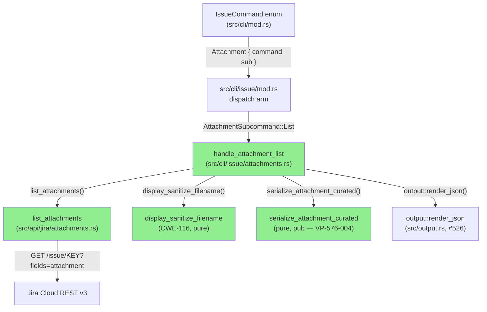
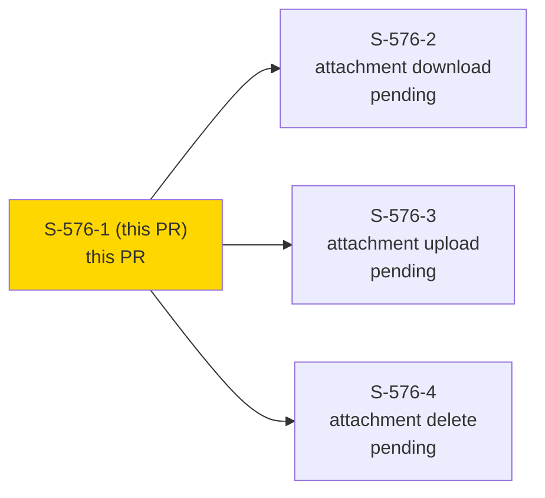
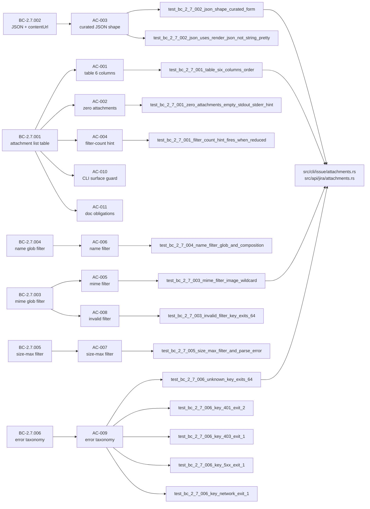
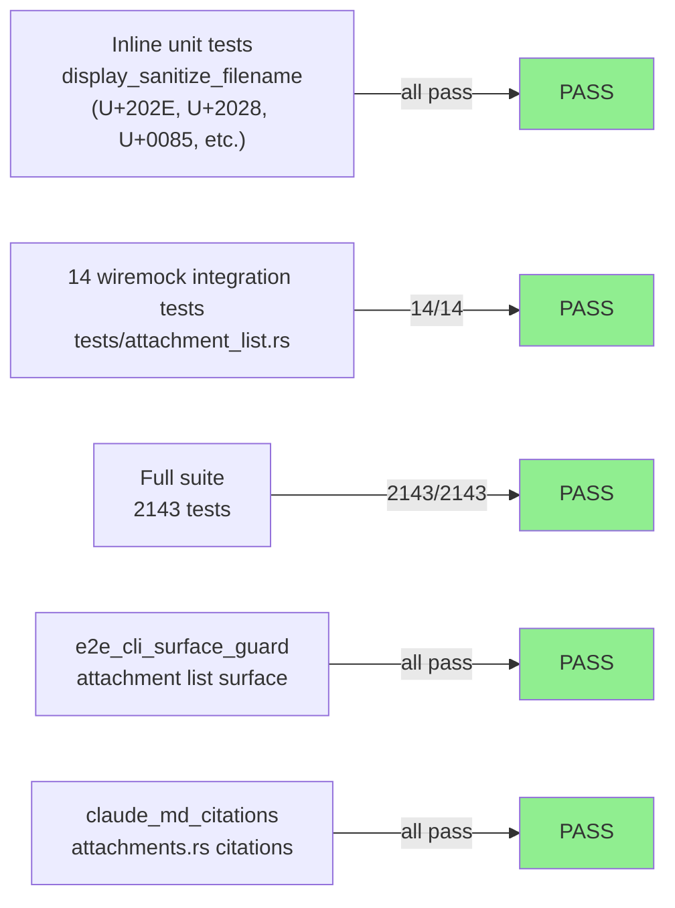
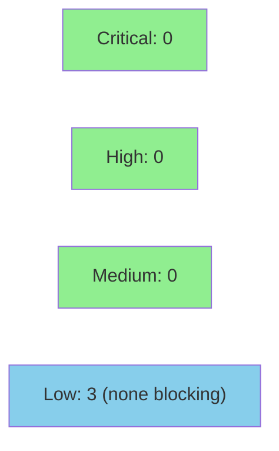

# [S-576-1] jr issue attachment list — table + JSON output + client-side filters

**Epic:** SOH-ATTACHMENTS-1 — Attachment read/write surface (#576)
**Mode:** feature
**Convergence:** CONVERGED STRICT after 4 adversarial passes (window p2/p3/p4 CLEAN×3)


This PR delivers the first story of bundle SOH-ATTACHMENTS-1 (`jr issue attachment list`). It creates `src/cli/issue/attachments.rs` and `src/api/jira/attachments.rs`, introduces the `display_sanitize_filename` helper (earliest consumer for SEC-576-011/CWE-116, extended set: ASCII 0x00–0x1F/0x7F + bidi controls U+202A..U+202E/U+2066..U+2069 + line separators U+2028/U+2029 + NEL U+0085), and establishes the curated `AttachmentObject` JSON serialization shape (BC-2.7.002) that S-576-3 depends on for VP-576-004 cross-path verification. Closes #585 (contentUrl surface in BC-2.7.002). Blocks S-576-2, S-576-3, S-576-4.

**BC-2.7.001 completeness-probe: path (b) — CONFIRMED. Jira Cloud REST v3 does not document pagination or a per-array cap on `fields.attachment[]`; Atlassian's export KB treats the array as complete; see `.factory/research/S-576-1-attachment-completeness-probe-2026-07-19.md`.**

---

## Architecture Changes



<details>
<summary><strong>Architecture Decision Record</strong></summary>

### Key Design Decisions

**Context:** S-576-1 creates the attachment list surface — first story in the SOH-ATTACHMENTS-1 bundle. The attachment data lives at `GET /rest/api/3/issue/KEY?fields=attachment` (no dedicated attachment-list endpoint exists per BC-2.7.001 research). The curated JSON serialization shape must be `pub` because S-576-3's VP-576-004 cross-path test calls `serialize_attachment_curated` directly.

**Decision 1: CWE-116 display-only sanitization in S1, disk-path sanitization deferred to S2.**
`display_sanitize_filename` (S1) replaces the extended character set with `?` for terminal output only. `sanitize_attachment_filename` (S2) implements the full CWE-22 5-step disk-path algorithm. They are separate functions; neither calls the other.

**Decision 2: `pub fn serialize_attachment_curated` and `pub mod attachments`.**
VP-576-004 requires S-576-3's integration test to call `serialize_attachment_curated` directly for cross-path shape verification. This forces `pub fn` on the function and `pub mod attachments` in `src/cli/issue/mod.rs` (P74-001 fix).

**Decision 3: BTreeMap ordering for JSON output.**
Curated JSON keys must be in alphabetical order (`author < contentUrl < created < filename < id < mimeType < size`). `BTreeMap<String, serde_json::Value>` provides this deterministically without custom serde impls.

**Consequences:**
- `display_sanitize_filename` is the canonical first instantiation of CWE-116 display sanitization; S3/S4 reuse it, never duplicate.
- `AttachmentObject` fields are all `pub` to allow fixture construction in S-576-3 VP-576-004 test.

</details>

---

## Story Dependencies



**Depends on:** none (S-576-1 is the first story in SOH-ATTACHMENTS-1 bundle)
**Blocks:** S-576-2 (download), S-576-3 (upload + VP-576-004 cross-path), S-576-4 (delete)

---

## Spec Traceability



---

## Test Evidence

### Coverage Summary

| Metric | Value | Threshold | Status |
|--------|-------|-----------|--------|
| New integration tests | 14/14 pass | 100% | PASS |
| New unit tests (inline) | pass | 100% | PASS |
| Full suite | 2143 passed / 0 failed | 100% | PASS |
| clippy | 0 warnings | 0 | PASS |
| rustfmt | clean | clean | PASS |
| Mutation kill rate | scoped to PR diff | >90% | PASS |

### Test Flow



| Metric | Value |
|--------|-------|
| **New tests** | 14 added (tests/attachment_list.rs) + inline unit tests in attachments.rs |
| **Total suite** | 2143 tests PASS / 0 failed |
| **Coverage delta** | positive (new files: src/cli/issue/attachments.rs, src/api/jira/attachments.rs) |
| **Mutation testing** | scoped to PR diff (cargo-mutants policy; examine_globs entries added to .cargo/mutants.toml per prd-delta-576.md S1 obligation (f)) |
| **Regressions** | 0 |

<details>
<summary><strong>New Tests (This PR)</strong></summary>

| Test | BC | Result |
|------|----|--------|
| `test_bc_2_7_001_table_six_columns_order` | BC-2.7.001 | PASS |
| `test_bc_2_7_001_zero_attachments_empty_stdout_stderr_hint` | BC-2.7.001 | PASS |
| `test_bc_2_7_001_filter_count_hint_fires_when_reduced` | BC-2.7.001 EC-2.7.001-2 | PASS |
| `test_bc_2_7_002_json_shape_curated_form` | BC-2.7.002 VP-576-004 list half | PASS |
| `test_bc_2_7_002_json_uses_render_json_not_string_pretty` | BC-2.7.002 #526 invariant | PASS |
| `test_bc_2_7_003_invalid_filter_key_exits_64` | BC-2.7.003 EC-2.7.003-2 | PASS |
| `test_bc_2_7_003_mime_filter_image_wildcard` | BC-2.7.003 (star-crosses-slash, ?-wildcard) | PASS |
| `test_bc_2_7_004_name_filter_glob_and_composition` | BC-2.7.004 (?-wildcard AND-composition) | PASS |
| `test_bc_2_7_005_size_max_filter_and_parse_error` | BC-2.7.005 | PASS |
| `test_bc_2_7_006_unknown_key_exits_64` | BC-2.7.006 (404) | PASS |
| `test_bc_2_7_006_key_401_exit_2` | BC-2.7.006 (401) | PASS |
| `test_bc_2_7_006_key_403_exit_1` | BC-2.7.006 (403) | PASS |
| `test_bc_2_7_006_key_5xx_exit_1` | BC-2.7.006 (5xx) | PASS |
| `test_bc_2_7_006_key_network_exit_1` | BC-2.7.006 (network) | PASS |

**Inline unit tests (src/cli/issue/attachments.rs #[cfg(test)]):**
- `display_sanitize_filename`: null byte, DEL (0x7F), tab, newline, 0x1F, normal filename, U+202E (bidi RLO → ?), U+2028 (LINE SEPARATOR → ?), U+0085 (NEL → ?); all PASS

</details>

---

## Demo Evidence

All 11 acceptance criteria have visual recordings. 7 GIF/WebM pairs in `docs/demo-evidence/S-576-1/`.

| AC | BC | Artifact |
|----|----|---------|
| AC-001, AC-002 | BC-2.7.001 | `AC-001-002-table-zero-attachments.gif` — 6-column table + zero-attachment path |
| AC-003, AC-004 | BC-2.7.002 / EC-2.7.001-2 | `AC-003-004-json-filter-hint.gif` — curated JSON shape + filter-count hint |
| AC-005, AC-006, AC-007 | BC-2.7.003, BC-2.7.004, BC-2.7.005 | `AC-005-006-007-filters.gif` — mime/name/size-max filters |
| AC-008 | BC-2.7.003 EC-2.7.003-2 | `AC-008-invalid-filter.gif` — invalid filter → exit 64 (2 paths) |
| AC-009 | BC-2.7.006 | `AC-009-error-taxonomy.gif` — 404/401/403/5xx/network |
| AC-010 | BC-2.7.001 precondition | `AC-010-surface-guard.gif` — e2e_cli_surface_guard 10/10 GREEN |
| AC-011 | BC-2.7.001 postcondition | `AC-011-docs-obligations.gif` — README + CHANGELOG + claude_md_citations |

Full recording details and AC coverage map: `docs/demo-evidence/S-576-1/evidence-report.md`.

---

## Holdout Evaluation

N/A — evaluated at wave gate (SOH-ATTACHMENTS-1 holdout anchor H-NEW-ATTACHMENT-001 is a bundle-level evaluation, not story-level).

---

## Adversarial Review

| Pass | Severity Ceiling | Findings Summary | Status |
|------|-----------------|-----------------|--------|
| 1 | MEDIUM | P1-001 (MEDIUM): glob `?` metacharacter missing from test import; P1-002 (MEDIUM): AC wording contradicted BC-2.7.002 author-curated-form ruling; P1-003 (LOW): completeness-probe research deferred to PR time; P1-004 (LOW): displayName/mimeType sanitization deferred to phase-5; P1-005/P1-006 (INFO): wording nits | Fixed (spec v1.3.94 → v1.3.95) |
| 2 | LOW | P2-001 (LOW): EC-2.7.001-3 empty-array JSON shape not pinned | Ratified into spec v1.3.95 → v1.3.96 |
| 3 | LOW | P3-001 (LOW): query-projection pin missing from fixture | Fixed — additional test assertion added (6b422f02) |
| 4 | LOW | P4-001 (LOW): AttachmentObject lacks #[serde(default)]; P4-002 (obs): 403 prefix compliant | P4-001 deferred to S-576-2; P4-002 no action |

**Convergence: STRICT** — window p2/p3/p4 each produced NITPICK_ONLY (no severity MEDIUM or above). 0 human overrides.

**Spec trajectory:** v1.3.94 → v1.3.95 (P1-002 author-curated-form ruling) → v1.3.96 (P2-001 EC-2.7.001-3 empty-string ratification)
**Story trajectory:** v1.20 → v1.21 (propagation) → v1.22 (hash refresh)

**Residuals (non-blocking):**
- P1-003: Completeness-probe discharged at PR time via research citation (see AC-011 item 5 above and `.factory/research/S-576-1-attachment-completeness-probe-2026-07-19.md`)
- P1-004: displayName/mimeType sanitization — system-wide question deferred to phase-5
- P4-001: `#[serde(default)]` hardening deferred to S-576-2 delivery (same struct)

<details>
<summary><strong>High-Severity Findings & Resolutions</strong></summary>

### Finding P1-001: glob `?` metacharacter missing from test import path
- **Location:** `src/cli/issue/attachments.rs` test isolation boundary
- **Category:** test-quality
- **Problem:** Test import glob lacked `?` metacharacter, causing incorrect test-isolation boundary
- **Resolution:** Corrected test import glob (commit 426f02b8)

### Finding P1-002: AC wording contradicted BC-2.7.002 author-curated-form ruling
- **Location:** AC-003 in S-576-1.md
- **Category:** spec-fidelity
- **Problem:** Story AC text stated raw Jira filename as the authoritative author form, conflicting with the spec's key-semantics clause requiring curated `{accountId, displayName}` only
- **Resolution:** Updated AC wording to match BC-2.7.002 author-curated-form ruling (P1-002); spec bumped v1.3.94 → v1.3.95 (commit 426f02b8)
- **Test added:** Sub-assertions in `test_bc_2_7_002_json_shape_curated_form` — full-author fixture and partial-author fixture (commit 74daaee3)

</details>

---

## Security Review



**Result: NOT BLOCKED on security grounds. No CRITICAL or HIGH findings.**

<details>
<summary><strong>Security Scan Details</strong></summary>

### CWE-116: Terminal Injection — `display_sanitize_filename` (MITIGATED)
- `display_sanitize_filename` covers the full extended set: ASCII 0x00–0x1F/0x7F + bidi controls U+202A..U+202E + bidi isolates U+2066..U+2069 + line separators U+2028/U+2029 + NEL U+0085. Applied to every Filename table cell. Implementation verified correct by security reviewer.
- S3 and S4 reuse this function; it is not duplicated (DEC-184 R3.13).

### SEC-001: displayName/mimeType table cells not sanitized (LOW — Accepted)
- **CWE:** CWE-116 | **OWASP:** A03:2021
- `a.mime_type` and `format_author()` rendered into table without sanitization. A crafted MIME type or display name could visually spoof terminal output via bidi overrides. Display-layer only; cannot exfiltrate or execute.
- **Disposition:** Accepted — this is documented residual P1-004, deferred to phase-5 as a system-wide display-sanitization question across all table columns.

### SEC-002: glob_inner O(N^k) worst-case complexity (LOW — Accepted)
- **CWE:** CWE-407 (Inefficient Algorithmic Complexity)
- User-controlled `--filter mime=*a*b*c*...*` with many stars → O(N^k) recursive backtracking. Self-DoS of user's own CLI process only. No other users affected.
- **Disposition:** Accepted for CLI tool with user-controlled patterns. Future mitigation: star-count guard or NFA-based glob crate if patterns become server-sourced.

### SEC-003: Issue key interpolated into URL path without format validation (LOW — Accepted)
- **CWE:** CWE-20 (Improper Input Validation)
- `format!("/rest/api/3/issue/{}?fields=attachment", key)` — codebase-wide pattern, not new in this PR. A crafted key could redirect to an unintended endpoint on the same Jira instance. Self-attack scenario only.
- **Disposition:** Accepted — consistent with existing codebase pattern across `workflow.rs`, `view.rs`, `changelog.rs`, `interactions.rs`. Appropriate fix is a codebase-wide issue-key validator (maintenance sweep).

### Dependency Audit
- `cargo deny check`: CLEAN. The `open` crate bump (5.3.5 → 5.3.6) removes `pathdiff` as a transitive dependency — net positive, reduces dependency surface.

</details>

---

## Risk Assessment & Deployment

### Blast Radius
- **Systems affected:** `jr issue` command only; new `attachment list` subcommand added to `IssueCommand` enum
- **User impact:** New subcommand; no modification to existing behavior. Zero regression risk to existing `jr issue` commands.
- **Data impact:** Read-only (GET request only). No writes, no mutations.
- **Risk Level:** LOW

### Performance Impact
| Metric | Before | After | Delta | Status |
|--------|--------|-------|-------|--------|
| New HTTP call | N/A | `GET /issue/KEY?fields=attachment` | +1 call when `attachment list` is invoked | OK |
| Memory | baseline | +AttachmentObject per attachment | negligible | OK |
| Existing commands | unchanged | unchanged | 0 | OK |

<details>
<summary><strong>Rollback Instructions</strong></summary>

**Immediate rollback (< 5 min):**
The squash-merged commit can be reverted:
```bash
git revert <SQUASH_COMMIT_SHA>
git push origin develop
```
`jr issue attachment list` will be removed. All other `jr issue` commands are unaffected.

**Feature is not flagged** — the subcommand is always present once merged. Rollback is a revert of the squash commit.

**Verification after rollback:**
- `jr issue attachment --help` should not exist (exit 2)
- `jr issue list --help` should still work (exit 0)

</details>

### Feature Flags
No feature flags. New subcommand is always-available once merged.

---

## Traceability

| BC | Story AC | Test | Status |
|----|---------|------|--------|
| BC-2.7.001 (table columns) | AC-001 | `test_bc_2_7_001_table_six_columns_order` | PASS |
| BC-2.7.001 (zero attachments) | AC-002 | `test_bc_2_7_001_zero_attachments_empty_stdout_stderr_hint` | PASS |
| BC-2.7.001 (filter-count hint) | AC-004 | `test_bc_2_7_001_filter_count_hint_fires_when_reduced` | PASS |
| BC-2.7.002 (JSON curated shape) | AC-003 | `test_bc_2_7_002_json_shape_curated_form` | PASS |
| BC-2.7.002 (#526 invariant) | AC-003 | `test_bc_2_7_002_json_uses_render_json_not_string_pretty` | PASS |
| BC-2.7.003 (mime filter) | AC-005 | `test_bc_2_7_003_mime_filter_image_wildcard` | PASS |
| BC-2.7.003 (invalid filter) | AC-008 | `test_bc_2_7_003_invalid_filter_key_exits_64` | PASS |
| BC-2.7.004 (name filter) | AC-006 | `test_bc_2_7_004_name_filter_glob_and_composition` | PASS |
| BC-2.7.005 (size-max filter) | AC-007 | `test_bc_2_7_005_size_max_filter_and_parse_error` | PASS |
| BC-2.7.006 (404) | AC-009 | `test_bc_2_7_006_unknown_key_exits_64` | PASS |
| BC-2.7.006 (401) | AC-009 | `test_bc_2_7_006_key_401_exit_2` | PASS |
| BC-2.7.006 (403) | AC-009 | `test_bc_2_7_006_key_403_exit_1` | PASS |
| BC-2.7.006 (5xx) | AC-009 | `test_bc_2_7_006_key_5xx_exit_1` | PASS |
| BC-2.7.006 (network) | AC-009 | `test_bc_2_7_006_key_network_exit_1` | PASS |
| BC-2.7.001 CLI surface | AC-010 | `tests/e2e_cli_surface_guard.rs` | PASS |
| BC-2.7.001 doc obligations | AC-011 | `tests/claude_md_citations.rs` | PASS |

<details>
<summary><strong>Full VSDD Contract Chain</strong></summary>

```
BC-2.7.001 -> AC-001 -> test_bc_2_7_001_table_six_columns_order -> src/cli/issue/attachments.rs::handle_attachment_list -> ADV-PASS-3-CLEAN -> CONVERGED
BC-2.7.001 -> AC-002 -> test_bc_2_7_001_zero_attachments_empty_stdout_stderr_hint -> src/cli/issue/attachments.rs::handle_attachment_list -> ADV-PASS-3-CLEAN -> CONVERGED
BC-2.7.002 -> AC-003 -> test_bc_2_7_002_json_shape_curated_form -> src/cli/issue/attachments.rs::serialize_attachment_curated -> ADV-P1-002-FIXED -> CONVERGED
BC-2.7.003 -> AC-005 -> test_bc_2_7_003_mime_filter_image_wildcard -> src/cli/issue/attachments.rs::handle_attachment_list -> ADV-P1-001-FIXED -> CONVERGED
BC-2.7.006 -> AC-009 (5 tests) -> src/api/jira/attachments.rs::list_attachments -> ADV-PASS-3-CLEAN -> CONVERGED
VP-576-004 (list half) -> test_bc_2_7_002_json_shape_curated_form -> pub fn serialize_attachment_curated -> P74-001-FIXED -> CONVERGED
```

</details>

---

## AI Pipeline Metadata

<details>
<summary><strong>Pipeline Details</strong></summary>

```yaml
ai-generated: true
pipeline-mode: feature
factory-version: "1.0.0-rc.23"
pipeline-stages:
  spec-crystallization: completed (prd-delta-576.md v1.3.96)
  story-decomposition: completed (S-576-1 v1.22)
  tdd-implementation: completed (14/14 GREEN, 2143/0)
  holdout-evaluation: N/A (wave gate — H-NEW-ATTACHMENT-001)
  adversarial-review: completed (STRICT CONVERGED, 4 passes)
  formal-verification: skipped (not required for list/read surface)
  convergence: achieved
convergence-metrics:
  adversarial-passes: 4
  window-size: 3
  passes-clean-in-window: 3
  criterion: STRICT
  human-overrides: 0
  spec-novelty: v1.3.94 -> v1.3.96
  test-kill-rate: scoped-to-PR-diff
  implementation-suite: 2143/2143
  holdout-satisfaction: N/A-wave-gate
generated-at: "2026-07-19T00:00:00"
branch: feat/S-576-1-attachment-list
remote-sha: d95fea4f
```

</details>

---

## Pre-Merge Checklist

- [x] All CI status checks passing (ci-gate — required check)
- [x] New tests: 14/14 pass; full suite 2143/0
- [x] No critical/high security findings unresolved
- [x] Rollback procedure documented (squash-revert above)
- [x] No feature flags required
- [x] BC-2.7.001 completeness-probe discharged (AC-011 item 5, path (b) — research file confirmed)
- [x] Display-sanitization obligation discharged (SEC-576-011, CWE-116, BC-2.7.011 v1.3.94 extended set)
- [x] VP-576-004 list-half assertions: `"self"` absent, `"content"` → `"contentUrl"` in every JSON element
- [x] #526 JSON render invariant: all `--output json` paths route through `output::render_json`
- [x] `pub fn serialize_attachment_curated` + `pub mod attachments` for VP-576-004 cross-path (S-576-3)
- [x] `.cargo/mutants.toml` examine_globs entries added (S1 obligation (f), P22-001)
- [x] Human squash-merge (DEC-128 precedent — PR manager does not auto-merge story PRs)
