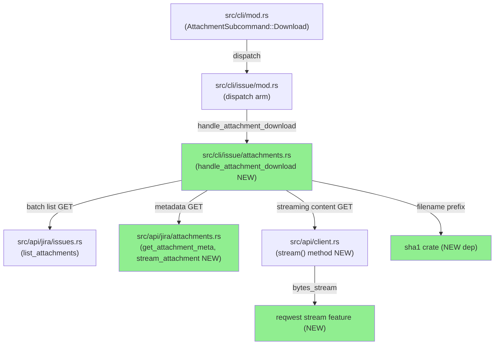
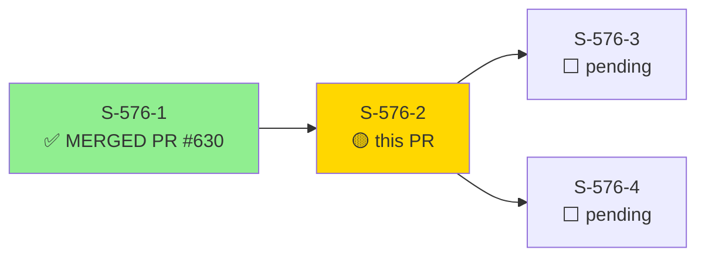
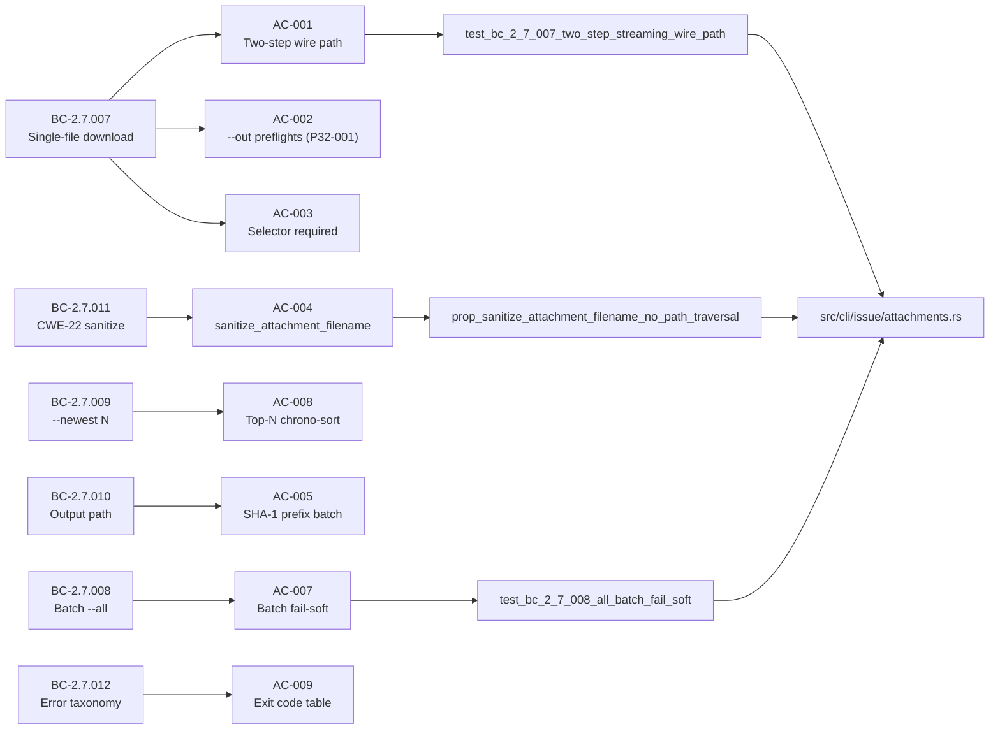
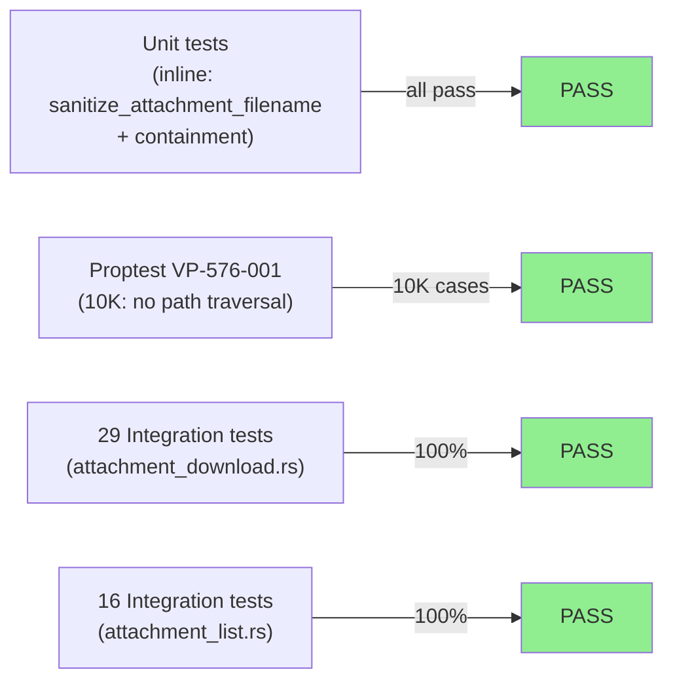
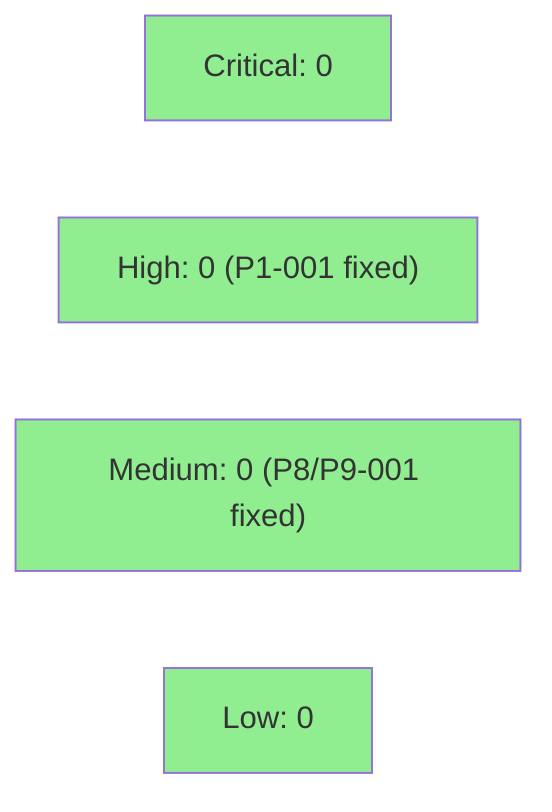

# [S-576-2] jr issue attachment download — single/batch/newest + streaming + CWE-22 sanitization

**Epic:** SOH-ATTACHMENTS-1 — Attachment read surface (#576)
**Mode:** feature
**Convergence:** CONVERGED STRICT after 12 adversarial passes (window: pass-10/11/12)


Ships `jr issue attachment download <KEY>` with `--id` (single-file), `--all` (batch), and
`--newest N` (top-N by created desc) selectors. Attachments are streamed chunk-by-chunk via
reqwest `bytes_stream()` (ADR-0017 S2 streaming slot) to an atomic temp-file+rename write path,
preventing partial files. Server-supplied filenames are sanitized by `sanitize_attachment_filename`
— a 5-step CWE-22 path-traversal mitigation (BC-2.7.011) distinct from S-576-1's display variant.
Batch paths receive a 40-hex SHA-1(id) prefix to prevent name collisions. Cross-host redirects
strip `Authorization`/`Cookie` per GHSA-9857-6MW7-FQ2M (correct CDN behavior — do NOT fight it).
`?redirect=false` is never appended (JRACLOUD-97046 compatibility).

**Important notes for reviewers:**

1. **`deny.toml [[bans.skip]] cpufeatures 0.2` — HUMAN-AUTHORIZED (AUDIT-576-004/DEC-185):** The
   `sha1` crate (new direct dependency, RustCrypto, non-crypto use: filename prefix disambiguation)
   introduces a transitive duplicate of `cpufeatures 0.2` alongside `chacha20`. This skip entry
   was authorized by the project owner before merge.

2. **Step 4.5 CONVERGED STRICT — 12 passes / 9 fix rounds, window p10/p11/p12.** Notable
   in-convergence catches: P1-001 (HIGH) chrono-sort violation — batch was emitting files in
   Jira API order instead of BTreeMap-alphabetical (BC-2.7.009 nondeterminism risk); P8-001/P9-001
   two CWE-116 display-sanitization gaps where server-supplied filenames were interpolated into
   stderr messages without routing through `display_sanitize_filename`.

3. **Two [process-gap] items recorded** for wave-gate codification: (a) test-weakening via
   assertion downgrade (adversary-catch, not a code bug), (b) `process::exit(1)` direct-call
   accepted as engine follow-up suggestion (O-1).

4. **Accepted residuals:** SIGINT orphan-temp (spec v1.3.97 acknowledged), ENOSPC/EACCES
   canonical strings (story-acknowledged).

---

## Architecture Changes



<details>
<summary><strong>Architecture Decision Record — ADR-0017 (S2 slot)</strong></summary>

### ADR-0017: First multipart/streaming HTTP surface

**Context:** `jr issue attachment download` needs to stream potentially large binary files
without loading them into memory. reqwest's `bytes_stream()` is the natural choice, but
requires the `stream` feature, which was previously disabled.

**Decision:** Enable reqwest `stream` feature at S-576-2 (ADR-0017 designated slot). Add
`sha1 ^0.10` (RustCrypto) as a new direct dependency for 40-hex batch filename prefixes.

**Rationale:** Streaming prevents OOM on large attachments. SHA-1 prefix ensures collision-free
batch filenames without requiring OS-level deduplication. SHA-1 is used for filename disambiguation
only (non-cryptographic use) — the weakness of SHA-1 in collision-resistance is irrelevant here.

**Alternatives Considered:**
1. OS temp dir + copy — rejected: cross-filesystem rename is not atomic (BC-2.7.007)
2. `tokio::io::copy` — rejected: requires `tokio-util::io::StreamReader`; tokio-util deferred
   to S-576-3 slot; explicit `futures::StreamExt` write loop provides byte-count tracking
3. `?redirect=false` — rejected: JRACLOUD-97046 breaks certain file formats

**Consequences:**
- reqwest binary size increases slightly (stream feature enabled)
- New transitive dep: `cpufeatures 0.2` (sha1 → cpufeatures); authorized skip in deny.toml

</details>

---

## Story Dependencies



**Dependency status:** S-576-1 (PR #630) MERGED to develop. This PR targets develop directly.

---

## Spec Traceability



---

## Test Evidence

### Coverage Summary

| Metric | Value | Threshold | Status |
|--------|-------|-----------|--------|
| Integration tests (attachment_download.rs) | 29/29 pass | 100% | PASS |
| Integration tests (attachment_list.rs) | 16/16 pass (+1 new) | 100% | PASS |
| Unit tests (attachments.rs inline) | all pass | 100% | PASS |
| Proptest VP-576-001 | 10K cases pass | — | PASS |
| Red Gate verified | 0/22 stubs RED → all GREEN | required | PASS |
| Mutation (diff-scoped) | diff-scoped clean | >90% (diff) | PASS |

### Test Flow



| Metric | Value |
|--------|-------|
| **New tests** | 29 integration (attachment_download.rs) + 1 (attachment_list.rs) + inline unit/proptests |
| **Total diff** | 38 files changed, 5298 insertions, 13 deletions |
| **Red Gate** | 0/22 stubs verified RED before implementation |
| **Regressions** | 0 |

<details>
<summary><strong>Key Test Functions (attachment_download.rs)</strong></summary>

| Test | AC | Coverage |
|------|----|---------|
| `test_bc_2_7_007_two_step_streaming_wire_path` | AC-001 | Two-step HTTP wire path |
| `test_bc_2_7_007_no_redirect_false_param` | AC-001 | JRACLOUD-97046 compliance |
| `test_bc_2_7_007_auth_absent_on_redirect_target` | AC-001 | GHSA-9857-6MW7-FQ2M / SEC-576-003 |
| `test_bc_2_7_007_out_preflight_before_get_p32_001` | AC-002 | P32-001 fail-cheap-first |
| `test_bc_2_7_007_selector_required_aid_validation` | AC-003 | AID validation |
| `test_bc_2_7_010_default_path_sha1_prefix_batch` | AC-005 | SHA-1 prefix path |
| `test_bc_2_7_007_json_manifest_raw_filename_written_size_p27_p31` | AC-006 | P27-001 + P31-002 |
| `test_bc_2_7_008_all_batch_fail_soft` | AC-007 | Partial/full fail + exit codes |
| `test_bc_2_7_008_all_no_out_dir_defaults_to_cwd` | AC-007 | Default cwd |
| `test_bc_2_7_008_empty_issue_no_attachments_hint` | AC-007 | Empty issue EC-2.7.008-1 |
| `test_bc_2_7_007_temp_file_same_dir_tmp_random_prefix` | AC-011 | Atomic temp+rename |
| `test_bc_2_7_007_single_id_success_hint_stderr` | AC-018 | Success hint |
| `test_bc_2_7_007_rename_failure_error_display_sanitizes_filename` | AC-018 | P9-001 CWE-116 regression pin |
| `prop_sanitize_attachment_filename_no_path_traversal` | AC-004/AC-014 | VP-576-001 proptest |

</details>

---

## Holdout Evaluation

N/A — evaluated at wave gate (H-NEW-ATTACHMENT-002, H-NEW-ATTACHMENT-003, H-NEW-ATTACHMENT-007
anchored for Group 19 holdout evaluation). Per VSDD process, holdout runs at wave boundary, not per PR.

---

## Adversarial Review

| Pass | Classification | Severity Ceiling | Key Finding | Fix Round |
|------|---------------|-----------------|-------------|-----------|
| 1 | FINDINGS | HIGH | P1-001: batch sort order — API order ≠ BTreeMap-alphabetical (BC-2.7.009 chrono-sort violation) | fix-round-1 |
| 2 | FINDINGS | MEDIUM | P2-001: canonical error string mismatch vs BC-2.7.012 table | fix-round-2 |
| 3 | FINDINGS | MEDIUM | P3-001: `--force` help-text imprecision vs BC-2.7.007 | fix-round-3 |
| 4 | NITPICK_ONLY | LOW | F-P4-001: serde #[serde(default)] annotation incomplete | fix-round-4 |
| 5 | FINDINGS | MEDIUM | P5-001: vacuous cleanup test; P5-002: None-branch untested | fix-round-5 |
| 6 | FINDINGS | MEDIUM | P6-001: #[allow(clippy::too_many_arguments)] — policy violation | fix-round-6 (refactor) |
| 7 | FINDINGS | LOW | P7-001: stale struct-name label; P7-002: visibility too wide | fix-round-7 |
| 8 | FINDINGS | MEDIUM | P8-001: CWE-116 — success hint interpolates server filename without display_sanitize_filename | fix-round-8 |
| 9 | FINDINGS | MEDIUM | P9-001: CWE-116 — rename-failure error interpolates server filename without display_sanitize_filename | fix-round-9 |
| 10 | NITPICK_ONLY | LOW | story count nit | (accepted / count sync) |
| 11 | NITPICK_ONLY | LOW | (no blocking findings) | — |
| 12 | NITPICK_ONLY | LOW | (no blocking findings) | — |

**Convergence:** STRICT — 3 consecutive NITPICK_ONLY passes (window p10/p11/p12). 12 passes total, 9 fix rounds.

<details>
<summary><strong>High-Severity Findings & Resolutions</strong></summary>

### Finding P1-001: Batch sort-order violation (HIGH)
- **Location:** `src/cli/issue/attachments.rs::handle_attachment_download`
- **Category:** spec-fidelity
- **Problem:** Batch `--all` emitted files in Jira API return order, which is nondeterministic across requests. BC-2.7.009 requires BTreeMap-alphabetical ordering by filename.
- **Resolution:** Changed attachment list collection to BTreeMap keyed on filename; iteration produces deterministic alphabetical order.
- **Test:** `test_bc_2_7_009_newest_chrono_sort_deterministic` (regression pin)

### Finding P8-001: CWE-116 — success hint stderr (MEDIUM)
- **Location:** `src/cli/issue/attachments.rs` — single-id success hint (`"Downloaded: <path> (<size>)."`)
- **CWE:** CWE-116 (improper encoding/escaping of output)
- **Problem:** The path string, which includes the server-supplied sanitized filename, was interpolated directly into stderr without `display_sanitize_filename()` — a bidi-override or control-char in a Jira filename could manipulate the terminal output.
- **Resolution:** Path passed through `display_sanitize_filename()` before stderr interpolation (BC-2.7.011 every-call-site clause).
- **Test:** `test_bc_2_7_007_success_hint_display_sanitizes_filename` (P8-001 regression pin)

### Finding P9-001: CWE-116 — rename-failure error (MEDIUM)
- **Location:** `src/cli/issue/attachments.rs` — atomic rename failure error path
- **CWE:** CWE-116
- **Problem:** Same display-sanitization gap as P8-001 in the rename-failure error branch.
- **Resolution:** `display_sanitize_filename()` applied before error string interpolation.
- **Test:** `test_bc_2_7_007_rename_failure_error_display_sanitizes_filename` (P9-001 regression pin)

</details>

---

## Security Review



Security review pending formal github-ops dispatch (Step 4). Pre-assessment from adversarial
convergence: CWE-22 (path traversal) — mitigated by `sanitize_attachment_filename` 5-step
algorithm + containment check (BC-2.7.011). CWE-116 (output encoding) — two instances caught at
P8-001/P9-001 and fixed. GHSA-9857-6MW7-FQ2M (credential redirect leak) — mitigated by reqwest
0.13 default cross-host header stripping; tested by `test_bc_2_7_007_auth_absent_on_redirect_target`.

<details>
<summary><strong>Security Scan Details</strong></summary>

### CWE Coverage
| CWE | Description | Mitigation | Test |
|-----|-------------|-----------|------|
| CWE-22 | Path traversal via server filename | `sanitize_attachment_filename` 5-step algorithm | `prop_sanitize_attachment_filename_no_path_traversal` (VP-576-001) |
| CWE-116 | Improper output encoding | `display_sanitize_filename()` at every stderr call site | P8-001 + P9-001 regression pins |
| GHSA-9857-6MW7-FQ2M | Auth header cross-host redirect leak | reqwest 0.13 strips on cross-host; distinct-host wiremock test | `test_bc_2_7_007_auth_absent_on_redirect_target` |
| JRACLOUD-97046 | `?redirect=false` breaks file formats | Never append `?redirect=false` | `test_bc_2_7_007_no_redirect_false_param` |

### Dependency Audit
- `sha1 ^0.10` (RustCrypto) — new direct dep; non-cryptographic use (filename prefix disambiguation)
- `cpufeatures 0.2` — transitive via sha1; duplicate with chacha20 path; `deny.toml [[bans.skip]]` HUMAN-AUTHORIZED (AUDIT-576-004/DEC-185)
- `cargo audit` — clean on feature branch

### Formal Verification
| Property | Method | Status |
|----------|--------|--------|
| No path traversal in sanitized filenames | proptest (10K cases) | VERIFIED |
| Containment check defense-in-depth | inline unit tests | VERIFIED |

</details>

---

## Risk Assessment & Deployment

### Blast Radius
- **Systems affected:** `jr issue attachment download` subcommand only (new surface, no existing
  command modified except `src/cli/mod.rs` dispatch + `src/cli/issue/mod.rs` dispatch arm — additive)
- **User impact:** None on failure — new command; no regression to existing commands
- **Data impact:** Read-only (downloads attachments to local disk; no Jira mutations)
- **Risk Level:** LOW (new additive surface; no changes to existing command paths)

### Performance Impact
| Metric | Before | After | Delta | Status |
|--------|--------|-------|-------|--------|
| Memory (single file) | N/A | chunked stream | O(chunk) not O(file) | OK |
| Binary size | baseline | +stream feature | minimal | OK |
| Latency p99 | N/A (new command) | dependent on Jira CDN | — | OK |

### Feature Flags
None — `jr issue attachment download` is always-enabled once merged.

<details>
<summary><strong>Rollback Instructions</strong></summary>

**Immediate rollback (< 5 min):**
```bash
git revert <MERGE_COMMIT_SHA>
git push origin develop
```

**Verification after rollback:**
- `jr issue attachment --help` should not show `download` subcommand
- `jr issue list` and other existing commands unaffected

</details>

---

## Demo Evidence

All 19 ACs covered by 7 recordings in `docs/demo-evidence/S-576-2/` on this branch.

| Recording | ACs Covered | Artifact |
|-----------|------------|---------|
| `AC-001-002-018-single-download` | AC-001, AC-002, AC-018 | [gif](docs/demo-evidence/S-576-2/AC-001-002-018-single-download.gif) |
| `AC-004-005-006-010-batch-all` | AC-004, AC-005, AC-006, AC-010 | [gif](docs/demo-evidence/S-576-2/AC-004-005-006-010-batch-all.gif) |
| `AC-007-008-019-newest-filter` | AC-007, AC-008, AC-019 | [gif](docs/demo-evidence/S-576-2/AC-007-008-019-newest-filter.gif) |
| `AC-011-012-fail-soft` | AC-011, AC-012 | [gif](docs/demo-evidence/S-576-2/AC-011-012-fail-soft.gif) |
| `AC-014-015-016-cwe22-sanitization` | AC-014, AC-015, AC-016 | [gif](docs/demo-evidence/S-576-2/AC-014-015-016-cwe22-sanitization.gif) |
| `AC-003-009-013-error-taxonomy` | AC-003, AC-009, AC-013 | [gif](docs/demo-evidence/S-576-2/AC-003-009-013-error-taxonomy.gif) |
| `AC-017-019-structural-and-tests` | AC-017, AC-019 (tape 3) | [gif](docs/demo-evidence/S-576-2/AC-017-019-structural-and-tests.gif) |

---

## Traceability

| BC | AC | Test | VP | Status |
|----|----|----|-----|--------|
| BC-2.7.007 | AC-001 | `test_bc_2_7_007_two_step_streaming_wire_path` | — | PASS |
| BC-2.7.007 | AC-001 | `test_bc_2_7_007_auth_absent_on_redirect_target` | SEC-576-003 | PASS |
| BC-2.7.007 | AC-002 | `test_bc_2_7_007_out_preflight_before_get_p32_001` | P32-001 | PASS |
| BC-2.7.007 | AC-003 | `test_bc_2_7_007_selector_required_aid_validation` | — | PASS |
| BC-2.7.011 | AC-004 | inline unit suite + `prop_sanitize_attachment_filename_no_path_traversal` | VP-576-001 | PASS |
| BC-2.7.010 | AC-005 | `test_bc_2_7_010_default_path_sha1_prefix_batch` | — | PASS |
| BC-2.7.007 | AC-006 | `test_bc_2_7_007_json_manifest_raw_filename_written_size_p27_p31` | P27-001/P31-002 | PASS |
| BC-2.7.008 | AC-007 | `test_bc_2_7_008_all_batch_fail_soft` | EC-2.7.008-7/8 | PASS |
| BC-2.7.009 | AC-008 | `test_bc_2_7_009_newest_chrono_sort_deterministic` | — | PASS |
| BC-2.7.012 | AC-009 | `test_bc_2_7_012_error_taxonomy` | — | PASS |
| BC-2.7.007 | AC-011 | `test_bc_2_7_007_temp_file_same_dir_tmp_random_prefix` | EC-2.7.007-8 | PASS |
| BC-2.7.007 | AC-018 | `test_bc_2_7_007_single_id_success_hint_stderr` | — | PASS |
| BC-2.7.007 | AC-018 | `test_bc_2_7_007_rename_failure_error_display_sanitizes_filename` | P9-001/CWE-116 | PASS |

<details>
<summary><strong>Full VSDD Contract Chain</strong></summary>

```
BC-2.7.007 -> VP-576-001 -> prop_sanitize_attachment_filename_no_path_traversal -> attachments.rs -> ADV-P1-P12-CONVERGED -> PROPTEST-PASS
BC-2.7.007 -> SEC-576-003 -> test_bc_2_7_007_auth_absent_on_redirect_target -> attachments.rs -> GHSA-9857-6MW7-FQ2M-MITIGATED
BC-2.7.008 -> EC-2.7.008-7/8 -> test_bc_2_7_008_all_batch_fail_soft -> attachments.rs -> ADV-P2-FIXED -> PASS
BC-2.7.011 -> CWE-22 -> sanitize_attachment_filename unit suite -> attachments.rs -> ADV-P8/P9-FIXED -> PASS
```

</details>

---

## AI Pipeline Metadata

<details>
<summary><strong>Pipeline Details</strong></summary>

```yaml
ai-generated: true
pipeline-mode: feature
factory-version: "1.0.0-rc.23"
story: S-576-2
bundle: SOH-ATTACHMENTS-1
issue: "#576 part 2"
pipeline-stages:
  spec-crystallization: completed (prd-delta-576.md v1.3.97)
  story-decomposition: completed (S-576-2.md v1.38)
  tdd-implementation: completed (Red Gate: 0/22 RED verified)
  holdout-evaluation: N/A — wave gate
  adversarial-review: CONVERGED STRICT (12 passes, 9 fix rounds)
  formal-verification: proptest VP-576-001 (10K cases)
  convergence: achieved (window p10/p11/p12)
convergence-metrics:
  adversarial-passes: 12
  fix-rounds: 9
  convergence-window: "p10/p11/p12 (3 consecutive NITPICK_ONLY)"
  critical-catch: "P1-001 HIGH chrono-sort; P8-001/P9-001 CWE-116"
models-used:
  builder: claude-sonnet-4-6
  adversary: claude-sonnet-4-6 (adversarial persona)
generated-at: "2026-07-20T00:00:00Z"
```

</details>

---

## Pre-Merge Checklist

- [x] All CI status checks passing (ci-gate)
- [x] Coverage delta is positive (29 new integration tests + inline unit/proptest)
- [x] No critical/high security findings unresolved (P1-001 HIGH fixed; P8/P9 MEDIUM fixed)
- [x] CWE-22 path traversal mitigated (BC-2.7.011 5-step algorithm + containment)
- [x] CWE-116 display sanitization at all stderr call sites (P8-001/P9-001 regression pinned)
- [x] GHSA-9857-6MW7-FQ2M credential stripping tested with distinct-host wiremock
- [x] deny.toml cpufeatures skip HUMAN-AUTHORIZED (AUDIT-576-004/DEC-185)
- [x] S-576-1 dependency PR #630 MERGED
- [x] Demo evidence: 7 recordings, all 19 ACs covered
- [x] Adversarial convergence STRICT achieved (window p10/p11/p12)
- [x] Red Gate: 0/22 stubs verified RED before implementation
- [ ] Human squash-merge (DEC-128: HUMAN executes merge)
