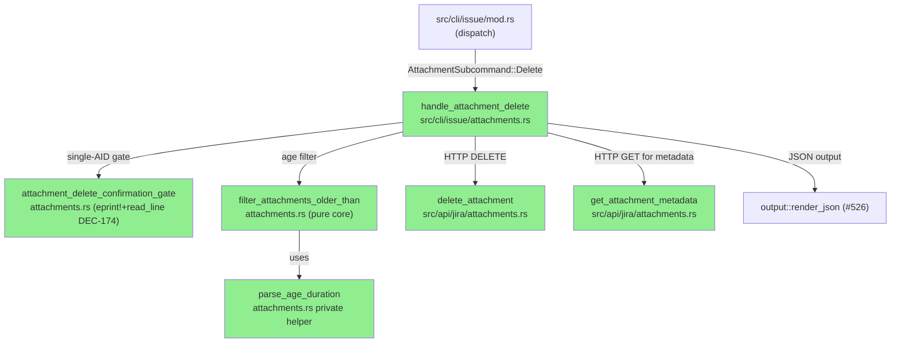
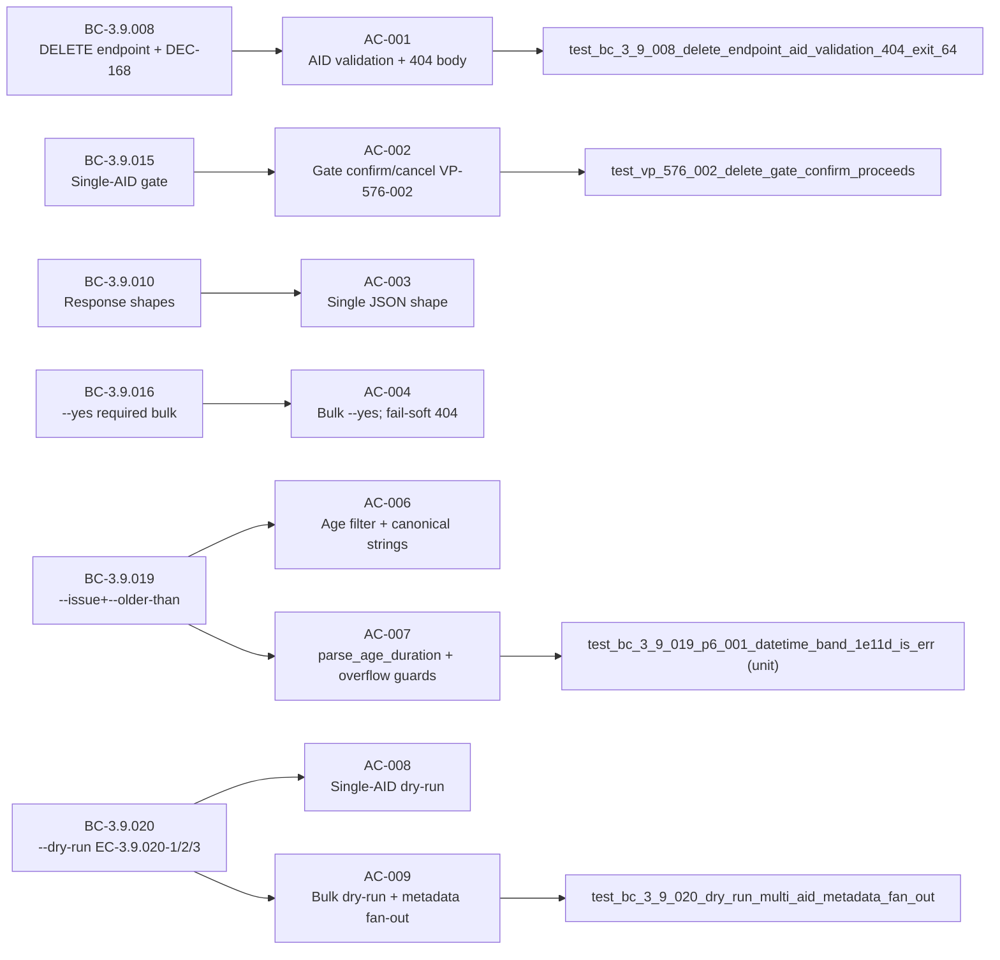
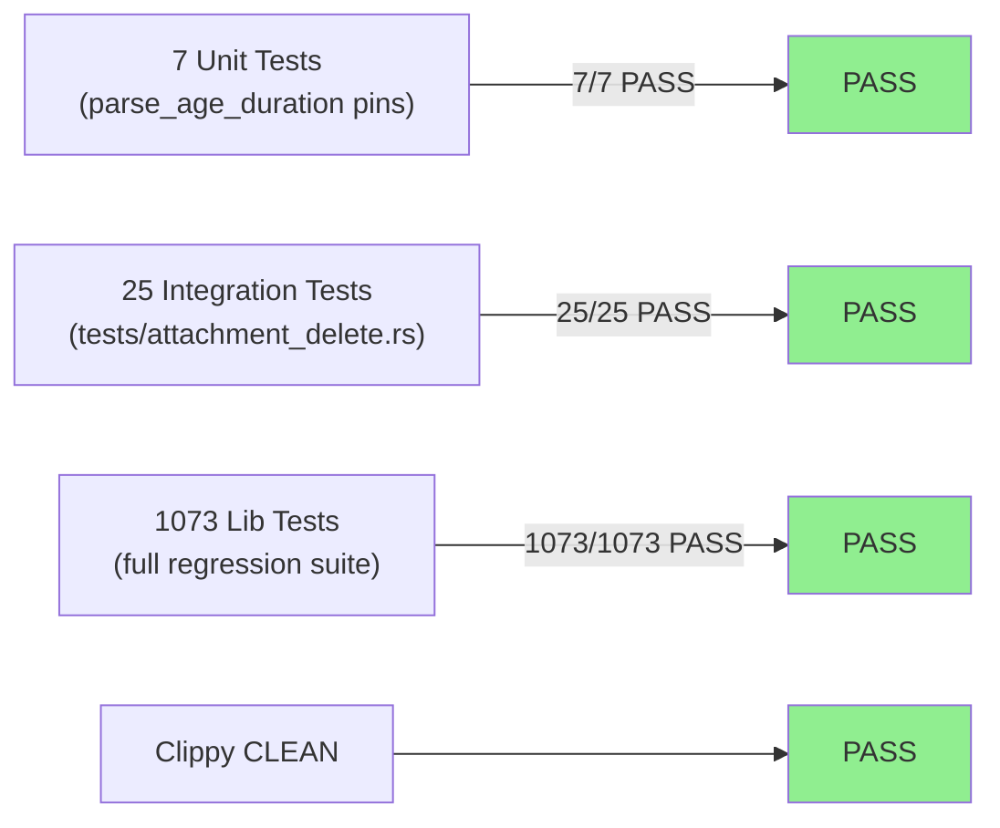
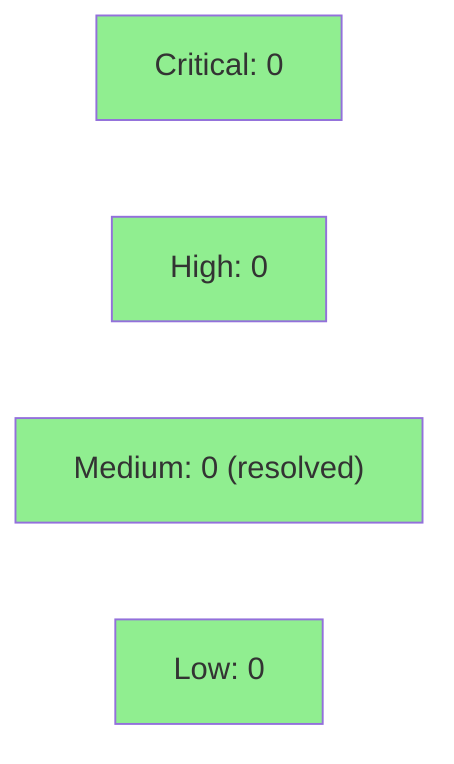

# [S-576-4] feat(issue): attachment delete single/bulk/older-than + dry-run

**Epic:** SOH-ATTACHMENTS-1 — jr issue attachment CRUD surface  
**Mode:** feature  
**Convergence:** CONVERGED STRICT after 11 adversarial passes (5 fix rounds; window p9/p10/p11 CLEAN×3)


This PR delivers the `jr issue attachment delete` command — the fourth story of the SOH-ATTACHMENTS-1 bundle. It adds single-AID targeted delete (with a `eprint!`-based confirmation gate, pre-prompt metadata GET for filename, and DEC-168 404 body surfacing), multi-AID bulk delete (fail-soft 404 skip, non-404 abort), `--issue KEY --older-than DUR` age-filtered bulk delete (dedicated `parse_age_duration` private helper with a three-band overflow onion guard), `--dry-run` for both single-AID (EC-3.9.020-3) and bulk (EC-3.9.020-1/2) forms, CWE-116 `display_sanitize_filename` on prompt filenames, and a full delete error taxonomy (BC-3.9.013). DEC-168 ruling is codified: targeted 404 exits 64 with canonical prefix + Jira body; bulk 404 is a benign skip. Three arithmetic overflow bands caught by adversarial review (P1-001/P2-001/P6-001) now guarded via clamp + `TimeDelta::try_seconds` + `checked_sub_signed`.

Depends on: S-576-1 (merged, PR #630). Blocks: S-576-5 (EJ e2e teardown uses `jr issue attachment delete`). Does **not** close #576 (S-576-5 closes it).

---

## Architecture Changes



<details>
<summary><strong>Architecture Decision Record</strong></summary>

### ADR: Targeted-vs-bulk 404 asymmetry (DEC-168)

**Context:** `DELETE /rest/api/3/attachment/<id>` can return 404 in two contexts: a user explicitly naming a specific attachment that no longer exists (targeted delete), or a bulk loop where an attachment was deleted between list-time and delete-time (stale in bulk).

**Decision:** Targeted single-AID 404 → exit 64 + stderr beginning with `"Attachment <AID> not found or not accessible."` followed by the raw Jira error body (NOT body-only, NOT silent). Bulk path 404 → benign skip, continue to next AID.

**Rationale:** In the targeted case the user named a specific target that doesn't exist — that is an error. In the bulk case the attachment was already gone before the loop reached it — that is idempotent and expected.

**Alternatives Considered:**
1. Unified exit 64 for all 404s — rejected because it would make bulk operations fragile on concurrent delete workloads.
2. Silent exit 0 for targeted 404 — rejected per DEC-168; the user named a target that doesn't exist, which is always an error worth surfacing.

**Consequences:**
- Two separate API functions: `delete_attachment_targeted` (maps 404 → `JrError::UserError`) vs `delete_attachment` (maps 404 → benign, used in bulk loop). Do NOT unify them.
- The S-576-3 replace-detection check `msg.contains("not found or already deleted")` relies on `delete_attachment`'s benign wording — changing it would break S-576-3.

</details>

---

## Story Dependencies


---

## Spec Traceability



---

## Test Evidence

### Coverage Summary

| Metric | Value | Threshold | Status |
|--------|-------|-----------|--------|
| Integration tests (attachment_delete) | 25/25 pass | 100% | PASS |
| Unit tests (parse_age_duration in src) | 7/7 pass | 100% | PASS |
| Full lib suite | 1073/1073 pass | 100% | PASS |
| Clippy | CLEAN | 0 warnings | PASS |
| fmt | CLEAN | — | PASS |
| deny | CLEAN | — | PASS |
| Holdout anchors | H-NEW-ATTACHMENT-005/006/012 | — | N/A — evaluated at wave gate |
| Mutation kill rate | N/A (240m budget; deferred to CI) | >90% | — |

### Test Flow



| Metric | Value |
|--------|-------|
| **New tests** | 25 integration (tests/attachment_delete.rs) + 7 unit (src/cli/issue/attachments.rs #[cfg(test)]) |
| **Total lib suite** | 1073 PASS |
| **Regressions** | 0 |

<details>
<summary><strong>Detailed Test Results — New Tests This PR</strong></summary>

### Integration Tests (tests/attachment_delete.rs — 25 tests)

| Test | AC | Result |
|------|----|--------|
| `test_bc_3_9_008_delete_endpoint_aid_validation_404_exit_64` | AC-001 | PASS |
| `test_bc_3_9_015_aid_validation_before_gate` | AC-002 | PASS |
| `test_vp_576_002_delete_gate_confirm_proceeds` | AC-002/AC-013 | PASS |
| `test_vp_576_002_delete_gate_cancel_stays` | AC-002/AC-013 | PASS |
| `test_bc_3_9_015_gate_eof_exits_130` | AC-002 | PASS |
| `test_bc_3_9_010_single_aid_json_shape` | AC-003 | PASS |
| `test_bc_3_9_013_bulk_delete_fail_soft_all_404` | AC-004 | PASS |
| `test_bc_3_9_016_bulk_requires_yes_exits_64` | AC-004 | PASS |
| `test_bc_3_9_010_bulk_delete_non_404_aborts_sequence` | AC-004 | PASS |
| `test_bc_3_9_010_bulk_partial_404_skip_continues` | AC-004 | PASS |
| `test_bc_3_9_010_bulk_json_shape` | AC-005 | PASS |
| `test_bc_3_9_019_issue_key_older_than_resolution` | AC-006 | PASS |
| `test_bc_3_9_019_older_than_parse_age_duration_filter` | AC-007 | PASS |
| `test_bc_3_9_020_dry_run_single_aid` | AC-008 | PASS |
| `test_bc_3_9_020_dry_run_bulk` | AC-009 | PASS |
| `test_bc_3_9_020_dry_run_multi_aid_metadata_fan_out` | AC-009 | PASS |
| `test_bc_3_9_015_non_interactive_without_yes_exits_64` | AC-010 | PASS |
| `test_bc_3_9_016_issue_older_than_yes_combined` | AC-011 | PASS |
| `test_bc_3_9_016_issue_without_older_than_exit_2` | AC-014 | PASS |
| `test_bc_3_9_016_clap_mutual_exclusion_constraints` | AC-015 | PASS |
| `test_bc_3_9_013_delete_401_exit_2` | AC-016 | PASS |
| `test_bc_3_9_013_delete_403_exit_1` | AC-016 | PASS |
| `test_bc_3_9_013_delete_5xx_exit_1` | AC-016 | PASS |
| `test_bc_3_9_013_delete_network_error_exit_1` | AC-016 | PASS |
| `test_bc_3_9_008_404_body_surfaced_to_stderr` | AC-013 | PASS |

### Unit Tests (src/cli/issue/attachments.rs #[cfg(test)] — 7 tests)

| Test | Purpose | Result |
|------|---------|--------|
| `test_bc_3_9_019_ec_8_parse_age_duration_1d_is_24h` | Boundary pin: 1d == 24h (not 8h Jira workday) | PASS |
| `test_bc_3_9_019_2w_equals_336_hours` | P1-001 mutation pin: 2w == 336h | PASS |
| `test_bc_3_9_019_0d_is_err` | P1-001 mutation pin: 0d invalid | PASS |
| `test_bc_3_9_019_30m_exact` | P1-001 mutation pin: 30m exact | PASS |
| `test_bc_3_9_019_2h_exact` | P1-001 mutation pin: 2h == 120 min | PASS |
| `test_bc_3_9_019_p2_001_chrono_band_1e12d_is_err` | P2-001 pin: chrono band overflow exit 64 not panic | PASS |
| `test_bc_3_9_019_p6_001_datetime_band_1e11d_is_err` | P6-001 pin: DateTime subtraction overflow exit 64 not panic | PASS |

</details>

---

## Holdout Evaluation

| Metric | Value | Threshold |
|--------|-------|-----------|
| Holdout anchors | H-NEW-ATTACHMENT-005, H-NEW-ATTACHMENT-006, H-NEW-ATTACHMENT-012 | — |
| **Result** | **N/A — evaluated at wave gate** | |

---

## Adversarial Review

| Pass | Findings | Critical | High | Medium | Status |
|------|----------|----------|------|--------|--------|
| 1 | 1 | 0 | 0 | 1 | Fixed (P1-001: parse_age_duration overflow onion band 1) |
| 2 | 2 | 0 | 0 | 2 | Fixed (P2-001: chrono band 2 + P2-002: AC-009 fan-out unimplemented) |
| 3 | 1 | 0 | 0 | 1 | Fixed (P3-001: dry-run table missing both output forms) |
| 4 | 1 | 0 | 0 | 1 | Fixed (P4-001: AC-003 stdout/stderr channel error in story) |
| 5 | 0 | 0 | 0 | 0 | NITPICK_ONLY — discharged |
| 6 | 1 | 0 | 0 | 1 | Fixed (P6-001: DateTime subtraction panic — overflow band 3) |
| 7 | 0 | 0 | 0 | 0 | CLEAN |
| 8 | 1 | 0 | 0 | 1 | Fixed (P8-001: empty-AID vacuous-truth bypass) |
| 9 | 0 | 0 | 0 | 0 | CLEAN (window 1/3) |
| 10 | 0 | 0 | 0 | 0 | CLEAN (window 2/3) |
| 11 | 0 | 0 | 0 | 0 | CLEAN (window 3/3) — **CONVERGED STRICT** |

**Convergence:** CONVERGED STRICT at pass 11 (trajectory: 1→2→1→1→0→1→0→1→0→0→0)

<details>
<summary><strong>Notable High/Medium Findings & Resolutions</strong></summary>

### P1-001: parse_age_duration char-boundary panic + i64 multiply overflow
- **Location:** `src/cli/issue/attachments.rs::parse_age_duration`
- **Category:** correctness / safety
- **Problem:** Extreme values (e.g. `"99999999999999999w"`) overflowed i64 arithmetic before the `chrono::Duration::hours()` call, causing panic instead of exit 64. Also, slicing at a non-char-boundary on multibyte trailing chars (e.g. `"5€"`) panicked.
- **Resolution:** Added clamp + saturating cast; char-boundary safe suffix extraction.
- **Tests added:** `test_bc_3_9_019_2w_equals_336_hours`, `test_bc_3_9_019_0d_is_err` (unit); P1-001a/b sub-cases in integration test.

### P2-001: chrono TimeDelta::try_seconds fallibility (second overflow band)
- **Location:** `src/cli/issue/attachments.rs::parse_age_duration`
- **Category:** correctness / safety
- **Problem:** `TimeDelta::try_seconds()` is fallible — for values like `1e12d` that survived the first guard, `try_seconds` returned `None` (overflow), unhandled.
- **Resolution:** Added `checked_mul` guard before `TimeDelta::try_seconds`; propagates as exit 64.
- **Test added:** `test_bc_3_9_019_p2_001_chrono_band_1e12d_is_err`

### P2-002: AC-009 multi-AID dry-run metadata fan-out was unimplemented
- **Location:** `src/cli/issue/attachments.rs::handle_attachment_delete`
- **Category:** spec-fidelity
- **Problem:** The explicit multi-AID dry-run path (EC-3.9.020-2) did not perform per-AID GET metadata fan-out; the table populated with no filenames.
- **Resolution:** Added per-AID `GET /rest/api/3/attachment/<id>` fan-out in multi-AID dry-run path.
- **Test added:** `test_bc_3_9_020_dry_run_multi_aid_metadata_fan_out`

### P6-001: DateTime NaiveDate subtraction panic (third overflow band)
- **Location:** `src/cli/issue/attachments.rs::filter_attachments_older_than`
- **Category:** correctness / safety
- **Problem:** `DateTime - chrono::Duration` via `checked_sub_signed` could still panic for values like `1e11d` that passed the first two overflow bands, because the resulting `DateTime` would underflow NaiveDate range.
- **Resolution:** Added `MAX_AGE_SECS` clamp constant + `checked_sub_signed` with error return instead of subtraction operator.
- **Test added:** `test_bc_3_9_019_p6_001_datetime_band_1e11d_is_err`

### P8-001: Empty-AID list vacuous-truth bypass
- **Location:** `src/cli/issue/attachments.rs::handle_attachment_delete`
- **Category:** correctness
- **Problem:** When `--issue+--older-than` resolved to zero attachments, the bulk deletion loop was entered with an empty list — vacuous success. The sibling-parity guard (from S-576-3) was not applied to this path.
- **Resolution:** Added sibling-parity guard: empty resolved list exits 0 immediately with zero-match response before entering delete loop.

</details>

---

## Security Review



<details>
<summary><strong>Security Scan Details</strong></summary>

### CWE Coverage
- **CWE-116 (Improper Encoding):** `display_sanitize_filename` applied in all confirmation prompts and dry-run preview tables — filename sanitization before TTY output (BC-2.7.011).
- **CWE-674 (Uncontrolled Recursion):** Not applicable — this PR adds iterative loops, not recursion.
- **Input Validation:** `^[0-9]+$` AID validation fires before any HTTP call or prompt (BC-3.9.015 precondition). Invalid AID exits 64 immediately.
- **Numeric Overflow:** Three-band overflow onion caught by adversarial review (P1-001/P2-001/P6-001) — all bands guarded.
- **Injection:** All echo text uses `display_sanitize_filename` (CWE-116); no raw user input surfaces to TTY without sanitization.

### Dependency Audit
- `cargo deny check`: CLEAN (no new dependencies; uses existing chrono, reqwest, wiremock).

### Security Review Result
Populated after Step 4 (security-reviewer pass). No CRITICAL/HIGH findings expected given adversarial convergence already caught all overflow bands.

</details>

---

## Risk Assessment & Deployment

### Blast Radius
- **Systems affected:** `jr issue attachment delete` subcommand only (new surface; additive to `AttachmentSubcommand`).
- **User impact on failure:** Delete operations fail gracefully with exit code 64 (user error) or 1 (API/permission error). No data at risk from failure — attachments are only deleted on explicit user intent with `--yes` or confirmation.
- **Data impact:** Attachment deletion is irreversible. Mitigated by: confirmation gate (single-AID), `--yes` requirement (bulk), and `--dry-run` preview capability.
- **Risk Level:** LOW — additive command; no existing behavior modified.

### Performance Impact
| Metric | Before | After | Delta | Status |
|--------|--------|-------|-------|--------|
| Startup latency | unchanged | unchanged | 0 | OK |
| Single-AID delete | N/A | 1×GET + 1×DELETE | new | OK |
| Bulk delete (N AIDs) | N/A | N×DELETE sequential | new | OK |
| `--issue --older-than` | N/A | 1×GET issue + N×DELETE | new | OK |

<details>
<summary><strong>Rollback Instructions</strong></summary>

**Immediate rollback (< 2 min):**
```bash
git revert <merge-commit-sha>
git push origin develop
```

**Verification after rollback:**
- `jr issue attachment delete --help` should not show `delete` subcommand
- `cargo test --test attachment_delete` suite should not exist

</details>

### Feature Flags
| Flag | Controls | Default |
|------|----------|---------|
| (none) | No feature flags; command is always available after merge | — |

---

## Traceability

| Requirement | Story AC | Test | Status |
|-------------|---------|------|--------|
| BC-3.9.008 DELETE endpoint + DEC-168 | AC-001 | `test_bc_3_9_008_delete_endpoint_aid_validation_404_exit_64` | PASS |
| BC-3.9.015 single-AID gate + VP-576-002 | AC-002 | `test_vp_576_002_delete_gate_confirm_proceeds` / `cancel_stays` | PASS |
| BC-3.9.010 response shapes | AC-003, AC-005 | `test_bc_3_9_010_single_aid_json_shape`, `test_bc_3_9_010_bulk_json_shape` | PASS |
| BC-3.9.016 --yes required bulk | AC-004, AC-011 | `test_bc_3_9_016_bulk_requires_yes_exits_64` | PASS |
| BC-3.9.019 --issue+--older-than | AC-006, AC-007 | `test_bc_3_9_019_issue_key_older_than_resolution` | PASS |
| BC-3.9.020 --dry-run EC-3.9.020-1/2/3 | AC-008, AC-009 | `test_bc_3_9_020_dry_run_single_aid`, `test_bc_3_9_020_dry_run_bulk` | PASS |
| BC-3.9.013 error taxonomy | AC-016 | `test_bc_3_9_013_delete_401_exit_2`, `_403_exit_1`, `_5xx_exit_1`, `_network_error_exit_1` | PASS |

<details>
<summary><strong>Full VSDD Contract Chain</strong></summary>

```
BC-3.9.008 -> VP-576-002 -> test_vp_576_002_delete_gate_confirm_proceeds -> src/cli/issue/attachments.rs::handle_attachment_delete -> ADV-PASS-11-CONVERGED
BC-3.9.015 -> AC-002 -> test_bc_3_9_015_aid_validation_before_gate -> attachments.rs::attachment_delete_confirmation_gate -> ADV-PASS-11-CONVERGED
BC-3.9.019 -> AC-007 -> test_bc_3_9_019_p2_001_chrono_band_1e12d_is_err -> attachments.rs::parse_age_duration -> ADV-PASS-11-CONVERGED
BC-3.9.019 -> AC-007 -> test_bc_3_9_019_p6_001_datetime_band_1e11d_is_err -> attachments.rs::filter_attachments_older_than -> ADV-PASS-11-CONVERGED
BC-3.9.020 -> AC-009 -> test_bc_3_9_020_dry_run_multi_aid_metadata_fan_out -> attachments.rs::handle_attachment_delete (multi-AID dry-run path) -> ADV-PASS-11-CONVERGED
DEC-168 -> AC-001/AC-013 -> test_bc_3_9_008_404_body_surfaced_to_stderr -> api/jira/attachments.rs::delete_attachment_targeted -> ADV-PASS-11-CONVERGED
```

</details>

---

## Demo Evidence

All 16 ACs covered by 7 VHS terminal recordings. Evidence at `docs/demo-evidence/S-576-4/`.

| Recording | GIF | ACs Covered |
|-----------|-----|-------------|
| `AC-001-002-003-010-single-gate` | `AC-001-002-003-010-single-gate.gif` | AC-001, AC-002, AC-003, AC-010 |
| `AC-001-013-dec168-targeted-404` | `AC-001-013-dec168-targeted-404.gif` | AC-001, AC-013 (DEC-168 canonical prefix+body) |
| `AC-004-005-bulk-failsoft` | `AC-004-005-bulk-failsoft.gif` | AC-004, AC-005 |
| `AC-006-007-011-issue-older-than` | `AC-006-007-011-issue-older-than.gif` | AC-006, AC-007, AC-011 |
| `AC-007-016-duration-errors` | `AC-007-016-duration-errors.gif` | AC-007, AC-016 |
| `AC-008-009-dry-run` | `AC-008-009-dry-run.gif` | AC-008, AC-009 |
| `AC-012-014-015-clap-tests` | `AC-012-014-015-clap-tests.gif` | AC-012, AC-013, AC-014, AC-015 |

**Coverage: 16/16 ACs demonstrated.**

---

## AI Pipeline Metadata

<details>
<summary><strong>Pipeline Details</strong></summary>

```yaml
ai-generated: true
pipeline-mode: feature
factory-version: "1.0.0-rc.23"
pipeline-stages:
  spec-crystallization: completed (prd-delta-576.md v1.3.97)
  story-decomposition: completed (S-576-4 v1.34)
  tdd-implementation: completed
  holdout-evaluation: N/A — evaluated at wave gate
  adversarial-review: completed (CONVERGED STRICT)
  formal-verification: N/A
  convergence: achieved (p9/p10/p11 CLEAN×3)
convergence-metrics:
  adversarial-passes: 11
  fix-rounds: 5
  trajectory: "1→2→1→1→0→1→0→1→0→0→0"
  window: "p9/p10/p11 CLEAN×3"
  spec-version-at-convergence: "v1.3.97"
  story-version-at-convergence: "v1.34"
test-counts:
  integration: 25
  unit: 7
  lib: 1073
notable-catches:
  - "P1-001: parse_age_duration overflow onion band 1 (char-boundary + i64 multiply)"
  - "P2-001: chrono TimeDelta::try_seconds fallibility (band 2)"
  - "P2-002: AC-009 multi-AID metadata fan-out unimplemented"
  - "P3-001: dry-run tables missing both JSON and human forms"
  - "P6-001: DateTime NaiveDate subtraction panic (band 3)"
  - "P8-001: empty-AID vacuous-truth bypass"
process-gap-candidate: "FALLIBLE-ARITHMETIC-SWEEP — three-band overflow onion lessons"
models-used:
  builder: claude-sonnet-4-6
  adversary: claude-sonnet-4-6
generated-at: "2026-07-21"
```

</details>

---

## Pre-Merge Checklist

- [ ] All CI status checks passing
- [ ] Coverage delta is positive or neutral
- [ ] No critical/high security findings unresolved
- [ ] Rollback procedure validated
- [ ] Human review completed (DEC-128 — human squash-merge required)
- [ ] Demo evidence verified: 16/16 ACs covered
- [ ] Dependency PR S-576-1 merged (PR #630, ✅ confirmed)
