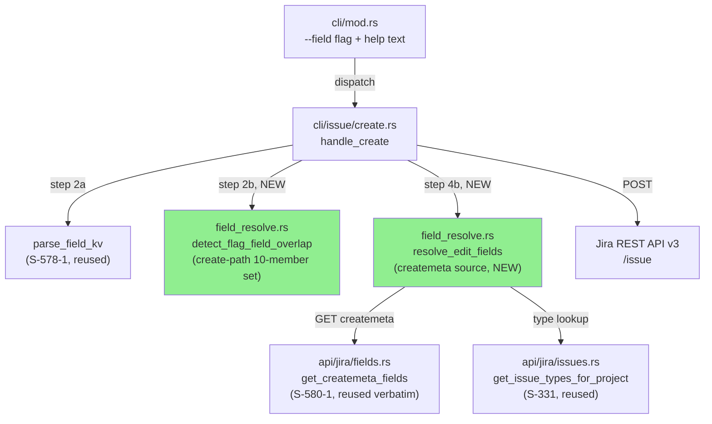
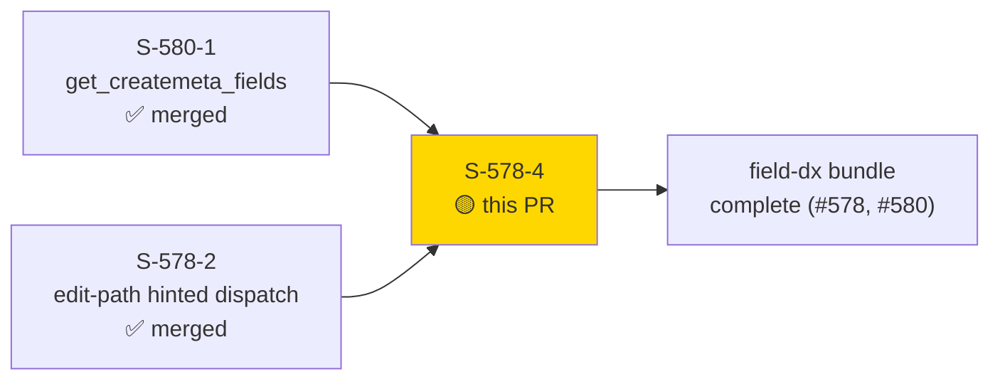
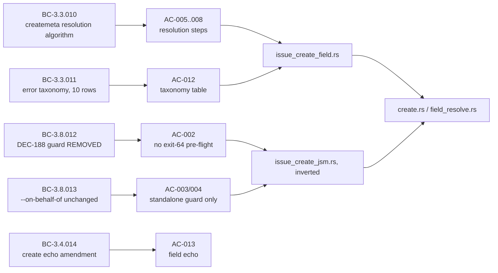
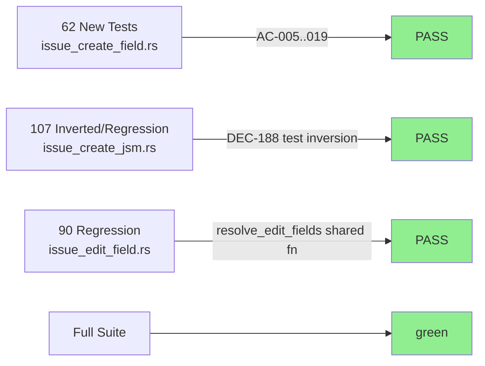
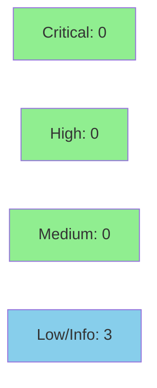

# [S-578-4] `issue create --field` Platform-Path Support — createmeta Resolution + DEC-188 Reversal

**Epic:** field-dx bundle (GitHub issues #580 / #578) — part 5 of 5
**Mode:** feature
**Convergence:** CONVERGED (STRICT) after 14 adversarial passes (final 3 consecutive CLEAN; zero production-logic defects found after pass 2)


Adds `jr issue create --field NAME[:kind]=VALUE` support on the **platform (non-JSM)** create
path. Resolution runs against `createmeta` (`GET .../createmeta/<proj>/issuetypes/<itid>`,
reused verbatim from S-580-1's `get_createmeta_fields`) through the same `resolve_edit_fields`
dispatch machinery `issue edit --field` already uses (S-578-2), now parameterized by a
createmeta-vs-editmeta source. This closes #578 item 2 and is the final story in the field-dx
bundle. It also **reverses** DEC-188 (S-639-1's `--field`-alone exit-64 pre-flight guard) per
DEC-310, a human-approved decision registered at the Feature-Mode F2 gate — a deliberate,
documented un-guard, not a regression. `--on-behalf-of`'s own pre-flight guard (BC-3.8.013) is
unchanged. A new ten-member dedicated-flag × `--field` collision guard (D2) prevents a `--field`
pair from silently colliding with a dedicated flag's wire key before any HTTP call.

---

## Architecture Changes



<details>
<summary><strong>Architecture Decision Record</strong></summary>

### ADR: Reuse the edit-path dispatch machinery for create-path field resolution (DEC-310)

**Context:** S-639-1 (DEC-188) shipped an exit-64 pre-flight guard rejecting `--field` on the
platform create path entirely, on the premise that createmeta-driven resolution was out of
scope for that cycle. The field-dx bundle subsequently built the full hinted-dispatch pipeline
for the edit path (S-578-2) and JSM create path (S-578-3), leaving the platform create path as
the only remaining `--field` surface still hard-blocked.

**Decision:** Extend `resolve_edit_fields` with a createmeta-vs-editmeta source parameter
instead of writing a second, independent resolution function, and remove the DEC-188 guard for
`--field` specifically (not `--on-behalf-of`, which keeps its own unrelated guard).

**Rationale:** One shared dispatch function means hint-kind parsing (`:option`/`:id`/`:name`/
`:asset`), option-value resolution, and error taxonomy stay byte-for-byte consistent across all
three `--field` call sites (edit, JSM create, platform create) rather than drifting across three
maintained copies.

**Alternatives Considered:**
1. A separate `resolve_create_fields` function — rejected: duplicates ~600 LOC of dispatch logic
   for a source-only difference (createmeta GET vs editmeta GET).
2. Leaving the DEC-188 guard in place and only building JSM-path support (already done in
   S-578-3) — rejected: leaves the platform path as a documented, permanent gap without a
   supporting rationale once the resolution machinery already exists.

**Consequences:**
- `resolve_edit_fields` and `detect_flag_field_overlap` are now shared, multi-caller functions —
  future edits must preserve both call sites' distinct governed-key sets (5-member edit-path
  Gate B vs 10-member create-path D2 — see Architecture Compliance Rules in the story spec).
- This is a permission-widening reversal: no previously-working invocation breaks; an invocation
  that used to exit 64 now either succeeds or fails later with a more specific resolution error.

</details>

---

## Story Dependencies



Both dependencies (`S-580-1`, `S-578-2`) are merged to `develop`. This is the final story in the
`field-dx` bundle — nothing downstream depends on S-578-4 itself (`blocks: []`).

---

## Spec Traceability



---

## Test Evidence

### Coverage Summary

| Metric | Value | Status |
|--------|-------|--------|
| `issue_create_field` (new suite) | 62 pass | PASS |
| `issue_create_jsm` (inverted DEC-188 tests + regressions) | 107 pass | PASS |
| `issue_edit_field` (regression — shared `resolve_edit_fields`) | 90 pass | PASS |
| Full workspace suite | green | PASS |
| `cargo clippy -- -D warnings` | clean | PASS |
| `cargo fmt --all -- --check` | clean | PASS |
| Red Gate | new/inverted tests failed pre-implementation → all PASS post-implementation | PASS |

### Test Flow



<details>
<summary><strong>Detailed Test Notes</strong></summary>

- `tests/issue_create_field.rs` is a NEW file (2,996 LOC) — covers AC-005 through AC-019: the
  6-step createmeta resolution algorithm, the 10-row error taxonomy, the 10-member D2 collision
  guard (5 original Gate-B-shaped static keys + `labels`/`parent`/`assignee` + 2 resolved-id
  keys for `--points`/`--team`), POST-body wire-shape assertions (added Pass 4), the create-path
  echo (BC-3.4.014 amendment), and the negative regression pin for the documented
  display-name-spelling residual (AC-011).
- `tests/issue_create_jsm.rs` carries the DEC-188 **test inversion** per BC-3.8.012's F3/F4
  removal obligations: AC-1/3/5/7/9/10/11/13/17/18/19 were rewritten from exit-64 assertions to
  exit-0/createmeta-resolution assertions; AC-2/16/20 (`--on-behalf-of`-alone, unaffected) and
  AC-6/21 (JSM non-mis-fire) were left authoritative as-is; AC-12's help-text substring count
  changed from `== 2` to `== 1` (scoped to the `--on-behalf-of` help line only).
- Zero-HTTP proof tests for the D2 guard use isolated `MockServer` instances with `expect(0)`
  mocks (wiremock 0.6 FIFO-ordering constraint, per the story's Library & Framework Requirements
  table) rather than the shared platform-create stub helper.

</details>

---

## Adversarial Review

Per-story Step 4.5 adversarial convergence (BC-5.39.001 perimeter, 3-consecutive-clean bar):
**14 passes**, converged STRICT — final 3 passes CLEAN, zero production-logic defects found
after Pass 2.

| Pass | Classification | Findings | Notes |
|------|-----------------|----------|-------|
| 1 | FINDINGS_PRESENT | 2 LOW + 2 NIT | Echo-behavior spec drift + missing AC-016 help-text coverage — fixed (4 tests added) |
| 2 | FINDINGS_PRESENT | 1 LOW | Create-path used `.remove()` where the edit-path sibling used `.get()` on the editmeta field map — false "not on Create screen" rejection; fixed for parity + regression test |
| 3 | NITPICK_ONLY | 0 | Window 1/3 |
| 4 | FINDINGS_PRESENT | 1 MEDIUM + 1 LOW | No POST-body wire-shape assertions on the create path; unrealistic AC-018 fixture — fixed (4 wire-shape tests + realistic fixture) |
| 5 | FINDINGS_PRESENT | 2 LOW + 1 NIT | Stale CLAUDE.md size entry; story File-Structure vs Architecture-Mapping self-contradiction (code was already correct per Architecture Mapping); missing taxonomy substring assertions — fixed/documented |
| 6 | NITPICK_ONLY | 0 | Window 1/3 |
| 7 | FINDINGS_PRESENT | 1 LOW + 1 NIT | Comment-only: D2 residual-note wording narrowed, stale rustdoc — fixed, no behavioral change |
| 8–14 | NITPICK_ONLY / CLEAN | 0 | Convergence window satisfied; final 3 passes CLEAN |

**Convergence:** No production-logic defect survived past Pass 2; passes 3–14 were
documentation/coverage nits and comment-only fixes, consistent with the story's own
`adversary-convergence-state.json` cycle log (`.factory/cycles/cycle-002/S-578-4/`).

---

## Security Review



<details>
<summary><strong>Security Scan Details — CLEAN, safe to merge</strong></summary>

Reviewed via `gh pr diff 746` plus verification of the two reused HTTP functions in
`src/api/jira/issues.rs`. No CRITICAL, HIGH, or MEDIUM findings.

- **Injection (CWE-89/74/91): NONE.** All `--field` values reach the wire body as
  `serde_json::Value` assigned via `fields[field_id] = wire_value` — serde handles all
  escaping. No manual JSON/ADF string interpolation in the new path; no JQL built from
  `--field`.
- **Path/URL injection (CWE-22): NONE.** The newly-reachable path segments (`project_key`,
  `issue_type_id`) are percent-encoded via `urlencoding::encode` in the reused
  `get_issue_types_for_project`/`get_createmeta_fields`. Createmeta pagination is bounded
  by `MAX_CREATEMETA_PAGES` (CWE-400/770 guard).
- **Auth/authorization exposure from the DEC-188 guard removal: NONE beyond the intended,
  documented DEC-310 widening.** `resolve_against_createmeta` only sets fields present in
  the createmeta response for the resolved project/issue-type; Jira's server-side
  field-level security still gates the actual create POST. `--on-behalf-of`'s guard is
  untouched; JSM dispatch fork untouched.
- **Secrets/credentials:** no changes to auth headers, keychain, tokens, or logging.
- **Input validation:** `parse_field_kv` (reused verbatim) rejects malformed hints at step
  2a before any HTTP call; `detect_flag_field_overlap` is a pure, zero-HTTP structural
  check running before project/type resolution.

INFO/LOW (no action required): the D2 collision guard's documented non-firing residual
(display-name/substring spellings) is a UX/correctness matter, not a security boundary;
`--field description=X` cannot smuggle a description bypass (ADF `doc` type has no
dispatch arm → exit 64); authorization for the platform `--field` path now rests entirely
on Jira server-side enforcement, consistent with a thin-client design and the
human-approved DEC-310 reversal.

</details>

**Verdict: CLEAN — safe to merge from a security standpoint.**

---

## Risk Assessment & Deployment

### Blast Radius
- **Systems affected:** `jr issue create` platform (non-JSM) path only. JSM create path
  (`jsm_create.rs`) and `issue edit` are unmodified in behavior (edit.rs gains only the shared
  `resolve_edit_fields` source-parameter plumbing, verified by the unchanged 90-pass
  `issue_edit_field` regression suite).
- **User impact:** Purely permission-widening. An invocation that previously exited 64
  (`--field` alone, no `--request-type`) now either succeeds or fails later with a specific
  createmeta-resolution error. No previously-working invocation is broken.
- **Data impact:** None — no new persisted state, no cache schema change.
- **Risk Level:** LOW (additive dispatch on an existing shared function; guarded by a 14-pass
  adversarial convergence and a 10-member collision guard preventing silent field clobbering).

### Feature Flags
None — this ships as default CLI behavior, consistent with `jr`'s no-feature-flag convention.

---

## Traceability

| Requirement | Story AC | Test | Status |
|-------------|---------|------|--------|
| BC-3.3.010 (resolution algorithm) | AC-005..008, AC-015 | `test_bc_3_3_010_*` in `issue_create_field.rs` | PASS |
| BC-3.3.011 (error taxonomy) | AC-012 | `test_bc_3_3_011_error_taxonomy_all_10_rows` | PASS |
| BC-3.4.014 (create echo amendment) | AC-013, AC-014 | `test_bc_3_4_014_*` | PASS |
| BC-3.8.012 (DEC-188 reversal, CURRENT BEHAVIOR) | AC-002, AC-016 | `test_bc_3_8_012_*` | PASS |
| BC-3.8.013 (unchanged) | AC-003, AC-004 | `test_bc_3_8_013_*`, `test_vp_578_019_*` | PASS |
| D2 collision guard (Invariant 5) | AC-011 | `test_vp_578_021_*` (5 tests) | PASS |

---

## Demo Evidence

Per-AC VHS demo recordings live on the **`factory-artifacts` branch** at
`.factory/demos/S-578-4/` (6 recordings + `evidence-report.md`) — **not** in this PR's diff.
`docs/demo-evidence/` is intentionally `.gitignore`d in the product repo (see `.gitignore`
lines 34–35), so its absence from this diff is expected, not a gap.

| AC(s) covered | Recording |
|----------------|-----------|
| AC-001 | `AC-001-malformed-field-hint` (webm/gif/tape) |
| AC-002/005/006/013 | `AC-002-005-006-013-field-resolves-success` (webm/gif/tape) |
| AC-002 (error path) | `AC-002-error-field-not-on-create-screen` (webm/gif/tape) |
| AC-003/004 | `AC-003-004-on-behalf-of-guards` (webm/gif/tape) |
| AC-011 | `AC-011-d2-collision-guard` (webm/gif/tape) |
| AC-016 | `AC-016-help-text-reversal` (webm/gif/tape) |

---

## AI Pipeline Metadata

<details>
<summary><strong>Pipeline Details</strong></summary>

```yaml
ai-generated: true
pipeline-mode: feature
factory-version: "1.0.0"
pipeline-stages:
  spec-crystallization: completed
  story-decomposition: completed
  tdd-implementation: completed
  holdout-evaluation: N/A — evaluated at wave gate
  adversarial-review: completed (14 passes, STRICT convergence)
  formal-verification: skipped
  convergence: achieved
adversarial-passes: 14
story: S-578-4
bundle: field-dx
decisions: [DEC-310 (reverses DEC-188)]
generated-at: "2026-08-31"
```

</details>

---

## Pre-Merge Checklist

- [ ] All CI status checks passing (`ci-gate`)
- [x] Coverage delta is positive (new 2,996-LOC test file; 259 total tests across the three
      affected suites)
- [ ] No critical/high security findings unresolved (pending Step 4 security review)
- [x] Rollback procedure: `git revert` the merge commit — no data migration, no feature flag
- [x] No feature flag applicable
- [ ] pr-reviewer convergence (Step 5, in progress)
