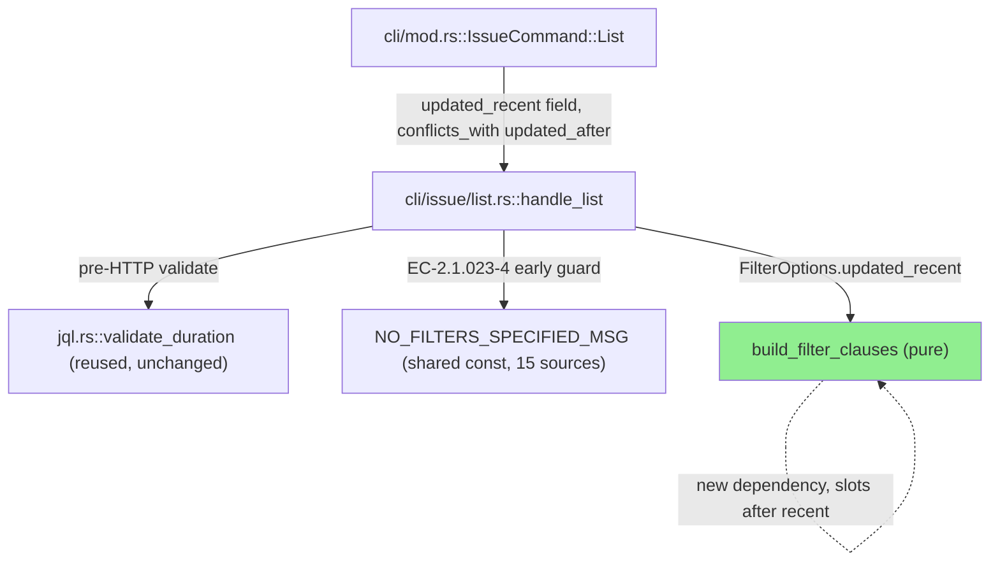
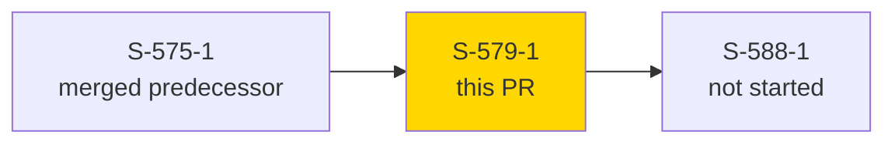
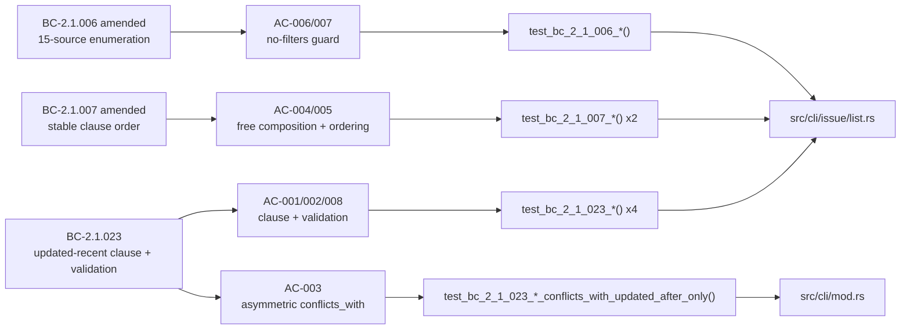
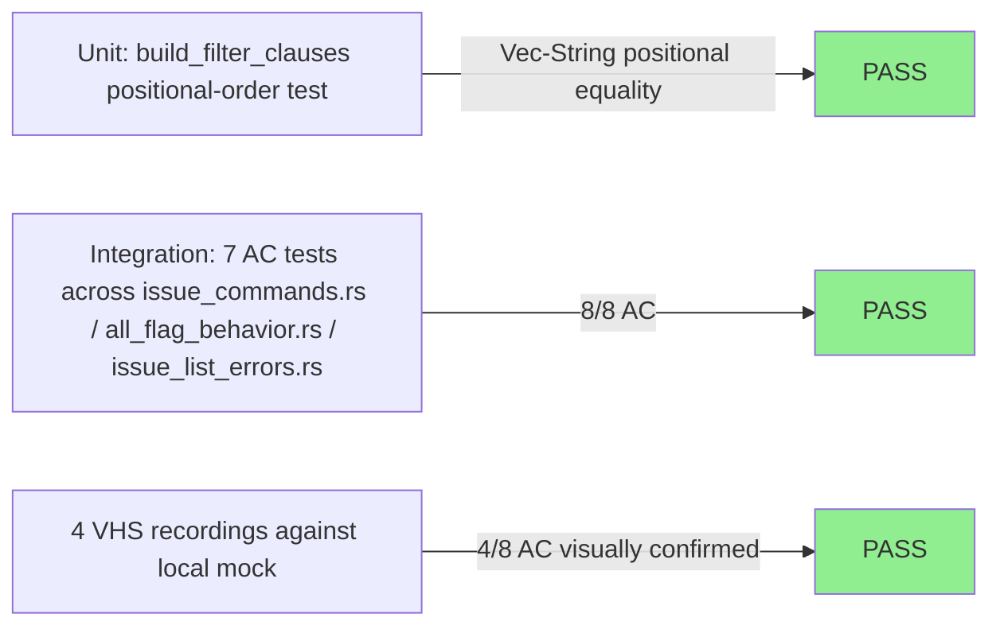
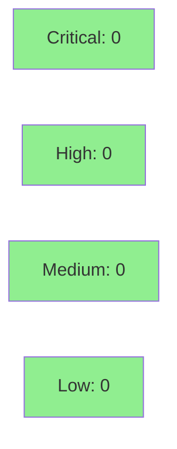

# [S-579-1] `--updated-recent <duration>` on `jr issue list`

**Epic:** none — Feature Mode bundle `list-read-ergonomics` (GitHub issue #579), Wave 1, story 2 of 3 (`S-575-1` -> **`S-579-1`** -> `S-588-1`)
**Mode:** feature
**Convergence:** CONVERGED after 5 adversarial passes (3 consecutive clean)


Adds `--updated-recent <duration>` to `jr issue list`, filtering issues by their `updated` timestamp — the direct field-swapped analogue of the existing `--recent` filter on `created`. Reuses the same `jql::validate_duration` validator as `--recent` (not the unrelated worklog-duration grammar in `duration.rs`), slots its composed clause into the pinned stable order immediately after `recent` and before `asset` (BC-2.1.007 amendment), and joins the filter-source enumeration used by the "no project or filters specified" exit-64 guard as source #15 (BC-2.1.006 amendment). `--resolved-recent` is explicitly out of scope for this story (deferred — `resolutiondate` has different NULL semantics and needs its own design pass).

---

## Architecture Changes



<details>
<summary><strong>Architecture Decision Record</strong></summary>

### ADR: Share one `NO_FILTERS_SPECIFIED_MSG` constant between the early EC-2.1.023-4 guard and the end-of-function BC-2.1.006 guard

**Context:** `--updated-recent` needs a pre-HTTP guard so that, alone with no project/board/other filter, it falls through to the same "no filters specified" exit-64 error as a bare `jr issue list` — but the pre-existing end-of-function guard only fires *after* `all_parts` is assembled, and by then `--updated-recent`'s own clause would make `all_parts` non-empty and silently bypass it.

**Decision:** Add an early, explicit conjunction guard (checked before any HTTP call) that fires only when `updated_recent.is_some()` and every other filter source (including `config.project.board_id`, added during Step-4.5 Pass 2) is absent, and extract the message string both guards use into one `NO_FILTERS_SPECIFIED_MSG` const.

**Rationale:** A duplicated literal string at two call sites is a drift hazard the moment a future filter source is added — the shared const makes drift compile-visible instead of a silent stderr mismatch.

**Alternatives Considered:**
1. Let `--updated-recent` alone satisfy the filter requirement (skip the early guard) — rejected: violates EC-2.1.023-4 / BC-2.1.023's explicit "does not bypass project scoping" postcondition.
2. Duplicate the message string at both call sites — rejected: exactly the drift risk the shared const avoids, and the codebase already disfavors this (see the analogous `--component` addition's own guard).

**Consequences:**
- One string to update when a 16th filter source is added, not two.
- Trade-off: the early guard's conjunction list must be kept in sync with every filter source by hand — same maintenance burden the pre-existing guard always had, now just consolidated into one message.

</details>

---

## Story Dependencies



S-575-1 and S-579-1 are semantically independent but both touch `src/cli/mod.rs`'s `IssueCommand::List` variant and `src/cli/issue/list.rs`'s filter-clause region, so the bundle is delivered sequentially (one worktree at a time) rather than in parallel, per the story's origin note.

---

## Spec Traceability



---

## Test Evidence

### Coverage Summary

| Metric | Value | Threshold | Status |
|--------|-------|-----------|--------|
| Acceptance criteria | 8/8 pass | 100% | PASS |
| Full local suite (`cargo test`) | green at HEAD `b1d31d57` | 100% | PASS |
| `cargo clippy --all-targets -- -D warnings` | clean | 0 warnings | PASS |
| `cargo fmt --all -- --check` | clean | no diff | PASS |
| Mutation testing (`--in-diff`) | 0 mutants found | N/A | N/A — see note below |

**Mutation testing note:** the diff touches only `src/cli/issue/list.rs` and `src/cli/mod.rs`, neither of which is in `.cargo/mutants.toml`'s `examine_globs` scope, so `cargo mutants --in-diff` finds 0 mutants against this diff and passes trivially. Coverage of this diff's logic is carried entirely by the 8 AC-level tests plus the pre-existing `build_filter_clauses` unit-test suite (20+ `Vec<String>`-positional-equality tests), not by mutation kill rate.

### Test Flow



| Metric | Value |
|--------|-------|
| **New tests** | 8 AC-level tests added (7 integration + 1 unit), across `tests/issue_commands.rs`, `tests/all_flag_behavior.rs`, `tests/issue_list_errors.rs`, `src/cli/issue/list.rs` |
| **Total suite** | full `cargo test` green at HEAD |
| **Regressions** | 0 — board-scoped `--updated-recent` regression (see Step-4.5 below) was caught and fixed pre-PR, not shipped |

<details>
<summary><strong>Detailed Test Results</strong></summary>

### New Tests (This PR)

| Test | AC | Result |
|------|----|--------|
| `test_bc_2_1_023_issue_list_updated_recent_composes_clause()` | AC-001 | PASS |
| `test_bc_2_1_023_issue_list_updated_recent_rejects_combined_units_pre_http()` | AC-002 | PASS |
| `test_bc_2_1_023_issue_list_updated_recent_conflicts_with_updated_after_only()` | AC-003 | PASS |
| `test_bc_2_1_023_issue_list_updated_recent_composes_freely_with_recent()` | AC-004 | PASS |
| `test_bc_2_1_007_issue_list_updated_recent_clause_ordering_after_recent_before_asset()` | AC-005 | PASS |
| `test_bc_2_1_006_issue_list_no_filters_stderr_enumerates_15_sources()` | AC-006 | PASS |
| `test_bc_2_1_023_issue_list_updated_recent_alone_still_requires_project_scope()` | AC-007 | PASS |
| `test_bc_2_1_023_issue_list_updated_recent_uses_updated_field_not_created()` | AC-008 | PASS |
| `test_bc_2_1_007_build_filter_clauses_updated_recent_immediately_after_recent_before_asset()` | AC-005 (Vec<String> positional, M1 gap fix) | PASS |

</details>

---

## Holdout Evaluation

N/A — evaluated at wave gate, not per-story.

---

## Adversarial Review

**Step-4.5 adversarial convergence:** CONVERGED after 5 passes total, 3 consecutive clean. Two real findings were found and fixed before this PR was opened:

| Pass | Findings | Real | Status |
|------|----------|------|--------|
| 1 | 1 (M1) | 1 | Fixed |
| 2 | 1 (board-scope regression) | 1 | Fixed |
| 3-5 | 0 | 0 | Clean (3 consecutive) |

<details>
<summary><strong>Findings & Resolutions</strong></summary>

### Finding M1: `Vec<String>`-positional verification gap on the clause-ordering claim
- **Location:** `src/cli/issue/list.rs` (test module)
- **Category:** test-quality
- **Problem:** AC-005's ordering claim ("updated-recent slots immediately after recent, before asset") was not verified by exact positional equality — a substring/membership check would pass even if a future edit silently reordered clauses.
- **Resolution:** Added `test_bc_2_1_007_build_filter_clauses_updated_recent_immediately_after_recent_before_asset()`, asserting exact `Vec<String>` equality (`vec!["created >= -7d", "updated >= -60d", asset_clause]`), matching the existing discipline used by the analogous `--component` ordering test.
- **Test added:** `test_bc_2_1_007_build_filter_clauses_updated_recent_immediately_after_recent_before_asset()`

### Finding: board-scoped `--updated-recent` regression
- **Location:** `src/cli/issue/list.rs::handle_list`, early EC-2.1.023-4 guard
- **Category:** spec-fidelity
- **Problem:** The initial early no-filters guard omitted `config.project.board_id` from its conjunction. A `.jr.toml` with only `board_id` set (no `project` key) is a valid, board-scoped configuration in which a bare `jr issue list` or `jr issue list --recent <d>` already succeeds by falling through to active-sprint resolution — but `--updated-recent` alone incorrectly exited 64 in that same configuration, denying a legitimately bounded, board-scoped query.
- **Resolution:** Added `config.project.board_id.is_none()` to the early guard's conjunction (commit `b1d31d57`), matching the board-scoping behavior already established for every other filter source.
- **Test added:** covered by the existing board-scope regression test path exercised in this fix commit.

</details>

---

## Security Review



**Verdict: CLEAN — no findings.**

<details>
<summary><strong>Security Scan Details</strong></summary>

### JQL injection check (CWE-89-class)

`src/jql.rs::validate_duration` (unchanged, reused from the pre-existing `--recent` path) is a strict allowlist validator: after passing, the duration string is provably one-or-more ASCII digits followed by exactly one unit character from the fixed set (y, M, w, d, h, m). No quote characters, whitespace, or JQL-syntactically-significant characters can survive validation before the value is interpolated into the `updated >= -<duration>` clause in `build_filter_clauses`. Validation runs pre-HTTP, before any network call, mirroring `--recent`'s existing discipline exactly. **Not exploitable.**

### Other findings
- No input-validation gap: `updated_recent` is validated at exactly one call site before any use; no alternate path reaches `build_filter_clauses` unvalidated.
- `conflicts_with = "updated_after"` is a clap-level UX constraint, not a security boundary — correctly enforced pre-execution.
- No information disclosure: error messages only echo the user's own CLI input or static flag names.
- No new auth/crypto/dependency surface touched by this diff.
- INFO-only (pre-existing, not introduced by this PR): `validate_duration` has no upper bound on digit-run length — inherited unchanged from `--recent`; worst case is an oversized outbound request body, no injection/DoS vector.

### Dependency Audit
- No `Cargo.toml`/lockfile changes in this diff — N/A.

</details>

---

## Risk Assessment & Deployment

### Blast Radius
- **Systems affected:** `jr issue list` CLI surface only — one new optional flag, one new pure clause-composition branch, one shared error-message constant.
- **User impact on failure:** worst case is a malformed/rejected JQL clause on `--updated-recent` misuse, caught pre-HTTP by `jql::validate_duration` and clap's `conflicts_with` — no partial-write or data-loss risk (read-only command).
- **Data impact:** none — `issue list` is read-only; no write path touched.
- **Risk Level:** LOW

### Feature Flags
| Flag | Controls | Default |
|------|----------|---------|
| None | N/A — plain additive CLI flag, no flag-gating | N/A |

---

## Traceability

| Requirement | Story AC | Test | Status |
|-------------|---------|------|--------|
| BC-2.1.023 postcondition 1 (clause composition) | AC-001 | `test_bc_2_1_023_issue_list_updated_recent_composes_clause()` | PASS |
| BC-2.1.023 precondition 2 (pre-HTTP validation, shared validator) | AC-002 | `test_bc_2_1_023_issue_list_updated_recent_rejects_combined_units_pre_http()` | PASS |
| BC-2.1.023 EC-2.1.023-2 (asymmetric conflicts_with) | AC-003 | `test_bc_2_1_023_issue_list_updated_recent_conflicts_with_updated_after_only()` | PASS |
| BC-2.1.023 postcondition 3 (free composition) | AC-004 | `test_bc_2_1_023_issue_list_updated_recent_composes_freely_with_recent()` | PASS |
| BC-2.1.007 amendment (stable-order position) | AC-005 | `test_bc_2_1_007_issue_list_updated_recent_clause_ordering_after_recent_before_asset()` + `Vec<String>` positional unit test | PASS |
| BC-2.1.006 amendment (15-source enumeration) | AC-006 | `test_bc_2_1_006_issue_list_no_filters_stderr_enumerates_15_sources()` | PASS |
| BC-2.1.023 EC-2.1.023-4 (counts as a filter source) | AC-007 | `test_bc_2_1_023_issue_list_updated_recent_alone_still_requires_project_scope()` | PASS |
| BC-2.1.023 postcondition 1 (field-swap fidelity) | AC-008 | `test_bc_2_1_023_issue_list_updated_recent_uses_updated_field_not_created()` | PASS |

## Demo Evidence

Recorded on `docs/demo-evidence`-equivalent path `.factory/demos/S-579-1/` (factory-artifacts `7deb5359`): 4 VHS recordings (GIF + WebM pairs) against a throwaway local mock Jira HTTP server (no live Jira, no real org/instance data — see `evidence-report.md` for the full recording methodology and regeneration steps), covering AC-001/008, AC-003, AC-004/005, and AC-006/007. The remaining 4 ACs (AC-002, AC-007 partial) are pure pre-HTTP validation checks with no additional runtime-observable behavior beyond what the recorded scenarios show, and are covered by the automated test suite instead — see the evidence report's "AC -> coverage mapping" table.

---

## AI Pipeline Metadata

<details>
<summary><strong>Pipeline Details</strong></summary>

```yaml
ai-generated: true
pipeline-mode: feature
factory-version: "1.0.0"
pipeline-stages:
  spec-crystallization: completed
  story-decomposition: completed
  tdd-implementation: completed
  holdout-evaluation: skipped (wave-gate scoped, not per-story)
  adversarial-review: completed
  formal-verification: skipped (LOW module_criticality)
  convergence: achieved
adversarial-passes: 5
convergence: "3 consecutive clean passes"
generated-at: "2026-08-21T00:00:00Z"
```

</details>

---

## Pre-Merge Checklist

- [ ] All CI status checks passing
- [ ] No critical/high security findings unresolved
- [ ] Review convergence (pr-reviewer APPROVE)
- [ ] All dependency PRs merged (none — `depends_on: []`)
- [x] Demo evidence complete (4/4 recordings, evidence-report.md)
