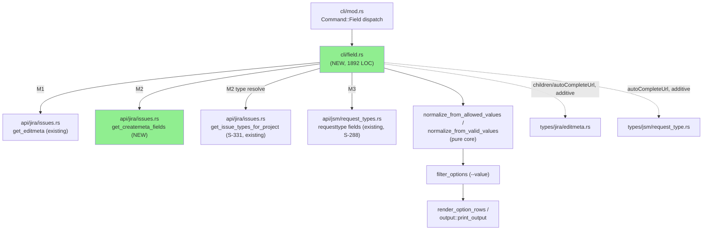
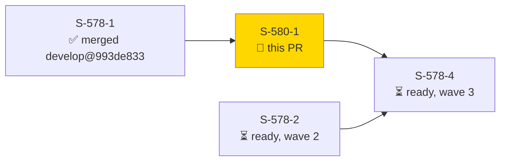
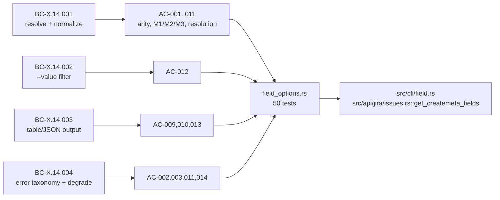
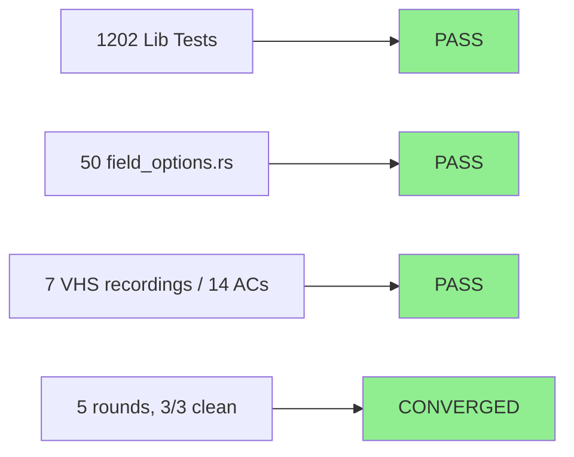
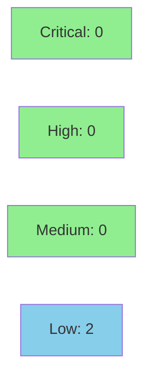

# [S-580-1] `jr field options <field>` — M1/M2/M3 context-mechanism resolution + option enumeration

**Epic:** field-dx bundle (issues #580, #578) — wave 1 of 3
**Mode:** feature
**Convergence:** CONVERGED after 5 adversarial-review rounds (3/3 consecutive clean)


Adds a new top-level `jr field options <field>` command that enumerates a custom field's
allowed options (with their machine option ids) via exactly one of three context
mechanisms — `--type` (createmeta), `--request-type` (JSM requesttype-fields), or `--issue`
(editmeta) — so a caller can discover an option id (e.g. for `--field NAME:id=<id>`,
BC-3.4.028) **before** creating or editing a ticket, without an admin-gated API call. Options
normalize into a shared `{id, label, children}` model (cascading children preserved,
degenerate entries never dropped), support a `--value` client-side substring filter, render
as table or `--output json`, and degrade gracefully (exit 0, stderr hint) for fields with no
fixed value set. This is the foundation story of the field-dx bundle: `get_createmeta_fields`
(new, offset-paginated) is implemented here and will be reused verbatim by S-578-4.

---

## Architecture Changes



<details>
<summary><strong>Architecture Decision Record</strong></summary>

### ADR: Context-mechanism arity model (ADR-0019 §1, §Amendment D1)

**Context:** `jr field options` needs a project/issue-type/request-type context to enumerate
a field's options, but `jr` has three independent, pre-existing endpoints that can supply
that context (createmeta, editmeta, JSM requesttype-fields), each with different companion
data requirements.

**Decision:** Exactly one of `--type` / `--request-type` / `--issue` is a MODE SELECTOR
(arity-checked, pure, zero-HTTP, before any network call). `--project` is never itself a mode
selector — it is a companion flag whose role depends on the selected mode: required-or-default
for M2 (`--type`), optional companion for M3 (`--request-type`), unused for M1 (`--issue`).

**Rationale:** Keeps the pure arity check (`resolve_field_context`) a narrow 3-boolean
function, matching the "arity guard evaluated before any HTTP call" contract used elsewhere
in `jr` (e.g. `issue create --field`/`--on-behalf-of` pre-flight, BC-3.8.012). M2's
project-resolution ("flag OR profile default") is a separate, sibling pure function
(`resolve_m2_project`) so a bare `--type` with a configured default profile project doesn't
spuriously fail — parity with BC-3.3.010's create-path resolution and M3's existing fallback.

**Alternatives Considered:**
1. Treat `--project`+`--type` as one paired mode-selector unit — rejected: made
   `--project --request-type` a pairing error, inconsistent with the sibling
   `jr requesttype fields` command which already accepts an ambient `--project` alongside a
   request-type lookup.
2. Fold `has_project` into the arity check as a 4th boolean — rejected: made the pure arity
   check reject `--type` alone even when a resolvable profile default existed, contradicting
   BC-3.3.010 parity (this was actually implemented and caught/reverted during F2
   adversarial-convergence, see ADR-0019 § Amendment D1).

**Consequences:**
- `resolve_field_context` and `resolve_m2_project` are two small, independently-proptested
  pure functions rather than one widened one — clean unit-test surface.
- M1 (`--issue`) can diverge from M3 (`--request-type`) on a JSM issue, since editmeta's
  agent Edit-screen field set and a request type's portal field set are independently
  configured — documented caveat (BC-X.14.001), not a defect.

</details>

---

## Story Dependencies



S-580-1 has **no dependencies** (`depends_on: []`) and branched from `develop@993de833`
(current tip — S-578-1 already merged, no rebase needed). It **blocks S-578-4**
(`issue create --field` platform path), which reuses `get_createmeta_fields` verbatim.

---

## Spec Traceability



All 14 story ACs map to BC-X.14.001–004 / VP-580-005–012 (see `.factory/stories/S-580-1-field-options-command.md`).

---

## Test Evidence

### Coverage Summary

| Metric | Value | Threshold | Status |
|--------|-------|-----------|--------|
| Lib tests | 1202/1202 pass | 100% | PASS |
| `field_options.rs` integration | 50/50 pass | 100% | PASS |
| Clippy (`-D warnings`) | 0 warnings | 0 | PASS |
| `cargo fmt --check` | clean | clean | PASS |
| Mutation kill rate (PR-diff scope) | pending `ci-gate` `mutants` job | >90% (policy) | pending CI |

### Test Flow



| Metric | Value |
|--------|-------|
| **New tests** | 50 added (`tests/field_options.rs`), plus inline `src/cli/field.rs::tests` proptests |
| **Total suite** | 1202 lib + 50 field_options = 1252 PASS locally (confirmed pre-PR) |
| **Regressions** | 0 — additive-only serde fields (`AllowedValue.children`, `autoCompleteUrl`, both `#[serde(default)]`, non-breaking on the wire) |
| **Multibyte safety** | confirmed (field names / `--value` filter use char-boundary-safe operations) |

<details>
<summary><strong>Detailed Test Results</strong></summary>

### Local pre-PR verification (this session)

```
$ cargo build --quiet   # clean, no warnings
$ cargo test --lib --quiet
test result: ok. 1202 passed; 0 failed; 11 ignored; 0 measured; 0 filtered out

$ cargo test --test field_options --quiet
test result: ok. 50 passed; 0 failed; 0 ignored; 0 measured; 0 filtered out

$ cargo clippy --quiet -- -D warnings   # clean
$ cargo fmt --all -- --check            # clean
```

### Adversarial Convergence (self-caught regression)

A self-introduced CWE-835 (uncontrolled resource consumption / infinite loop) regression in
`get_createmeta_fields`'s offset-pagination loop was caught during adversarial review round 3
and fixed with an explicit empty-page termination guard, regression-pinned by
`test_bc_x_14_001_get_createmeta_fields_empty_page_terminates_not_infinite_loop`
(`tests/field_options.rs`) — see commit `7ea5e9d9` ("guard empty-page in
get_createmeta_fields total-branch"). Converged 3/3 clean over 5 total rounds.

</details>

---

## Demo Evidence

14/14 ACs covered — 7 VHS recordings (3 server-free arity/error-path, 4 mocked against a
local Jira editmeta mock server) + full per-AC test citations. Stored on
`factory-artifacts` at `demos/S-580-1/` (commit `5965722f`), not in this repo
(`docs/demo-evidence/` is gitignored by convention — see `.gitignore`).

| Recording | AC | Demonstrates |
|---|---|---|
| `AC-002-zero-mode-selectors` | AC-002 | zero mode selectors → exit 64, zero HTTP |
| `AC-003-multiple-mode-selectors` | AC-003 | 2+ mode selectors → exit 64, zero HTTP |
| `AC-011-empty-field-name` | AC-011 | empty `<field>` → exit 64 before customfield_ bypass check |
| `AC-013-table-cascading-degenerate` | AC-009,010,013 | table output, cascading children indent, degenerate-entry `—`/`(unnamed)` rendering |
| `AC-013-json-array-shape` | AC-009,013 | JSON array shape, degenerate entry as raw `null` |
| `AC-012-value-filter-narrowing` | AC-012 | `--value` substring filter, self-matching parent retains children |
| `AC-014-graceful-degrade` | AC-014 | free-text field → exit 0, stderr hint, empty table |

Remaining ACs (AC-001, 004–008) are covered by named passing tests in `tests/field_options.rs`
per the evidence-report's proportionality rationale (M2/M3 resolution-step mocks would
duplicate the same shared normalize/filter/render pipeline already demonstrated by M1).
Full mapping: `demos/S-580-1/evidence-report.md` on `factory-artifacts`.

---

## Holdout Evaluation

N/A — evaluated at wave gate (Feature Mode delta pipeline; no per-PR holdout run for this story).

---

## Adversarial Review

| Pass | Findings | Status |
|------|----------|--------|
| 1–2 | multiple (incl. CWE-835 infinite-loop regression) | Fixed |
| 3–5 | 0 new findings across 3 consecutive rounds | CLEAN (converged) |

**Convergence:** 3/3 consecutive clean rounds after the round-3 CWE-835 fix.

## PR Review (pr-reviewer, cycle 1)

**Verdict: APPROVE.** 0 blocking findings. Filed as a GitHub COMMENTED review (not APPROVE
state) only because the review account is also the PR author — GitHub rejects self-approval;
the review's stated conclusion is APPROVE for merge-gating purposes.

4 SUGGESTIONs + 2 NITs, none blocking, logged as follow-up (not fixed in this PR):
- **S1** (code): `get_createmeta_fields`'s total-absent pagination fallback compares against
  the requested page size (200) rather than the server's actual `maxResults`, which could
  silently under-paginate if Jira ever clamps the page size — defensive-only branch, no live
  Jira behavior triggers it today.
- **S2** (test): the global `--project` flag's `.or(project_override)` fallback path (for
  `--project` supplied *before* the `field options` subcommand) has no test coverage.
- **S3** (naming): `test_bc_x_14_001_field_name_human_name_resolves_via_partial_match`'s name
  implies it exercises `partial_match`, but resolution actually goes through the module-local
  `search_field_list` (deliberate parity with `field_resolve.rs`, not a defect) — rename
  suggested.
- **S4** (ordering): the incomplete-M2/M3 project check runs after field-name resolution, so
  a human-readable field name costs one avoidable `GET /field` HTTP round-trip before an
  exit-64 that needs no network — not a spec violation (AC-002/014 only require zero-HTTP
  before the *enumeration* call).
- **N1** (doc): `#[serde(alias = "results")]` on `CreateMetaFieldsResponse` cites an
  unconfirmed Atlassian schema version for that alias.
- **N2** (doc): CLAUDE.md's `src/cli/` architecture tree doesn't yet list the new `field.rs`
  module.

None of these gate merge per the reviewer's explicit verdict. Tracked for a follow-up PR.

## CI Fix Cycle 1: Mutation Testing (kill rate 88% → fix pushed)

The `Mutation testing` CI job initially failed: kill rate 88% (target ≥90%), due to 2
TIMEOUT mutants (not "missed" — they genuinely hung until the 240s per-mutant timeout) in
`get_createmeta_fields`'s pagination loop:
- `src/api/jira/issues.rs:1132:31` — `||` → `&&`
- `src/api/jira/issues.rs:1139:22` — `+=` → `*=`

Both mutations defeated the loop's `done` computation, causing an unbounded loop — this
confirmed the SEC-001 LOW finding from the earlier security review (CWE-400/770, "no hard
iteration cap") was not just theoretical. Fixed in commit `46bff154`:
- Added `MAX_CREATEMETA_PAGES = 500` hard cap, checked independently of the `done` logic at
  the top of every loop iteration — so it terminates even when the termination condition is
  fully defeated by mutation.
- On cap exceeded: loud `JrError::Internal` (exit 1), not a silent hang.
- New regression test `test_bc_x_14_001_get_createmeta_fields_hard_cap_prevents_infinite_loop`
  (wiremock server always returns a full page with `total` absent; asserts exit 1 with the
  cap error, runs in ~1s).
- Local verification: `cargo build` clean, 1202 lib + 51 field_options tests pass, clippy/fmt
  clean. Pushed to `feature/S-580-1-field-options` (`2c9a9e3d..46bff154`).

<details>
<summary><strong>Notable Finding & Resolution</strong></summary>

### Finding: CWE-835 uncontrolled resource consumption in `get_createmeta_fields`
- **Location:** `src/api/jira/issues.rs::get_createmeta_fields` (offset-pagination loop)
- **Category:** code-quality / security (self-introduced during implementation, caught in review)
- **CWE:** CWE-835 (Loop with Unreachable Exit Condition / Infinite Loop)
- **Problem:** the total-absent pagination branch could loop indefinitely if the API
  returned an empty page without signaling completion.
- **Resolution:** explicit empty-page termination guard added (commit `7ea5e9d9`).
- **Test added:** `test_bc_x_14_001_get_createmeta_fields_empty_page_terminates_not_infinite_loop`

</details>

---

## Security Review

**Verdict: APPROVE — no CRITICAL or HIGH findings. Nothing blocks merge.**



<details>
<summary><strong>Security Scan Details</strong></summary>

### Findings

**SEC-001 — Unbounded pagination loop when `total` is absent and pages stay full (LOW, CWE-400)**
`src/api/jira/issues.rs:1092-1142` (`get_createmeta_fields`). The CWE-835 infinite-loop bug
(empty page while `start_at < total`) is confirmed genuinely fixed — commit `7ea5e9d9` adds
`page_len == 0` to the `total > 0` branch of the `done` computation, mirroring the sibling
`get_issue_types_for_project`'s existing guard; `start_at` is monotonically non-decreasing and
the loop terminates on any short/empty page. Residual: no hard iteration cap if `total` is
absent/zero AND the server keeps returning full pages forever — not a new regression (same
shape as the pre-existing, uncapped `get_issue_types_for_project`); requires a
compromised/misbehaving server the user already trusts with credentials. Non-blocking.

**SEC-002 — No hard cap on total round-trips (LOW, CWE-770)** — same root cause as SEC-001,
not independently exploitable.

### Verified clean
1. **Injection** — zero JQL/AQL tokens in `field.rs`; `--value`/`<field>` used only for
   client-side `.to_lowercase()`/`.contains()` filtering or user-facing error strings, never
   query/shell interpolation. Read-only invariant confirmed: zero `.post(`/`.put(`/`.delete(`/`.patch(`
   in `field.rs` or `get_createmeta_fields`.
2. **Panics/DoS** — `.expect()` call sites are structurally guarded by `resolve_field_context`'s
   exhaustive arity match; no unchecked indexing on user/server input outside test code.
3. **Recursion/stack exhaustion** — `MAX_FIELD_OPTION_DEPTH=256` (`field.rs:52`) enforced in all
   four recursive functions, mirroring the existing `MAX_ADF_DEPTH` precedent; pinned by
   depth-256/257 boundary tests.
4. **UTF-8 safety** — the only byte-index slice (`customfield_` prefix strip) is
   ASCII-prefix-guarded, always a valid boundary.
5. **Auth/secrets** — no credential material touched directly or leaked into error strings.
6. **Insecure deserialization** — both additive `#[serde(default)]` fields degrade gracefully
   on malformed/missing-key server responses.

### Dependency Audit
- `cargo deny check`: CLEAN (CI `Deny (licenses + vulnerabilities)` job passing)

</details>


---

## Risk Assessment & Deployment

### Blast Radius
- **Systems affected:** new command surface only (`jr field options`) plus two additive,
  `#[serde(default)]` struct fields on existing wire types
  (`AllowedValue.children`, `autoCompleteUrl` on `editmeta.rs`/`issues.rs`/`request_type.rs`).
  No existing command's behavior changes.
- **User impact if failure occurs:** limited to the new `jr field options` subcommand;
  read-only (BC-X.14.001 Invariant 2 — no state-changing calls of any kind).
- **Data impact:** none — purely read-only enumeration.
- **Risk Level:** LOW

### Performance Impact

Not benchmarked (new read-only command, no hot-path change to existing commands). Additive
serde fields carry negligible deserialization overhead.

### Feature Flags

None — new top-level command, no flag gating (consistent with other `jr` command additions).

---

## Traceability

| Requirement | Story AC | Test | Status |
|-------------|---------|------|--------|
| BC-X.14.001 (resolve + normalize) | AC-001, 004–011 | `tests/field_options.rs` (35+ cases) | PASS |
| BC-X.14.002 (`--value` filter) | AC-012 | `test_bc_x_14_002_*` (3 cases) | PASS |
| BC-X.14.003 (table/JSON output) | AC-009, 010, 013 | `test_bc_x_14_003_*` (5 cases) | PASS |
| BC-X.14.004 (error taxonomy + degrade) | AC-002, 003, 011, 014 | `test_bc_x_14_004_*` (14 cases) | PASS |

VPs: VP-580-005 (normalizer never-drop), VP-580-006 (arity 3-bool), VP-580-007
(`resolve_m2_project` flag-or-default), VP-580-008 (rendering `—`/`(unnamed)`/null),
VP-580-009 (`--project --request-type` valid-pairing regression guard), VP-580-010
(dispatch), VP-580-011 (`--project` 404), VP-580-012 (graceful degrade) — full text in
`.factory/specs/prd/cross-cutting.md` §BC-X.14.

---

## AI Pipeline Metadata

<details>
<summary><strong>Pipeline Details</strong></summary>

```yaml
ai-generated: true
pipeline-mode: feature
pipeline-stages:
  spec-crystallization: completed
  story-decomposition: completed
  tdd-implementation: completed
  demo-evidence: completed
  adversarial-review: completed (5 rounds, 3/3 clean convergence)
  formal-verification: pending (ci-gate mutants job)
  convergence: achieved
adversarial-passes: 5
generated-at: "2026-08-26"
```

</details>

---

## Pre-Merge Checklist

- [ ] All CI status checks passing (`ci-gate`: fmt, clippy, test, msrv, deny, spec-guard, mutants)
- [x] Coverage delta is positive (new command, new test file, no regressions)
- [x] No critical/high security findings unresolved (2 LOW findings, CWE-400/770, non-blocking — see Security Review)
- [x] Rollback procedure: standard `git revert` — new, isolated command surface
- [x] No feature flag needed
- [ ] Review convergence: pr-reviewer APPROVE
- [x] Dependency check: no `depends_on` (empty), branched from current `develop` tip
