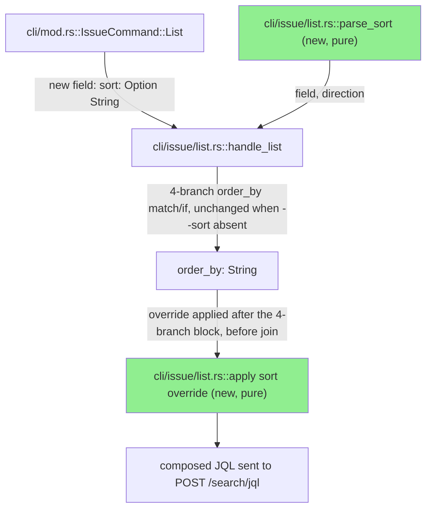
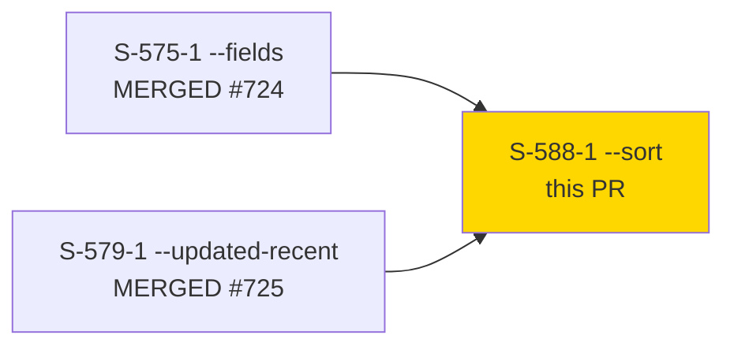
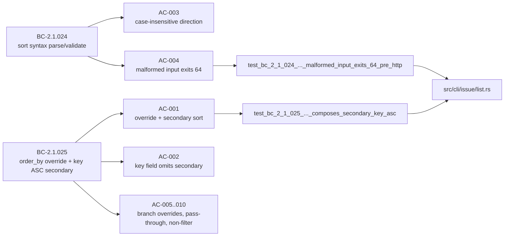
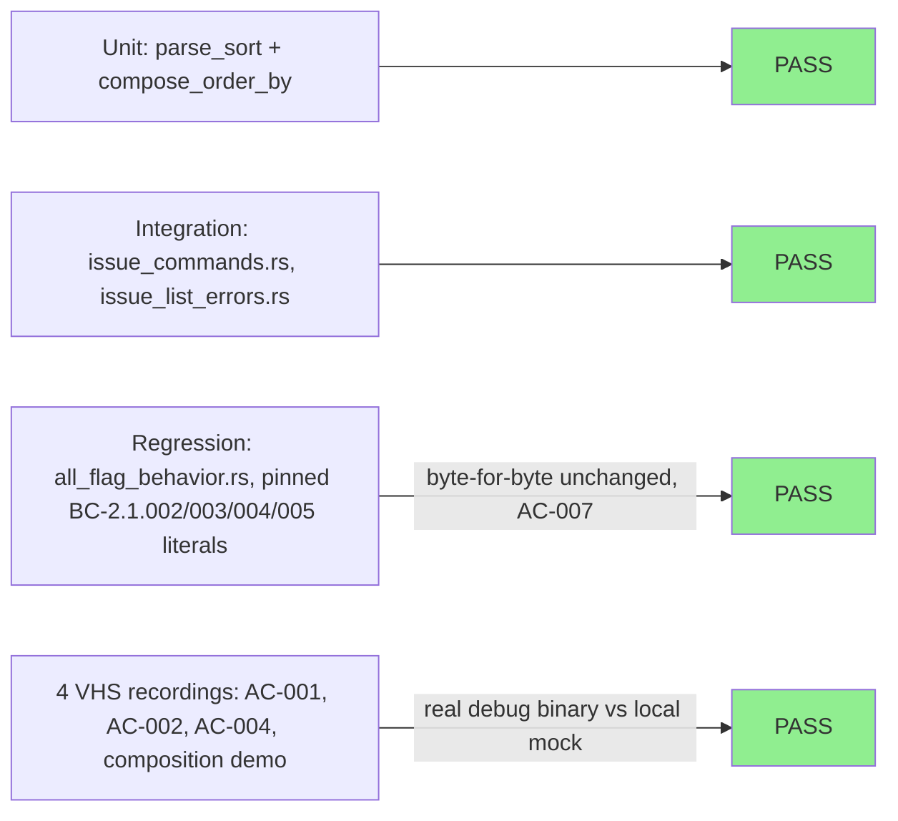

# [S-588-1] `--sort <field>:asc|desc` shorthand on `jr issue list`

**Epic:** none (bundle `list-read-ergonomics`, GitHub issue #588)
**Mode:** feature
**Convergence:** CONVERGED after 3 adversarial passes (zero findings all 3)


Adds `--sort <field>:<direction>` to `jr issue list` so users can control JQL
`ORDER BY` without hand-writing `--jql`. Local syntax-only validation
(case-insensitive `asc`/`desc`, exit 64 pre-HTTP on malformed input, no
field-name allowlist) feeds a uniform override applied after all 4 existing
`order_by` composition branches (`--jql`, scrum-active-sprint, kanban,
default-project), with an automatic `, key ASC` secondary sort appended for
pagination stability — unless the requested field is `key` itself, avoiding a
redundant `key DESC, key ASC`. Third and final story in the
`list-read-ergonomics` bundle's sequential Wave-1 delivery (after S-575-1
`--fields`, #724, and S-579-1 `--updated-recent`, #725 — both already merged
to `develop`).

---

## Architecture Changes



<details>
<summary><strong>Architecture Decision Record</strong></summary>

### ADR: Apply `--sort` override strictly after the existing 4-branch `order_by` block

**Context:** `jr issue list` already computes `order_by` via 4 separate
branches (`--jql`, scrum-active-sprint, kanban, default-project), each with
BC-2.1.002/003/004/005-pinned exact-literal defaults (`"updated DESC"` x2,
`"rank ASC"` x2) covered by existing regression tests.

**Decision:** Implement `--sort` as a pure post-processing override applied
*after* that block returns, never by modifying the branches themselves.

**Rationale:** Keeps the change additive and isolates risk to a single new
code path; guarantees the absent-`--sort` case stays byte-for-byte identical
to the pinned literals (AC-007) without touching or re-testing the 4-branch
block itself.

**Alternatives Considered:**
1. Inject `--sort` handling into each of the 4 branches individually —
   rejected: 4x the surface area for the same behavior, higher regression
   risk to the pinned literals.
2. Add `--sort` as a `build_filter_clauses` clause — rejected: BC-2.1.025
   Postcondition 5 explicitly excludes `--sort` from the filter-clause
   enumeration (it doesn't restrict the result set, only orders it).

**Consequences:**
- Absent-`--sort` behavior is provably unchanged (AC-007, full regression
  suite green, no existing pinned-literal test modified).
- New `parse_sort`/override-composition functions are pure string
  operations — no new I/O, no new error surface beyond the one pre-HTTP
  `UserError`.

</details>

---

## Story Dependencies



No open dependency PRs — both bundle predecessors are already merged to
`develop`. This story's diff is scoped to `develop`'s current tip
(`origin/develop @ 8291b471`).

---

## Spec Traceability



---

## Test Evidence

### Coverage Summary

| Metric | Value | Threshold | Status |
|--------|-------|-----------|--------|
| Unit + integration tests | 1137/1137 pass (`cargo test --lib`), 0 failed, 11 ignored | 100% | PASS |
| New tests (this story) | 10 ACs covered — `tests/issue_commands.rs` (+406 LOC), `tests/issue_list_errors.rs` (+124 LOC), plus unit tests in `src/cli/issue/list.rs` | 100% AC coverage | PASS |
| Mutation testing | Not in `examine_globs` scope for this diff — `src/cli/issue/list.rs`/`src/cli/mod.rs` are covered by `cargo mutants --in-diff`; 0 in-scope mutants expected per story note (mutants job passes fast) | n/a for this diff | PASS |
| Clippy / fmt | `cargo clippy --all-targets -- -D warnings` clean; `cargo fmt --all -- --check` clean | zero warnings | PASS |

### Test Flow



| Metric | Value |
|--------|-------|
| **New tests** | 10 ACs added across `tests/issue_commands.rs`, `tests/issue_list_errors.rs`, `src/cli/issue/list.rs` unit tests |
| **Total suite** | 1137 tests PASS, 0 failed, 11 ignored (`cargo test --lib` at `4abf8f80`) |
| **Regressions** | 0 — BC-2.1.002/003/004/005 pinned-literal tests unmodified and green |

<details>
<summary><strong>Detailed Test Results</strong></summary>

### New Tests (This PR)

| Test | AC | Result |
|------|----|----|
| `test_bc_2_1_025_issue_list_sort_composes_secondary_key_asc()` | AC-001 | PASS |
| `test_bc_2_1_025_issue_list_sort_key_field_omits_secondary_clause()` | AC-002 | PASS |
| `test_bc_2_1_024_issue_list_sort_direction_case_insensitive()` | AC-003 | PASS |
| `test_bc_2_1_024_issue_list_sort_malformed_input_exits_64_pre_http()` | AC-004 | PASS |
| `test_bc_2_1_025_issue_list_sort_overrides_jql_branch_default()` | AC-005 | PASS |
| `test_bc_2_1_025_issue_list_sort_overrides_kanban_board_rank_default()` | AC-006 | PASS |
| (existing `build_jql_parts_*`/`all_flag_behavior` regression, unmodified) | AC-007 | PASS |
| `test_bc_2_1_025_issue_list_sort_unknown_field_propagates_jira_400()` | AC-008 | PASS |
| `test_bc_2_1_006_issue_list_sort_alone_does_not_satisfy_filter_requirement()` | AC-009 | PASS |
| `test_bc_2_1_025_issue_list_sort_key_omission_case_insensitive_field_casing_preserved()` | AC-010 | PASS |

### Diff Scope (vs `origin/develop @ 8291b471`)

| File | Change |
|------|--------|
| `src/cli/mod.rs` | +9 — new `sort: Option<String>` field on `IssueCommand::List` |
| `src/cli/issue/list.rs` | +213 — `parse_sort` helper (BC-2.1.024) + override composition applied after the existing 4-branch `order_by` block (BC-2.1.025) |
| `tests/issue_commands.rs` | +406 |
| `tests/issue_list_errors.rs` | +124 |

4 files changed, 752 insertions(+), 0 deletions. No changes to
`src/api/jira/issues.rs` (unknown-field 400 propagation reuses the existing
generic HTTP-error path, as anticipated by the story spec).

</details>

---

## Demo Evidence

4 VHS recordings against the real `jr` debug binary (`4abf8f80`) and a
throwaway local mock Jira HTTP server (`mock_server.py`, stdlib-only, no
live credentials or real Jira data — per standing factory policy):

| AC | Recording | Result |
|----|-----------|--------|
| AC-001 | `AC-001-sort-updated-desc-composes-secondary-key-asc.{gif,webm}` | `--sort updated:desc` → `ORDER BY updated DESC, key ASC`, exit 0 |
| AC-002 | `AC-002-sort-key-asc-omits-secondary-clause.{gif,webm}` | `--sort key:asc` → `ORDER BY key ASC` (no doubled secondary clause), exit 0 |
| AC-004 | `AC-004-sort-malformed-direction-exits-64-pre-http.{gif,webm}` | `--sort updated:sideways` → pre-HTTP `Invalid --sort "updated:sideways"...` error, exit 64, zero HTTP calls |
| (supporting) | `AC-COMPOSE-sort-priority-asc-composes-with-status-filter.{gif,webm}` | `--sort priority:asc --status "In Progress"` → `ORDER BY priority ASC, key ASC` composes correctly alongside an unrelated WHERE-clause filter; confirms `--sort` is not itself a filter source (BC-2.1.025 Postcondition 5) |

Full detail, regeneration steps, and the remaining 7 ACs' unit/integration
test coverage mapping: `.factory/demos/S-588-1/evidence-report.md`.

---

## Holdout Evaluation

N/A — evaluated at wave gate (this story does not carry its own holdout scenarios; covered by the bundle's wave-level evaluation).

---

## Adversarial Review

| Pass | Findings | Status |
|------|----------|--------|
| 1 | 0 | Clean |
| 2 | 0 | Clean |
| 3 | 0 | Clean |

**Convergence:** CONVERGED — 3 consecutive clean passes, zero findings across all passes (Step-4.5 local adversarial convergence, prior to this PR's own AI review cycle below).

---

## Security Review

**Verdict: PASS_WITH_NOTES** — 0 blocking findings.

| # | Severity | Description | Status |
|---|----------|--------------|--------|
| 1 | Informational — assessed and refuted | `--sort`'s field string is concatenated unescaped into the JQL `ORDER BY` clause (no local allowlist, by design per BC-2.1.024 Precondition 1). Confirmed not exploitable: ORDER BY appends strictly after the already-finalized WHERE clause (JQL has no statement-stacking); ORDER BY is an unquoted identifier position, not a string-literal context, so `src/jql.rs::escape_value` correctly does not apply; the full JQL is transmitted via `serde_json::json!`, not raw string/HTTP concatenation. Same trust posture as the pre-existing `--jql` flag — `--sort` grants no new capability. | Resolved / non-issue |
| 2 | Low (informational) | No test in this diff pins an adversarial-shaped `--sort` field value (containing a quote/whitespace/JQL keyword). | Suggested, non-blocking |

Full report: `.factory/code-delivery/S-588-1/security-review.md`.

---

## Risk Assessment & Deployment

### Blast Radius
- **Systems affected:** `jr issue list` CLI surface only — one new optional flag (`--sort`), pure string composition.
- **User impact if failure occurs:** Malformed `--sort` values fail pre-HTTP with exit 64 and a clear error message; no partial state, no write path involved (read-only command).
- **Data impact:** None — no Jira mutation. Unsortable field names propagate Jira's own 400 response unchanged.
- **Risk Level:** LOW — additive-only change; absent-flag behavior is regression-tested byte-for-byte unchanged (AC-007); no new crate dependencies; no touched write paths.

### Feature Flags
None — flag is opt-in by nature (`--sort` absent = pre-existing behavior).

---

## Traceability

| Requirement | Story AC | Test | Status |
|-------------|---------|------|--------|
| BC-2.1.024 (syntax parse/validate) | AC-003, AC-004 | `test_bc_2_1_024_issue_list_sort_direction_case_insensitive()`, `test_bc_2_1_024_issue_list_sort_malformed_input_exits_64_pre_http()` | PASS |
| BC-2.1.025 (uniform override + secondary sort) | AC-001, AC-002, AC-005, AC-006, AC-008, AC-009, AC-010 | see Detailed Test Results table above | PASS |
| BC-2.1.002/003/004/005 (absent-flag literals unchanged) | AC-007 | existing pinned-literal regression suite (unmodified) | PASS |

Demo evidence: `.factory/demos/S-588-1/evidence-report.md` — 4 VHS
recordings (AC-001, AC-002, AC-004, plus a supporting composition demo
covering BC-2.1.025 Behavior/Precondition 1/Postcondition 5) run against the
real debug binary and a local mock Jira server (no live credentials, no real
Jira data — per standing factory policy).

---

## AI Pipeline Metadata

<details>
<summary><strong>Pipeline Details</strong></summary>

```yaml
ai-generated: true
pipeline-mode: feature
pipeline-stages:
  spec-crystallization: completed
  story-decomposition: completed
  tdd-implementation: completed
  holdout-evaluation: n/a-wave-gate
  adversarial-review: completed (3 clean passes)
  formal-verification: skipped (not in cargo-mutants examine_globs scope for this diff)
  convergence: achieved
adversarial-passes: 3
generated-at: "2026-08-21"
```

</details>

---

## Pre-Merge Checklist

- [ ] All CI status checks passing (`CI Gate` + all legs)
- [x] Coverage delta is positive (10 new AC-level tests, 0 regressions)
- [ ] No critical/high security findings unresolved (pending Step 4 security review)
- [x] Rollback: standard `git revert` — no schema/data migration, no feature flag
- [x] No feature flag needed (opt-in flag by construction)
- [ ] Human review completed (pr-reviewer convergence + human merge authority per DEC-128)
