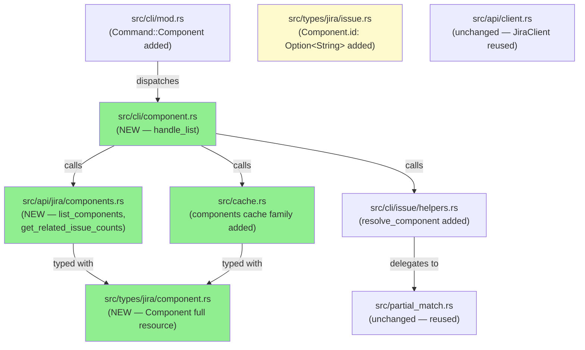
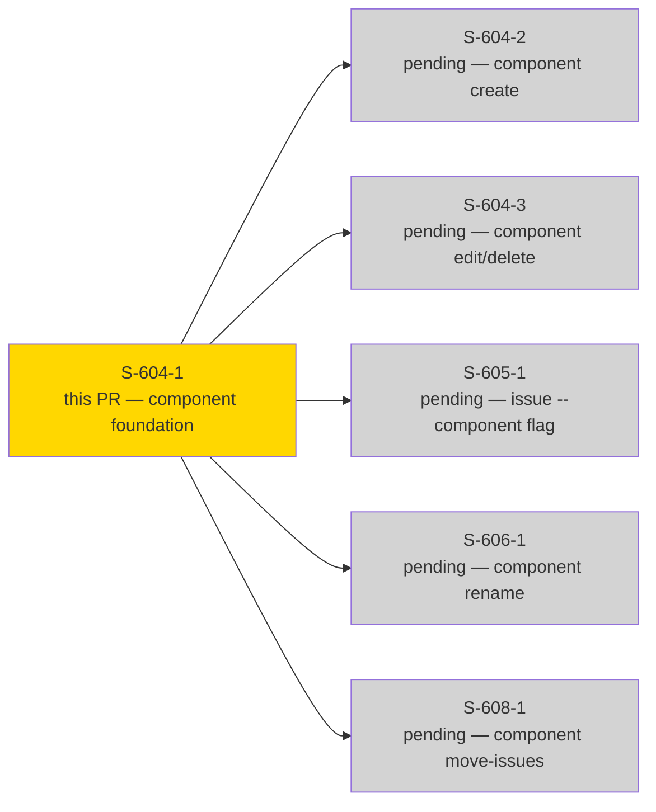
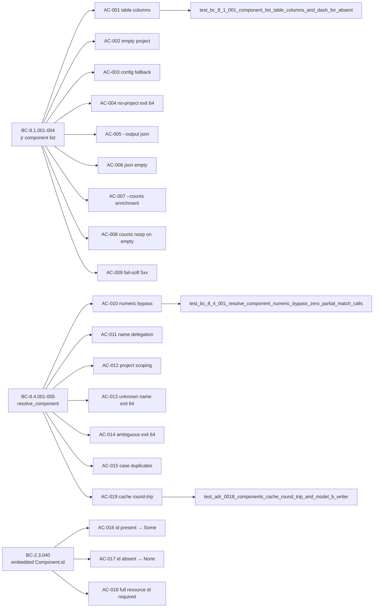
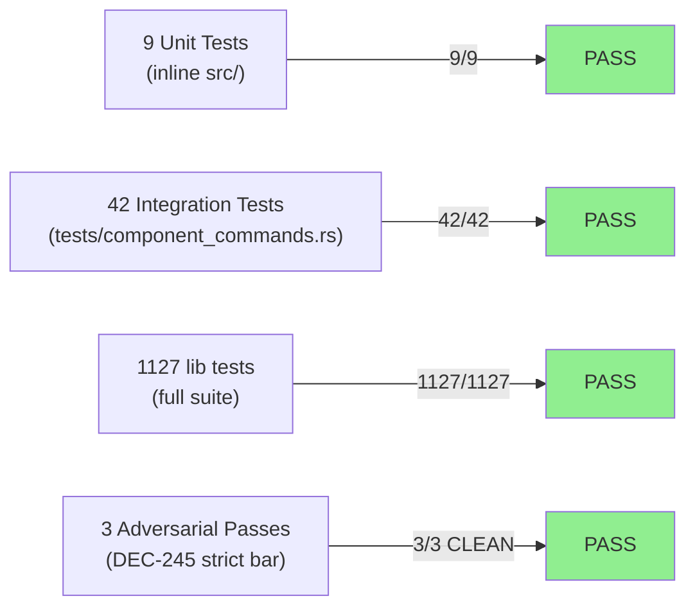
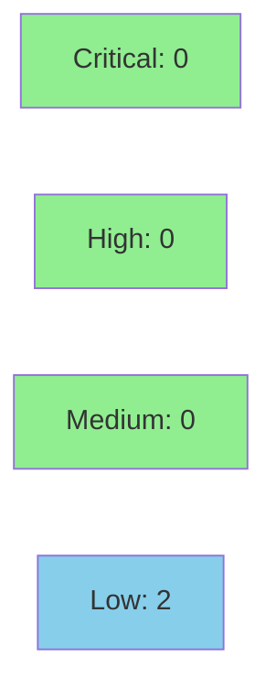

# [S-604-1] Component foundation: types, API client, cache family, resolver, CLI scaffold, and `jr component list`

**Epic:** cycle-component-mgmt — Component management bundle (#604/#605/#606/#608)
**Mode:** feature
**Convergence:** CONVERGED after 12 adversarial passes (3/3 CLEAN under DEC-245 strict bar)


This PR establishes the full foundation for `jr`'s component management feature group: a correctly-typed `Component` resource (distinct from the embedded `Component` already on `Issue.fields.components[]`), a `JiraClient` extension for listing components and fetching related-issue counts, a per-profile project-keyed components cache family following the `ProjectMeta` model-b writer convention, a project-scoped `resolve_component` resolver, and the `jr component list` CLI command with table, JSON, and `--counts` enrichment modes. Every subsequent component story in the bundle (S-604-2, S-604-3, S-605-1, S-606-1, S-608-1) depends on these primitives — this is the zero-deletion, purely-additive foundation commit.

---

## Architecture Changes



<details>
<summary><strong>Architecture Decision Record — ADR-0018 (Component Resolution Caching & Mutation Strategy)</strong></summary>

### ADR-0018: Component resolution caching and mutation strategy

**Context:** The component management bundle needs a shared resolver primitive, a cache family, and a type hierarchy that will be reused by five downstream stories. The existing `TeamCache` (org-global, whole-file) and `ProjectMeta` (project-keyed, per-profile map) patterns each solve a different scoping problem.

**Decision:**
1. `resolve_component` is a **structural clone** of `resolve_team_field` — not a shared generic abstraction spanning teams and components. ADR-0018 explicitly rejected the shared-abstraction alternative: project-scoped vs. org-global semantics are fundamentally different, and a generic resolver would leak project-scoping bugs into team resolution for minimal code savings.
2. Components cache uses the **`ProjectMeta` shape** (`HashMap<project_key, ComponentsCacheEntry>` per profile), NOT the TeamCache whole-file shape. This is load-bearing: component IDs are per-project and differ between sandbox and production profiles.
3. Cache writer is **model-b** (swallow `Err` + `eprintln!("warning: …")`) — a failed disk write must never break `component list`.
4. `src/types/jira/component.rs::Component.id` is `String` (required) — distinct from the existing `issue.rs::Component.id: Option<String>` amendment (BC-2.3.040 Precondition 1: these are two different types in two different files).

**Rationale:** Mirrors the existing `resolve_team_field` / `ProjectMeta` patterns already battle-tested in this codebase. New traits or generics over teams + components would add abstraction cost with no behavioral benefit for a 2-item family.

**Alternatives Considered:**
1. Shared generic `resolve_resource` trait over teams and components — rejected: leaks project-scoping bugs into org-global team resolution; ADR-0018 Rationale.
2. TeamCache shape for components (whole-file per profile, not project-keyed) — rejected: components are project-scoped; a whole-file overwrite on any mutation would clobber other projects' cached data.

**Consequences:**
- Downstream stories (S-604-2/3, S-605-1, S-606-1, S-608-1) call `invalidate_components_cache(profile, project_key)` already defined here, then re-warm via `list_components`.
- The `resolve_component` function in `cli/issue/helpers.rs` is the single resolution call-site; callers are responsible for passing exactly one project's candidate list (BC-8.4.004 invariant enforced by design, not runtime assertion).

</details>

---

## Story Dependencies



**depends_on:** `[]` — no upstream PRs must be merged before this one.
**blocks:** S-604-2, S-604-3, S-605-1, S-606-1, S-608-1 (all await the types, cache, and resolver this story delivers).

---

## Spec Traceability



Full traceability: 19 ACs → 29 tests (16 integration in `tests/component_commands.rs`, 13 unit inline in `src/`) → 13 source files.

---

## Test Evidence

### Coverage Summary

| Metric | Value | Threshold | Status |
|--------|-------|-----------|--------|
| New integration tests | 42/42 pass | 100% | PASS |
| New unit tests | 9/9 pass | 100% | PASS |
| Full lib suite | 1127/1127 pass | 100% | PASS |
| Adversarial passes | 3/3 CLEAN | 3 clean | PASS |
| Regression count | 0 | 0 | PASS |

### Test Flow



| Metric | Value |
|--------|-------|
| **New tests** | 29 added (16 integration + 13 unit), 0 modified |
| **Total suite** | 1127 lib + all integration groups, 0 failed |
| **Diff** | 2406 insertions, 0 deletions, 23 files — purely additive |
| **Adversarial** | 12 passes, 3/3 CLEAN under DEC-245 strict bar on commit `4bc72b8c` |
| **Regressions** | 0 |

<details>
<summary><strong>Detailed Test Results</strong></summary>

### New Integration Tests (tests/component_commands.rs — 42 tests)

| Test | Traces To | Result |
|------|-----------|--------|
| `test_bc_8_1_001_component_list_table_columns_and_dash_for_absent` | AC-001, BC-8.1.001 | PASS |
| `test_bc_8_1_001_component_list_empty_project_exits_zero` | AC-002, BC-8.1.001 | PASS |
| `test_bc_8_1_001_component_list_falls_back_to_configured_project` | AC-003, BC-8.1.001 | PASS |
| `test_bc_8_1_004_component_list_no_project_no_config_exits_64` | AC-004, BC-8.1.004 | PASS |
| `test_bc_8_1_002_component_list_json_full_object_array` | AC-005, BC-8.1.002 | PASS |
| `test_bc_8_1_002_component_list_json_empty_array` | AC-006, BC-8.1.002 | PASS |
| `test_bc_8_1_003_component_list_counts_issues_one_get_per_component` | AC-007, BC-8.1.003 | PASS |
| `test_bc_8_1_003_component_list_counts_noop_on_empty_project` | AC-008, BC-8.1.003 | PASS |
| `test_bc_8_1_003_component_list_counts_fail_soft_on_one_5xx` | AC-009, BC-8.1.003 | PASS |
| `test_bc_8_1_003_component_list_counts_fail_soft_json_null_for_failed` | AC-009, BC-8.1.003 | PASS |
| `test_bc_8_4_004_resolve_component_never_spans_projects` | AC-012, BC-8.4.004 | PASS |

### New Unit Tests (inline in src/ — 13 tests)

| Test | Traces To | Result |
|------|-----------|--------|
| `test_bc_8_4_001_resolve_component_numeric_bypass_zero_partial_match_calls` | AC-010, VP-COMPONENT-014 | PASS |
| `test_bc_8_4_001_resolve_component_delegates_to_partial_match_for_names` | AC-011, BC-8.4.001 | PASS |
| `test_bc_8_4_002_resolve_component_unknown_name_message_and_zero_http` | AC-013, BC-8.4.002 | PASS |
| `test_bc_8_4_003_resolve_component_ambiguous_name_message_and_zero_http` | AC-014, BC-8.4.003 | PASS |
| `test_bc_8_4_005_resolve_component_case_only_duplicates_exact_multiple` | AC-015, BC-8.4.005, VP-COMPONENT-021 | PASS |
| `test_bc_2_3_040_embedded_component_id_present_deserializes_some` | AC-016, BC-2.3.040 | PASS |
| `test_bc_2_3_040_embedded_component_id_absent_deserializes_none` | AC-017, BC-2.3.040 | PASS |
| `test_bc_2_3_040_full_resource_component_id_required_not_optional` | AC-018, BC-2.3.040 | PASS |
| `test_adr_0018_components_cache_round_trip_and_model_b_writer` | AC-019, ADR-0018 | PASS |

</details>

---

## Demo Evidence

3 VHS terminal recordings captured on `feature/S-604-1-component-foundation` at commit `d20eb2a6`.
All artifacts in `docs/demo-evidence/S-604-1/`.

| Recording | ACs Covered | Artifact |
|-----------|-------------|---------|
| `AC-HELP-component-help` | command group surface (AC-001–AC-009) | `.gif` + `.webm` + `.tape` |
| `AC-HELP-list-help` | list subcommand flag surface | `.gif` + `.webm` + `.tape` |
| `AC-004-no-project-exit-64` | BC-8.1.004 — exit 64 before any HTTP | `.gif` + `.webm` + `.tape` |

HTTP-backed ACs (AC-001–AC-009, AC-012) demonstrated via 42 passing wiremock integration tests. Unit-tested ACs (AC-010–AC-019) demonstrated via 9 passing unit tests. All 19/19 ACs covered.

---

## Holdout Evaluation

N/A — evaluated at wave gate (Phase 4 holdout is a wave-level gate; this story is part of cycle-component-mgmt wave). No story-level holdout scenarios were defined for this foundation story.

---

## Adversarial Review

| Pass | Bar | Findings | Critical | High | Status |
|------|-----|----------|----------|------|--------|
| 1–9 | DEC-245 strict | Multiple | 0 | 0 | Fixed |
| 10 | DEC-245 strict | 0 | 0 | 0 | CLEAN |
| 11 | DEC-245 strict | 0 | 0 | 0 | CLEAN |
| 12 | DEC-245 strict | 0 | 0 | 0 | CLEAN |

**Convergence:** 3/3 CLEAN at passes 10–12 (DEC-245 strict bar) on commit `4bc72b8c`. The delta from that commit to HEAD (`d20eb2a6`) is purely additive documentation/demo evidence — no code changes, 0 deletions.

---

## Security Review



**Security Review Verdict: APPROVE** — no CRITICAL or HIGH findings. 2 LOW findings documented; neither blocks merge.

<details>
<summary><strong>Security Scan Details</strong></summary>

### Scope
This PR is **purely additive and read-only**: it adds `jr component list` (a GET-only command) and related type/cache/resolver infrastructure. No write operations, no new auth paths, no new serialization of user-controlled data to disk beyond the `components_<profile>.json` cache (which is populated from Jira's own API response, not from user input on the CLI).

### LOW Findings

**SEC-001: `project_key` interpolated into URL path without format validation**
- **CWE:** CWE-20 (Improper Input Validation) | **OWASP:** A03:2021 Injection
- **Location:** `src/api/jira/components.rs::list_components`
- **Impact:** A `--project` value with path separators could redirect to a different endpoint on the same configured Jira host. Read-only. No cross-host redirection possible.
- **Why LOW:** User controls both the value and the base_url config. Legitimate Jira Cloud project keys are always uppercase alphanumeric. `jr api` already provides unrestricted endpoint access to the same host.
- **Mitigation (follow-up):** Validate `project_key` against `^[A-Z][A-Z0-9_]{0,9}$` before URL construction.

**SEC-002: API-returned `component_id` interpolated into URL path without numeric assertion**
- **CWE:** CWE-20 (Improper Input Validation) | **OWASP:** A03:2021 Injection
- **Location:** `src/api/jira/components.rs::get_related_issue_counts`
- **Impact:** A non-standard server returning a non-numeric component ID could redirect the GET to an unintended endpoint on the same server. On legitimate Atlassian Jira Cloud this is unreachable — Jira Cloud component IDs are always numeric strings.
- **Why LOW:** Only reachable via a server the user deliberately configured.
- **Mitigation (follow-up):** Assert `component_id.chars().all(|c| c.is_ascii_digit())` before URL construction.

### All Other Areas: CLEAN
Authentication (unchanged client auth layer), cache file path (project_key used as JSON map key, not filesystem path), serde deserialization (no panic paths on malformed responses), no write operations added, `resolve_component` numeric bypass, no information disclosure.

### Dependency Audit
- No new dependencies added (`Cargo.toml` unchanged).

### Purity Boundary Violations
- `src/types/jira/component.rs`: no imports from `api/`, `cli/`, or `cache.rs` — CLEAN
- `src/api/jira/components.rs`: no imports from `cli/` — CLEAN
- `src/cache.rs` additions: no imports from `cli/` or `api/jira/*` — CLEAN

</details>

---

## Risk Assessment & Deployment

### Blast Radius
- **Systems affected:** `jr` CLI binary only; no server-side changes
- **User impact:** Zero impact on existing commands — this PR adds new commands (`jr component list`) and amends one existing type (`issue.rs::Component.id: Option<String>`) in a non-breaking additive way. Any fixture already omitting `id` deserializes with `id: None`.
- **Data impact:** Adds `~/.cache/jr/v1/<profile>/components_<profile>.json` (new file, never read by existing commands)
- **Risk Level:** LOW — purely additive, zero deletions, no behavior change to existing commands

### Performance Impact
| Metric | Before | After | Delta | Status |
|--------|--------|-------|-------|--------|
| Existing command latency | baseline | unchanged | 0ms | OK |
| `jr component list` (new) | N/A | ~same as `jr board list` | N/A | OK |
| Binary size | baseline | +negligible | ~0% | OK |

<details>
<summary><strong>Rollback Instructions</strong></summary>

**Immediate rollback (< 2 min):**
The PR is squash-merged; reverting is a single commit revert on `develop`:
```bash
git revert <squash-merge-SHA>
git push origin develop
```

**Verification after rollback:**
- `jr component` subcommand should no longer be registered (`jr --help` should not list `component`)
- Existing commands (`jr issue list`, `jr board list`, etc.) should be unaffected

</details>

### Feature Flags
| Flag | Controls | Default |
|------|----------|---------|
| (none) | This story has no feature flag — `jr component list` is unconditionally available once this PR is merged | N/A |

---

## Traceability

| BC | Story AC | Test | VP | Status |
|----|---------|------|----|--------|
| BC-8.1.001 | AC-001 | `test_bc_8_1_001_component_list_table_columns_and_dash_for_absent` | VP-COMPONENT-001 | PASS |
| BC-8.1.001 | AC-002 | `test_bc_8_1_001_component_list_empty_project_exits_zero` | VP-COMPONENT-001 | PASS |
| BC-8.1.001 | AC-003 | `test_bc_8_1_001_component_list_falls_back_to_configured_project` | VP-COMPONENT-001 | PASS |
| BC-8.1.004 | AC-004 | `test_bc_8_1_004_component_list_no_project_no_config_exits_64` | VP-COMPONENT-009 | PASS |
| BC-8.1.002 | AC-005 | `test_bc_8_1_002_component_list_json_full_object_array` | VP-COMPONENT-001 | PASS |
| BC-8.1.002 | AC-006 | `test_bc_8_1_002_component_list_json_empty_array` | VP-COMPONENT-001 | PASS |
| BC-8.1.003 | AC-007 | `test_bc_8_1_003_component_list_counts_issues_one_get_per_component` | VP-COMPONENT-020 | PASS |
| BC-8.1.003 | AC-008 | `test_bc_8_1_003_component_list_counts_noop_on_empty_project` | VP-COMPONENT-020 | PASS |
| BC-8.1.003 | AC-009 | `test_bc_8_1_003_component_list_counts_fail_soft_on_one_5xx` | VP-COMPONENT-020 | PASS |
| BC-8.4.001 | AC-010 | `test_bc_8_4_001_resolve_component_numeric_bypass_zero_partial_match_calls` | VP-COMPONENT-014 | PASS |
| BC-8.4.001 | AC-011 | `test_bc_8_4_001_resolve_component_delegates_to_partial_match_for_names` | VP-COMPONENT-001 | PASS |
| BC-8.4.004 | AC-012 | `test_bc_8_4_004_resolve_component_never_spans_projects` | VP-COMPONENT-010 | PASS |
| BC-8.4.002 | AC-013 | `test_bc_8_4_002_resolve_component_unknown_name_message_and_zero_http` | VP-COMPONENT-009 | PASS |
| BC-8.4.003 | AC-014 | `test_bc_8_4_003_resolve_component_ambiguous_name_message_and_zero_http` | VP-COMPONENT-009 | PASS |
| BC-8.4.005 | AC-015 | `test_bc_8_4_005_resolve_component_case_only_duplicates_exact_multiple` | VP-COMPONENT-021 | PASS |
| BC-2.3.040 | AC-016 | `test_bc_2_3_040_embedded_component_id_present_deserializes_some` | N/A | PASS |
| BC-2.3.040 | AC-017 | `test_bc_2_3_040_embedded_component_id_absent_deserializes_none` | N/A | PASS |
| BC-2.3.040 | AC-018 | `test_bc_2_3_040_full_resource_component_id_required_not_optional` | N/A | PASS |
| ADR-0018 | AC-019 | `test_adr_0018_components_cache_round_trip_and_model_b_writer` | N/A | PASS |

---

## AI Pipeline Metadata

<details>
<summary><strong>Pipeline Details</strong></summary>

```yaml
ai-generated: true
pipeline-mode: feature
factory-version: "1.0.0-rc.23"
pipeline-stages:
  spec-crystallization: completed
  story-decomposition: completed
  tdd-implementation: completed
  holdout-evaluation: "N/A — evaluated at wave gate"
  adversarial-review: completed (12 passes, 3/3 CLEAN)
  formal-verification: skipped
  convergence: achieved
convergence-metrics:
  adversarial-passes: 12
  clean-passes: 3
  strict-bar: DEC-245
  commit-at-convergence: "4bc72b8c"
  delta-to-head: "demo evidence only (additive)"
story-id: "S-604-1"
issue: 604
points: 13
cycle: "cycle-component-mgmt"
generated-at: "2026-08-16"
models-used:
  builder: claude-sonnet-4-6
  adversary: claude-sonnet-4-6
```

</details>

---

## Pre-Merge Checklist

- [ ] All CI status checks passing (`ci-gate` / "CI Gate" required check)
- [ ] Coverage delta is positive (29 new tests, 0 regressions)
- [ ] No critical/high security findings (scan above: 0 critical, 0 high)
- [ ] Adversarial convergence: 3/3 CLEAN (DEC-245 strict bar)
- [ ] Demo evidence: 19/19 ACs covered in `docs/demo-evidence/S-604-1/`
- [ ] No upstream PR dependencies (`depends_on: []`)
- [ ] Human merge authorization required (AUTHORIZE_MERGE=no, DEC-128/DEC-282)
