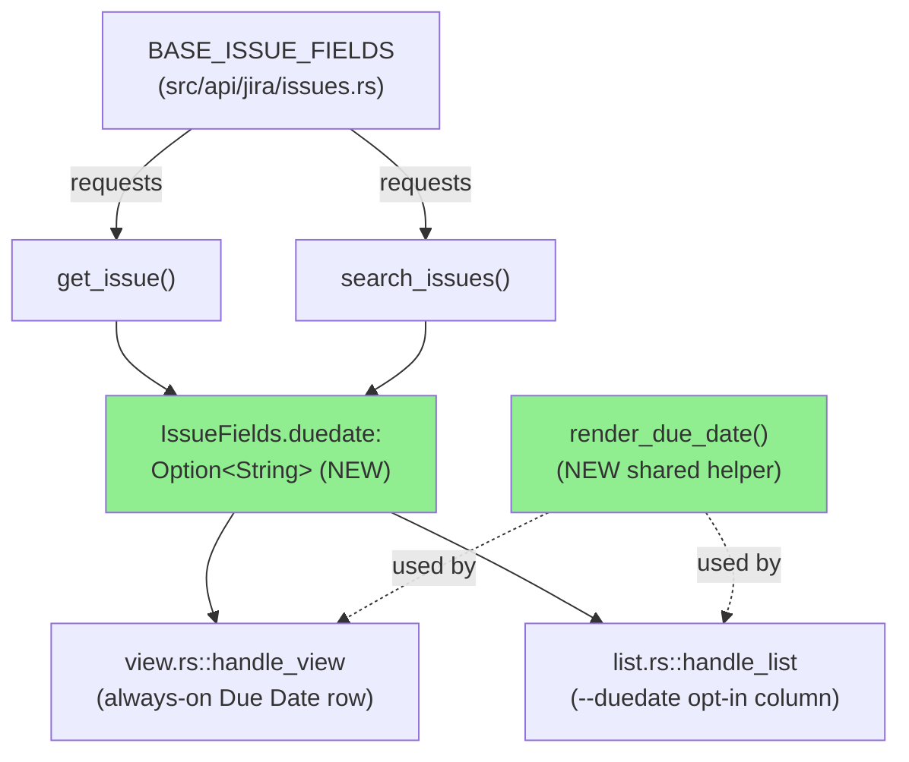
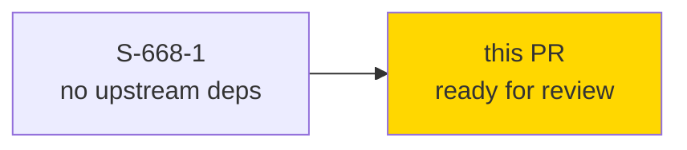
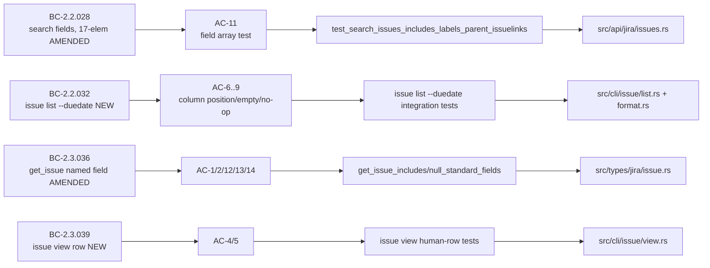

# [S-668-1] Surface Jira `duedate` in `jr issue view`/`jr issue list`

**Epic:** none — leaf enhancement (`depends_on: []`)
**Mode:** feature
**Convergence:** CONVERGED after 3/3 clean adversarial passes (8 total passes, distinct lenses — every finding was test-coverage, never a production defect)

Surfaces Jira's `duedate` field end-to-end: it now flows through `.fields.duedate`
in `issue view --output json` / `issue list --output json` (previously silently
dropped by the flatten-based `extra` field), always renders as a "Due Date" row in
`issue view`'s human table, and is available as an opt-in `--duedate` column in
`issue list`. Closes #668.

---

## Human-Approved Design (verbatim — do not deviate)

- **Rendering is verbatim, no parsing.** Jira returns `duedate` as date-only
  `YYYY-MM-DD`; a parse-then-reformat round trip would be byte-identical, so no
  `chrono` parser and no `--verbose`-gated warning path were added (an earlier
  design draft that did this was explicitly removed before implementation).
- **Empty-value convention:** `None` or `Some("")` → `"-"` (the `Created`/`Updated`/
  `Points` convention — not `"(none)"`), via one shared helper
  `render_due_date(Option<&str>) -> String` in `src/cli/issue/format.rs`, called
  from both `view.rs` (row) and `format.rs` (column) — no duplicated logic.
- **`issue view`:** ALWAYS renders a "Due Date" row (unconditional, like `Created`/
  `Updated`), positioned immediately after `Updated` and before `Project`.
- **`issue list`:** NEW opt-in `--duedate` boolean flag (default off). Column
  position is fixed: `Key, Type, Status, Priority, [Due Date], [Points], Assignee,
  [Team], [Assets], Summary` — inserted after Priority, before Points.
- **`--duedate` is a silent no-op on `--output json`** — JSON shape is
  unconditional on the flag (matches `--points`/`--assets`/`--team` treatment); no
  stderr warning either way.
- **`IssueFields.duedate` is a NAMED `Option<String>` field**, not routed through
  `#[serde(flatten)] extra` — required for the human-render path's
  `.as_deref()` access, following the issue #59 `created`/`updated`/`reporter`
  precedent.
- **Scope is `issue list` only.** `format_issue_row`/`issue_table_headers` have
  other call sites (`board.rs`, `queue.rs` ×2, `sprint.rs`) — all pass `None` for
  the new parameter; a missed call site is a compile error, not a silent bug.

---

## Architecture Changes



---

## Story Dependencies



No upstream story dependencies (`depends_on: []`); nothing else in the dependency
graph is blocked by this PR (`blocks: []`).

---

## Spec Traceability



---

## Test Evidence

### Coverage Summary

| Metric | Value | Status |
|--------|-------|--------|
| Full workspace `cargo test` | all binaries green, 0 failed | PASS |
| `cargo clippy --all-targets --all-features -- -D warnings` | clean | PASS |
| `cargo fmt --all -- --check` | clean | PASS |
| Acceptance criteria | 16/16 satisfied (AC-1..AC-9 visually demo'd; AC-10..AC-16 test-evidenced) | PASS |
| Adversarial convergence | 3/3 clean consecutive passes (8 total, distinct lenses) | CONVERGED |

### What changed

```
 CHANGELOG.md             |   6 +
 README.md                |   4 +-
 src/api/jira/issues.rs   |   1 +
 src/cli/board.rs         |   4 +-
 src/cli/issue/format.rs  | 139 ++++++-
 src/cli/issue/list.rs    |  20 +-
 src/cli/issue/view.rs    |   4 +
 src/cli/mod.rs           |   3 +
 src/cli/queue.rs         |   4 +-
 src/cli/sprint.rs        |   9 +-
 src/types/jira/issue.rs  |  13 +-
 tests/common/fixtures.rs |  18 +
 tests/issue_commands.rs  | 969 ++++++++++++++++++++++++++++++++++++++++++++++-
 13 files changed, 1176 insertions(+), 18 deletions(-)
```

### Key tests added/extended (per AC)

| AC | Test |
|----|------|
| AC-1/2 | `issue view --output json` `.fields.duedate` present/null tests |
| AC-3 | `issue list --output json` per-row `duedate` presence test |
| AC-4/5 | `issue view` human row — set value / `-` for unset |
| AC-6/7/8 | `issue list --duedate` column position, `-` for unset, column absent without flag |
| AC-9 | `issue list --duedate --output json` byte-identical-to-no-flag no-op test |
| AC-10 | Direct unit tests on `render_due_date(None/Some("")/Some("2027-07-30"))` |
| AC-11 (MANDATORY) | `test_search_issues_includes_labels_parent_issuelinks` updated to 17-element field array |
| AC-12/13 | `get_issue_includes_standard_fields` / `get_issue_null_standard_fields` extended with `duedate` present/absent |
| AC-14 | Named-field (not `extra`-routed) access verified via AC-1/AC-12 |
| AC-15 | `BASE_ISSUE_FIELDS` position assertion (adjacent to `created`/`updated`) |
| AC-16 | `board view` / `queue view` / `sprint current` unaffected — no Due Date column leak, combined-column ordering pinned at both unit and integration level |

---

## Demo Evidence

8 VHS recordings (GIF + WebM + `.tape` source) at
`.factory/demos/S-668-1/` against a local mock server with synthetic data,
covering AC-1, AC-2, AC-3, AC-4, AC-5, AC-6, AC-8, AC-9:
`AC-001-view-json-duedate-set`, `AC-002-view-json-duedate-unset`,
`AC-003-list-json-duedate-unconditional`, `AC-004-view-human-due-date-row-set`,
`AC-005-view-human-due-date-dash-when-unset`, `AC-006-list-duedate-column-position`,
`AC-008-list-without-flag-omits-column`, `AC-009-list-duedate-json-noop`.
AC-7 and AC-10..AC-16 are test-evidenced (see table above) rather than visually
demo'd — no distinct human-visible surface beyond what AC-6/AC-4 already show.
Index: `.factory/demos/S-668-1/INDEX.md`.

---

## Holdout Evaluation

N/A — evaluated at wave gate (this is a Feature Mode story, not part of a
greenfield wave schedule).

---

## Adversarial Review

Per-story adversarial convergence (Step 4.5, factory-internal, pre-PR):
**CONVERGED 3/3 clean** across 8 total passes using distinct lenses. All findings
across all 8 passes were test-coverage gaps (e.g. missing combined-column-order
assertions, absence-check hardening) — never a production-code defect; the
implementation was spec-faithful from the first pass. No unresolved findings.

This PR additionally routes through fresh-eyes `pr-reviewer` and
`security-reviewer` dispatch as part of the PR lifecycle below (see PR comments
for that pass's findings/disposition).

---

## Security Review

No new external input surface: `duedate` is a Jira-supplied, already-validated
JSON string field flowing through the existing serde deserialization path (same
as `created`/`updated`). No new parsing, no new dependency, no new file/network
I/O. Rendering is a verbatim string pass-through (no format-string injection
surface — output goes through comfy-table / serde_json, both of which treat the
value as opaque data). Full manual + automated security-reviewer pass result to
be appended after that agent's dispatch completes (see PR comments).

---

## Risk Assessment & Deployment

### Blast Radius
- **Systems affected:** `jr issue view`, `jr issue list` (JSON + human output);
  read-only, additive change to existing HTTP field-request list.
- **User impact if failure occurs:** worst case, a malformed/missing Due Date
  cell in table output — no crash path identified (helper is total over
  `Option<&str>`, no `unwrap`/`expect` added).
- **Data impact:** none — no write path touched (`issue edit --field duedate=...`
  already worked via the generic `--field` mechanism and is unaffected).
- **Risk Level:** LOW (additive read-side rendering change; `format_issue_row`/
  `issue_table_headers` signature change is compile-error-enforced across all 4
  call sites, eliminating the main risk class for this kind of change).

### Feature Flags
None — `--duedate` is itself the opt-in mechanism for the `issue list` column;
`issue view`'s row is unconditional per BC-2.3.039 (matches `Created`/`Updated`).

---

## Traceability

| BC | Story AC(s) | Test | Status |
|----|-------------|------|--------|
| BC-2.2.028 [AMENDED] — `search_issues` 17-field order | AC-3, AC-11, AC-15 | `test_search_issues_includes_labels_parent_issuelinks` | PASS |
| BC-2.2.032 [NEW] — `issue list --duedate` flag/column/JSON-noop/scope | AC-6, AC-7, AC-8, AC-9, AC-10, AC-16 | `issue list --duedate` integration tests + `render_due_date` unit tests | PASS |
| BC-2.3.036 [AMENDED] — `get_issue` named `duedate` field | AC-1, AC-2, AC-12, AC-13, AC-14 | `get_issue_includes_standard_fields` / `get_issue_null_standard_fields` | PASS |
| BC-2.3.039 [NEW] — `issue view` always-on Due Date row | AC-4, AC-5, AC-10 | `issue view` human-row tests | PASS |

Full BC bodies: `.factory/specs/prd/bc-2-issue-read.md` (spec v1.3.179).
Story: `.factory/stories/S-668-1-duedate-issue-view-list.md` (16 ACs, all satisfied).

---

## AI Pipeline Metadata

```yaml
ai-generated: true
pipeline-mode: feature
pipeline-stages:
  spec-crystallization: completed
  story-decomposition: completed
  tdd-implementation: completed
  adversarial-review: completed (per-story convergence, 3/3 clean, 8 total passes)
  formal-verification: skipped (LOW module criticality, ordinary feature)
  convergence: achieved
story: S-668-1
issue: 668
behavioral_contracts: [BC-2.2.028, BC-2.2.032, BC-2.3.036, BC-2.3.039]
```

---

## Pre-Merge Checklist

- [ ] All CI status checks passing (`ci-gate` required check — pending at PR open)
- [x] Coverage delta is positive (net new tests added, no removed coverage)
- [ ] No critical/high security findings unresolved (pending security-reviewer dispatch)
- [x] Rollback: standard `git revert` — no migration, no feature flag, no data change
- [x] No dependency graph impact (`depends_on: []`, `blocks: []`)
- [ ] Fresh-eyes `pr-reviewer` review complete
- [ ] **Human merge decision** — merge authority is the human's; this PR is prepared
      to a mergeable, reviewed, CI-green state and does not self-merge.

Closes #668.
