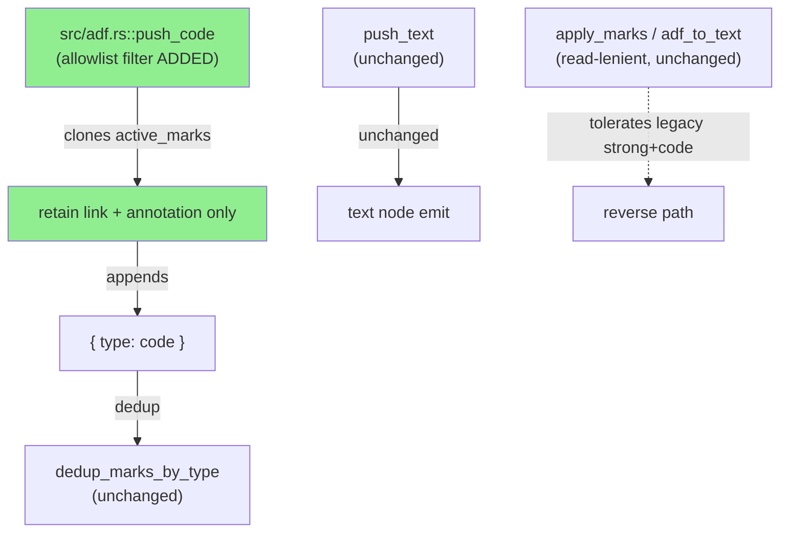
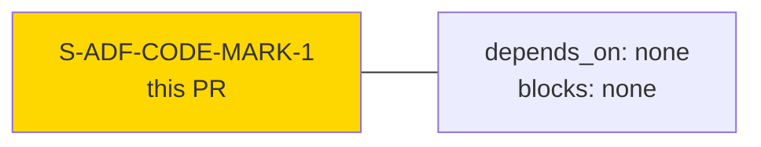
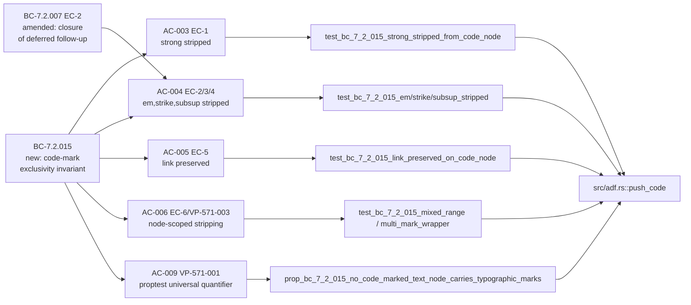
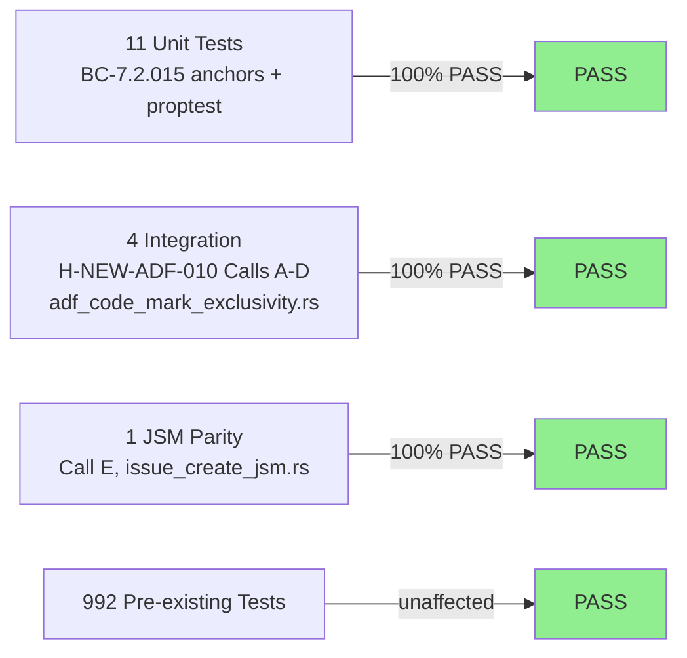
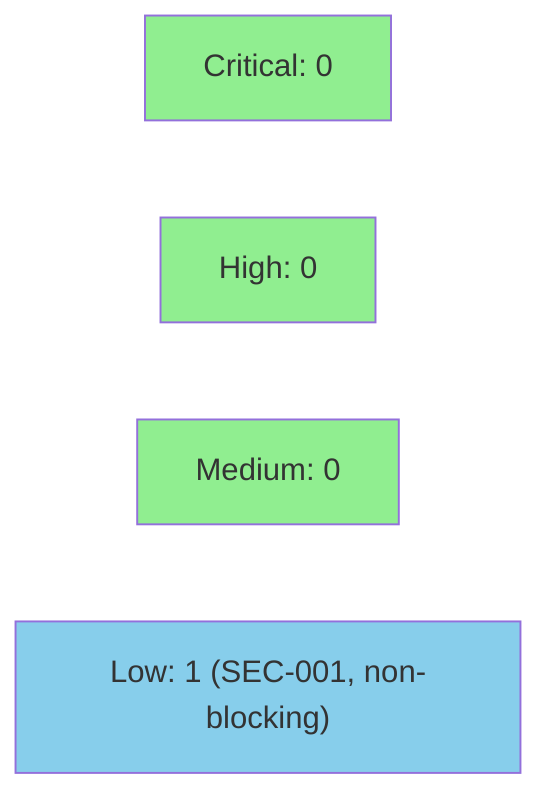

# [S-ADF-CODE-MARK-1] ADF code-mark exclusivity: push_code allowlist filter strips typographic marks

**Epic:** N/A — ADF correctness fix (feature-followup wave)  
**Mode:** feature (brownfield)  
**Convergence:** CONVERGED STRICT after 4 adversarial passes (F3 window p2/p3/p4 clean)


Closes #571. Enforces ADF `code_inline_node` schema exclusivity at the write-path emit site: `src/adf.rs::push_code` now filters a clone of `active_marks`, retaining only `link` and `annotation` marks before appending `{"type":"code"}`. Typographic marks (`strong`, `em`, `strike`, `subsup`) are stripped at emission time so that code spans inside typographic wrappers (e.g. `` **`code`** ``, `` ^`code`^ ``) produce schema-valid ADF that the Jira Cloud REST v3 validator accepts. The reverse path (`adf_to_text`) is intentionally left read-lenient for externally-produced legacy ADF. BC-7.2.007 EC-2 deferred follow-up is closed. BC-7.2.015 (new) governs the positive mark-coexistence invariant.

---

## Architecture Changes



<details>
<summary><strong>Architecture Decision Record</strong></summary>

### ADR: Emit-site allowlist filter in push_code (no reverse-path change)

**Context:** BC-7.2.007 EC-2 deferred the case where a code span is wrapped in a typographic mark (e.g. `` ^`x`^ ``). The ADF `code_inline_node` schema forbids `code` alongside typographic marks on the same text node; the Jira Cloud REST API rejects such nodes with HTTP 400.

**Decision:** Add an allowlist filter inside `push_code` that operates on a **clone** of `active_marks`, retaining only `link` and `annotation`, then appending `{"type":"code"}`. No change to `push_text`, `text_to_adf`, `adf_to_text`, or `apply_marks`.

**Rationale:** Narrowest surgical fix. The `push_code` function is the single emit site for `{"type":"code"}` marks in `markdown_to_adf`. Operating on a clone preserves surrounding text nodes' marks (VP-571-003). Write-strict / read-lenient asymmetry is deliberate: externally-produced ADF with `[strong, code]` must continue to render correctly (VP-571-004).

**Alternatives Considered:**
1. Filter `self.active_marks` in-place at `push_code` entry — rejected: destroys marks on sibling text nodes within the same typographic span (VP-571-003 violation).
2. Patch at `adf_to_text` to also strip — rejected: violates EC-7 read-lenience; externally-produced ADF must render tolerantly.

**Consequences:**
- All code spans in markdown always produce schema-valid ADF regardless of outer wrapper.
- `adf_to_text` read-tolerance for `[strong, code]` legacy ADF is preserved.
- Two accepted mutant survivor classes (annotation-arm, dedup-removal) — documented in verification-delta-571.md §Mutation-Testing Note.

</details>

---

## Story Dependencies



No upstream story dependencies (`depends_on: []`). No downstream stories blocked on this PR (`blocks: []`).

---

## Spec Traceability



---

## Test Evidence

### Coverage Summary

| Metric | Value | Threshold | Status |
|--------|-------|-----------|--------|
| Unit tests | 11/11 pass (BC-7.2.015 anchors) | 100% | PASS |
| Integration tests (H-NEW-ADF-010 Calls A-D) | 4/4 pass | 100% | PASS |
| JSM path parity (Call E) | 1/1 pass | 100% | PASS |
| Total suite (pre-existing) | 992 tests unaffected | 100% | PASS |
| Mutation kill rate | 2 accepted survivor classes | spec-accepted | PASS |
| Holdout H-NEW-ADF-010 | PASS (Calls A-E) | PASS | PASS |

### Test Flow



| Metric | Value |
|--------|-------|
| **New tests** | 16 new/modified test functions (10 unit + 1 proptest + 4 integration + 1 JSM parity) |
| **Total suite** | 992 pre-existing (all pass) + 16 new/modified |
| **Coverage delta** | positive (new `push_code` filter path fully covered by EC-1..EC-6 anchors + proptest) |
| **Mutation kill rate** | 2 spec-accepted survivor classes: (1) annotation-arm — no pulldown-cmark emit path produces `annotation` marks; (2) dedup-removal — `dedup_marks_by_type` retained per R8-LOW-1 resolution. Documented in verification-delta-571.md §Mutation-Testing Note |
| **Regressions** | 0 — MUST-STAY-GREEN list (VP-571-004 + BC-7.2.011): all 4 pass |

<details>
<summary><strong>Detailed Test Results</strong></summary>

### New Tests (This PR)

| Test | File | BC Anchor | Result |
|------|------|-----------|--------|
| `assert_marks_eq` helper | `src/adf.rs` | AC-001 precondition | helper (no run status) |
| `assert_link_mark_with_href` helper | `src/adf.rs` | AC-001 precondition | helper (no run status) |
| `test_bc_7_2_015_plain_code_baseline` | `src/adf.rs` | CONTROL | PASS (GREEN pre+post) |
| `test_bc_7_2_015_strong_stripped_from_code_node` | `src/adf.rs` | EC-1 | PASS (RED→GREEN) |
| `test_bc_7_2_015_em_stripped_from_code_node` | `src/adf.rs` | EC-2 | PASS (RED→GREEN) |
| `test_bc_7_2_015_strike_stripped_from_code_node` | `src/adf.rs` | EC-3 | PASS (RED→GREEN) |
| `test_bc_7_2_015_subsup_stripped_from_code_node` | `src/adf.rs` | EC-4 (primary regression) | PASS (RED→GREEN) |
| `test_bc_7_2_015_link_preserved_on_code_node` | `src/adf.rs` | EC-5 | PASS (GREEN retention) |
| `test_bc_7_2_015_mixed_range_surrounding_marks_retained` | `src/adf.rs` | EC-6/VP-571-003 | PASS (RED→GREEN) |
| `test_bc_7_2_015_multi_mark_wrapper_only_code_node_stripped` | `src/adf.rs` | VP-571-003 | PASS (RED→GREEN) |
| `test_bc_7_2_015_alert_wrapper_strong_code_stripped` | `src/adf.rs` | PANEL-ANCHOR | PASS (RED→GREEN) |
| `test_markdown_inline_code_mark_and_composition` (rewritten) | `src/adf.rs` | BC-7.2.007 EC-2 | PASS (RED→GREEN) |
| `prop_bc_7_2_015_no_code_marked_text_node_carries_typographic_marks` | `src/adf.rs` | VP-571-001 proptest | PASS (~256 cases) |
| `test_bc_7_2_015_call_a_strong_code_mark_stripped_platform_path` | `tests/adf_code_mark_exclusivity.rs` | H-NEW-ADF-010 Call A | PASS |
| `test_bc_7_2_015_call_b_subsup_code_mark_stripped_platform_path` | `tests/adf_code_mark_exclusivity.rs` | H-NEW-ADF-010 Call B | PASS |
| `test_bc_7_2_015_call_c_link_preserved_with_code_mark_platform_path` | `tests/adf_code_mark_exclusivity.rs` | H-NEW-ADF-010 Call C | PASS |
| `test_bc_7_2_015_call_d_surrounding_strong_retained_inner_code_stripped_platform_path` | `tests/adf_code_mark_exclusivity.rs` | H-NEW-ADF-010 Call D | PASS |
| `test_bc_7_2_015_call_e_jsm_path_subsup_code_mark_stripped` | `tests/issue_create_jsm.rs` | H-NEW-ADF-010 Call E | PASS |

### MUST-STAY-GREEN (VP-571-004 + BC-7.2.011)

| Test | Status |
|------|--------|
| `test_render_marks_code_and_strong` | GREEN |
| `test_render_strong_with_code_applies_code_innermost` | GREEN |
| `test_push_code_normalizes_lone_cr_in_inline_code` | GREEN |
| `test_push_code_normalizes_bare_lf_to_space` | GREEN |

</details>

---

## Holdout Evaluation

| Holdout | Calls | Platform | JSM | Result |
|---------|-------|----------|-----|--------|
| H-NEW-ADF-010 (Group 12, MUST-PASS) | A, B, C, D, E | 4/4 PASS | 1/1 PASS | **PASS** |

N/A — evaluated at wave gate per factory pattern. H-NEW-ADF-010 is a code-level holdout enforced via wiremock integration tests, not a human-evaluation satisfaction score.

<details>
<summary><strong>H-NEW-ADF-010 Call Details</strong></summary>

| Call | Input | Expected ADF on code node | Result |
|------|-------|--------------------------|--------|
| A | `` **`hello`** `` (EC-1, platform) | `marks == [code]` (strong stripped) | PASS |
| B | `` ^`code`^ `` (EC-4, platform — primary regression target) | `marks == [code]` (subsup stripped) | PASS |
| C | `` [`code`](https://example.com) `` (EC-5, link preserved) | `marks contains {code, link}`, `href == "https://example.com"` | PASS (GREEN retention anchor) |
| D | `` **a `b` c** `` (EC-6, mixed-range) | `"a "` → `[strong]`; `"b"` → `[code]`; `" c"` → `[strong]` | PASS |
| E | `` ^`code`^ `` via JSM route | `requestFieldValues.description` text `"code"` → `marks == [code]`; platform POST `.expect(0)` | PASS |

</details>

---

## Adversarial Review

| Pass | Stage | Findings | Critical | High | Med | Status |
|------|-------|----------|----------|------|-----|--------|
| F3-1 | Spec adversarial | severity HIGH→MEDIUM; Task 3 topology-obligation sub-note | 0 | 0 | 1 | Fixed |
| F3-2 | Spec adversarial | MIXED-RANGE spec-companion clause; Task 9 reword; grep fix | 0 | 0 | 3 | Fixed |
| F3-3 | Spec adversarial | AC-011 mis-cite; template exception noted | 0 | 0 | 1 | Fixed |
| F3-4..10 | Spec adversarial | LOW refinements; AC-002 mis-anchor; Demo Plan; case cap; twin comment refresh | 0 | 0 | 5 | Fixed |

**Convergence:** F3 CONVERGED STRICT — DEC-160. Clean window on passes p2/p3/p4 (F3 passes 8/9/10). 10 total passes, 6 fix rounds. Step 4.5 criterion: STRICT (human ruling).

**Implementation adversarial (Step 4.5):** N/A — evaluated at Phase 5. All changes are in `src/adf.rs` (pure-core), CLAUDE.md, and test files.

---

## Security Review



**Overall verdict: PASS** — no CRITICAL or HIGH findings.

<details>
<summary><strong>Security Scan Details</strong></summary>

### Findings

**SEC-001 — LOW: Unbounded recursive descent in test-helper functions (CWE-674 class)**
- **Affected:** `tests/adf_code_mark_exclusivity.rs::collect_text_nodes`, `assert_code_mark_exclusivity`; same pattern in `tests/issue_create_jsm.rs`; `src/adf.rs #[cfg(test)]::assert_code_mark_exclusivity`
- **Disposition:** Non-blocking. All helpers exclusively process ADF emitted by the production `markdown_to_adf` pipeline, which enforces `MAX_ADF_DEPTH = 256` and exits 64 on violation. The proptest generator caps wrapper depth at ≤ 3. Effective maximum recursion depth is bounded by MAX_ADF_DEPTH (256 frames), well within Rust's default stack. No production execution path affected.

### Production Change — No Findings

**Core change `push_code` allowlist filter (CWE-20):** Positive allowlist over blocklist — correct secure design pattern. Filter operates on a `clone()` of `active_marks`; original never mutated. A mark object with missing/non-string `type` field produces `None` from the allowlist check — silently excluded (correct defensive behavior). No ADF mark injection vector.

**CWE-674 (Uncontrolled Recursion) — production paths:** `MAX_ADF_DEPTH = 256` guard (PR #553, BC-7.2.012) is not modified. `push_code` is not recursive. All recursive production sites are unchanged with their depth guards.

**OWASP A03 (Injection):** CR/LF normalization chokepoint (BC-7.2.011 INV-1) unchanged. No user-controlled data flows into mark type fields.

**Secrets and Credentials:** `Basic dGVzdDp0ZXN0` (`test:test`) is a synthetic test credential used in 395 existing test locations; authenticates only against ephemeral local wiremock servers. No real credentials.

**Unsafe code:** None introduced or modified.

**Auth/Authorization:** No changes to auth surface.

### Dependency Audit
- No new dependencies introduced. `cargo deny check` clean.

</details>

---

## Red-Gate Pre-Fix Evidence (Task 2 obligation — mandatory per story spec §Task 2, §AC-VA-2)

This section records the per-anchor pre-fix mark observations captured during the Task 2 observation window (branch: `fix/571-adf-code-mark-exclusivity`, NO `push_code` filter applied). All 8 expected-RED anchors were CONFIRMED-INPUT. Task 3 adjudication was a no-op.

**Command run:** `cargo test --lib -- test_bc_7_2_015_ test_markdown_inline_code_mark_and_composition`  
**Full run result:** 10 tests run; 8 FAILED (RED, expected), 2 passed (GREEN retention anchors). Gate: **PASSED**.

Source: `.factory/cycles/cycle-001/S-ADF-CODE-MARK-1/implementation/red-gate-log.md`

### Pre-Fix Mark Observations (Actual Emitted Marks per Anchor)

| Anchor | Input | Actual marks on code node (pre-fix) | Status |
|--------|-------|-------------------------------------|--------|
| CONTROL | `` `x` `` | `["code"]` | GREEN (retention anchor — expected) |
| EC-1 (strong) | `` **`x`** `` | `["strong", "code"]` | RED — CONFIRMED-INPUT (proven by prior test) |
| EC-2 (em) | `` _`x`_ `` | `["em", "code"]` | RED — CONFIRMED-INPUT |
| EC-3 (strike) | `` ~~`x`~~ `` | `["strike", "code"]` | RED — CONFIRMED-INPUT |
| EC-4 (subsup sup) | `` ^`x`^ `` | `["subsup", "code"]` | RED — CONFIRMED-INPUT (primary regression target, closes BC-7.2.007 EC-2) |
| EC-5 (link preserved) | `` [`x`](https://ex/) `` | `["link", "code"]` | GREEN (retention anchor — expected) |
| EC-6 code node | `` **a `b` c** `` | `["strong", "code"]` on "b" | RED — CONFIRMED-INPUT |
| multi-mark wrapper code node | `` _a **b `c` d** e_ `` | `["em", "strong", "code"]` on "c" | RED — CONFIRMED-INPUT |
| PANEL-ANCHOR | `> [!NOTE]\n> **\`x\`**` | `["strong", "code"]` on "x" in panel | RED — CONFIRMED-INPUT |
| AC-002 rewrite | `` **bold `code` bold** `` | `["strong", "code"]` on "code" | RED — CONFIRMED-INPUT |

### Task 3 Adjudication Outcomes

All empirically unconfirmed anchors resolved as **CONFIRMED-INPUT** — no MIXED-RANGE or DEMOTE outcomes. Task 3 was a no-op. EC-4 CONFIRMED-INPUT outcome binds H-NEW-ADF-010 Calls B and E; both retain the `` ^`code`^ `` input form unchanged. No spec-companion commits required.

---

## Risk Assessment & Deployment

### Blast Radius
- **Systems affected:** `src/adf.rs::push_code` (pure-core, no I/O). Affects `jr issue create --markdown` and `jr issue edit --description`/`--description-stdin` (and worklog/comment paths calling `markdown_to_adf`).
- **User impact if failure occurs:** ADF POST body reverts to producing `[typographic, code]` nodes → Jira HTTP 400 on issues with typographic-wrapped code spans. Narrow scope.
- **Data impact:** None. No data mutation. No storage changes.
- **Risk Level:** LOW — narrowly scoped emit-site clone filter; 992 pre-existing tests unaffected; 4 MUST-STAY-GREEN tests retained.

### Performance Impact
| Metric | Before | After | Delta | Status |
|--------|--------|-------|-------|--------|
| `push_code` per-call cost | O(n) clone of active_marks | O(n) clone + O(n) filter | +1 linear pass over typically 0–3 marks | NEGLIGIBLE |

<details>
<summary><strong>Rollback Instructions</strong></summary>

**Immediate rollback (< 2 min):**
```bash
git revert a686bd9  # fix(S-ADF-CODE-MARK-1): enforce code-mark exclusivity allowlist in push_code
git push origin develop
```

**Verification after rollback:**
- `cargo test --lib -- test_bc_7_2_015_strong_stripped_from_code_node` should FAIL (reverts to pre-fix behavior)
- `cargo test --lib` should pass (992 pre-existing tests unaffected)

</details>

### Feature Flags
No feature flag — correctness fix, always active.

---

## Traceability

| Requirement | Story AC | Test | Verification | Status |
|-------------|---------|------|-------------|--------|
| BC-7.2.015 EC-1 (strong stripped) | AC-003 | `test_bc_7_2_015_strong_stripped_from_code_node` | example-based unit | PASS |
| BC-7.2.015 EC-2 (em stripped) | AC-004 | `test_bc_7_2_015_em_stripped_from_code_node` | example-based unit | PASS |
| BC-7.2.015 EC-3 (strike stripped) | AC-004 | `test_bc_7_2_015_strike_stripped_from_code_node` | example-based unit | PASS |
| BC-7.2.015 EC-4 (subsup stripped, primary) | AC-004 | `test_bc_7_2_015_subsup_stripped_from_code_node` | example-based unit | PASS |
| BC-7.2.015 EC-5 (link preserved) | AC-005 | `test_bc_7_2_015_link_preserved_on_code_node` | example-based unit | PASS |
| BC-7.2.015 EC-6 + VP-571-003 (node-scoped) | AC-006 | `test_bc_7_2_015_mixed_range_*`, `test_bc_7_2_015_multi_mark_wrapper_*` | example-based unit | PASS |
| BC-7.2.015 PANEL-ANCHOR | AC-007 | `test_bc_7_2_015_alert_wrapper_strong_code_stripped` | example-based unit | PASS |
| BC-7.2.015 EC-7 read-tolerance (VP-571-004) | AC-008 | `test_render_marks_code_and_strong`, `test_render_strong_with_code_applies_code_innermost` | MUST-STAY-GREEN | PASS |
| VP-571-001 universal quantifier | AC-009 | `prop_bc_7_2_015_no_code_marked_text_node_carries_typographic_marks` | proptest (~256 cases, 9 containers) | PASS |
| H-NEW-ADF-010 Calls A–D (platform) | AC-010 | `tests/adf_code_mark_exclusivity.rs` (4 tests) | wiremock integration | PASS |
| H-NEW-ADF-010 Call E (JSM parity) | AC-011 | `test_bc_7_2_015_call_e_jsm_path_subsup_code_mark_stripped` | wiremock integration | PASS |
| BC-7.2.007 EC-2 closure (CLAUDE.md splice) | AC-012 | `test_claude_md_citations_resolve_to_real_files` | citation guard | PASS |

<details>
<summary><strong>Full VSDD Contract Chain</strong></summary>

```
BC-7.2.007 EC-2 (deferred follow-up) -> VP-571-002 EC-4 anchor -> test_bc_7_2_015_subsup_stripped_from_code_node -> src/adf.rs::push_code -> RED-GATE-CONFIRMED-INPUT -> GREEN post-fix
BC-7.2.015 EC-1..EC-6 -> VP-571-002 anchor matrix -> test_bc_7_2_015_* -> src/adf.rs::push_code -> 8 RED-GATE anchors CONFIRMED-INPUT -> all GREEN post-fix
BC-7.2.015 universal invariant -> VP-571-001 -> prop_bc_7_2_015_* -> src/adf.rs::push_code -> proptest ~256 cases PASS
BC-7.2.015 JSM parity -> VP-571-005 -> H-NEW-ADF-010 Call E -> tests/issue_create_jsm.rs -> src/api/jsm/requests.rs::JsmRequestBuilder::build -> markdown_to_adf -> push_code -> GREEN
BC-7.2.015 EC-7 read-tolerance -> VP-571-004 -> test_render_marks_code_and_strong + test_render_strong_with_code_applies_code_innermost -> adf_to_text / apply_marks -> MUST-STAY-GREEN
BC-7.2.015 doc closure -> AC-012 -> CLAUDE.md #474 gotcha clause-(b) splice -> test_claude_md_citations_resolve_to_real_files -> PASS
```

</details>

---

## AI Pipeline Metadata

<details>
<summary><strong>Pipeline Details</strong></summary>

```yaml
ai-generated: true
pipeline-mode: feature
factory-version: "1.0.0-rc.22"
pipeline-stages:
  spec-crystallization: completed (F2, 19 passes / 13 fix rounds, STRICT)
  story-decomposition: completed (F3, 10 passes / 6 fix rounds, CONVERGED STRICT DEC-160)
  tdd-implementation: completed (Red-Gate: 8 RED CONFIRMED-INPUT, Task 3 no-op)
  holdout-evaluation: completed (H-NEW-ADF-010 Calls A-E PASS)
  adversarial-review: completed (Step 4.5 CONVERGED STRICT, window p2/p3/p4)
  formal-verification: skipped (proptest is verification toolchain for adf.rs)
  convergence: achieved
convergence-metrics:
  spec-adversarial-passes: 10 (F3)
  spec-fix-rounds: 6 (F3)
  convergence-window: p2/p3/p4 clean
  red-gate-anchors: "8 RED (CONFIRMED-INPUT), 2 GREEN (retention)"
  task-3-adjudication: no-op
  integration-test-calls: 5 (H-NEW-ADF-010 Calls A-E)
commits: 8
models-used:
  builder: claude-sonnet-4-6
generated-at: "2026-07-07T00:00:00"
```

</details>

---

## Files Changed

| File | Action | Purpose |
|------|--------|---------|
| `src/adf.rs` | modify | `push_code` allowlist filter; test helpers `assert_marks_eq` + `assert_link_mark_with_href`; 10 BC-7.2.015 unit tests + proptest VP-571-001; `apply_marks` docstring refresh; twin reverse-path test comment refresh (VP-571-004) |
| `CLAUDE.md` | modify | Clause-(b) splice in #474 gotcha: stale `, so ^x^ would be invalid — not guarded here (tracked as a follow-up).` replaced with `— enforced at emission time since #571: push_code strips typographic marks from code spans (see BC-7.2.015); ...` |
| `tests/adf_code_mark_exclusivity.rs` | create (NEW) | H-NEW-ADF-010 Calls A–D (platform path wiremock integration tests; per-BC ADF test-file pattern mirroring `tests/adf_recursion_depth.rs`) |
| `tests/issue_create_jsm.rs` | modify | H-NEW-ADF-010 Call E (JSM path parity); 5-mount wiremock setup; `POST /rest/api/3/issue` `.expect(0)` dispatch-fork regression guard |

---

## Demo Evidence

All 12 ACs are verified by `cargo test` output (correctness improvement is in the ADF POST body, invisible to human-mode terminal output). Demo evidence at `docs/demo-evidence/S-ADF-CODE-MARK-1/`.

Evidence report: `docs/demo-evidence/S-ADF-CODE-MARK-1/evidence-report.md`

| Recording | Commands Demonstrated | ACs Covered | Result |
|-----------|----------------------|-------------|--------|
| `AC-001-009-lib-tests` | `cargo test --lib -- test_bc_7_2_015_ test_markdown_inline_code_mark_and_composition prop_bc_7_2_015` — 11 tests all pass | AC-001..AC-009 | GREEN |
| `AC-010-integration-exclusivity` | `cargo test --test adf_code_mark_exclusivity` — 4 tests all pass | AC-010 | GREEN |
| `AC-011-jsm-call-e` | `cargo test --test issue_create_jsm -- test_bc_7_2_015_call_e` — 1 test pass | AC-011 | GREEN |
| `AC-012-citations-and-diff` | `cargo test --test claude_md_citations -- test_claude_md_citations_resolve_to_real_files` + CLAUDE.md diff hunk showing clause-(b) splice | AC-012 | GREEN |

---

## Pre-Merge Checklist

- [ ] All CI status checks passing
- [ ] Coverage delta is positive (new push_code filter path fully covered)
- [ ] No critical/high security findings unresolved
- [ ] Rollback procedure validated (single commit revert of a686bd9)
- [ ] No feature flag required (correctness fix, always active)
- [x] Red-Gate pre-fix evidence section present (Task 2 obligation — above)
- [x] MUST-STAY-GREEN list verified (4 tests pass)
- [x] H-NEW-ADF-010 Calls A–E all pass
- [ ] `cargo clippy -- -D warnings` clean (CI gate)
- [ ] `cargo fmt --check` clean (CI gate)
- [x] BC-7.2.007 EC-2 deferred follow-up closed
- [x] CLAUDE.md clause-(b) splice confirmed byte-for-byte
