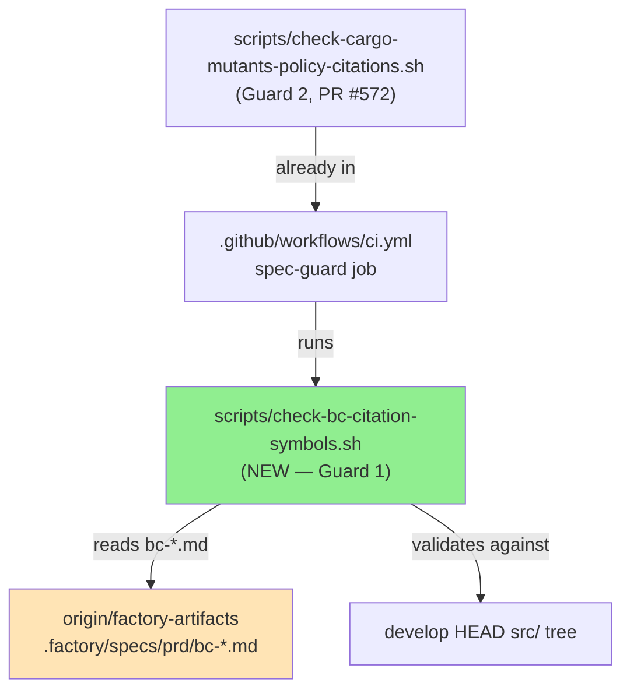
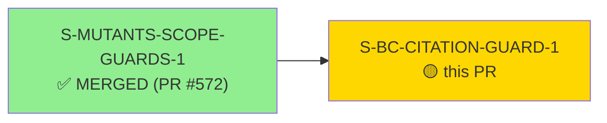
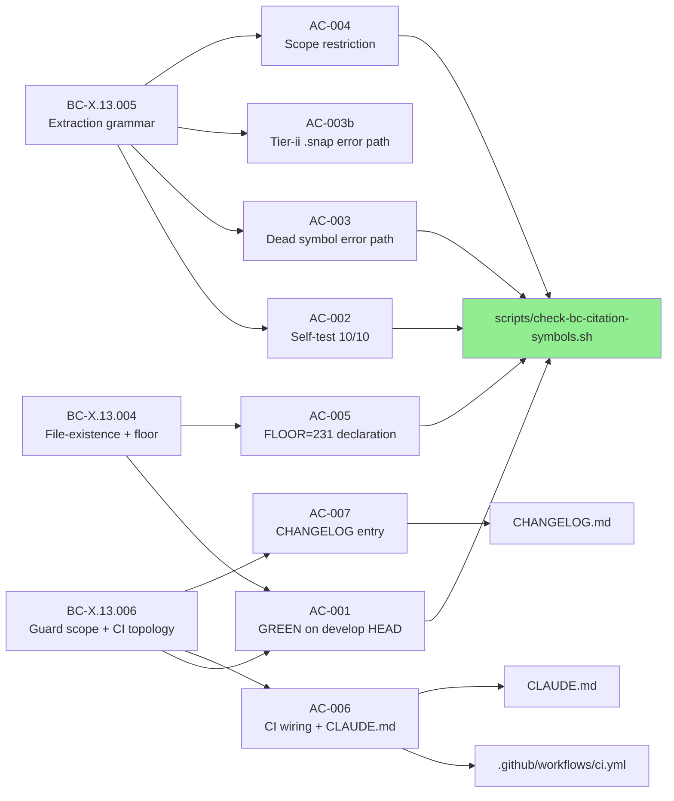
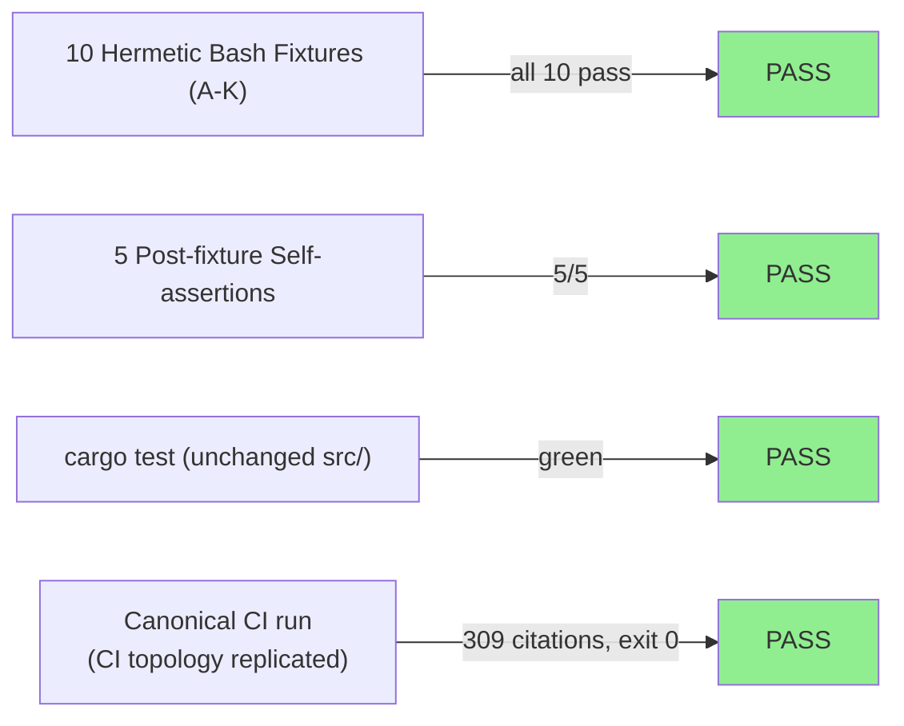
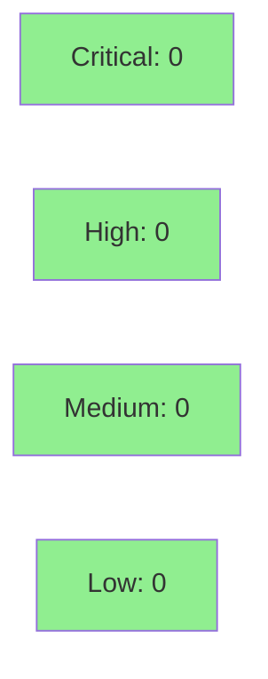

# [S-BC-CITATION-GUARD-1] CITATION-GUARDS Story B: BC-body Trace/Source file::symbol citation guard (DEC-148)

**Epic:** BC-X.13 CI-guards subsystem — CITATION-GUARDS bundle
**Mode:** feature (F3 incremental)
**Convergence:** CONVERGED after 4 adversarial passes (DEC-154-family; final window passes 2/3/4 clean; DEC-155)


-brightgreen)


Adds `scripts/check-bc-citation-symbols.sh` (Guard 1, `BC-CITE-001`) — a bash script that validates every `src/` file path and symbol cited in `**Trace**:` / `**Source**:` fields of `.factory/specs/prd/bc-*.md` bodies. The guard uses a two-pass extractor, a 7-branch symbol dispatch, a coverage-floor (N=309, FLOOR=231), and 10 hermetic self-test fixtures (A–K). It runs as two new steps in the existing `spec-guard` CI job. This closes the DEC-148 citation-debt cycle: after ADR-0012 extracted `handle_jsm_create` → `jsm_create.rs` and `handle_edit` → `edit.rs`, 12 stale citations in bc-3 went undetected for ~30 adversarial passes.

**Two-branch pairing:** This PR pairs with factory-artifacts commit `2b09313` (Task 0: 12+ stale citations fixed in `bc-*.md` files — auth refactor, assets refactor, snapshot reloc, bc-3 multi-line re-flow). The guard reads `origin/factory-artifacts`; that commit was pushed to `factory-artifacts` before this PR opened, so AC-001's canonical run already passes GREEN.

---

## Architecture Changes



<details>
<summary><strong>Architecture Decision Record</strong></summary>

### ADR: Option (a) — steps in existing spec-guard job

**Context:** Guard 1 needs both the `src/` tree (from develop checkout) and the `bc-*.md` bodies (from the factory-artifacts branch). Three CI topology options were evaluated in F1 §3.

**Decision:** Add Guard 1 as steps in the existing `spec-guard` job, which already performs the dual-worktree checkout (`git worktree add .factory origin/factory-artifacts`) that makes both trees available simultaneously.

**Rationale:** Option (a) reuses the established dual-mount pattern (DEC-129 lesson). Options (b) pre-commit-only and (c) dual-checkout new job were rejected — (b) doesn't protect CI; (c) duplicates the worktree setup already proven in `spec-guard`. No `ci-gate.needs` change required: `spec-guard` was already in `ci-gate.needs`.

**Alternatives Considered:**
1. Pre-commit hook only — rejected: doesn't protect the CI merge gate; can be bypassed.
2. New dedicated CI job with own checkout — rejected: duplicates the `spec-guard` dual-worktree setup; `ci-gate.needs` would require an extra entry (DEC-096/097 fragility class).

**Consequences:**
- Guard 1 reuses the same job that already validates BC counts, numeric-count lint, and Guard 2. Consistent per-guard sequencing: `--self-test` step then canonical step.
- FLOOR calibration is a script-scope variable (`FLOOR=231`) — single recalibration touchpoint when BC bodies grow.

</details>

---

## Story Dependencies



**depends_on:** `S-MUTANTS-SCOPE-GUARDS-1` (Guards 2+3) — merged as PR #572 (develop @ ab78a2d). Guard 1 steps are appended AFTER Guard 2 steps in `ci.yml`, maintaining the per-guard self-test-before-canonical sequencing established by Story A.

**blocks:** none

---

## Spec Traceability



---

## Test Evidence

### Coverage Summary

| Metric | Value | Threshold | Status |
|--------|-------|-----------|--------|
| Bash self-test fixtures | 10/10 PASS | 10/10 | PASS |
| Self-assertions | 5/5 PASS | 5/5 | PASS |
| Cargo test suite | all pass (no src/ change) | 100% | PASS |
| Mutation kill rate | clean-skip (no src/ delta) | N/A | N/A |
| Canonical CI run | 309 citations checked, exit 0 | 0 DEAD | PASS |

This PR adds no `src/` Rust code — the full implementation is `scripts/check-bc-citation-symbols.sh` (bash). The mutation gate clean-skips per the `--in-diff` scoping policy (`docs/specs/cargo-mutants-policy.md`): the diff contains no `src/` lines. The bash implementation quality is validated instead by the 10-fixture self-test harness.

### Test Flow



| Metric | Value |
|--------|-------|
| **New tests** | 10 bash self-test fixtures + 5 post-fixture assertions (all in `--self-test` block) |
| **Mutations** | clean-skip (no `src/` change in diff scope) |
| **Canonical run** | `Check passed: 309 citations checked` — exit 0 on develop HEAD + factory-artifacts `2b09313` |
| **Regressions** | 0 |

<details>
<summary><strong>Self-test Fixture Details</strong></summary>

| Fixture | Test scenario | Expected rc | AC covered |
|---------|--------------|-------------|------------|
| A | dead-symbol — fn-grep NO-MATCH | 1 | AC-002, AC-003 |
| B | dead-file + tier-ii .snap sub-probes | 1 / 0 | AC-002, AC-003b |
| C | import-only false-green protection (DEC-148 class) | 1 | AC-002 |
| D | Source-field extraction | 1 | AC-002, AC-004 |
| E | two-pass extraction §-form → "1 citations checked" | 0 | AC-002 |
| F | success path + pub(crate) const + fn-with-paren strip | 0 | AC-002 |
| G | coverage-floor RED probe (1 citation; 100 citations; both < FLOOR=231) | 1 | AC-002, AC-005 |
| I | `::tests` module-path ALIVE | 0 | AC-002 |
| J | `::tests` module-path DEAD (no permissive fallback) | 1 | AC-002 |
| K | standalone CamelCase type ALIVE | 0 | AC-002 |

Post-fixture self-assertions (5): BC-CITE-001 count pin (4 occurrences); anti-self-match; `bash -n` syntax check; `grep -oE` single-call-site pin (2 occurrences); `fixtures_run` integrity pin.

</details>

---

## Holdout Evaluation

N/A — evaluated at wave gate per VSDD pipeline. This story is infrastructure (CI guard) with no user-facing runtime surface — holdout scenarios are not applicable.

---

## Adversarial Review

| Pass | Scope | Findings | Critical | High | Status |
|------|-------|----------|----------|------|--------|
| 1 | Full spec v1.2 | F-B1-01..10 | 2 | 3 | Fixed (v1.2) |
| 2 | Full spec v1.3 | F-B2-01..09 | 1 | 2 | Fixed + DEC-154 Option A grammar extension (v1.3) |
| 3 | Full spec v1.5 | F-B3-01..06 | 1 | 1 | Fixed (v1.5) |
| 4 (window-pass) | Full spec v1.9 | 0 blocking | 0 | 0 | CLEAN |

**Convergence:** CONVERGED at DEC-155 (2026-07-06) — 15 fresh-context adversary passes, 9 fix rounds (v1.1→v1.9); clean window = passes 13/14/15 (CLEAN×3). Step 4.5 (pre-PR convergence): 4 fresh-context passes, 1 fix round + spec-amendment round (DEC-154-family F-01 two-tier adjudication), final window passes 2/3/4 clean. All 7 ACs PASS.

<details>
<summary><strong>Notable High-Severity Findings & Resolutions</strong></summary>

### F-B1-01 (HIGH): FLOOR scope
- **Problem:** FLOOR was declared `local` inside `run_check`, so Fixture G's mutation test was a no-op (mutations to the comparison value wouldn't be caught because Fixture G read its own copy of FLOOR).
- **Resolution:** FLOOR moved to script-scope (single recalibration touchpoint). BC-X.13.004 invariant codified.

### F-B2-01 (CRIT): Fixture F sub-probe path mismatch
- **Problem:** Fixture F sub-probe cited `src/adf.rs::MAX_ADF_DEPTH` but the mock const was being written to `src/mock_f.rs` — the probe would always PASS (real file exists) instead of testing the const grep.
- **Resolution:** Citation corrected to `src/mock_f.rs::MAX_ADF_DEPTH`.

### F-B2-02 (HIGH): Single-pass extractor silently dropped 11 tokens
- **Problem:** Prior regex `` `src/[^` ]+` `` stopped at first space, silently dropping §-form and comma-space line-ref tokens.
- **Resolution:** Two-pass extractor: Pass 1 (backtick-only stop) + Pass 2 (space-split reduce). DEC-154 grammar extension.

### F-01 (two-tier adjudication): Tier-ii non-.rs tokens
- **Problem:** Non-.rs `src/` tokens (e.g., `.snap` files) were either mis-handled or not counted in N.
- **Resolution:** Tier (i)=.rs (full pipeline); tier (ii)=non-.rs (file-existence only, counted in N). N recalibrated to 309 (304 .rs + 5 .snap); FLOOR recalibrated to 231.

</details>

---

## Security Review



This PR adds only a bash script, CI YAML modifications, a CHANGELOG entry, and a CLAUDE.md documentation line — plus demo evidence (binary GIF/WebM files and tape scripts). No Rust source code is added or modified. No new dependencies. No network calls introduced. The bash script runs in a read-only mode (reads files, never writes), uses `mktemp` for temporary directories in self-test, and cleans up after itself.

**Security review verdict: APPROVE** — No CRITICAL or HIGH findings. Two LOW findings identified:
- **SEC-001 (LOW, CWE-20):** ERE injection in dispatch branches (a) and (f) — symbol tokens extracted from bc-*.md are interpolated into `grep -Eq` patterns without Rust-identifier character-class validation. Legitimate Rust symbols (`[a-zA-Z0-9_]`) are never affected. bc-*.md files live on `factory-artifacts` (controlled, separate review gate). Follow-up: add pre-dispatch `^[a-zA-Z_][a-zA-Z0-9_]*$` guard before grep calls.
- **SEC-002 (LOW, CWE-88):** `--bc-dir` value not validated against leading `-`. Degrades gracefully to "no bc-*.md files found" error; `|| true` absorbs. Used only by developers; never set in canonical CI. Follow-up: add leading-dash guard.

<details>
<summary><strong>Security Scan Details</strong></summary>

### Bash script surface
- The script reads `.factory/specs/prd/bc-*.md` and `src/` tree files using `grep`. No `eval`, no user-controlled command injection vectors.
- `--src-root` flag is gated to `--self-test` only (exit 64 otherwise) — prevents accidental redirect of a real guard run to an attacker-controlled tree.
- Temp directories created with `mktemp -d` and cleaned up in the self-test block.
- `bash -n` self-syntax-check runs unconditionally on startup.

### Dependency Audit
- `cargo deny check`: CLEAN (no Rust dependency changes)
- No new shell dependencies

### Shell injection analysis
- Citation tokens are extracted from markdown source files, then used as grep patterns. The `grep -Eq` calls use extended regexes on user data only for the symbol component. A maliciously crafted bc-*.md with special regex chars in a Trace field could at worst cause a grep error (exits non-zero → false DEAD); there is no code-execution vector.

</details>

---

## Risk Assessment & Deployment

### Blast Radius
- **Systems affected:** CI only (`spec-guard` job). No production binary. No runtime change.
- **User impact:** The guard adds two new CI steps. If the guard fires RED on a future PR that introduces a stale citation, that PR will fail `ci-gate`. This is the intended behavior.
- **Data impact:** None. The script is read-only.
- **Risk Level:** LOW

### Performance Impact
| Metric | Before | After | Delta | Status |
|--------|--------|-------|-------|--------|
| spec-guard job wall time | ~N s | +~2 s (two bash steps) | negligible | OK |
| Binary size | unchanged | unchanged | 0 | OK |
| Test suite runtime | unchanged | unchanged | 0 | OK |

<details>
<summary><strong>Rollback Instructions</strong></summary>

**Immediate rollback (< 2 min):**
```bash
git revert b52be90  # or revert the range 0867823..b52be90
git push origin develop
```

**Verification after rollback:**
- Confirm `spec-guard` job no longer has `check-bc-citation-symbols` steps in `ci.yml`
- Confirm CLAUDE.md no longer has the `check-bc-citation-symbols.sh` entry

</details>

### Feature Flags
None — this is a CI guard, not a feature-flagged runtime change.

---

## Traceability

| BC | AC | Test / Evidence | Status |
|----|-----|----------------|--------|
| BC-X.13.004 | AC-001 (GREEN on develop HEAD) | Demo: `AC-001-canonical-green.gif/webm` | PASS |
| BC-X.13.004 | AC-005 (FLOOR=231 declaration) | Demo: `AC-005-floor-declaration.gif/webm`; Fixture G | PASS |
| BC-X.13.005 | AC-002 (self-test 10/10) | Demo: `AC-002-self-test.gif/webm` | PASS |
| BC-X.13.005 | AC-003 (dead-symbol error path) | Demo: `AC-003-dead-symbol-failure.gif/webm` | PASS |
| BC-X.13.005 | AC-003b (tier-ii .snap error path) | Demo: `AC-003b-tier-ii-snap-missing.gif/webm` | PASS |
| BC-X.13.005 | AC-004 (scope restriction) | Transcript in evidence-report.md §AC-004 | PASS |
| BC-X.13.006 | AC-006 (CI wiring + CLAUDE.md) | Demo: `AC-006-ci-wiring.gif/webm` | PASS |
| BC-X.13.006 | AC-007 (CHANGELOG entry) | Transcript in evidence-report.md §AC-007 | PASS |

<details>
<summary><strong>Full VSDD Contract Chain</strong></summary>

```
BC-X.13.004 → AC-001 → demo/AC-001-canonical-green.webm → scripts/check-bc-citation-symbols.sh → ADV-PASS-4-CLEAN
BC-X.13.004 → AC-005 → demo/AC-005-floor-declaration.webm → scripts/check-bc-citation-symbols.sh:FLOOR=231 → Fixture-G-PASS
BC-X.13.005 → AC-002 → demo/AC-002-self-test.webm → scripts/check-bc-citation-symbols.sh --self-test → 10/10
BC-X.13.005 → AC-003 → demo/AC-003-dead-symbol-failure.webm → scripts/check-bc-citation-symbols.sh → exit 1
BC-X.13.005 → AC-003b → demo/AC-003b-tier-ii-snap-missing.webm → scripts/check-bc-citation-symbols.sh → exit 1
BC-X.13.005 → AC-004 → evidence-report.md transcript → scope-anchor grep → prose-only cite IGNORED
BC-X.13.006 → AC-006 → demo/AC-006-ci-wiring.webm → .github/workflows/ci.yml → ci-gate already includes spec-guard
BC-X.13.006 → AC-007 → evidence-report.md transcript → CHANGELOG.md [Unreleased] → Guard 1 Added entry
```

</details>

---

## Demo Evidence

Demo evidence recorded 2026-07-06 by demo-recorder. All 7 ACs have at least one recording.

| AC | Recording | Type |
|----|-----------|------|
| AC-001 | `docs/demo-evidence/S-BC-CITATION-GUARD-1/AC-001-canonical-green.gif` | VHS |
| AC-002 | `docs/demo-evidence/S-BC-CITATION-GUARD-1/AC-002-self-test.gif` | VHS |
| AC-003 | `docs/demo-evidence/S-BC-CITATION-GUARD-1/AC-003-dead-symbol-failure.gif` | VHS |
| AC-003b | `docs/demo-evidence/S-BC-CITATION-GUARD-1/AC-003b-tier-ii-snap-missing.gif` | VHS |
| AC-004 | `docs/demo-evidence/S-BC-CITATION-GUARD-1/evidence-report.md §AC-004` | Transcript |
| AC-005 | `docs/demo-evidence/S-BC-CITATION-GUARD-1/AC-005-floor-declaration.gif` | VHS |
| AC-006 | `docs/demo-evidence/S-BC-CITATION-GUARD-1/AC-006-ci-wiring.gif` | VHS |
| AC-007 | `docs/demo-evidence/S-BC-CITATION-GUARD-1/evidence-report.md §AC-007` | Transcript |

---

## AI Pipeline Metadata

<details>
<summary><strong>Pipeline Details</strong></summary>

```yaml
ai-generated: true
pipeline-mode: feature (F3 incremental)
factory-version: "1.0.0"
pipeline-stages:
  spec-crystallization: completed (F2, 2026-07-05)
  story-decomposition: completed (S-BC-CITATION-GUARD-1 v1.12)
  tdd-implementation: completed (6 commits; red-gate → green)
  holdout-evaluation: "N/A — evaluated at wave gate"
  adversarial-review: "completed — 15 passes, 9 fix rounds; CONVERGED (DEC-155)"
  formal-verification: skipped (bash script; no formal-verify surface)
  convergence: achieved (passes 13/14/15 CLEAN × 3)
convergence-metrics:
  adversarial-passes: 15
  fix-rounds: 9
  final-clean-window: 3
  pre-pr-step4.5-passes: 4
  pre-pr-fix-rounds: 1
story-id: S-BC-CITATION-GUARD-1
story-version: "1.12"
behavioral-contracts:
  - BC-X.13.004
  - BC-X.13.005
  - BC-X.13.006
two-branch-pairing: "factory-artifacts@2b09313 (Task 0 hygiene) + this product PR"
models-used:
  builder: claude-sonnet-4-6
  adversary: claude-sonnet-4-6 (fresh context)
generated-at: "2026-07-06"
```

</details>

---

## Pre-Merge Checklist

- [ ] All CI status checks passing (ci-gate)
- [x] No src/ Rust code modified — mutation gate clean-skip confirmed
- [x] No new dependencies — `cargo deny check` unaffected
- [x] Demo evidence present for all 7 ACs (21 files in `docs/demo-evidence/S-BC-CITATION-GUARD-1/`)
- [x] factory-artifacts commit `2b09313` (Task 0 hygiene) pushed before this PR — canonical run GREEN
- [x] Story A (S-MUTANTS-SCOPE-GUARDS-1, PR #572) already merged — dependency satisfied
- [x] `ci-gate.needs` unchanged — `spec-guard` was already included
- [x] CLAUDE.md doc-fallout entry added
- [x] CHANGELOG.md [Unreleased] entry added
- [ ] Code owner approval (required — protected branch)
- [x] AUTHORIZE_MERGE=no — merge HELD pending orchestrator authorization
