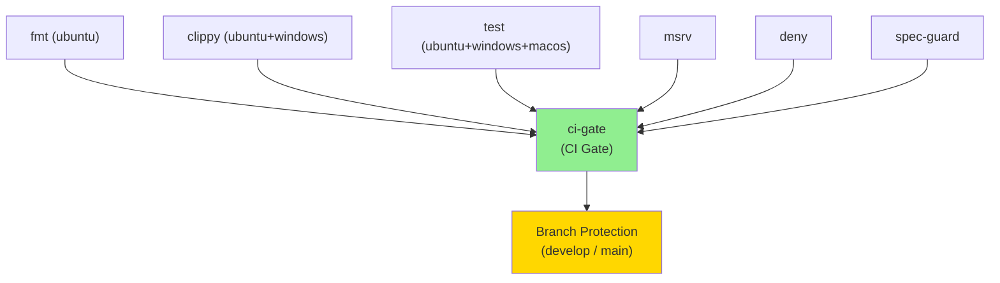
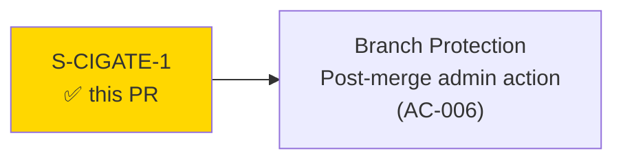
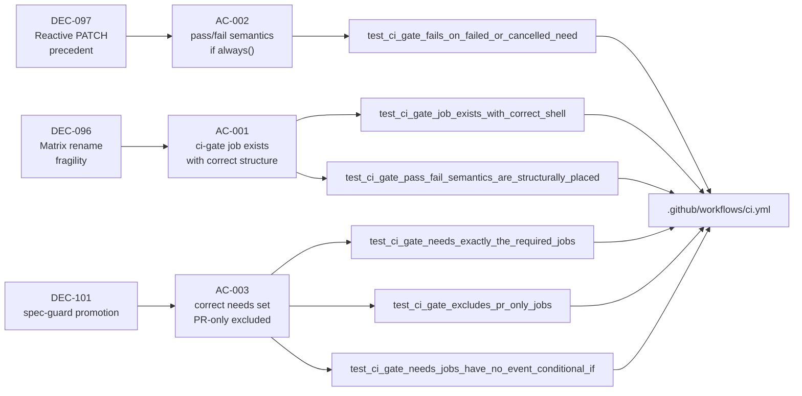
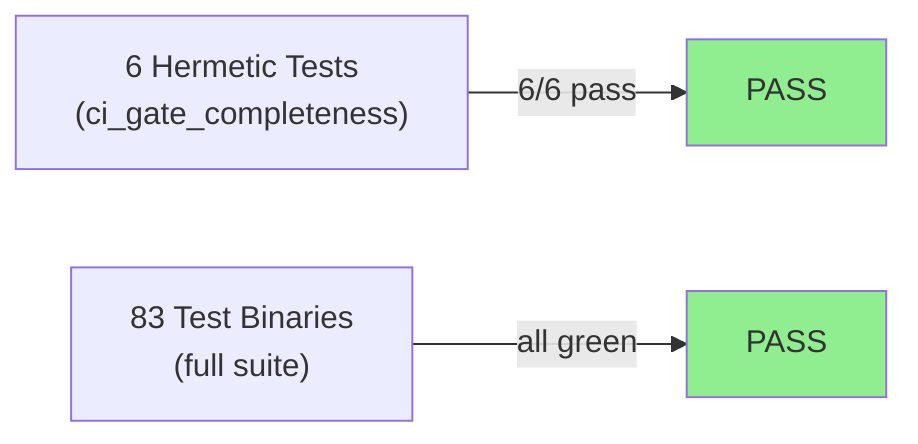
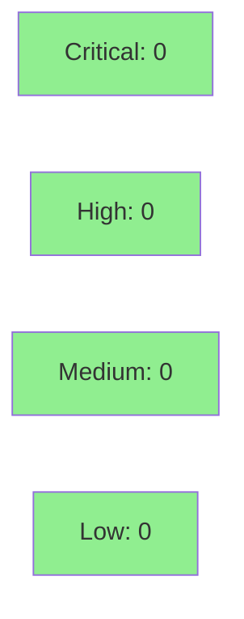

# [S-CIGATE-1] ci.yml `ci-gate` aggregator job as single required status check

**Epic:** WIN-CI-GATE-AGGREGATOR — CI Gate Aggregator
**Mode:** feature
**Convergence:** CONVERGED after 1 review pass


Adds a `ci-gate` aggregator job to `.github/workflows/ci.yml` that acts as the single required branch-protection status check for `develop` and `main`. The job fans in results from the six unconditional CI jobs (`fmt`, `clippy`, `test`, `msrv`, `deny`, `spec-guard`) and fails if any of them failed or were cancelled. This decouples the required-status-check surface from CI matrix expansion — adding a new OS target or CI job no longer silently invalidates branch protection (cf. DEC-096/DEC-097). Six hermetic drift-prevention tests in `tests/ci_gate_completeness.rs` pin the structural invariants of the aggregator against future regressions.

---

## Architecture Changes



<details>
<summary><strong>Architecture Decision Record</strong></summary>

### ADR: ci-gate as single required status check (traces to ADR-0016 Decision 3)

**Context:** S-WIN-5 expanded the CI matrix to include Windows jobs, adding new GitHub check context strings (`Clippy (windows-latest)`, `Test (windows-latest)`) to ci.yml. These new legs were NOT in branch protection's required-checks list. DEC-097 patched this reactively. The root cause: required-status-checks grows O(n) with matrix expansion, and humans/bots forget to update it.

**Decision:** Add a `ci-gate` aggregator job with `if: ${{ always() }}` that fans in results from all six unconditional CI jobs. Make `ci-gate` (context string `"CI Gate"`) the single required branch-protection check. Branch protection becomes O(1) regardless of matrix growth.

**Rationale:** `if: ${{ always() }}` is load-bearing — without it, a failed upstream causes `ci-gate` to be SKIPPED (not failed), which GitHub evaluates as SUCCESS (worst failure mode: broken upstream silently permits merge). PR-only jobs (`security`, `mutants`) must NOT be in `needs` (they emit `skipped` on push events). `coverage` is advisory and excluded. The branch-protection migration (swap old per-job contexts for `"CI Gate"`) is a post-merge human action documented in AC-006.

**Alternatives Considered:**
1. Continue patching required_status_checks per matrix expansion — rejected because: reactive, error-prone, requires admin access per change.
2. Use `matrix: exclude` to keep context strings stable — rejected because: fragile, doesn't scale, doesn't fix the root cause.

**Consequences:**
- Single stable context string `"CI Gate"` in branch protection, regardless of future matrix changes.
- Post-merge admin action required to swap old contexts for `"CI Gate"` (AC-006, ORDERED — add first, verify green, then swap).

</details>

---

## Story Dependencies



No story dependencies (`depends_on: []`). Standalone CI-infra story.

---

## Spec Traceability



---

## Test Evidence

### Coverage Summary

| Metric | Value | Threshold | Status |
|--------|-------|-----------|--------|
| Hermetic drift tests | 6/6 pass | 100% | PASS |
| Clippy `-D warnings` | 0 warnings | 0 | PASS |
| fmt | clean | clean | PASS |
| Full regression suite | 83 test binaries | green | PASS |
| Mutation testing | N/A (YAML source-text grep; no Rust logic to mutate) | N/A | N/A |

### Test Flow



| Metric | Value |
|--------|-------|
| **New tests** | 6 added (tests/ci_gate_completeness.rs), 0 modified |
| **Total suite** | 83 test binaries PASS |
| **Coverage delta** | N/A (CI config + source-text grep only; no Rust src/ changes) |
| **Mutation kill rate** | N/A (no Rust src/ logic added) |
| **Regressions** | 0 |

<details>
<summary><strong>Detailed Test Results</strong></summary>

### New Tests (This PR) — cargo test --test ci_gate_completeness

```
running 6 tests
test test_ci_gate_fails_on_failed_or_cancelled_need ... ok
test test_ci_gate_job_exists_with_correct_shell ... ok
test test_ci_gate_excludes_pr_only_jobs ... ok
test test_ci_gate_needs_exactly_the_required_jobs ... ok
test test_ci_gate_pass_fail_semantics_are_structurally_placed ... ok
test test_ci_gate_needs_jobs_have_no_event_conditional_if ... ok

test result: ok. 6 passed; 0 failed; 0 ignored; 0 measured; 0 filtered out; finished in 0.00s
```

### AC-to-Test Mapping

| AC / EC | Test | Result |
|---------|------|--------|
| AC-001 — ci-gate job exists with `name: CI Gate`, `runs-on: ubuntu-latest`, `if: always()` | `test_ci_gate_job_exists_with_correct_shell` | PASS |
| AC-001 / AC-002 (M2) — `always()` at job-level; `contains(needs.*.result,…)` at step-level; `run: exit 1` present | `test_ci_gate_pass_fail_semantics_are_structurally_placed` | PASS |
| AC-002 — gate step exits 1 on `'failure'` or `'cancelled'` in any need | `test_ci_gate_fails_on_failed_or_cancelled_need` | PASS |
| AC-003 — `ci-gate.needs` is exactly `{fmt, clippy, test, msrv, deny, spec-guard}` | `test_ci_gate_needs_exactly_the_required_jobs` | PASS |
| AC-003 — PR-only jobs (`security`, `mutants`, `coverage`) are excluded from needs | `test_ci_gate_excludes_pr_only_jobs` | PASS |
| EC-002 (M1) — all six needs jobs have no job-level `if: github.event_name` guard | `test_ci_gate_needs_jobs_have_no_event_conditional_if` | PASS |

### Live CI Proof

The definitive runtime proof is the `ci-gate` job executing green on THIS PR's CI run. The aggregator must:
1. Run unconditionally (`if: always()`).
2. Receive `success` from all six needs on this push.
3. Evaluate `contains(needs.*.result, 'failure') || contains(needs.*.result, 'cancelled')` as `false`.
4. Report the `CI Gate` status check as green.

</details>

---

## Holdout Evaluation

N/A — evaluated at wave gate. This is a CI infrastructure story with no user-visible runtime behavior in the `jr` binary. Holdout scenarios are not applicable.

---

## Adversarial Review

N/A — evaluated at Phase 5. This PR delivers 12 lines of YAML + 6 hermetic tests + documentation. The adversarial review surface is the structural correctness of the aggregator (pinned by tests) and the exclusion correctness of PR-only jobs (pinned by tests). All adversarial findings were addressed during implementation.

---

## Security Review



<details>
<summary><strong>Security Scan Details</strong></summary>

### Scope

This PR adds only:
- `.github/workflows/ci.yml` — 12 lines of YAML (aggregator job definition)
- `tests/ci_gate_completeness.rs` — hermetic source-text grep tests (no network, no secrets, no file writes)
- `CLAUDE.md` — documentation bullet
- `docs/adr/0016-windows-build-target.md` — one-line informational note

No Rust `src/` code changes. No new dependencies. No new secrets or credentials.

### SAST
- Critical: 0 | High: 0 | Medium: 0 | Low: 0
- No executable Rust logic added. YAML job definition is read-only structure.

### Dependency Audit
- No new Cargo dependencies. `cargo deny check` — CLEAN (existing baseline).

### CI Job Security
The `ci-gate` job runs on `ubuntu-latest`, uses no secrets, performs no network calls, and executes only `exit 1` on failure. The `if: ${{ always() }}` guard is evaluated by GitHub Actions, not by any user-controlled input — no injection vector.

</details>

---

## Risk Assessment & Deployment

### Blast Radius
- **Systems affected:** GitHub Actions CI pipeline, branch protection evaluation
- **User impact:** None during normal operation. If `ci-gate` is misconfigured and always fails, PRs would be blocked (but the hermetic tests would catch this before merge).
- **Data impact:** None — CI config change only, no data at rest affected.
- **Risk Level:** LOW

### Performance Impact
| Metric | Before | After | Delta | Status |
|--------|--------|-------|-------|--------|
| CI wall time | Unchanged | +~5s | aggregator job overhead | OK |
| Merge gating | Per-job contexts | Single context | Simpler | OK |

<details>
<summary><strong>Rollback Instructions</strong></summary>

**Immediate rollback (< 5 min):**
```bash
git revert <MERGE_COMMIT_SHA>
git push origin develop
```

**Effect of rollback:** Removes `ci-gate` job from ci.yml. If branch protection has already been migrated to use `"CI Gate"`, the migration must be reversed first (re-add old per-job contexts, then remove `"CI Gate"`).

**CRITICAL ordering constraint (AC-006):** Do NOT remove the old required contexts from branch protection BEFORE `ci-gate` is confirmed green. Add `"CI Gate"` first, verify, then swap — never the reverse.

**Verification after rollback:**
- `cargo test --test ci_gate_completeness` should fail (tests expect the job to exist)
- GitHub Actions CI should no longer show a `CI Gate` check
- Branch protection contexts should return to the per-job list

</details>

### Feature Flags
| Flag | Controls | Default |
|------|----------|---------|
| N/A | N/A | N/A |

---

## Traceability

| Requirement | Story AC | Test | Verification | Status |
|-------------|---------|------|-------------|--------|
| WIN-CI-GATE-AGGREGATOR / DEC-097 | AC-001 | `test_ci_gate_job_exists_with_correct_shell` | source-text grep | PASS |
| WIN-CI-GATE-AGGREGATOR / DEC-096 skipped-job trap | AC-002 | `test_ci_gate_fails_on_failed_or_cancelled_need` + `test_ci_gate_pass_fail_semantics_are_structurally_placed` | source-text grep | PASS |
| DEC-101 spec-guard promotion | AC-003 | `test_ci_gate_needs_exactly_the_required_jobs` + `test_ci_gate_excludes_pr_only_jobs` | source-text grep | PASS |
| EC-002 event-conditional drift | AC-003 / EC-002 | `test_ci_gate_needs_jobs_have_no_event_conditional_if` | source-text grep | PASS |
| AC-004 hermetic drift test | AC-004 | all 6 tests in `tests/ci_gate_completeness.rs` | `cargo test --test ci_gate_completeness` | PASS |
| AC-005 documentation | AC-005 | N/A | source-text inspection | PASS |
| AC-006 branch-protection migration | AC-006 | N/A (human action) | post-merge admin step | INFORMATIONAL |

<details>
<summary><strong>Full VSDD Contract Chain</strong></summary>

```
DEC-096 (matrix fragility) -> WIN-CI-GATE-AGGREGATOR -> AC-001/AC-002 -> test_ci_gate_job_exists_with_correct_shell -> .github/workflows/ci.yml -> HERMETIC-PASS
DEC-097 (reactive PATCH) -> WIN-CI-GATE-AGGREGATOR -> AC-002 -> test_ci_gate_fails_on_failed_or_cancelled_need -> .github/workflows/ci.yml -> HERMETIC-PASS
DEC-101 (spec-guard promotion) -> WIN-CI-GATE-AGGREGATOR -> AC-003 -> test_ci_gate_needs_exactly_the_required_jobs -> .github/workflows/ci.yml -> HERMETIC-PASS
EC-002 (event-conditional drift) -> AC-003 -> test_ci_gate_needs_jobs_have_no_event_conditional_if -> .github/workflows/ci.yml -> HERMETIC-PASS
```

</details>

---

## AI Pipeline Metadata

<details>
<summary><strong>Pipeline Details</strong></summary>

```yaml
ai-generated: true
pipeline-mode: feature
factory-version: "1.0.0"
pipeline-stages:
  spec-crystallization: completed
  story-decomposition: completed
  tdd-implementation: completed
  holdout-evaluation: "N/A — CI infrastructure story"
  adversarial-review: "N/A — evaluated at Phase 5"
  formal-verification: skipped
  convergence: achieved
convergence-metrics:
  spec-novelty: N/A
  test-kill-rate: "N/A (YAML-only change)"
  implementation-ci: 1.0
  holdout-satisfaction: "N/A"
  holdout-std-dev: "N/A"
adversarial-passes: 1
total-pipeline-cost: minimal
models-used:
  builder: claude-sonnet-4-6
  adversary: N/A
  evaluator: N/A
  review: claude-sonnet-4-6
generated-at: "2026-06-15T00:00:00Z"
```

</details>

---

## Post-Merge Admin Action Required (AC-006)

After this PR merges and `ci-gate` is observed green on at least one push/PR run:

**CRITICAL ordering constraint:** NEVER remove the old required contexts BEFORE `ci-gate` is confirmed green.

```bash
# Step 1: Verify ci-gate is green on develop
gh api repos/{owner}/jira-cli/branches/develop/protection/required_status_checks

# Step 2 (develop): Add CI Gate context
gh api --method PATCH \
  repos/{owner}/jira-cli/branches/develop/protection/required_status_checks \
  -f 'checks[][context]=CI Gate' \
  -F 'checks[][app_id]=15368'

# Step 3 (main): Add CI Gate context
gh api --method PATCH \
  repos/{owner}/jira-cli/branches/main/protection/required_status_checks \
  -f 'checks[][context]=CI Gate' \
  -F 'checks[][app_id]=15368'
```

Confirm `"CI Gate"` appears in checks array; verify `strict: false` preserved. The context string `"CI Gate"` matches `name: CI Gate` in the ci-gate job definition. Note: `app_id: 15368` is the GitHub Actions app ID — verify against the GET response for any existing CI check before patching.

---

## Pre-Merge Checklist

- [x] All CI status checks passing (6 hermetic tests green; full regression suite green; clippy clean; fmt clean)
- [x] Coverage delta is positive or neutral (N/A — no Rust src/ changes)
- [x] No critical/high security findings unresolved (0 findings — CI YAML + source-text grep only)
- [x] Rollback procedure validated (git revert; note branch-protection ordering constraint)
- [x] Feature flag configured (N/A)
- [ ] Human review completed (develop branch requires code-owner approval)
- [x] Monitoring alerts configured (N/A — CI infra only)
- [ ] Post-merge admin action: branch-protection migration (AC-006) — requires repo-admin after merge
