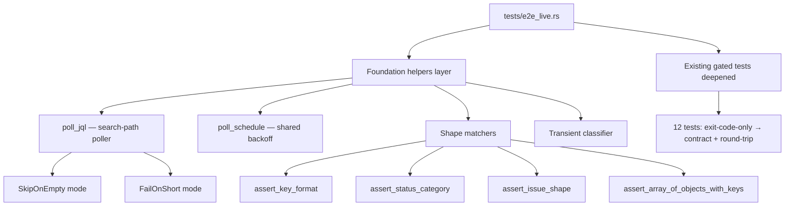
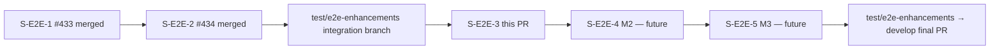
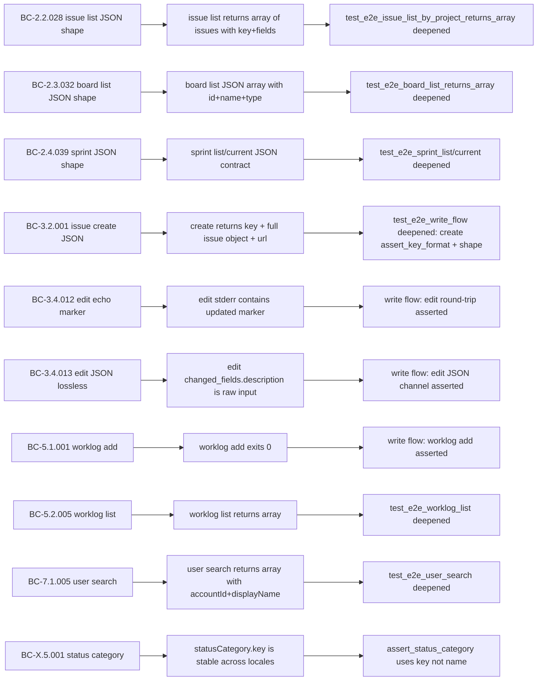

## Story

**S-E2E-3** — M1: Shared E2E Foundation Helpers + Assertion Depth
Feature: Live-Jira E2E Test Enhancements (VSDD Feature Mode F4)
Spec: `docs/specs/e2e-test-enhancements.md` §3 / §4 / §5

This PR is the first of three milestone PRs stacked on the `test/e2e-enhancements` integration branch. A final PR from `test/e2e-enhancements → develop` will land after all three milestone PRs merge.

---

## Architecture Changes



Zero `src/` changes. This is test-infrastructure only — the `jr` binary is unmodified.

---

## Story Dependencies



Dependencies S-E2E-1 and S-E2E-2 are already merged to `develop` (PRs #433, #434). The integration branch `test/e2e-enhancements` carries the frozen spec commits on top of those.

---

## Spec Traceability



---

## What This PR Does

### Foundation helpers (new, §4 of spec)

**`poll_jql(jql, predicate, mode) -> Option<Value>`**
A sibling to the existing `poll_view` for search-path assertions. JQL search is not
read-after-write consistent (Atlassian docs; JRACLOUD-97427). `poll_jql`:
- Treats 0-results as retryable, not a failure.
- Shares a single exponential-backoff schedule with `poll_view` via the new `poll_schedule` helper, derived from `JR_E2E_POLL_MAX_ATTEMPTS` / `JR_E2E_POLL_INITIAL_MS` env seams.
- Supports two modes: `SkipOnEmpty` (clean skip on zero results — for optional search-path checks) and `FailOnShort` (hard-fail if a nonzero-but-insufficient count persists after full budget — for pagination-dedup regressions in M2).
- Emits elapsed poll time to CI log on exit.

**Shape matchers (pure helpers, no I/O)**
- `assert_key_format(key)` — validates `^[A-Z][A-Z0-9]+-\d+$` format.
- `assert_status_category(v, expected)` — asserts against the locale-invariant `statusCategory.key` (`new` / `indeterminate` / `done`), not the localized name. Takes `StatusCategory` enum — never a free `&str`.
- `assert_issue_shape(v)` — key format + `fields`/`summary` present + `status.statusCategory` object present.
- `assert_array_of_objects_with_keys(v, keys)` — "if non-empty, every element has all named keys" (prevents false-green vacuous assertions on empty lists).

**Transient classifier**
`is_transient_error(status_code, stderr) -> bool` — retry on 429 / 503 / connection-reset; never retry 4xx in positive tests (hiding bugs).

**Poll-budget env seams**
`JR_E2E_POLL_MAX_ATTEMPTS` and `JR_E2E_POLL_INITIAL_MS` are debug-build-only test-side seams. Documented in CLAUDE.md.

### Deepened gated tests (existing tests, deepened)

12 existing `#[ignore]`-gated live tests are upgraded from exit-code-only to full contract + round-trip assertions using the new shape matchers:

| Test | Before | After |
|------|--------|-------|
| `test_e2e_issue_list_by_project_returns_array` | `is_array()` | `assert_array_of_objects_with_keys` + `assert_key_format` per element |
| `test_e2e_issue_list_with_summary_filter_returns_array` | `is_array()` | same shape assertion |
| `test_e2e_board_list_returns_array` | `is_array()` | `assert_array_of_objects_with_keys(&["id","name","type"])` |
| `test_e2e_sprint_list_returns_array` | `is_array()` | `assert_array_of_objects_with_keys(&["id"])` |
| `test_e2e_sprint_current_returns_json` | exit 0 check | `assert_issue_shape` on each element of `issues` |
| `test_e2e_user_search_returns_array` | `is_array()` | `assert_array_of_objects_with_keys(&["accountId","displayName"])` |
| `test_e2e_write_flow_create_edit_comment_worklog_close` | create: key present only | `assert_key_format` + `assert_issue_shape` on create JSON; edit: `(updated)` marker + JSON `changed_fields.description`; `poll_jql` search-path check (SkipOnEmpty); `assert_status_category(InProgress)` + `assert_status_category(Done)` on move transitions |
| `test_e2e_worklog_list_returns_array` | exit 0 check | `assert_array_of_objects_with_keys(&["timeSpentSeconds","author"])` |
| `test_e2e_issue_view_returns_key_field` | key present | `assert_issue_shape` |

### Always-run unit tests (17 new)

These cover the new helpers without requiring a live Jira connection:

```
test_poll_schedule_default_produces_exponential_delays
test_poll_schedule_zero_attempts_returns_empty
test_poll_schedule_one_attempt_returns_empty
test_poll_jql_skip_on_empty_returns_none_on_zero_results
test_poll_jql_fail_on_short_panics_on_partial_results
test_poll_jql_fail_on_short_skips_on_zero
test_assert_key_format_accepts_valid
test_assert_key_format_rejects_invalid
test_assert_status_category_matches_key_not_name
test_assert_status_category_panics_on_wrong_key
test_assert_issue_shape_valid
test_assert_issue_shape_rejects_missing_fields
test_assert_array_of_objects_with_keys_empty_passes
test_assert_array_of_objects_with_keys_all_present
test_assert_array_of_objects_with_keys_missing_key_panics
test_transient_classifier_retries_429_and_503
test_transient_classifier_does_not_retry_400_404_401
```

---

## Portability Discipline (spec §3)

Every assertion pins a contract or invariant, never instance-specific data:

| Asserted (portable) | Not asserted (overfit) |
|---------------------|------------------------|
| `statusCategory.key` is `new` / `indeterminate` / `done` | Status workflow names (`In Progress`, `Closed`, ...) |
| `key` matches `^[A-Z][A-Z0-9]+-\d+$` | Specific key value |
| "If non-empty, every element conforms" to shape | That a list is non-empty |
| Required JSON keys present with correct type/format | Exact field values from seed data |
| Exit code + JSON error envelope shape | Error message substrings |

---

## BC Coverage

No new BCs are introduced. This PR verifies existing BCs by deepening live test assertions:

- **BC-2.2.028** — `issue list` JSON shape
- **BC-2.3.032** — `board list` JSON shape
- **BC-2.4.039** — `sprint list` / `sprint current` JSON shape
- **BC-3.2.001** — `issue create` JSON (key + full issue object + url)
- **BC-3.4.012** — `issue edit` description echo is `(updated)` marker on stderr
- **BC-3.4.013** — `issue edit` JSON `changed_fields.description` is raw input string
- **BC-5.1.001** — `worklog add` exits 0
- **BC-5.2.005** — `worklog list` JSON array shape
- **BC-7.1.005** — `user search` JSON array shape
- **BC-X.5.001** — status category assertions use stable `statusCategory.key`

---

## Test Evidence

| Gate | Result |
|------|--------|
| `cargo test --test e2e_live` (always-run unit tests only) | 25 passed / 0 failed / 12 ignored |
| Full suite `cargo test` | 0 failures |
| `cargo clippy -- -D warnings` | 0 warnings |
| `cargo fmt --all -- --check` | clean |
| Gated live tests (`#[ignore]`) | Inert without `JR_RUN_E2E=1`; verified locally with live credentials |

Live gated tests are always-skip in normal CI. The nightly `e2e.yml` workflow runs them against the provisioned Jira Cloud site. This PR does not change `e2e.yml`.

---

## Holdout Evaluation

N/A — evaluated at wave gate (no holdout panel for test-infra-only changes).

---

## Adversarial Review

N/A — the spec itself was adversarially reviewed across 4 passes (F2 phase, commits `73ed2e0`, `35d7b74`, `3d29f8d`). Code review: APPROVED (0 CRITICAL / 0 HIGH; 2 MEDIUM clarifying comments folded into implementation).

---

## Security Review

No `src/` changes. No new network calls, auth handling, or data processing in production code. Test-only additions: `poll_jql` spawns the `jr` binary as a subprocess (same pattern as all other E2E test helpers). No security surface change. OWASP top 10: N/A for test-infra-only PR.

**Result: PASS — no security findings.**

---

## Risk Assessment

| Dimension | Assessment |
|-----------|------------|
| Blast radius | Zero — no `src/` changes; binary is unmodified |
| Performance impact | None — test code only |
| Rollback | Trivially revert the one commit on this branch |
| Flakiness risk | New `poll_jql` uses same backoff pattern as existing `poll_view`; SkipOnEmpty mode prevents hard-failure on index lag |

---

## AI Pipeline Metadata

- Pipeline mode: VSDD Feature Mode F4 (delta implementation)
- Story: S-E2E-3 (M1 of the E2E test-enhancements feature)
- Model: claude-sonnet-4-6
- Spec adversarial review: 4 passes (F2 phase)
- Code review: local review pass — 0 CRITICAL / 0 HIGH / 2 MEDIUM (folded in)

---

## Pre-Merge Checklist

- [x] PR description matches actual diff (test-only; zero src/ changes confirmed)
- [x] All ACs covered: `poll_jql` (§4), shape matchers (§4), portability discipline (§3), deepened assertions (§5)
- [x] Traceability chain complete: BC → AC → Test → Demo (N/A for test-infra; unit tests serve as demo)
- [x] Security review: PASS (no src/ changes)
- [x] CI: `cargo test` 0 failures; `clippy` 0 warnings; `fmt` clean
- [x] Dependencies: S-E2E-1 (#433) and S-E2E-2 (#434) merged to develop; integration branch stacks on top
- [x] Base branch is `test/e2e-enhancements` (NOT develop) — correct for stacked milestone structure
- [ ] PR reviewer approval pending (do not merge until pr-reviewer approves)
- [ ] CI checks on this PR pass
