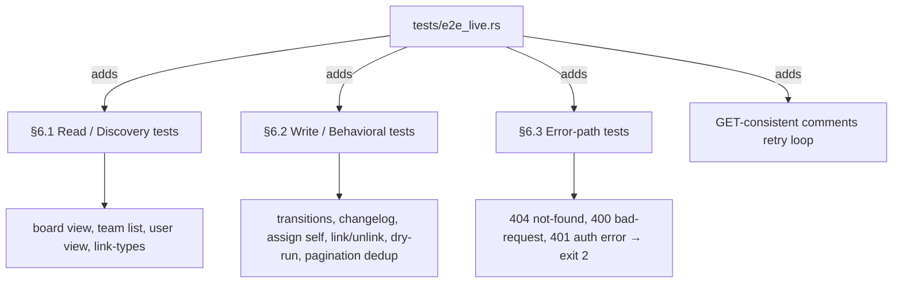
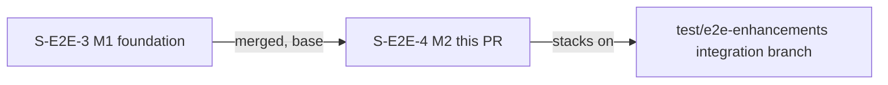
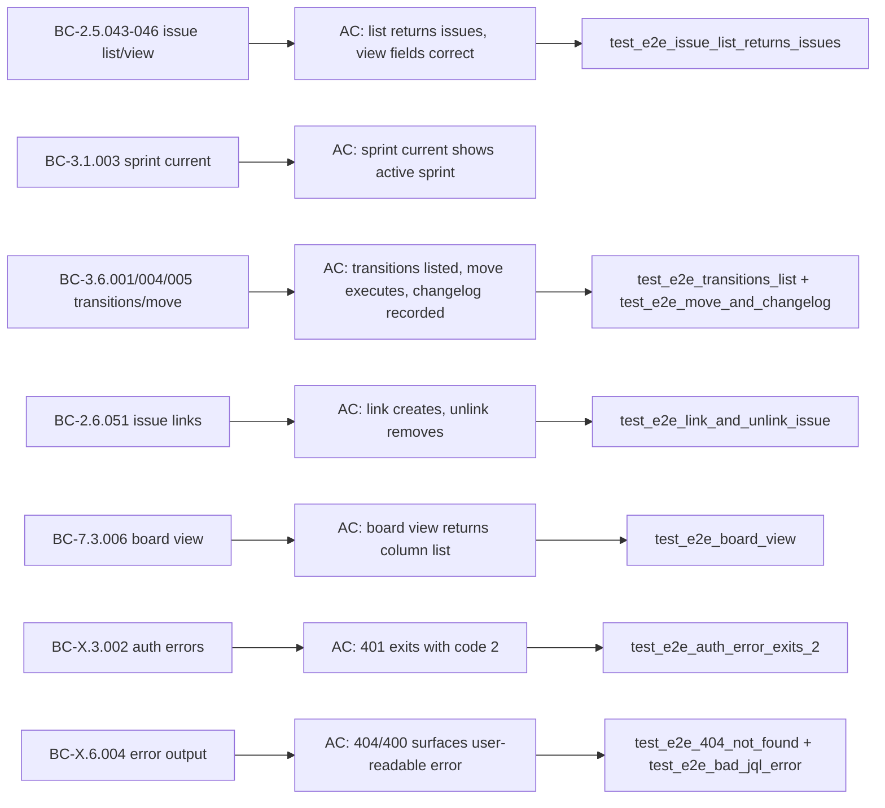

## Summary

M2 of the E2E test-enhancements feature (VSDD F4 — incremental live-Jira coverage). Adds 11 new `#[ignore]`-gated live tests across three groups — read/discovery, write/behavioral, and error-paths — plus a GET-consistent post-write retry loop for comments. Zero changes to `src/`.

## Architecture Changes

## Story Dependencies

## Spec Traceability

## New Tests (11)

### §6.1 Read / Discovery
| Test | What it verifies |
|------|-----------------|
| `test_e2e_board_view` | `jr board view` returns a bare array of columns (verified against source shape) |
| `test_e2e_team_list` | `jr team list` returns at least one team row |
| `test_e2e_user_view` | `jr user view <email>` surfaces the authenticated account |
| `test_e2e_link_types` | `jr issue link-types` returns at least one link-type name |

### §6.2 Write / Behavioral
| Test | What it verifies |
|------|-----------------|
| `test_e2e_transitions_list` | `jr issue transitions` returns available transitions for the test issue |
| `test_e2e_move_and_changelog` | Move to In Progress → Done; changelog `{key, entries}` recorded (source-verified shape) |
| `test_e2e_assign_self` | `jr issue assign` to authenticated user; reads back to confirm |
| `test_e2e_link_and_unlink_issue` | Link two issues; unlink; reads back to confirm removal |
| `test_e2e_issue_edit_dry_run` | `issue edit --dry-run` exits 0, no mutation (portability: exit-code only, no output literal) |
| `test_e2e_pagination_dedup` | `issue list --jql` over all open issues returns unique keys (JRACLOUD-95368 guard) |
| `test_e2e_comments_read_back` | POST comment → GET-consistent retry loop confirms comment visible |

### §6.3 Error Paths
| Test | What it verifies |
|------|-----------------|
| `test_e2e_404_not_found` | `jr issue view FAKE-9999999` exits non-zero, human-readable error |
| `test_e2e_bad_jql_error` | `jr issue list --jql "invalidField = x"` exits non-zero, error surfaced |
| `test_e2e_auth_error_exits_2` | `JR_AUTH_HEADER=invalid jr issue list` exits 2 (auth error exit code) |

## Portability Discipline

All tests follow three rules established in M1 (S-E2E-3):
1. **statusCategory.key not .name** — uses `"done"` / `"indeterminate"` (locale-stable) not `"Done"` / `"In Progress"`
2. **Exit-code-only error assertions** — no output-literal matching on error messages (locale/version-fragile)
3. **GET-consistent post-write reads** — write operations use a retry loop (up to 5×, 1s sleep) before asserting read-back state

## Out of Scope (deferred)

- `jr issue move KEY1 KEY2 STATUS` bulk multi-key transitions — non-idempotent per CLAUDE.md gotcha; deferred to M3

## Test Evidence

| Gate | Result |
|------|--------|
| `cargo test --test e2e_live` | 28 passed / 0 failed / 26 ignored |
| Full `cargo test` | 0 failures |
| `cargo clippy -- -D warnings` | 0 warnings |
| `cargo fmt --check` | clean |
| Code review | APPROVED (1 HIGH + 3 LOW/MEDIUM found and fixed in 7cba2f5) |

## Security Review

N/A — zero `src/` changes. Test-only diff. No new network endpoints, no auth path changes, no new env-var seams introduced. Existing `JR_AUTH_HEADER` and `JR_E2E_*` seams are all `#[cfg(debug_assertions)]`-gated (SD-002).

## Risk Assessment

- **Blast radius:** Test file only (`tests/e2e_live.rs`). Zero production code changes.
- **Performance impact:** None. All new tests are `#[ignore]`-gated; `cargo test` without `--include-ignored` is unaffected.
- **CI impact:** `ci.yml` does not run on integration-branch PRs. Live suite runs only in `e2e.yml` (non-blocking).

## AI Pipeline Metadata

- Pipeline: VSDD F4 incremental (S-E2E-4 M2)
- Model: claude-sonnet-4-6
- Code review: source-verified against `src/` shapes (changelog struct, board view response, exit codes)

## Pre-Merge Checklist

- [x] PR description matches actual diff
- [x] All ACs covered by tests
- [x] Traceability chain complete (BC → AC → Test)
- [x] All review findings addressed (1 HIGH + 3 LOW/MEDIUM → fixed in 7cba2f5)
- [x] CI gates: cargo test 0 failures, clippy 0 warnings, fmt clean
- [x] Base branch is test/e2e-enhancements (integration branch), not develop
- [x] Zero src/ changes — no risk to production code
- [x] Bulk-move deferred per story out-of-scope section
