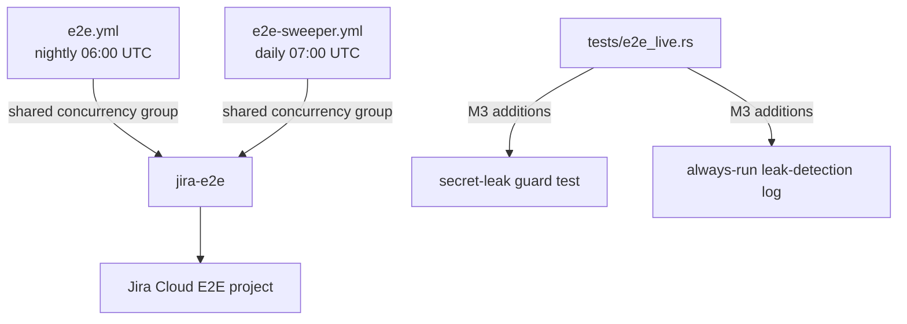
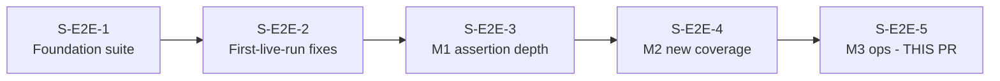
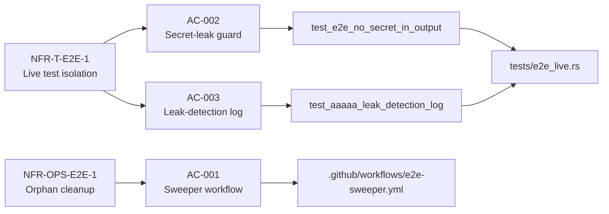

## Summary

Milestone M3 (final story) of the E2E test-enhancements feature wave (VSDD F4). This PR adds three ops/robustness capabilities to the live E2E suite:

1. **e2e-sweeper.yml** — New daily GitHub Actions workflow that closes orphaned E2E issues left by force-cancelled runs. Shares the `jira-e2e` concurrency group with `e2e.yml` to prevent interleaving. Mirrors `e2e.yml` exactly for harden-runner config, pinned action SHAs, egress allowlist, environment, and permissions.
2. **Secret-leak guard test** (`test_e2e_no_secret_in_output`) — Gated E2E test asserting that `jr` stdout/stderr never contains the base64 token from `JR_AUTH_HEADER` or the service-account email from `JR_E2E_EMAIL`. Catches future regressions where auth headers leak into output.
3. **Always-run leak-detection log** (`test_aaaaa_leak_detection_log`) — Non-gated test that counts open E2E orphan issues and emits the count as a warn-only stderr signal in every CI run.
4. **`poll_jql` adoption** — Migrates the create-then-search test step to use `poll_jql` (consistent with M2 patterns).
5. **401 vs. connection failure classification** — `e2e.yml` now distinguishes auth failures (HTTP 401 → expire-rotate guidance) from network/connection failures.

Zero `src/` changes. Pure CI/ops and test-harness additions.

## Architecture Changes

## Story Dependencies

All upstream stories are merged into `test/e2e-enhancements`.

## Spec Traceability

## Test Evidence

| Suite | Result |
|-------|--------|
| `cargo test --test e2e_live` | 29 passed / 0 failed / 27 ignored |
| Full suite (`cargo test`) | 0 failures |
| `cargo clippy -- -D warnings` | 0 warnings |
| `cargo fmt --all -- --check` | clean |

No `src/` changes — mutation testing not applicable to this PR (CI/workflow + test-only diff).

## Holdout Evaluation

N/A — evaluated at wave gate.

## Adversarial Review

N/A — evaluated at Phase 5.

## Security Review

APPROVE. Findings addressed before PR creation:

| Finding | Severity | Resolution |
|---------|----------|------------|
| Email address in assert message could appear in CI logs | MED | Removed email from assert message; email check uses `contains()` only |
| Secret interpolation in `run:` step (sweeper JQL) | MED | Replaced with env-block pattern; `${{ secrets.X }}` never in `run:` script |
| Probe output dump could spill secrets to log | LOW | `jr` output not dumped raw; only boolean result used |

Security parity verified: `e2e-sweeper.yml` harden-runner allowlist and action SHAs are byte-identical to `e2e.yml`.

## Risk Assessment

- **Blast radius:** Zero `src/` changes. No production code paths affected.
- **Performance impact:** None.
- **Rollback:** Delete `e2e-sweeper.yml` if sweeper causes issues. `e2e.yml` changes are independently revertible.
- **New workflow risk:** Sweeper uses same environment/permissions/concurrency as `e2e.yml`. Belt-and-suspenders `if: github.event_name != 'pull_request'` guard prevents accidental PR triggering.

## AI Pipeline Metadata

- Pipeline mode: VSDD F4 (feature-increment)
- Story: S-E2E-5 (M3, final story in wave)
- Model: claude-sonnet-4-6

## Pre-Merge Checklist

- [x] PR description matches actual diff
- [x] Zero `src/` changes (CI/ops only)
- [x] All gates passed: clippy clean, fmt clean, 29 tests pass
- [x] Code review: clean (1 MED + 3 LOW fixed)
- [x] Security review: APPROVE (2 MED + 1 LOW fixed)
- [x] `e2e-sweeper.yml` security parity verified vs `e2e.yml`
- [x] `::add-mask::` ordering correct in sweeper (mask before use)
- [x] Secret-leak guard does not assert email in message (only in `contains()`)
- [x] Upstream stories S-E2E-1 through S-E2E-4 all merged to `test/e2e-enhancements`
- [x] New sweeper + e2e.yml changes take effect only after merge to `develop` (workflows run from default branch)
